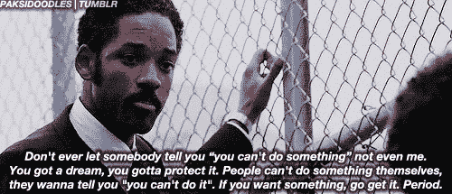

# 我的科技之旅——相信自己

> 原文：<https://medium.com/hackernoon/my-journey-in-tech-believing-in-myself-b49fde32be84>

我的博客记录了我作为一名[技术专家](https://hackernoon.com/tagged/technologist) [进入硅谷](https://hackernoon.com/tagged/making)的经历。我是一个有色人种的怪人，性别不合群，移民，曾被收养的年轻人。我来自一个非传统的计算机科学背景。我在大学里学了几门 CS 课程，最后在成为老师之前主修了人文学科。向青少年教授 web 开发让我对编码产生了兴趣。获得一所著名编程学校的奖学金后，我开始在旧金山的初创企业工作。我的博客一半是关于技术主题，另一半是关于平等和技术访问(我的旅程)。

2015 年，我在加州奥克兰教中学 ESL(英语作为第二语言)。我在追随我妈妈的脚步。她在新泽西州卡姆登的一所城市公立学校系统教了 25 年书。我已经教了五年书。卡姆登在种族人口统计以及犯罪和贫困率方面很像奥克兰。2016 年，人口普查表明 [38%的卡姆登人口生活在贫困中](https://www.census.gov/quickfacts/fact/table/camdencitynewjersey/PST045216)，而 [20%的奥克兰人经历着同样的情况。这两个地方的另一个共同点是，我在卡姆登的公立学校上了一年学，在奥克兰教了五年书，那里的人们都很坚强，年轻人也很有热情。](https://www.census.gov/quickfacts/fact/table/oaklandcitycalifornia/PST045216)

在城市公共教育系统中教书绝非易事。我亲眼目睹了资本主义的压迫性制度，从因为没有学校用品而不得不定量配给纸张，到将我辛苦挣来的每年 32，000 美元的工资中的 2，000 美元用于课程材料，到教室里没有暖气，以及对多次未通过标准化考试的移民和美国学生进行过度测试。很容易责怪自己和学生。但是到了第二年，我开始意识到这种方法并不能积极地发展人。

不管这些障碍，通过扩展我们的思维，获得新知识，并分析系统性压迫——我们(学生和我)能够相互灌输梦想的能力——实现比社会教给我们的更多的东西。

2015 年春天，我被要求教授一门关于 web 开发的课后课程。该项目还对性别动态和课堂上的成功进行了研究。所有这些都让我感兴趣。我教一个班，全是女生，全是男生，男女合校。白天教学和放学后教学有天壤之别。我所学的课程不是基于考试，而是通过实践来学习。重点是学习如何编码和构建最终项目——网站或游戏。

我记得当我的学生能够成功调试代码并使其进入工作状态时，我看到他们声音中的快乐和自信。我也受到了它的影响。帮助他们学习新的东西，让他们看到他们的成功立即显现，我感觉很好。有些学生喜欢上了编程，就像鱼喜欢水一样。我也有类似的感觉。

当我第一次告诉人们，我要离开教学去追求计算机编程的职业生涯时，我记得一位同事老师对我说的第一句话，“你擅长那个吗？”不是“那太棒了”或“让我知道我如何能支持”或“告诉我更多”，而是基本上满足我的自我怀疑感。当你有梦想时，你必须保护它，即使是那些应该给别人灌输信心而不是怀疑的人。

我记得我的前合伙人告诉我，当我从早上 8 点 30 分到下午 6 点去编码学校，打零工，比如为 LYFT 开车，送邮件，基本上是任何能带来收入的事情，离开编码学校，回去教书(她也是一名教师)。我必须保护我的梦想，即使是我最亲近的人也不能实现，因为正如威尔·史密斯在他的电影《追逐海蓓娜斯》中所说，“那些自己做不到的人，会告诉你，‘你也做不到’。”谢天谢地，我没有听。相反，我依靠我自己的向导——我自己，正如威尔·史密斯现实生活中的角色克里斯·加德纳所说，“如果你想要什么。去拿吧。句号"

从那以后我就走上了相信自己的道路。磨练我的直觉，相信自己，寻找相信/信任我的人——家人、朋友、同事、陌生人。放下那些不会点燃我自信之火的人、情况和环境。我周围都是毫不含糊地相信我的人，以至于看到了我甚至看不到的东西——我的潜力。

令人惊讶的是，有更多的人相信我，并为自信的种子浇水，这已被证明是一种解毒剂。我每天在工作中都能从骨子里感受到这一点——支持我并为我的成功欢呼的人们——包括最重要的——我自己。随着我自信心的建立，我的劳动成果也开始显现，最近我被邀请参加 Transform Tech 的一个小组讨论。我很高兴与我的跨性别和性别不符合社区分享我的旅程。