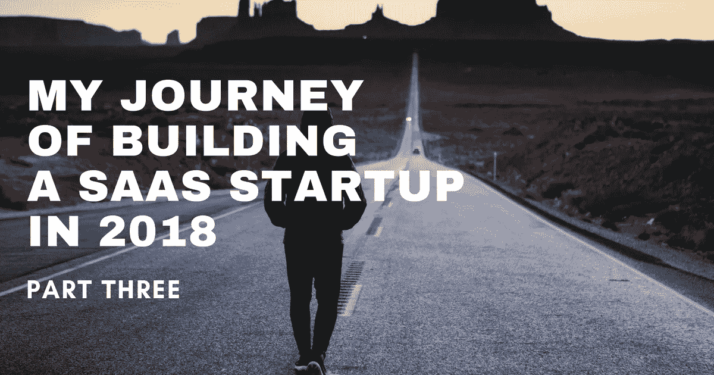
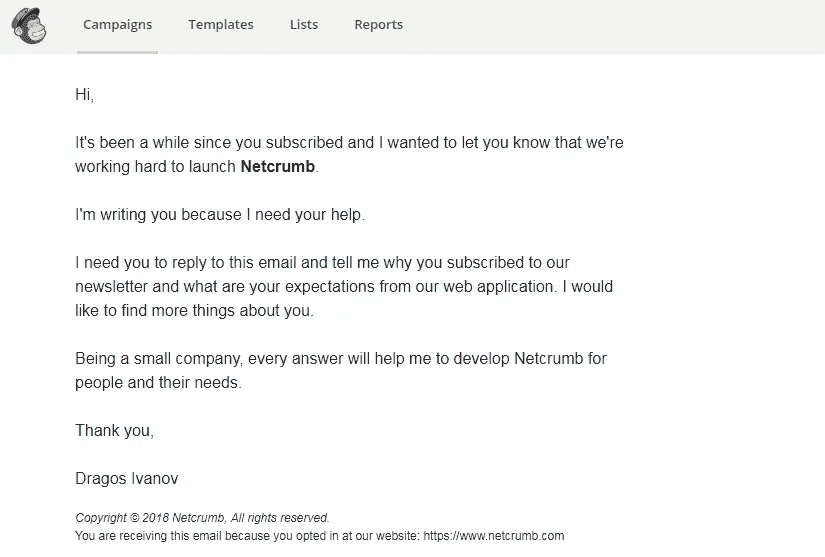
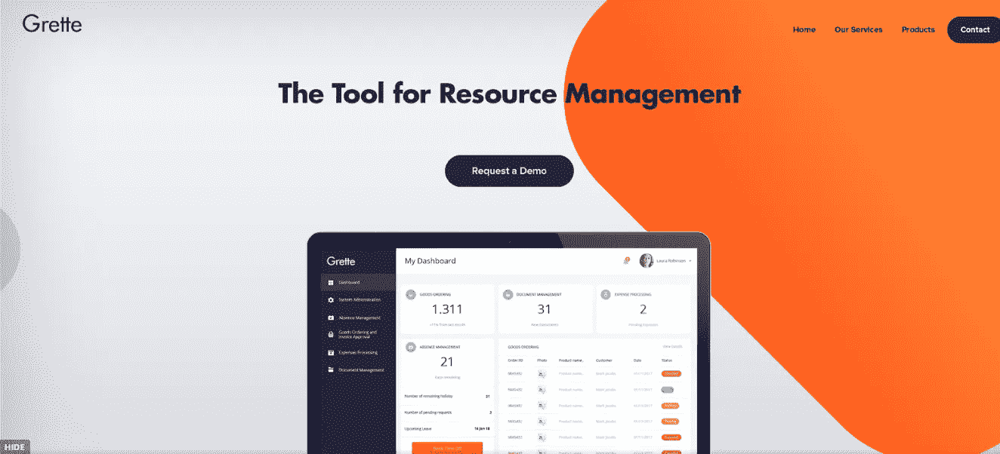
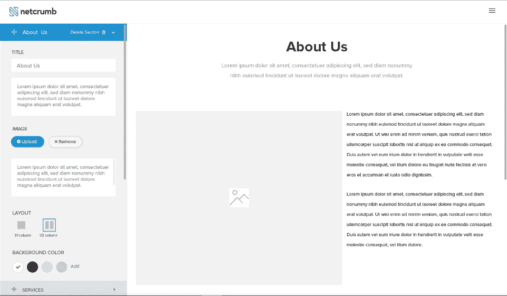
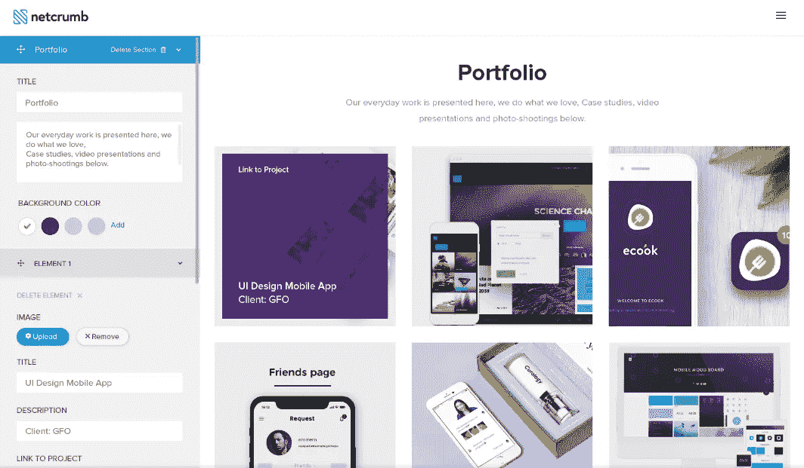
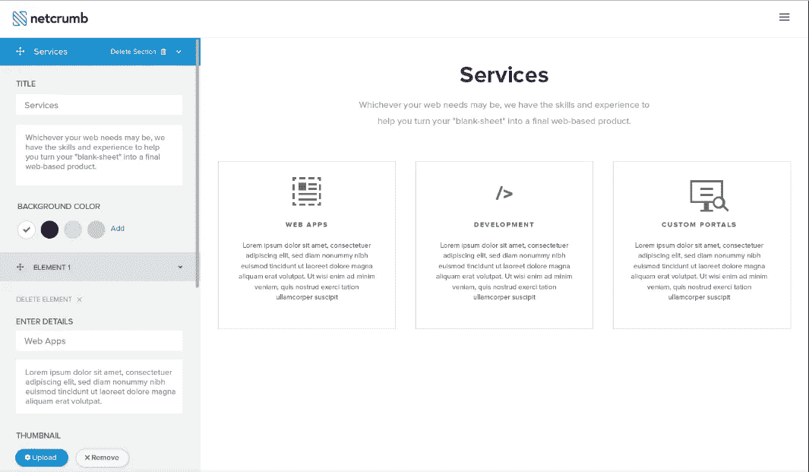
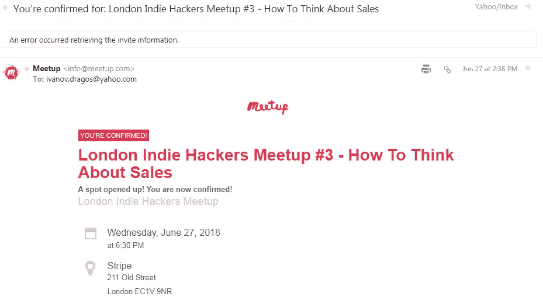

# 我的 2018 年 SaaS 创业之旅——第三部分

> 原文：<https://medium.com/hackernoon/my-journey-of-building-a-saas-startup-in-2018-part-three-3d07b5cbc498>

Photo by [Tegan Mierle](https://unsplash.com/photos/ioyEITUD2G8?utm_source=unsplash&utm_medium=referral&utm_content=creditCopyText) on [Unsplash](https://unsplash.com/search/photos/motivation?utm_source=unsplash&utm_medium=referral&utm_content=creditCopyText)

距离我上一篇博客已经有一段时间了。当我开始写这个的时候，差不多两个月过去了。

时间过得真快！！

如果你读了我之前的帖子，你可能会想“这个家伙还在构建那个很棒的 Wordpress 登录页面生成器吗？”

是啊！！他是。

我没有任何借口不早点写这篇博客，但我想我们都有这样的时刻，我们更喜欢做其他事情或观看世界杯足球赛。

上述事情加强了以下声明:

> 你必须走出自己的舒适区才能有所成就。

**过去的两个月我都做了些什么？我实现了我在上一个故事中说的任何事情了吗？**

对于那些不知道的人，在我的上一篇文章中，我说了下面的话:

> *接下来我想做的事情是在博客上创建一个销售线索磁铁，开通一个 Youtube 频道和一个自动回复器。*

如果你想阅读我之前的帖子，请点击这里。

我做过这些事情吗？

可惜我没有。

再说一次，我没有任何借口，但当你有一份全职工作时，时间是如此短暂。

我通常每天下班后再工作 3-4 个小时，加上周六和周日。

六七月份发生的“坏事”是世界杯。

我热爱足球，几乎看过所有的比赛(除了我全职工作时的比赛)

这件事让我效率低下。可能是平时工作的一半或者更少。

那么在过去的两个月里我做了什么？

在过去的几周里，我学到的第一件事是，很容易失去注意力并保持动力。

在夏天，你有各种各样的消遣。

我有点幸运，因为我是伦敦的一只孤独的狼。

我不是说这是一件坏事。很奇怪，但是我喜欢。

我想你需要有点孤独才能建立一些东西，但你也需要来自你的亲密朋友、家人甚至你在网上遇到的人的很多支持。

现在让我们谈谈自从我上一篇博文以来我做的第一件事。

我给我名单上的近 150 名订户发了一封电子邮件。

主题是“需要你的帮助”，在邮件中，我问他们为什么订阅，他们认为 Netcrumb 将如何帮助他们。

我没有得到很多回应。我想有 5%的人回应了，但我没有失望。

我发这封邮件的原因是我没有自动回复邮件(这是一件坏事，我会很快整理出来)

**人们怎么说？**

大多是积极的事情。他们的期望与 Netcrumb 的未来相符。

也许不是来自版本 A，但是他们说的许多事情都在路线图上。

第一个回复来自 Aweber 的 Zac，我对他说我会集成它，但不是在产品的第一个版本中。

另一个人是文案，他有很好的观点。

他建议，一旦人们试图在 Netcrumb 上建立自己的 Wordpress 登录页面，就试着帮助他们编写文本。(谢谢沃利)

我希望有更多的人响应，但我希望一旦我推出一个 MVP，人们将能够看到和使用，我会得到更多的反馈。

如果说我在创办 Netcrumb 之前后悔一件事的话，那就是我没有先建立一个受众群体。

2016 年，我创办了一个网站，帮助人们解决不同的 Wordpress 问题。

它的每月用户数从未超过 1000，我也从未试图从访问者那里获得电子邮件，我也没有太关注它。

它在同一个域名(netcrumb.com)上，但我删除了所有内容。

对我来说，Netcrumb 已经不重要了，但是如果你有什么想法，试着通过帮助人们做与你的想法相关的不同事情来建立一个观众群。

# 设计

Netcrumb 的所有设计都准备好了。Yuhuuu！！！

您将能够为 web 应用程序、移动应用程序、个人和数字机构创建登录页面。

我来和大家分享一些英雄设计:

根据你的类别选择，所有的英雄部分都是不同的。

下面的标题将是 SaaS 或 Web 应用程序类别的一部分。

进入最后一步后，您将能够添加“关于我们”、“服务”、“产品组合”、“常见问题”、“联系人”、“推荐”、“团队”、“特色”、“定价”、“客户”、“CTA”和“清单”。

你可以在下面看到部分设计:

基于这个设计，构建器已经差不多准备好了，但是仍然需要一些调整和错误修正。

在这些事情解决之后，下一步将是把用户创建的登陆页面打包到 Wordpress 主题中。

我不得不说，与我合作的公司工作非常出色，尽管项目已经推迟了一个月，我认为还需要 1-2 个月才能完成。

我从一开始就知道他们对 3 个月建成 Netcrumb 的估计过于乐观。

# 学习引导

对于不知道 Bootstrap 是什么的人来说:Bootstrap 是一个框架，可以帮助你更容易地创建响应性网站。

我为什么要学它？

我正在为 netcrumb.com 的[创建一个新的营销登陆页面。](https://netcrumb.com)

此时此刻，Netcrumb 的营销登陆页面在 CSS 和 HTML ( Bootstrap)上，对于博客页面，我使用免费的 Wordpress 主题。

我需要有一个 Wordpress 主题的整个网站，因为

这将有助于搜索引擎优化，网站将看起来更专业。

在我学会 Bootstrap 之后，我有一点想了解一下 VUE JS，但是我不知道我是否有时间去学习和使用它。

# 今年夏天没有假期

我决定今年夏天不度假。

八月底我会去巴黎过两天生日，但我不能称之为假期。

这也可能是因为我今年去了很多次罗马尼亚，去看我的女朋友和我的家人。

当然，我很想在希腊或西班牙的海滩上喝啤酒，但我认为此时此刻我有许多其他优先考虑的事情。

# Ahrefs 成员

我一直很喜欢 Ahrefs，我认为如果你想创建一个内容营销策略，他们的工具会带来很多价值。

唯一的缺点是，我认为他们每月 99 美元的较低价格太贵了。

六月份，我注册了他们的 Lite 会员，并为 Netcrumb 做了一些研究。

我已经暂时取消了会员资格，但一旦我开始做内容营销、Youtube 和/或博客文章，我就会续订。

在到期日的前五天，我想帮助其他人，因为我还有很多积分，我在独立黑客和一些脸书团体上发布了帖子。

我做了一些网站和关键词研究，我收到了相当多的“谢谢”。

帮助别人，不期望任何回报，可以建立关系，这很神奇！

# 妈妈测试手册

这是有人在独立黑客社区的一个帖子里推荐的一本书。

它大约有 150 页，很有价值。

我不会进入细节，但这本书的主要思想是，当我们想要创建一些启动(web 应用程序，移动应用程序等。)，我们向人们问了错误的问题，包括我们的朋友和家人。

我们不是问那些会给我们的研究带来价值的问题，而是以一种让对方给出错误反馈的方式提问。

比如你去问你妈妈。

“妈妈，你会以每年 30 美元的价格购买我想制作的这个食谱应用程序吗？”

她会一直说好，但这并不能给你任何有价值的信息。

相反，你必须问她最后一次使用食谱应用程序是什么时候，如果她使用，该应用程序缺少哪些东西等等。

我推荐这本书作为晚间读物。

在亚马逊上，它有平装本和 Kindle 版。

# 心理健康

我不确定我是否想在这里加入这一点，但后来我认为这是我旅程的一部分。

我必须分享它，这样人们就知道当他们开始建立自己的企业时会期待什么。

你大概知道，这辈子的一切都有起有落。

当你开始做自己的事情时，很多事情会在你的脑海中闪过。行得通吗？它有很多特点吗？会有人买单吗？我能以此谋生吗？顾客会怎么说？

所有这些问题都会让你忘记当初为什么要开始一切。

这些想法会拖累你，会让你失去动力和注意力。

前两个月我也有过，但是我是怎么解决的呢？

我想我没有。我知道这很可怕，但我不相信我有解决办法。

我只是强迫自己去工作，让它们过去，即使这意味着我的全职工作或网络瘫痪。

这不是正确的方法，但如果你有任何建议，给我留言。

关于这件事，我可能会写一篇更长的博文。我知道这是其他企业家的通病。

# 费用

这是你们所有人都期待的部分。

6、7 月份，我有如下开销。

*   AWS(亚马逊网络服务)——6 月份 24 美元，7 月份 52 美元

不得不承认，我很惊讶，即使我是 0 用户，我也已经在为 AWS 付费了。

我支付的是按小时收费的关系数据库服务，但我在 7 月份为弹性计算云多付了 19 美元。

对我来说，亚马逊网络服务似乎很复杂。很多名字和很多信息。

从 UX 的角度看，我认为这是一个烂摊子。

*   **Ahrefs——118 美元**

LITE 会员只要 99 美元，但因为我来自欧盟，他们需要支付增值税。

*   **机构— 3568**

这是我支付的第三部分，我还有一部分，我将在项目结束时支付。

# 独立黑客会议

6 月 27 日，伦敦举行了一次独立黑客会议。

对于那些不属于独立黑客社区的人，我建议加入。

会议在 Stripe 的伦敦办公室举行，实际上离我工作的地方步行 10 分钟。

会议是通过 meetup.com 举行的，我原以为我将无法参加，因为当我登记时，我是等候名单上的第 25 名。

令人惊讶的是，27 日我收到一封电子邮件，说我将能够参加。

我去了那里，我想我是第三个到达的人。

我对 Stripe 的办公室印象深刻，它的中间有一个酒吧。

我们收到了免费的比萨饼和饮料(啤酒和葡萄酒)，7 点钟开始了两次会谈。

一个由对讲机的帕迪·奥尼尔制作，另一个由 Quantcopy 的鲁迪·赖制作。

如果你想看他们的幻灯片，请访问此链接:

[https://indie hackers . London/meetup/2018/06/27/meetup-3-sales . html](https://indiehackers.london/meetup/2018/06/27/meetup-3-sales.html)

# 结论

Netcrumb 的网络应用程序开发进展顺利。

我真的对进展感到高兴，尽管三周前我开始恐慌，我认为发展没有朝着正确的方向前进。

这是其中一个时刻，当你忘记你为什么开始，你正在建设的目的是什么。

你开始质疑每一个决定，但我现在很高兴那些不好的感觉消失了。

创业是一个漫长的旅程，而不是冲刺。

精神强大是非常重要的，但最终重要的是成功并帮助尽可能多的人完成你的创作。