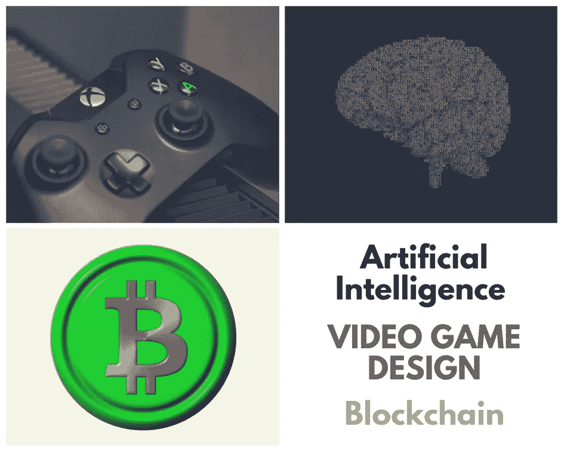
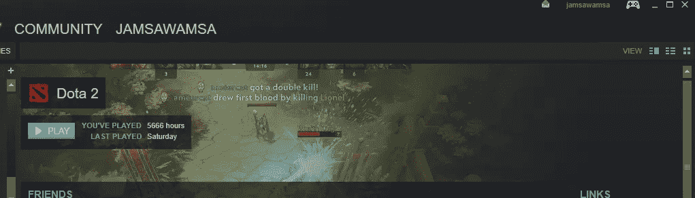

# 我的学习之旅和推动人类前进的 3 项技术

> 原文：<https://medium.com/hackernoon/my-journey-on-learning-and-the-3-technologies-that-will-drive-humanity-forward-4da677bdddfe>

在花了一大笔钱上大学获得学位之后，我可以说我从大学经历中得到的最大收获就是我母校的校训。

> **Ancora Imparo** 是意大利语，意为“我仍在学习”

2018 年之前的生活充满了起起落落，但大多数时候我只是在其中漂浮。直到 2017 年底，我才开始意识到，我积累的记忆和经历需要被记录和反思，以免我忘记迄今为止学到的一切。

所以，这是我对成就今天的我的承诺，也是我想走的路的宣言。

# 30 秒后见

我出生在新加坡，但我在吉隆坡长大。基本上我一生都在四处奔波，总共呆过 5 个国家。

从小到大，学习对我来说是小菜一碟。我尽了最少的努力，直到过度自信和傲慢让我从美国的大学退学。

变得抑郁。捡起我的屎(感谢迪伦)，足够幸运地获得第二次机会回到马来西亚，学习计算机科学。我要去英国交换一个学期的机器学习研究，最后一年在澳大利亚。基本上情况又开始好转了。

我出生在千禧一代——我基本上看到了有和没有 T4 科技的世界是什么样子。老实说，我看到技术改变我周围事物的速度让我既害怕又着迷。

2017 年，我意识到，无论我对自己知道的东西了解多少，再多的知识也不足以让我对自己的生活感到安全和有保障。

# 3 大技术支柱

意识到技术是世界变化背后的引擎，我列出了 3 个我认为是革命性的领域，它们很有可能将人类推向我们想象的极限。

这些是:

1.  人工智能🤖
2.  [区块链](https://hackernoon.com/tagged/blockchain)技术💱(有人请做一个合适的区块链表情符号)
3.  游戏设计🎮

考虑到这两个已经带来的许多进步，为什么#1 和#2 会在那个列表上是很明显的。另一方面，游戏设计是一个我对未来充满信心的领域。这也是我最感兴趣的领域。

这个[视频](https://www.youtube.com/watch?v=8FpigqfcvlM)基本上概括了我对此的感受。

让我着迷的是，你可以含蓄地教别人一些东西，而不必给出指示。想象一下，如果这可以应用于教育、培训或任何形式的知识共享。创造无缝体验，即使是陌生的，也能立即感到熟悉和直观。

> 游戏设计基本上是 UX 在类固醇。

苹果做了一项惊人的工作，让东西感觉超级可用和直观——甚至没有明确地教用户如何做事情。虽然他们可能对此有不同的说法，但自 Atari 时代以来，游戏设计一直试图解决这个问题，在 Atari 时代，游戏中的指令占据了游戏盒中宝贵的空间。

2017 年底，我决定开始了解所有这些人，而不是袖手旁观，看着这场革命发生，而不是置身其中。

# 我的目标

1.  **成为这三大支柱**的大师。我不是为了学习而学习这些技术。我要用我学到的去改变世界。
2.  **结合这三大支柱，为世界创造价值**。我将找到结合这三大支柱的方法，并将它们转化为推动人类前进的可用技术。
3.  激发他人拥抱技术革命并为之激动。改变世界不是我一个人能够简单地希望实现的事情。通过写下我的经历和分享我学到的东西，我想激励其他人也成为我旅程的一部分。

# 我对技术和学习这三大支柱的承诺

对于 2018 年，我为自己设定了目标，要在这三个我认为具有革命性的领域追求知识。

## 课程

完成 3 个支柱中任何一个支柱的 6 门课程:

1.  [来自 UCL 的大卫·西尔弗的强化学习](http://www0.cs.ucl.ac.uk/staff/d.silver/web/Teaching.html)
2.  [Coursera 上吴恩达的机器学习](https://www.coursera.org/learn/machine-learning)
3.  [Fast.ai](http://course.fast.ai/)
4.  [成为 Udemy 上以太坊和 Solidity 的区块链开发者](https://www.udemy.com/getting-started-with-ethereum-solidity-development/)
5.  TBD
6.  TBD

我决定在完成课程后选择我的课程，因为我意识到许多材料往往是重叠的(我知道这一点，因为我已经查阅了一些)，我不知道自己不知道什么，直到我了解这个领域。😬

## 书籍/阅读

阅读 6 本关于 3 个支柱中任何一个的书，或者任何能帮助我提高自己的书:

1.  尤瓦尔·诺亚·哈拉里的《智人:人类简史》
2.  ✔️ [克里斯·科勒的《最终幻想五》](https://bossfightbooks.com/)
3.  ✔️ [洞窟由德里克余](https://bossfightbooks.com/products/spelunky-by-derek-yu)
4.  [尼克·萨特纳的《巨人的影子》](https://bossfightbooks.com/products/shadow-of-the-colossus-by-nick-suttner)
5.  TBD
6.  TBD

类似地，当我完成一本书的时候，我也会在飞行中做出决定。你可能会注意到我有 3 本来自 [boss 格斗书](https://bossfightbooks.com/)的书。如果你正在寻找经典游戏的案例研究或个人经历，不用再找了。他们目前是我最喜欢的独立出版商之一。

自然，我的阅读不仅仅局限于这几本书。每当我感兴趣的时候，我经常读一些短小的书或文章。我还特意阅读了最近一篇关于人工智能在[培育方面的研究论文。每一天。](https://nurture.ai/)

我推荐人们阅读几篇值得注意的文章:

*   [我自创的人工智能硕士学位作者丹尼尔·伯克](https://hackernoon.com/my-self-created-ai-masters-degree-ddc7aae92d0e')(如果你注意到了，这篇文章从丹尼尔和他的生活学习方式中汲取了许多灵感💪)
*   我 32 岁，在生物黑客上花了 20 万美元。变得更冷静、更瘦、更外向、更健康、更快乐——塞尔日·法格特

## 追求电子游戏🎮

完成 6 个视频游戏。

我是一个超级电子游戏鉴赏家。我在 steam、PS4 和任天堂 3DS 上有超过 200 款游戏。实际上，我一周只玩 3-5 个小时。收集游戏更多的是我的退休计划——我打算一边喝威士忌，一边玩所有积压的游戏。👌

现在这看起来像是一个没有结果的目标，但是我仔细地管理我玩的游戏，确保它们要么是某种形式的经典，要么在游戏设计中对我有价值。虽然我怀疑我能否说服任何一个不是游戏玩家的人去玩这些游戏，但我强烈建议你去读一些关于这些游戏为何如此神奇的文章:

1.  [最终幻想四](https://kotaku.com/final-fantasy-vi-retrospective-simply-the-best-1792398695)
2.  [Collossus 的影子](https://www.polygon.com/2018/1/30/16946392/shadow-of-the-colossus-review-remake-ps4-playstation-sony)
3.  [最终幻想十五](https://www.polygon.com/2016/11/28/13661570/final-fantasy-15-review-xv-ff15-ps4-playstation-4-xbox-one-square-enix)
4.  [超轻型漂流者](https://kotaku.com/hyper-light-drifter-the-kotaku-review-1769432532)
5.  TBD
6.  TBD

# 为什么会有这些？

以前，我完全把时间浪费在电子游戏和毒品上。我漫无目的地生活着。看看我玩 Dota 2 游戏的时间就知道了。

The peak of playing of all 5666 hours wass getting into the top-32 in a national tournament, nothing that can secure my future.

2017 年是我决定停止所有这些废话的一年，并追求让我满意的事情。在未来的岁月里变得有意义，而不是某个四处漂泊的人等待事情发生在他身上。我进了 crypto，AI 还有最重要的，**做事** 。

今天，我发起了一项名为“人工智能星期六”的全球运动，在全球 50 多个城市为所有技能水平的人传播免费的人工智能教育，并在一家名为[nurse 的公司担任人工智能研究员。AI](https://nurture.ai/) 我有两个项目是关于区块链、AI 和游戏设计的。

> 我从未对生活感到如此满意。

然而，我仍然渴望更多。当技术革命发生时，我想在那里。当第一个人登上火星，当登月飞行商业化。([埃隆·马斯克](https://medium.com/u/76caee166b9c?source=post_page-----4da677bdddfe--------------------------------)😂).见鬼，我想成为幕后黑手，推动事情向前发展。

只是。因为。这是。全部。所以。**血腥。** **激动人心**。

*觉得这个有用吗？请随意击碎拍手，并检查我的其他作品。*😄

*李中清是* [*培育学院的人工智能研究员。艾*](https://nurture.ai/) *。他最近从莫纳什大学计算机科学专业毕业，撰写了关于人工智能和深度学习的文章。在 Twitter 上关注他@*[*jamsawamsa*](https://twitter.com/JamsaWamsa)*。*