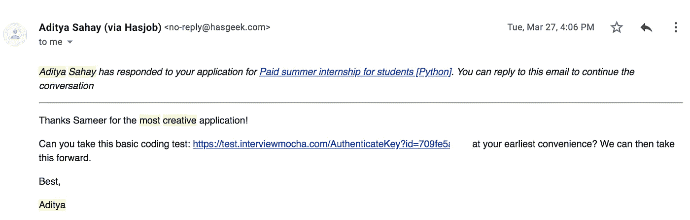

# 我的旅程:Sqrrl 之路

> 原文：<https://medium.com/hackernoon/my-journey-the-sqrrl-way-67e725492f33>

注意:这是我在 Sqrrl 实习时完全自愿和诚实地写下的经验和学习。
这是我写过的对我有意义的最长的一篇。

# 零比一

四个学期前，我在完全没有编程背景(除了 CMD+C / CMD+V)的情况下开始上大学，对大学从一开始就没有任何好处有一个大概的想法。我唯一的想法是理解和构建 web/移动应用程序的内部实现的强烈愿望，或者更准确地说，人们是如何主要通过技术赚取数百万美元的？所有这一切都带着好奇心和无所畏惧的心态。

我从未上过任何特定的编程课程，在学习编码时也从未盲目追随任何一位教练。尽管如此，我还是非常崇拜肯尼斯·雷茨、阿明·罗纳彻以及更多的 Python 董事会成员和核心开发人员。

在尝试新的东西时，我总是有一个现有的项目或一个新的项目想法——首先实现它，没有样本项目跟随它的应用。人们称之为“吃一堑长一智！”也是。我失败的次数远远多于成功的次数。但是没关系。因为那些失败让我胜利的时刻更加难忘。

# **Sqrrl 方式**

作为我所在大学的学生需要在暑假的两个月中进行的强制性暑期培训/实习，我于 2018 年 4 月被安排在 [Sqrrl Fintech](https://sqrrl.in/) 担任 Python 实习生。Sqrrl 是印度首个瞄准千禧一代的个人理财平台。在我呆在这里的八周里，我有了数不清的智力发现:这都归功于与我一起工作的[团队](https://sqrrl.in/team)令人难以置信的指导和耐心。在这两个月里，我不仅学到了技术，还学到了金融和营销。
-复利是第八大奇迹——我在真实数据上明白了这一点！
-几种营销策略，如预算分配等
-资产管理公司如何运作，共同基金和 sip 如何运作，以及了解我们的国家证券交易所如何运作。
-了解年化回报率:CAGR 和 XIRR

而在技术方面，从第一天起，我就试图遵循最好的模式。我做过无服务器 Lambda，DynamoDB，RDS。在 Sqrrl，在服务器端，我们使用一个非常轻量级的裸机 python 框架来构建快速的 web APIs 和名为 Falcon 的应用后端。有了一些使用像 Django 这样的全功能“包括电池”的服务器端 web 框架的经验，我花了一些时间来克服这一点并掌握这种极简主义！与此同时，它还有许多额外的好处，比如灵活的设计，与其他 python 框架相比更好的性能，更少的黑盒内容，当然，更少的开箱即用依赖性——除了 python 标准库，six 和 mimeparse 是唯一的依赖性。

# 项目和学院

当我开始自己的一些个人项目时，许多人忽视了我正在解决的问题，因为没有其他选择，我宁愿继续下去。迭代用户的反馈，今天它的代码库已经改变了 90%以上。当前:回报不错，至少远远超过满足我的开销。几乎有 25 万到 50 万用户每月出现(每月贡献不到 5 个小时)。那些忽视它的人，现在说这都是运气。显然，我不是彩票-

> “运气很重要。时机就是一切。但如果你坚持足够长的时间，你就能创造自己的运气。”
> ——海军拉维康

我不喜欢大学学习，我认为这是一个围绕个人全面成长的自我发现时期。所以坦率地说，一个人只是去那里遇到做不同事情的人，加入学生组织/社团，参加他们舒适区之外的活动。就我而言，我加入了位于皮坦普拉的维威卡难达职业研究学院技术协会——ACE——T2——计算机爱好者协会。我们是一群有才华(不是我，人们这么说)和好奇的技术爱好者，专注于各种领域，如 Web 开发、机器学习、图形设计、Android、物联网等。我从这个社团开始了我的编码之旅，从这个团队和他们用他们的技术技能做的项目中获得灵感。在过去的三年里，我们在 ACE 已经帮助了几个学生(包括我)开始了他们的开发者之旅，并且还主持了几场关于新技术的会议&举办了黑客马拉松。

在接下来的几个月里，我计划进一步提高我的技能，最有可能的是，开始开发一款 SaaS 产品。

我们被反复告知生命短暂，让我们不要延迟过我们渴望的生活。现在就做。

虽然这篇博客是我尽我所知写的，但如果你发现任何缺点，你可以写信给我 [sam@sameerkumar.website](mailto:sam@sameerkumar.website) 。

在[推特](https://twitter.com/sameer_kumar18)
[上关注我](https://www.sameerkumar.website/)