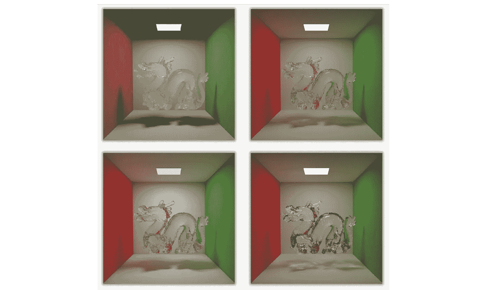
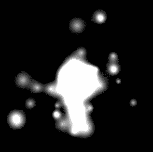

# 我的开源之旅

> 原文：<https://medium.com/hackernoon/my-journey-through-open-source-a0b033562294>

Image credit: [Autumn road](https://unsplash.com/photos/5hvn-2WW6rY) by [Patrick Tomasso](https://unsplash.com/@impatrickt)

在开源上工作的感觉是奇怪的独特和满足。你会觉得自己在为一个由来自世界各地的杰出人士组成的**更大的**做贡献。这是一种我在作为软件工程师的一般工作中很少感受到的感觉，它提醒了我当初为什么要进入编程。

为此，我很乐意分享我参与的一些开源项目，希望它们能激励其他人也这样做！

无论是找到一个你感兴趣的很酷的项目，分叉它，并作出贡献([指南](https://opensource.guide/how-to-contribute/))，还是如果你想在发布自己的开源项目方面做得更好，我鼓励你走出去并开始承诺！

这些项目大多专注于 JavaScript，分为以下几类:

*   节点. js
*   反应
*   操纵木偶的人
*   FFmpeg
*   爬行
*   制图法
*   寇阿相思树
*   混杂的

# 节点. js

*   [update-markdown-jsdoc](https://github.com/transitive-bullshit/update-markdown-jsdoc) —用 jsdoc 文档更新 markdown 文档部分。使用 API 文档自动更新库的自述文件非常有用。
*   [update-markdown-usage](https://github.com/transitive-bullshit/update-markdown-usage) —通过`--help`用 CLI 使用信息更新 markdown 文档部分。使用使用文档自动更新 CLI 的自述文件非常有用。
*   [抽象对象存储](https://github.com/transitive-bullshit/abstract-object-storage)——收集了使用谷歌云存储的有用工具。
*   [p-cache](https://github.com/transitive-bullshit/p-cache) —装饰器，通过 lru-cache 存储异步函数的结果。
*   [random](https://github.com/transitive-bullshit/random) —支持多种常见分布的可播种随机数发生器。
*   [id-shortener](https://github.com/transitive-bullshit/id-shortener)—node . js 的高效 id / url shortener，由默认为 redis 的可插拔存储支持。
*   [node-compat-require](https://github.com/transitive-bullshit/node-compat-require) —轻松允许您的节点程序在目标节点版本范围内运行，以最大化兼容性。
*   [async-await-parallel](https://github.com/transitive-bullshit/async-await-parallel)—node . js 模块，具有简单的并发控制，用于等待一组异步结果。
*   [snapchat](https://github.com/transitive-bullshit/snapchat) —非官方 Snapchat API 的 Node.js 客户端
*   [ip-set](https://github.com/transitive-bullshit/ip-set) —针对 IPv4 和 IPv6 地址优化的高效可变集合数据结构。主要用例是处理潜在的大型 IP 黑名单。
*   [rect-cover](https://github.com/transitive-bullshit/rect-cover) —计算两个矩形之间的变换，就像`background-size: cover`一样。([演示](https://transitive-bullshit.github.io/rect-cover/))
*   [rect-contain](https://github.com/transitive-bullshit/rect-contain) —计算两个矩形之间的转换，就像`background-size: contain`一样。([演示](https://transitive-bullshit.github.io/rect-contain/))
*   [github-is-starred](https://github.com/transitive-bullshit/github-is-starred) —检查用户是否已经标记了特定的 GitHub repo。
*   [GitHub-is-starred-CLI](https://github.com/transitive-bullshit/github-is-starred-cli)—CLI 检查用户是否已标记了特定的 GitHub repo。
*   webtorrent —面向网络的流媒体 torrent 客户端。⚡️ ( [演示](https://webtorrent.io/) ) ( *投稿*)
*   [ow](https://github.com/sindresorhus/ow) —人类的函数变元验证。(*投稿人*)
*   [Awesome-lint](https://github.com/sindresorhus/awesome-lint)—[Awesome](https://awesome.re/)列表的 Linter。(*投稿人*)

# 反应

*   [create-react-library](https://github.com/transitive-bullshit/create-react-library) —用于轻松发布现代 react 库的 CLI。⚡

Create React Library (CRL)是我最喜欢和最常用的开源项目之一。这有点像 Create React App (CRA)的弟弟妹妹。它甚至使用 CRA 在引擎盖下，例如使用和本地组件开发。

*   [react-modern-library-Boilerplate](https://github.com/transitive-bullshit/react-modern-library-boilerplate)—样板和 CLI [create-react-library](https://github.com/transitive-bullshit/create-react-library) 用于通过 create-react-app 发布带有汇总和示例用法的现代 React 模块。

Example of using [create-react-library](https://github.com/transitive-bullshit/create-react-library) to create a reusable React component npm package.

*   [React-背景-幻灯片](https://github.com/transitive-bullshit/react-background-slideshow)——React 的性感平铺背景幻灯片🔥([演示](https://transitive-bullshit.github.io/react-background-slideshow/))
*   [react-starfield-animation](https://github.com/transitive-bullshit/react-starfield-animation)-react✨基于画布的 starfield 动画([演示](https://transitive-bullshit.github.io/react-starfield-animation/))
*   [react-particle-effect 按钮](https://github.com/transitive-bullshit/react-particle-effect-button)—React 的爆发粒子效果按钮🎉([演示](https://transitive-bullshit.github.io/react-particle-effect-button/))
*   [反应粒子动画](https://github.com/transitive-bullshit/react-particle-animation) —基于画布的反应粒子动画🌐([演示](https://transitive-bullshit.github.io/react-particle-animation/))
*   [React-block-image](https://github.com/transitive-bullshit/react-block-image)—React 替代 img，提供更多控制+回退支持。🌃([演示](https://transitive-bullshit.github.io/react-block-image/))
*   [react-mp3-录音机](https://github.com/transitive-bullshit/react-mp3-recorder) —捕捉 MP3 音频的 React 麦克风录音机🎵([演示](https://transitive-bullshit.github.io/react-mp3-recorder/))
*   [React-before-after-slider](https://github.com/transitive-bullshit/react-before-after-slider)—React 的性感图像比较滑块。( [demo](https://transitive-bullshit.github.io/react-before-after-slider/)

# 操纵木偶的人

*   [令人敬畏的木偶师](https://github.com/transitive-bullshit/awesome-puppeteer)——令人敬畏的木偶师[资源的精选列表。](https://developers.google.com/web/tools/puppeteer/)
*   [木偶师-渲染-文本](https://github.com/transitive-bullshit/puppeteer-render-text) —使用无头 chrome 的健壮文本渲染器。
*   [puppeter-render-text-cli](https://github.com/transitive-bullshit/puppeteer-render-text-cli)—使用无头 chrome 的健壮文本渲染器的 CLI。

Example output png produced by [puppeteer-render-text](https://github.com/transitive-bullshit/puppeteer-render-text).

*   [木偶师——电子邮件](https://github.com/transitive-bullshit/puppeteer-email)——由无头 chrome 驱动的电子邮件自动化。
*   [puppet er-email-cli](https://github.com/transitive-bullshit/puppeteer-email/tree/master/packages/puppeteer-email-cli)—由 headless chrome 驱动的电子邮件自动化 CLI。
*   [木偶师——instagram](https://github.com/transitive-bullshit/puppeteer-instagram)——无头 chrome 驱动的 insta gram 自动化。
*   [木偶师-instagram-cli](https://github.com/transitive-bullshit/puppeteer-instagram-cli) —用于由无头 chrome 驱动的 instagram 自动化的 cli。
*   [木偶师——github](https://github.com/transitive-bullshit/puppeteer-github)——无头 chrome 驱动的 GitHub 自动化。
*   [木偶师-github-cli](https://github.com/transitive-bullshit/puppeteer-github-cli) —由无头 chrome 驱动的 github 自动化的 cli。

# FFmpeg

*   [awesome-ffmpeg](https://github.com/transitive-bullshit/awesome-ffmpeg) —以 JavaScript 为重点的 awesome [ffmpeg](http://ffmpeg.org/) 资源精选列表。👻
*   ffmpeg-concat —使用 ffmpeg 和性感的 OpenGL 过渡将一系列视频连接在一起。
*   [FFmpeg-GL-transition](https://github.com/transitive-bullshit/ffmpeg-gl-transition)—FFmpeg 过滤器，用于在视频流之间应用 GLSL 过渡([GL-transition](https://gl-transitions.com/))。这是一个更低级的 C++版本的 [ffmpeg-concat](https://github.com/transitive-bullshit/ffmpeg-concat) ，它扩展了 ffmpeg 本身。

[ffmpeg-concat](https://github.com/transitive-bullshit/ffmpeg-concat) OpenGL transitions demo (also applies to [ffmpeg-gl-transition](https://github.com/transitive-bullshit/ffmpeg-gl-transition))

*   [ffmpeg-probe](https://github.com/transitive-bullshit/ffmpeg-probe) —用于获取媒体文件信息的 ffprobe 包装器。
*   [ffmpeg-generate-video-preview](https://github.com/transitive-bullshit/ffmpeg-generate-video-preview)—从视频中生成一个吸引人的图像带或 GIF 预览。

GIF created with [ffmpeg-generate-video-preview](https://github.com/transitive-bullshit/ffmpeg-generate-video-preview).

*   [ffmpeg-extract-frame](https://github.com/transitive-bullshit/ffmpeg-extract-frame) —从视频中提取单个帧。
*   [ffmpeg-extract-frames](https://github.com/transitive-bullshit/ffmpeg-extract-frames)—使用 ffmpeg 从视频中提取屏幕截图。
*   [ffmpeg-extract-audio](https://github.com/transitive-bullshit/ffmpeg-extract-audio) —从媒体文件中提取音频流。
*   [ffmpeg-on-progress](https://github.com/transitive-bullshit/ffmpeg-on-progress) —使用 fluent-ffmpeg 可靠地报告进度的实用程序。
*   [ffmpeg-cli-flags](https://github.com/transitive-bullshit/ffmpeg-cli-flags) —所有 ffmpeg 命令行标志的综合列表。
*   [get-mp3-duration](https://github.com/transitive-bullshit/get-mp3-duration) —计算节点或浏览器中 mp3 缓冲区的持续时间。([演示](https://transitive-bullshit.github.io/react-mp3-recorder/))
*   [p-exiftool](https://github.com/transitive-bullshit/p-exiftool) —包装 [exiftool](https://www.sno.phy.queensu.ca/~phil/exiftool/) 用于从许多不同的文件类型中读取元数据。
*   [gif-extract-frames](https://github.com/transitive-bullshit/gif-extract-frames) —从 gif 中提取帧，包括帧间合并。

Example extracted frames from a GIF via [gif-extract-frames](https://github.com/transitive-bullshit/gif-extract-frames).

# 爬行

[captcha-solver](https://github.com/transitive-bullshit/captcha-solver) handles many different types of captchas, including Google’s reCAPTCHA v2.

*   [captcha-solver](https://github.com/transitive-bullshit/captcha-solver) —用于跨多个提供商自动验证 captcha 的库和 CLI。
*   [解析电子邮件](https://github.com/transitive-bullshit/parse-email) —解析 mime 编码的电子邮件。
*   [parse-otp-message](https://github.com/transitive-bullshit/parse-otp-message) —为验证码和服务提供商解析 otp 消息。
*   [短信号码验证器](https://github.com/transitive-bullshit/sms-number-verifier) —允许你欺骗短信号码验证。
*   [getsmscode](https://github.com/transitive-bullshit/getsmscode)—[getsmscode.com](http://www.getsmscode.com/)的 API 客户端。

# 制图法

Before & After demo of the [primitive](https://github.com/transitive-bullshit/primitive) algorithm reconstructing an image with 500 random shapes.

*   [图元](https://github.com/transitive-bullshit/primitive) —从几何图元中再现图像。([演示](https://transitive-bullshit.github.io/primitive-web/))
*   [图元-CLI](https://github.com/transitive-bullshit/primitive-cli)-CLI 从几何图元中再现图像。
*   [phash-im](https://github.com/transitive-bullshit/phash-im) —通过 [imagemagick](http://www.fmwconcepts.com/misc_tests/perceptual_hash_test_results_510/index.html) 进行感知图像哈希。
*   [phash-gif](https://github.com/transitive-bullshit/phash-gif) —感知 gif 哈希，用于轻松找到近似重复的 GIF。
*   [溶解](https://github.com/transitive-bullshit/dissolve-generator) —酷 2D 溶解效果发生器。([演示](https://transitive-bullshit.github.io/dissolve-generator/demo))

Demo of [dissolve](https://github.com/transitive-bullshit/dissolve-generator) effect generator.

# 寇阿相思树

*   [Koa 2-mongose-crud](https://github.com/transitive-bullshit/koa2-mongoose-crud)—[Koa 2](http://koajs.com/)用于 mongose 模型的 CRUD 中间件。
*   [Koa-micro](https://github.com/transitive-bullshit/koa-micro)—[Koa 2](http://koajs.com/)含电池的微服务。
*   [Koa-API-样板](https://github.com/transitive-bullshit/koa-api-boilerplate) — [Koa 2](http://koajs.com/) API 样板，含电池。

# 混杂的

*   [Milton](https://github.com/transitive-bullshit/Milton) — C++渲染框架 w/ MLT，bidi 路径跟踪等。和 OpenGL 预览(布朗 09 年的本科论文项目)。

([Milton](https://github.com/transitive-bullshit/Milton)) The same scene rendered using ray tracing (top left), path tracing (top right), bidirectional path tracing (bottom left), and MLT (bottom right). The brute force path traced version in the top right should be seen as a correct, reference image. Note the lack of caustics on the floor and lack of indirect illumination in the ray traced version. Discrepancies in the bidirectional path tracing and MLT renders are due to differences in tone mapping as well as implementation issues with correctly handling specular paths.

*   [Mipscope](https://github.com/transitive-bullshit/mipscope) —面向学习 MIPS 架构汇编的学生的跨平台 IDE。重点是一个方便的调试环境，包括一个可视化的，可逆的调试器。
*   [Gravity-sprite kit](https://github.com/transitive-bullshit/Gravity-spritekit)—iOS n-body 模拟用元球可视化。SpriteKit 提供的物理和图形。
*   [Gravity-cocos2d](https://github.com/transitive-bullshit/Gravity-cocos2d)—iOS n-body 模拟结合可视化与元球。cocos2d 提供的物理和图形。

Gravity visualization demo ([Gravity-spritekit](https://github.com/transitive-bullshit/Gravity-spritekit), [Gravity-cocos2d](https://github.com/transitive-bullshit/Gravity-cocos2d)).

# 结论

我在创建所有这些开源模块演示的过程中获得了很多乐趣。开源社区正在蓬勃发展，尤其是对 JavaScript NPM 来说。

希望这些项目中的一个或多个能激发你的好奇心去尝试…或者你会继续创造你自己的比我的更好的开源项目！😜

最后，如果你想要更多令人敬畏的开源软件，请关注我的 github。

## 在你走之前…

*如果您喜欢这篇文章，请点击👏下面，并与他人分享，这样他们也可以享受它。*