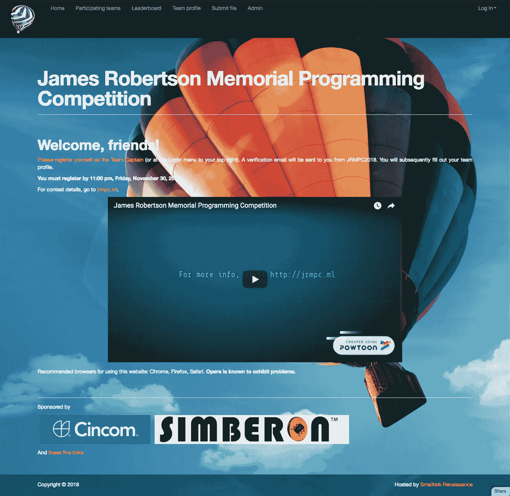

# 我在萨尔塔会议上的主题演讲

> 原文：<https://medium.com/hackernoon/my-keynote-at-the-salta-conference-435dfaccc888>

## 和 Smalltalk 的营销

我刚刚从阿根廷萨尔塔举行的 2018 年 small talks 会议回来，在那里我做了主题演讲。它很受欢迎，并启发了万斯·克什纳，[实验室软件](https://www.labware.com/lwweb.nsf/rHome3.xsp)的首席执行官和创始人，全额资助[詹姆斯·罗伯逊纪念编程竞赛](https://jrmpc.wordpress.com)。我对结果非常满意。

接下来是笔录。

谢谢你的介绍。

很高兴来到这里发表这个主题演讲，尤其是在你们美丽的国家。我要感谢莱安德罗·卡尼利亚邀请我并促成此事。

在过去的四年里，我一直是 Smalltalk 的坚定拥护者。我想解释一下我为什么这么做，我的动机是什么，我的策略是什么，结果是什么。

但是，首先，让我们从一点历史开始…

五十多年来，IT 行业一直保守着一个肮脏的小秘密。自 20 世纪 60 年代以来，我们使用文本编程语言和文本编辑器，以异常一致的方式编写程序，并将源代码存储在文件和文件夹中。这些文件包含了大量难以阅读的代码。

我们编译了源代码，并从命令行构建了应用程序。即使有了今天的现代 IDEs，我们仍然在间接地这样做。

我们测试了我们的应用程序，如果它失败了，我们必须诊断问题，编辑代码，然后重新编译。如果它再次失败，我们不得不重复。这种编辑-编译-测试-调试的循环既耗时又低效。

今天几乎没有什么变化。我们的语言更加奇特。我们的文本编辑器更加全面。但是我们仍然是文件、文件夹和命令行的奴隶。借用《星际迷航》中“永远边缘的城市”的一句话，我们正在“用石刀和熊皮”有效地编程。

结果，我们的生产力受到了影响。有了合适的工具，我们的生产力可以翻倍。我们可以用现在平均一半的时间来开发软件。这对我们的经济和工业有多大价值？

具有讽刺意味的是，这种可能的未来已经在我们面前摆了 40 多年，但我们却一直视而不见。

有一首彼得·艾伦的歌是这样唱的:

不要把过去扔掉，你也许会在雨天需要它，梦想会再次实现，当一切都变得新的时候

这个最适用于 Smalltalk。

它有着伟大的历史遗产。它已经在战场上被证明了无数次。根据软件度量权威机构 Namcook Analytics 的 Capers Jones 的说法，Smalltalk 是所有主要编程语言中最有生产力的。只有像腮腺炎和 Mathematica 这样的语言更有生产力，但是谁真的想用那些语言进行通用编程呢？

自从大约 11 年前我的一个朋友向我介绍了 Smalltalk，我就对这门语言着迷了。我想知道为什么它没有更受欢迎。尽管你可以在网上找到所有关于 Smalltalk 的技术资料，包括一些宣传，但人们并没有太关注它。

我认为这是因为 Smalltalk 的营销方式不恰当。技术会议没有接触到足够多的人。充满代码示例的技术文章并不引人注目。

社交媒体完全忽略了 Smalltalk。在我看来，需要一个响亮的声音。我决定成为那个声音，因为，坦率地说，没有其他人站出来。

我的策略是发表很多很多赞美闲聊优点的文章。这些文章必须引人注目，所以我用吸引人的图片装饰它们。我大量使用了由 BYTE 杂志推广的著名的热气球主题。

1981 年 8 月，当 BYTE 在 Smalltalk 上发表了一篇封面故事时，Smalltalk 在编程社区引起了轰动。它的影响力如此之大，以至于像 Objective-C 和 Erlang 这样的语言以及公共 Lisp 对象系统都会从中汲取灵感。很久以后，Ruby、Python、Groovy、Scala、Dart 和其他语言也纷纷效仿。

这里有一张我经常使用的最喜欢的图片。简直令人叹为观止。它唤起人们心中的自由和冒险。

这是另一个。我收集了大约 24 张类似的图片，我非常有效地使用了它们。

我强调了 Smalltalk 的六大优势。我特别强调了实时编码的强大功能，以及 Smalltalk 是一个实时对象系统的事实。IDE 将代码组织为类和方法的集合，而不是存储在文本文件中的大量代码。

Bret Victor 称之为以二维空间方式表示源代码。没有源文件。你的眼睛只关注类和方法。在周三的演讲中，都铎·吉尔巴向我们展示了这一想法的下一次重大演变([迷人的工具包](https://feenk.com))。

我使用我精心制作的明信片展示了 Smalltalk 语法极其简单和易于学习。过去曾经使用过 Smalltalk 明信片，但它们并不特别吸引人。

这部电影很受欢迎。这无疑是我收藏中点击率最高的照片。

我讨论了作为 Smalltalk 编程中首要质量的实时编码，以及它如何对 Smalltalk 令人难以置信的生产率负责。

在 2017 年的一篇论文中，Capers Jones 根据生产率对编程语言进行了排名。以下是一些数据:

生产率最低的语言是 C 和 Fortran，最有趣的是 JavaScript。JavaScript 目前是一种非常热门的语言，但并不像 web 开发人员声称的那样高效。

Ruby 的生产率相当高。Objective-C 也是如此，但很少有人像 Smalltalk 那样富有成效。

重要的是要明白，Namcook Analytics 的研究并不是说所有这些语言都是高效的。Excel 对于电子表格应用程序来说效率最高。流行性腮腺炎最适合医院和医疗保健应用。但是最有效的全能语言是 Smalltalk。

关于数据中的明显聚类，例如，C++、Java 和 Python 都有相同的工作时间。正如 Capers Jones 解释的那样，该表综合了多年来收集的大量客户研究的数据来源，并经过“标准化”以给出聚类结果。聚类是应用于数据的统计方法的副作用。

在 20 世纪 90 年代，Smalltalk 成为世界上最流行的 OO 语言，仅次于 C++。C++占据了最大的份额，但是 Smalltalk 获得了可观的 15 %,远远高于该领域的其他公司。

这是《计算机世界》1995 年 11 月 6 日的一页，展示了 Smalltalk 和 C++之间的争斗。

Smalltalk 非常适合商业使用，以至于 IBM 选择 Smalltalk 作为其 VisualAge 企业计划的核心，以取代 COBOL。显然，IBM 并没有轻率地做出这个决定。

那么，你如何营销 Smalltalk 呢？我的策略很简单。多年来，人们写了无数的技术文章，做了无数的技术演讲。人们一直致力于各种开源 Smalltalk 项目。

然而，“如果你建造了它，他们就会来”的哲学并没有奏效。在理智的基础上吸引人们是行不通的。Smalltalk 仍然被忽视。我猜测，需要做的是在情感上吸引人们的*，就像市场营销和广告中做的那样。Smalltalk 需要像苹果推广 iPhone 和埃隆马斯克推广特斯拉一样推广自己。*

*我列举了 Smalltalk 的众多历史贡献。我提醒公众三十年前 Smalltalk 的流行。我列出了 Smalltalk 的主要用户。我展示了 Smalltalk 是多么的多才多艺。*

*我保持营销信息清晰、简单、有重点。我一遍又一遍地重复这些信息。*

*结果是我的文章被世界各地成千上万的人阅读。其中一篇题为“学习 Smalltalk 如何让你成为更好的开发人员”的文章获得了超过 70，000 次浏览。在 Code Project，一篇类似的文章获得了 12000 次浏览。*

**

*在 Quora 上，我回答了数千个问题，并给出了学习 Smalltalk 编程的建议。这些答案也被成千上万的人阅读。所以，总的来说，今天有更多的人知道 Smalltalk。我相信我已经消除了 Smalltalk 消亡的看法，但也许这只是狂妄自大。*

**

*我试图在我的祖国加拿大创建一个 Smalltalk 编程竞赛。不幸的是，我无法获得资金。然而，我的努力可能会给你更多的营销思路。*

*这是我创作的一张海报。*

**

*这是我创建的竞赛网站…*

**

*下面是宣传片视频:*

****

*这里有几个 t 恤设计:*

**

*和*

**

*我希望 Smalltalk 社区继续支持我。在过去的四年里，我制造了很多噪音，但它绝不能止于我。我敦促全球所有的小型谈话者继续我所做的工作。让你的声音在社交媒体上被听到。撰写针对新人和企业高管的博客。不仅仅是技术写作。*

*将 Smalltalk 的营销放在首位。*

*我有一些让你的声音听得更清楚的建议。当你写作时，要清晰而充满激情。在你的博客中使用吸引人的醒目图片。*

*培养自己的写作能力并不容易。只能来源于实践。就像编程一样，你写得越多，你就会变得越好。*

*让激情成为你的向导。它会在你的写作中表现出来。发挥你的想象力。当我放松下来，专注于闲聊时，脑海中闪现的想法之多总是让我惊讶不已。*

*告诉人们你的故事。你为什么选择 Smalltalk？你为什么留在那里？用 Smalltalk 的时候什么让你开心？*

*了解这门语言的历史，这样你就可以提出许多有趣的事实来支持你的建议。我的很多文章都包含了很好的例子。*

**

*最后，我想说的是。Smalltalk 理应获得比过去 20 年更好的命运。今天有太多的开发人员要么从未听说过 Smalltalk，要么认为 Smalltalk 是一种过时的语言。*

*平均而言，Smalltalk 有可能使世界软件开发生产率翻一番。这将对 IT 行业以及我们的经济产生巨大影响。*

*然而，对我来说，Smalltalk 最大的好处是它将乐趣带回了编程中。Java、Python、JavaScript 和 C++带来的认知负荷对我来说从来都不有趣。通过 Smalltalk，我可以了解整个系统。没有黑暗的角落。Smalltalk 中的编程让我喜笑颜开。*

*在一天结束的时候，这是唯一真正重要的事情。非常感谢。*