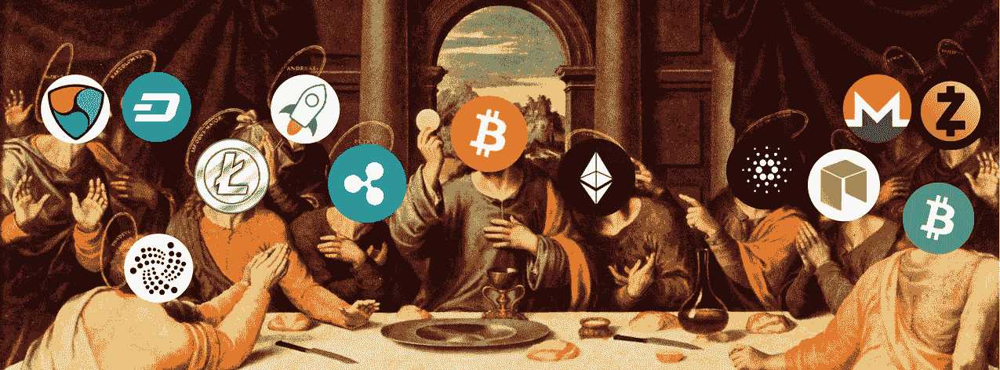

# 我对 2018 年及以后最有价值的加密市场的见解

> 原文：<https://medium.com/hackernoon/my-most-valuable-crypto-market-insights-for-2018-and-beyond-5c0a454fb278>

## *花费成百上千个小时与*处于加密领域前沿的颠覆性专家一起思考的结果。

There are several private jokes in this *revisited* version of [The Last Supper](https://www.artbible.info/art/large/301.html). Have fun finding them all.

自从我开始研究密码世界，我花了成百上千个小时——如果不是上千个小时——收集、吸收和思考一切，以便更好地了解这个市场(病毒？)这让我更加着迷。

我发现了非常有价值的信息，今天我想与你们分享。**无论你是密码领域的新手还是老手，我希望在这篇文章结束时，你会获得新的视角、** **和你在**之前从未听说过或思考过的 **。**

> “最有价值的经济学家是加密经济学家，因为他们实际上可以创造、管理和分析经济。”
> 
> —海军拉维坎特

如果你想直接跳到某一节，这篇文章由 8 部分组成:

1.  分散的交换协议将会改变游戏规则
2.  比特币基地(以及其他集中式交易所)有巨大的发展机会
3.  协议和可扩展性:正在进行中…但仍在等待黑仔应用程序
4.  秘密地缘政治:为什么秘密世界就像《权力的游戏》
5.  快进(2018 年以后)
6.  原始的隐秘想法和格言
7.  一些提示，特别是对加密新手

我们有很多话题要谈，所以让我们开始吧:

# 1.分散的交换协议将会改变游戏规则

> **“如果你认为我们正走向一个有数千个令牌的世界，那么本地支持它们是至关重要的**。”
> 
> —弗雷德·厄尔萨姆

1.  分散式交换协议将会改变游戏规则，因为**它们是加密基础设施**中的关键部分。他们有潜力发展秘密经济，并帮助将它们推向新的高度。
2.  推论:**支持分散式交换协议的协议可能会成为 2018-2019 年的大赢家**。**例如，参见 0x 项目($ZRX)。**您想了解更多关于 0x 的信息？[阅读这篇由](https://multicoin.capital/2017/12/14/0x-zrx-analysis-valuation/)[多信资本](https://twitter.com/multicoincap)撰写的宝石。
3.  如果我们看到更多基于 0x 协议的 dapps，如 [Paradex](https://paradex.io) ，这可能会导致以太坊($ETH)和 0x 的价值大幅增加。
4.  **OmiseGo ($OMG)可能是加密领域最******的项目之一。**它旨在建立一个分散的交易所/流动性提供者机制/票据交换所/信息传递[网络](https://hackernoon.com/tagged/network)/资产支持[区块链](https://hackernoon.com/tagged/blockchain)网关。但是，虽然我一开始在这个项目上花了很长时间，但我现在有点怀疑[交易将如何在链上结算](https://cdn.omise.co/omg/whitepaper.pdf)。OmiseGo 的团队应该使用一个[宇宙网络](https://cosmos.network)和一个非常复杂的过程来结算交易。**当然这很危险，但同时也很有趣**，所以拭目以待吧。**
5.  **其他值得注意的 dEX 项目:Airswap ($AST)和 Kyber Networks ($KNC)。**
6.  ****未来的分散式应用(dapp)**——包括移动应用——**将需要多个令牌来为其供电**。例如以太(在区块链上提交事务)、Filecoin(存储和检索数据)、假人($GNT)(执行繁重的计算)，当然还有应用程序本身所必需的令牌。**
7.  ****由于用户将** [**极不可能拥有正确比率的令牌来执行 dapp**](/@FEhrsam/why-decentralized-exchange-protocols-matter-58fb5e08b320) **s，因此将需要一个底层机制来按需获取这些令牌。****
8.  **因此，**区块链本地分散式应用将需要智能合约和开放的分散式交换协议**，它们易于使用和定制，以便让分散式应用以令人满意的方式工作。2018 年，我们可能会看到更多去中心化的应用，这将机械地增加去中心化交易所的交易量。**
9.  **分散式交换协议的另一个优点:**自动支持新令牌。这对于创建和支持数千个令牌的非常复杂的应用程序来说是一个需求**。当我们想到这一点时，分散式交易所的未来是令人难以置信的。**
10.  ****像 0x 区(＄DNT)这样的网络可能允许通过创建被称为*区、*的虚拟场所来实现这一点，这些虚拟场所将是市场和社区，它们将通过以太坊和 IPFS 协议在区块链上运行。治理将在阿拉贡(ANT)上完成。****
11.  **当然，不要认为一切都应该在区块链上运行。但是很多东西可以。随着技术的扩展，它可以取代许多需要并行化的服务。**
12.  ****像 NEO(＄NEO)和 Qtum(＄Qtum)这样的项目作为以太坊的替代方案也可能会很有趣。它们可以促进 dapps 的创建和执行，特别是在移动设备上。****

# **2.比特币基地(以及其他集中式交易所)有巨大的发展机会**

> **集权对于比特币基地就像脚跟对于阿奇利亚斯一样:尽管整体实力很强，但仍是一个弱点，可能会导致垮台。**

1.  ****比特币基地是目前最主流的平面加密坡道集中交易所**。但是中央集权对于比特币基地就像脚跟对于阿奇利亚斯一样:尽管整体实力强大，但仍是一个弱点，会导致垮台。**
2.  **正如 Brian Armstrong 所说，2018 年[**将会有更多的硬币加入比特币基地平台。在这个交易所上市的硬币历来都很成功。看看莱特币在著名交易所上市以来，2017 年的表现如何。**](https://youtu.be/irqUjxFtTPw?t=90)**
3.  **由于比特币基地希望成为“股票市场 2.0”，**我的猜测是，我们将有能力投资一篮子代币，就像你投资指数基金一样先锋方式** **，例如使用** [**Set 协议**](https://setprotocol.com) ，它基本上允许低成本、无信任地创建和交换一篮子代币。**
4.  **请记住，比特币基地对 ERC20 代币特别感兴趣。你想知道为什么吗？看看这个，并仔细阅读。**
5.  **比特币基地无疑是加密领域最有影响力和实力的公司之一。他们有一个[(不那么秘密)总体规划](https://blog.coinbase.com/the-coinbase-secret-master-plan-f4d644443301)。我相信比特币基地将通过迁移到混合和分散的结构来解决他们的一些可扩展性和安全性问题。**
6.  **然后你会问:他们的商业模式是什么？嗯，在我看来**他们可以成为 0x 协议的中继，并通过维护外链订单来赚钱**。还有两个理由需要认真思考这个假设:[这个](https://twitter.com/js_horne/status/936824470718709760)和[尤其是那个](https://youtu.be/QIoV93JWqtU?t=1150)。让我印象深刻的是，大多数 0x 项目顾问都是比特币基地的前员工。**
7.  **如果有一天比特币基地采用了 0x 协议，想象一下基于它的效用，令牌的价值会如何暴涨。请记住，在高峰时段，比特币基地有数百万的游客…和海量的交易。**
8.  **注意:虽然比特币基地和分散的交易所可能有光明的未来，但大多数受欢迎的交易所，如 Bittrex 和[币安](https://www.binance.com/?ref=11291033)都是集中的。**
9.  **币安是最常用的交易所的前五名，由于系统超载，它甚至暂停了新的注册。****短期内可能超过币安**。币安最近关闭了新的注册，所以 Kucoin 在这里有一个重要的机会，因为它可能会被无法再使用币安推荐链接的 YouTubers 大量推广。除非币安开放新的注册和更有趣的推荐政策。这就是 Kucoin 让我兴奋的地方。****

# ****3.协议和可扩展性:正在进行中…但仍在等待黑仔应用程序****

> ****“比特币每秒处理不到 3 笔交易(……)以太坊每秒处理 5 笔交易。优步每秒钟骑 12 次。区块链取代签证需要几年时间。”****
> 
> ****维塔利克·布特林****

1.  ******我们现在正处于协议开发阶段。投资应用程序可能有点为时过早且有风险，因为它们严重依赖于构建它们的底层协议**。****
2.  ****而且，正如我们在最近几个月所见证的那样，**可伸缩性是目前行业的主要瓶颈**。但是这可能会在 2018 年底改变。****
3.  ****如果 2017 年是比特币(BTC)年， **2018 年可能是以太坊年**，因为以太坊在 2018 年仍将是最大的区块链开发者生态系统。在接下来的几个月里，我们还可以看到近地天体的崛起和该协议中 ico 的倍增。****
4.  ******当前的协议限制使得运行大型用户应用程序暂时不可能**。在这方面，CryptoKitties 是一次有趣的经历。顺便说一句，[如果你仍然认为 CryptoKitties 是关于猫的，你就错过了整个要点](https://www.reddit.com/r/ethtrader/comments/7hdycd/if_you_think_cryptokitties_is_about_cats_youre/)。因此，现在大举投资大多数区块链应用似乎相当冒险。****
5.  ****有些人可能会觉得这很有趣和奇怪，但我认为色情有机会成为首批成功的区块链应用之一。正如 [TwoBitIdiot](/@twobitidiot/95-crypto-theses-for-2018-ca7b74f8abcf) 完美表达的那样:**“赌博、书呆子游戏和色情总是处于新技术的前沿。”关注 SPANK chain(SPANK)将会很有趣。一些优势是显而易见的:无边界和私人交易。******
6.  ****先说一会儿卡尔达诺(ADA)。**卡尔达诺是** [**一个完全野心勃勃的新人**](https://hackernoon.com/cardano-ethereum-and-neo-killer-or-overhyped-and-overpriced-8fcd5f8abcdf) 。该团队将该项目宣传为第一个拥有同行评审技术的区块链。 [Charles Hoskinson](https://twitter.com/IOHK_Charles) (他之前曾与 [Vitalik Buterin](https://twitter.com/vitalikbuterin) 一起参与以太坊项目)参与该项目，正如你所猜测的，他对如何解决比特币和以太坊等当前大玩家所面临的可扩展性问题有[很好的想法。](https://www.youtube.com/watch?v=_BnBmBZPvS8)****
7.  ****尽管我们在网上发现了很多怀疑论者——FUD 在 Reddit 上也发现了——主要是因为 **Cardano 虽然还处于非常早期的开发阶段，但它已经进入了加密市值的前 10 名。2018 年必将是卡尔达诺决定性的一年。******
8.  ****无论我们谈论的是比特币、以太坊、Cardano、NEO 还是其他……每个人都越来越清楚地认识到 [**区块链治理是最重要的问题之一**](/@FEhrsam/blockchain-governance-programming-our-future-c3bfe30f2d74) **，而获胜的协议是那些将包含内置机制以随着时间推移而发展的协议**。有趣的时光…****
9.  ****哦，我差点忘了谈论涟漪(XRP)。也许是因为[涟漪不分散](https://cryptoyoda1338.wordpress.com/2018/01/04/the-truth-about-ripple/)？Ripple 目前的主要优势是交易速度。**如果闪电网(针对比特币)和分片、雷电、等离子(针对以太坊)成功上线，Ripple 的代币价值可能会逐渐消失**。虽然我认为 Ripple 作为一家公司有机会取得成功，[但我对他们的 token 的长期成功持保留态度](https://multicoin.capital/2017/12/20/bear-case-xrp-bitcoin-futures-edition/)。****

# ****4.秘密地缘政治:为什么秘密世界就像《权力的游戏》****

> ****“永远让你的敌人感到困惑。如果他们从来不确定你是谁或者你想要什么，他们就不知道你下一步想做什么。有时候，让他们困惑的最好方法是做出一些没有目的的举动，甚至是看起来对你不利的举动。记住这一点，珊莎，当你来玩游戏。”****
> 
> ****—《权力的游戏》中的培提尔“小指头”贝里席****

1.  ****研究密码世界有点像看《权力的游戏》。你可以在机构投资者、大鲸、央行、国家…和 Reddit 帖子中看到很多参与者、阴谋和操纵；)****
2.  ****让我们把注意力集中在机构投资者身上，那些大到一时间不能倒的银行，因为这很有趣。**就在杰米·戴蒙(JP Morgan 董事长兼首席执行官)** [**称比特币为骗局**](https://www.theguardian.com/technology/2017/sep/13/bitcoin-fraud-jp-morgan-cryptocurrency-drug-dealers) **之后，人们意识到** [**JP 摩根实际上是最重要的比特币买家之一**](http://www.trustnodes.com/2017/09/16/jp-morgan-buys-bitcoin-price-rises-20) 。****
3.  ****但是银行会与比特币和平共处。这就是为什么它被称为缔造和平。他们看到了区块链技术的潜力。****
4.  ****例如， **JP 摩根正在试验区块链技术，最近** [**将 ZCash 隐私技术整合到他们在区块链的项目 Quorum**](https://www.coindesk.com/jpmorgan-integrates-zcash-privacy-tech-enterprise-blockchain/) 中。****
5.  ****到目前为止，各国央行试图淡化比特币的作用，同时强调加密货币的高度投机性。但是能持续多久呢？我们至少可以说， [**央行对**](https://www.bloomberg.com/news/articles/2017-12-15/what-the-world-s-central-banks-are-saying-about-cryptocurrencies) 有着复杂的感情。****
6.  ****如果主流采用继续像我们在前几个月看到的那样，他们可能会做一些事情。但目前我们仍处于“这是一件不容忽视的事情”的阶段，并且“一旦有了答案，我会尽快回复你。”****
7.  ****事实上，对于央行和国家来说，这是一个非常棘手的问题。加密货币是区块链和去中心化社区的第一个应用。**区块链和去中心化的概念可以应用于许多其他事物(身份识别、消息传递、所有权、计算、货币……)并暗示它们不需要中央权威**。****
8.  ****货币一直是区块链最简单的应用之一，因为它消除了中央党，点对点数字现金成为可能，因为每笔交易都在区块链上记录，社区同意谁花了钱，谁收到了钱。****
9.  ****我认为中国可能已经开始意识到加密货币正在通过大规模采用成为主流，并且**这种去中心化的概念(即缺乏中央权威)可能会产生政治后果**。****
10.  ****2017 年 8 月，当中国出台加密货币法规和 ICO 禁令时，**人们曾担心中国会关闭整个事情**(ICO、交易所、采矿农场、比特币和所有的加密)。**但这并没有发生。**我认为这非常重要。我们可以把它看作一个非常积极的信号，表明各国已经意识到阻止它已经太晚了。****
11.  ****此后，银行也改变了对 cryptos 的看法。**2018 年的羊群即将到来:** [**期货交易**](https://www.bloomberg.com/news/articles/2017-11-29/nasdaq-is-said-to-plan-bitcoin-futures-joining-biggest-rivals) **，** [**数字资产托管**](https://custody.coinbase.com) **，** [**密码交易台**](https://www.cnbc.com/2017/12/21/goldman-sachs-launching-trading-desk-for-bitcoin-report-says.html) **，** [**大概 ETF**](https://www.coindesk.com/sec-publishes-cboe-etf-filing-for-public-comment/)**将是银行的游戏名称**。****
12.  ****CBOE、高盛、纳斯达克、摩根大通……华尔街的人显然不想被排除在加密市场之外，与黄金、股票、全球货币供应、全球债务、衍生品和房地产等其他市场相比，加密市场仍然是一个非常小的市场。这种价值投入可能非常高，即使这已经部分地反映在价格中。****
13.  ******对各州来说，监管和/或禁止密码是一个棘手的问题:******
14.  ****首先，因为**他们不可能控制密码**的流通，尤其是有了 dEX。****
15.  ****其次，因为**如果他们的法规过于严格，他们会搬起石头砸自己的脚**，阻止人们参与重大创新浪潮，新兴和突破性的**技术/投资，他们可能会从**中赚取税收。****
16.  ****我确信，他们手中最好的牌是与时俱进，促进创新，保护公民免受诈骗，并通过税收获得公平份额的秘密利益。这让我们……****
17.  ****隐私硬币热潮！****
18.  ****人们是否想要隐私(出于“好”或“坏”的原因)，**2018 年我们大概会听到很多关于隐私币的事情**。我没有水晶球，所以我不知道会发生什么，但你可以肯定，监管机构将分析它们。****
19.  ****在隐私币中，**ZCash(ZEC)从技术角度来看是目前最受尊敬的。[爱德华·斯诺登称他们的隐私技术是安全的](https://twitter.com/snowden/status/913544739542241282)，[海军拉维康德是(超过？)对它感兴趣](https://www.coindesk.com/angellists-naval-ravikant-token-summit-bitcoin-solves-money-problems/)，Vitalik Butertin 说 [ZCash 的底层技术现在被夸大了](https://twitter.com/rhhackett/status/942799687844851713)…JP 摩根已经将其整合到区块链的一个项目中。******
20.  ****Monero(XMR)是迄今为止最受欢迎的隐私币，拥有一个重要的支持社区，尤其是在暗网上。****
21.  ****注意:当心急速上升，抵制错过的恐惧(FOMO)。无论 Verge ($XVG)是不是一个骗局，你都应该在做出决定之前对你的投资/交易想法进行压力测试，尤其是对于一个+688256.46%的 YTD crypto。****
22.  ****说不准会发生什么，但是冬天可能会来临。****

# ****5.快进(2018 年以后)****

> ****想象一下在区块链上运行企业级应用程序(想想 Salesforce 或 SAP ),管理数以千计的不同令牌来处理、存储和保护信息的未来。****

1.  ****让我们在这里停一下，想想接下来会发生什么。2018 年以后。****
2.  ******未来人们会将一些东西令牌化**:个人投资账户、薪水(或薪水的百分比)、房屋所有权、奢侈品、他们创建的公司、他们创造的个人数据(比如来自你的 Apple Watch/Fitbit 的数据)。****
3.  ******想象一下在区块链上运行企业级应用程序(比如 Salesforce 或 SAP ),并管理数千种不同令牌来处理、存储和保护信息的未来。******
4.  ****[**区块链安全也是 IoT**](https://hackernoon.com/the-solution-to-iot-is-blockchain-security-3e52a8dd812f) 让黑客几乎无法入侵的解决方案。****
5.  ****再想想视频游戏行业，繁重的计算将在地球另一边未被充分利用的超级计算机上进行。****
6.  ******分散的社交网络**:与集中的社交网络不同，它们不会被一个收集和出售你的个人信息的中央机构所控制，而且在那里**内容创作者会得到更好的回报(想想** [**道具**](https://www.propsproject.com) **)** 。****
7.  ******州**对区块链技术感兴趣，而**可以在其上整合他们的服务**。许多潜在的**使用案例，包括:高度敏感信息的安全存储、公民 ID 和社会安全管理、智能合同中写入的条约，以及为什么不…通过区块链进行治理**。这可能会比预期的更早发生。****
8.  ****一个[怪异的看门狗风格(但去中心化)的城市 OS](https://www.youtube.com/watch?v=V-532RWgUQs) 也可能在未来出现，但肯定不会在 2018 年。尽管如此……想象一下:**一个全市范围的分散运营系统可能有助于削减成本和最大限度地提高效率**。****
9.  ****将区块链和人工智能结合起来，你就可以**用完全自主的电动汽车管理交通服务，建设街道和建筑以节约能源，将智能合同用于应急响应、公用事业、犯罪监控和许多其他我想象不到的事情**。****
10.  ****城市操作系统的黑暗和集中版本:如果你让它在未来几年变得集中和/或非量子化，[下面是可能发生的事情](https://youtu.be/V-532RWgUQs?t=78)。你不想这样！就像你不希望[和](https://www.politico.com/story/2018/01/01/equifax-data-breach-congress-action-319631)再次发生一样。咄。****
11.  ****最后，我认为将真实世界的资产放在区块链有巨大的潜力，原因很明显:通过减少中间商，投资房地产的成本将会大大降低。这也将允许人们不受地域限制地购买房地产。(几乎)不需要等待，也不需要银行账户。交易将在智能合约的帮助下执行。而且它也很划算，因为人们可以投资很小的金额，仍然可以获得年回报。****
12.  ****在这里，我至少看到了 3 个房地产用例:房地产基金、由房地产支持的数字资产和令牌化所有权。你不会在点对点的房产平台上买房吗？嗯，如果可以的话，我会的。****

# ****6.原始的隐秘想法和格言****

> ****“加密是有史以来最伟大的视频游戏。直接从您的手机上与世界上的每个人全天候玩游戏。新的挑战者，迷因战争和金钱。每个新玩家都必须偿还所有现有玩家的债务。”****
> 
> ****—海军拉维坎特****

1.  *****注:以下大部分是我在本帖中没来得及展开的“草稿想法”。但是…我还是决定把它们包括进来，这样你就能明白了。*****
2.  ******比特币是特洛伊木马**。一夜暴富的诱惑有其目的:它是分散化未来的特洛伊木马，让人们对社会动荡持怀疑态度。2018 年我们可能会听到一些话题:P2P 现金、汇款网络、自由、隐私、全球货币、支付系统、无银行账户的银行、数字黄金、无银行费用、结束通货膨胀法令的垄断、不受政府侵犯、可编程货币、透明度和自由……仅举几例。****
3.  ****[**2010 年，全球约有 25 亿** **成年人没有使用正规银行或半正规小额信贷机构来存钱或借钱**](https://www.mckinsey.com/industries/financial-services/our-insights/counting-the-worlds-unbanked) 。这些未得到服务的成年人中有近 22 亿生活在非洲、亚洲、拉丁美洲和中东。在大多数情况下，他们没有银行账户，因为银行由于各种原因无法为他们服务(例如:偏远地区)。但是很多人都有手机，并用手机进行交易。他们为什么不用比特币和其他加密资产进行交易？****
4.  ******西联是柯达**。比特币基地是一个诺基亚。我们还在等 iPhone。****
5.  ******2017 年，Ripple 成为了密码界的**[**Sherminator**](https://www.youtube.com/watch?v=iBeDBvPfaBw)。****
6.  ****股权凭证对于 cryptos 就像股息对于股票一样重要。****
7.  ******比特币是 cryptos** 的 MySpace。现在让我们期待比特币的发展。是的，我说的是规模改进。****
8.  ****对于毫无准备的投资者/交易者来说，2018 年可能是暴力的一年。****
9.  ******大部分人还没有准备好/愿意做自己的银行，管理自己的私钥**。这是银行这样的中间商的机会。****
10.  ****比特币在哲学上和根本上是自由主义/密码朋克。****
11.  ******即使区块链势不可挡，各州和中央银行也是不可忽视的巨大影响力参与者，各国的立法将在 2018 年演变**。中国、法国、俄罗斯、韩国、美国和许多其他国家已经开始行动。根据决定，它可能会促进创新，也可能会严重阻碍加密货币的潜力。****
12.  ****" **Crypto 是有史以来最伟大的视频游戏**。直接从您的手机上与世界上的每个人全天候玩游戏。新的挑战者，迷因战争和金钱。每个新玩家都必须偿还所有现有玩家的债务。”—海军拉维坎特****

# ******7。一些提示，特别是给加密新手的******

> ****“我认为，人类面临的最大问题是自我敏感，难以发现自己是对是错，并辨别自己的优势和劣势。”****
> 
> ****—雷伊·达里奥****

****以下是我 2017 年学到的最好的教训的浓缩版。****

## ****投资组合跟踪和投资策略****

1.  ****投资组合跟踪我推荐 [**coin.fyi**](http://coin.fyi/) 。我知道我知道……外面有很多对 block folio[上瘾的人，但是我个人觉得它对于日常使用来说太笨重了。Coin.fyi 是一个网站，他们有一个 web 应用程序，所以你可以在桌面/移动设备上轻松访问它。希望我们能在 2018 年看到*好的*使用 API 自动同步交易的投资组合跟踪解决方案。](https://www.blockfolio.com)****
2.  ****同样，我也看到了加密会计解决方案的巨大市场机会，比如[**bitcointakes**](https://bitcoin.tax)。****
3.  ****[**coin market cap**](https://coinmarketcap.com)可能是追踪加密市值最著名的方法。****
4.  ****但人们越来越担心仅仅评估市值来评估和排名加密货币。所以你可能会对类似 [**Onchainfx**](https://onchainfx.com) 这样的检查工具感兴趣。****
5.  ****如果你正在开始一个投资组合，那么**你应该** [**阅读这个**](/@rleshner/how-to-start-a-crypto-portfolio-ec7bc0716a96) 。****
6.  ****分散你的投资组合，减少风险敞口。****
7.  ****如果你住在美国，有 25，000 美元或更多，想投资 cryptos 但不想花很多时间做研究，但仍然明智地投资……那么我会向你推荐一个类似于[**Bitwise ' s HOLD 10 Index**](https://www.bitwiseinvestments.com)的**被动投资解决方案。******
8.  ****否则，你可能会对拥有两个不同的投资组合感兴趣:一个是长期投资组合(你真正信任的项目)，另一个是短期投资组合。****
9.  ******摆脱情绪**，密切关注佛莫宁和福鼎。****
10.  ******不要单纯依赖基本面或技术面分析(FA/TA)** 。两者都用，多读一些(白皮书、观点、文章)并思考一下，看看最重要的趋势。****
11.  ****不管是不是关于加密，**找到与你意见相左的聪明人，不断用他们的想法对你的想法进行压力测试**。正如雷伊·达里奥在《原则》中明智地阐述的那样，我们应该经常问自己这样的问题:“我怎么会错呢？”以及“什么能证明我是对的？”****
12.  ****试着总是保持一个有意义的现金配置,你会在崩盘时，当每个人都吓坏了，或者在大规模反弹时，然后再平衡。随着时间的推移，它可能会给你的投资组合增加很多价值。还记得小指头在《权力的游戏》中的睿智之言:“**混沌不是坑。混乱是一架梯子。许多试图攀登它的人失败了。再也没有机会尝试了。跌倒会让他们崩溃。******
13.  ****这大概就是沃伦·巴菲特最著名的名言:“当别人贪婪时要恐惧，当别人恐惧时要贪婪。”****

## ******心理学******

1.  ****认识到 ***你不知道什么*** 。这一点非常重要，因为我们不知道的东西通常会让我们丧命。****
2.  ****正如杰克·博格尔曾经说过的:“时间是你的朋友；**冲动是你的敌人**”。****
3.  ******不要急**，尤其是买卖的时候。你可能会犯非常痛苦的错误。****
4.  ******利用** [**帕累托 80/20 法则**](https://www.investopedia.com/terms/p/paretoprinciple.asp) 于你有利。****
5.  ****记住**你(大部分时间)不擅长做决策**、[，因为这就是你大脑的工作方式](https://www.amazon.com/Thinking-Fast-Slow-Daniel-Kahneman/dp/0374533555/ref=sr_1_1?ie=UTF8&qid=1515337566&sr=8-1&keywords=thinking+fast+and+slow)。你想要一个很好的例子吗？给你:****
6.  ******投资中最大的错误之一是愚蠢的推断。20 世纪 60 年代，投资者推断 IBM 可以保持每年 25%以上的增长率，却没有意识到以这样的速度，它的价值将很快超过所有人类的生产力。2017 年，加密货币的总价值增长了约 33 倍。如果这种情况在 2018 年再次发生，我们将增加 20 万亿美元。到 2019 年，crypto 的价值将远远超过地球上所有的财富。”—阿里·保罗******

## ******安全******

1.  ****如果你不能控制私钥，那么你就不能真正控制你的密码。那又怎样？****
2.  ****因此:**购买加密货币硬件钱包可能是你一生中最明智的决定之一**。[买一个也不迟](https://www.ledgerwallet.com)。****
3.  ****推论:**不要让*所有*你的密码都在交易所交易，以避免交易对手风险**。比特币基地可能不会成为下一个 Mt. Gox，但它总是更容易破解一些集中的东西。这就是使用 blockhain 的全部意义。****
4.  ****双因素身份认证是您最好的朋友。尽你所能激活它。****
5.  ****几个交流= **几个邮箱**。****
6.  ******使用类似**[**LastPass**](https://www.lastpass.com/)**或**[**1 password**](https://1password.com/)**的解决方案来保护您的密码和 2FA 密钥**。****
7.  ****把你的密码写在纸上……并把它们放在一个非常安全的地方。如果你很有想象力，你可以做一个*越狱*风格的谜，只有你一个人能理解。****
8.  ******避免使用公共 WiFi** ，尤其是交易。****
9.  ******标记交易所和钱包网站**以避免网络钓鱼。****

## ****资源****

1.  ****要轻松(免费)追踪加密新闻，你可以使用 [Cryptopanic](http://cryptopanic.com/) 。****
2.  ****一些有趣的新闻: [Coindesk](https://www.coindesk.com/) 和 [Cointelegraph](https://www.google.com/url?sa=t&rct=j&q=&esrc=s&source=web&cd=1&cad=rja&uact=8&ved=0ahUKEwj61O-zpcbYAhWBXCwKHW9bALEQFggoMAA&url=https%3A%2F%2Fcointelegraph.com%2F&usg=AOvVaw1siXpntDkHbKn6aDlgApDz) 。****
3.  ******Twitter 可能是我最喜欢关注加密新闻的地方**。以下是一份你绝对应该追随的聪明人的非详尽清单:****
4.  ****海军拉维康(因其睿智的格言)。每个人都应该阅读这篇 [tweetstorm](https://twitter.com/naval/status/877467629308395521) 并关注他。****
5.  ****[安德烈亚斯·m·安东诺普洛斯](https://twitter.com/aantonop)(看大图)。****
6.  ****[Ari Paul](https://twitter.com/AriDavidPaul) (获得关于投资和加密市场的一般见解)。****
7.  ****[Tuur Demeester](https://twitter.com/TuurDemeester) (见《经济学人》/比特币-maximalist 观点)。****
8.  ****[密码](https://twitter.com/crypto_rand)(用于技术分析)。****
9.  ****[卢克·马丁](https://twitter.com/VentureCoinist)(技术分析)。****
10.  ****对于长期分析，我推荐 Medium 和 Reddit 。例如，Preethi Kasireddy(前比特币基地雇员)的这篇文章是我读过的关于以太坊的最好的文章之一。****
11.  ****最后但同样重要的是，安德烈亚斯·安东诺普洛斯的 YouTube 频道是新手的绝佳起点。****
12.  ****令牌峰会、Techcrunch 会议和 DevCons 也很棒，但通常是针对更高级的加密爱好者。****
13.  ****最重要的是，我会推荐阅读与密码主题不同的书籍。大部分是哲学，历史，社会学，商业书籍。****

**** [## 加密货币-黑客正午

### 在黑客正午阅读关于加密货币的文章。黑客如何开始他们的下午？

hackernoon.com](https://hackernoon.com/tagged/cryptocurrency) 

这篇文章不是投资建议。请做好自己的尽职调查。如果你喜欢/不喜欢这篇文章，我将非常乐意以建设性的方式与你讨论和讨论。你可以在 [Twitter](https://twitter.com/pierrerognion) 和 [LinkedIn](https://www.linkedin.com/in/pierrerognion/) 上联系我。谢谢，记住这一点:

> “他们先是无视你，然后嘲笑你，然后和你打，最后你赢了。”
> 
> 圣雄甘地

第三阶段才刚刚开始。

欢迎来到 2018 年。

—

*免责声明:我拥有本帖中讨论的一些加密资产，包括几个参考链接。*

我花了大量的时间和精力咀嚼这些信息，试图理解它们，并编写了这篇文章。如果您想要发送加密礼物，可以通过以下地址之一发送:

**BTC**:193 AC 96 mbtzaywean 1 TRT bv 5 W3C 3 zb5 ZF

**ETH**:0xd 238385 AEA 6 dbac 5 B1 c6a 03637 a6 faff 14 ca 6 AEC

**LTC**:lug xtf 8 azef 7 uspivonolupmcgjphjaph 6

**ZEC**:t1 ACP 2 urpm 5 yze 8 DLT 1 r 26 catp 5 ymek 1 vvf

**BCH**:1 ctnaerpbhaskkoh C3 XJ 3 xcnqhyu 637 w 2****