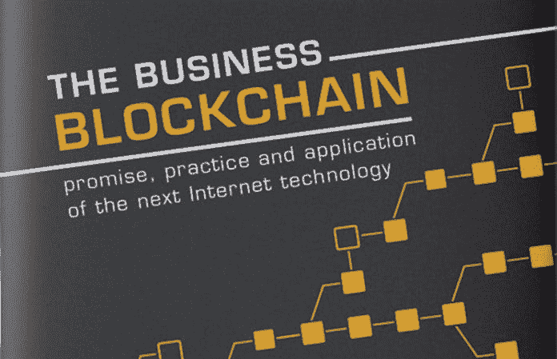

# “业务区块链”札记

> 原文：<https://medium.com/hackernoon/my-notes-from-the-business-blockchain-b0904058117b>

我有幸阅读了威廉姆·穆加亚的《商业区块链》(to)一书，我认为这本书对区块链技术、其工作原理和用例有着非常深入的了解。

这是我为这本书所做的笔记(P . S——你可以在本文末尾找到更多关于我读过的书的笔记！)

## 区块链是什么？

*   **商业**:公开维护分布式台账的后台数据库。
*   **技术**:同业间转移价值的交易网络。
*   **法律**:交易确认机制，不需要中介协助。

在 2015-2018 年期间，区块链仍将是一个半神秘、半复杂的现象。

区块链正在改变我们通过一种新形式的脚本语言编写应用程序的方式，这种语言可以将业务逻辑编程为在区块链强制执行的智能合同。

“散列”是一种独特的指纹，它有助于验证某条信息没有被篡改，而不需要真正看到它。

区块链同时展出以下 10 项资产:

1.  数字加密货币
2.  计算基础设施
3.  交易平台
4.  分散数据库
5.  分布式会计分类帐
6.  开发平台
7.  开源软件
8.  金融服务市场
9.  点对点网络
10.  信任服务层

随着数字加密货币得到越来越多的认可和理解，其未来的不确定性也将越来越少，从而形成一条更稳定、更渐进的使用曲线。

区块链的核心越开放，它周围的生态系统就会变得越强大。

POW 的一个强有力竞争者将是基于虚拟挖掘和基于令牌的投票概念的股份证明(POS)算法。

## 区块链如何渗透信任

区块链提供了一定程度的透明度和了解真相的机会，可以防止破坏信任。

在区块链，身份和声誉是有效地将对等交易锁定在适当位置的主要入门级因素。

智能合同让违约成本变得更高，因为它们通过“数字手段”控制着真实世界的有价值财产。

撰写简单的合约很容易，特别是如果您使用的是特定的智慧合约语言。

智能预言包含真实世界的信息表示，例如身份、地址或证书，它们还可以具有类似代理的属性，指示智能合约以某种方式表现。

*例子:Netki、OneName、BitID、Identifi。*

区块链公众的共识是公开达成的，理论上要受到众所周知的西比尔式的攻击。

Web3 体系结构包括:1)作为客户端的高级浏览器，2)作为共享资源的区块链分类账，以及 3)以分散方式运行智能业务逻辑程序的虚拟计算机网络。

万维网最初的超文本协议被称为星际文件系统(IPFS)的新超媒体协议所增强。

## 障碍、挑战和心理障碍

区块链将遇到抵制、被误解和被拒绝，直到它被广泛接受。

认证程序的普及，例如来自加密货币认证联盟(C4)的认证程序，将增加接受度。

在区块链问题上缺乏标准。

通过自行发行加密货币或加密代币进行众筹也是另一种融资选择。

这与 1997 年互联网的情况没有太大的不同，当时我们一个接一个地消除了所有这些障碍，而其中一些障碍自行消失了。

## 金融服务中的区块链

比特币的愿景是一个全球去中心化的货币网络，用户处于网络边缘。

银行业的去中心化就在这里。只是还没有平均分配。

银行不想改变银行业。创业公司想改变银行业。区块链想改变世界。

## 灯塔工业和新中介

区块链基础设施有多种内置冗余，非常有弹性。

很快，我们将能够得到一个“证明一切”愿景是这样的:信任检查应该是一个没有摩擦的过程，就像你在谷歌上搜索一样简单。

DAO 是一个分布式自治组织

政府可以通过多种方式使用基于区块链的服务

*   婚姻登记
*   财产所有权
*   机动车登记
*   专利
*   执照
*   赋税
*   投票

区块链的功能将成为解决医疗记录和患者数据隐私挑战的银弹。

区块链在医疗行业的用途包括:

*   共享我们的总体患者数据，同时对其进行匿名处理，以确保隐私得到维护。这有助于研究，也有助于比较类似的案例。
*   对医疗程序或事件的交付进行记录和加时间戳，以减少保险欺诈，促进服务的合规性和验证。
*   记录关键医疗设备(如 MRI 扫描仪)的维护历史，提供永久的审计跟踪。
*   携带一个安全的钱包，里面有我们完整的电子医疗记录或我们存储的 DNA，并允许在紧急情况下访问它。
*   验证药物来源，杜绝非法药物生产

## 实施区块链技术

特定问题(区块链)需要一段时间才能获得势头和理解

一些公司正在资助区块链的一个实验室，其中包括软件工程师，只要有想法出现并需要展示，他们就可以马上动手。

分散式应用程序首先为所有权、事务需求和逻辑创建自己的规则。

评估区块链平台时，谨记以下要点非常重要:

1.  可编程性。有哪些具体的编程语言？
2.  可扩展性。区块链可以增长多少个节点？会有上限吗？
3.  可升级性。开发人员为区块链提供增强和升级的记录如何？
4.  事务管理。所有交易都实时透明吗？
5.  能见度。你对区块链的活动有全面的了解吗？
6.  负担能力。部署该技术的成本是多少？
7.  安全。记录在案的对区块链安全的信心水平是多少？
8.  速度/性能。验证交易的速度上限是多少？
9.  高可用性。正常运行时间的记录如何？
10.  扩展性。您能通过各种附加组件扩展基本的区块链功能吗？
11.  互操作性。它是否能与其他区块链或相关技术很好地互操作？
12.  开源。代码开源了吗？各种开发人员的协作和贡献水平如何？

为区块链创建时，您必须具备以下条件:

*   教育:学习区块链的基本功能，以及它的一般功能。
*   发现:通过回答区块链适合哪里以及我们可以用它做什么来识别机会领域？
*   设计:我们需要哪些解决方案功能来发掘我们在发现阶段发现的潜力？它将如何影响我们正在做的事情，包括业务流程、合同和法律要求？
*   开发:软件开发、集成和技术部署。
*   管理:持续的软件维护、支持、迭代开发、新特性和更新。

## 权力下放是前进的方向

权力下放并不意味着无政府状态或从事非法行为。这意味着个人用户更有权力，更少限制。在分散式系统中，问题可以在早期和小的时候得到解决。

展望未来，这将变成一个更大的东西:一个由加密技术驱动的经济，拥有无与伦比的全球价值创造机会，这与网络本身的经济没有什么不同。

对于大多数使能技术，我们通常从复制旧习惯开始，通常是通过更快或更便宜地完成相同的过程。然后我们开始创新，用不同的方式做事，应用我们以前看不到的新想法。

如果你从零开始，去中心化会更容易。从集中服务过渡到分散服务更加困难。

喜欢这些笔记吗？你可以在这里找到更多我读过的书的笔记:[https://github.com/christopherdurr/booknotes](https://github.com/christopherdurr/booknotes)

如果你学到了新的或有用的东西，给这篇文章 50 个掌声！谢谢！