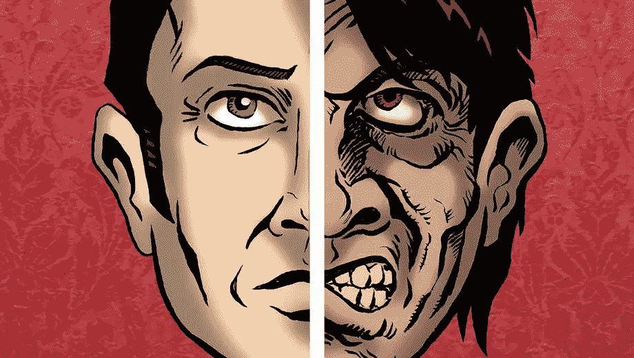
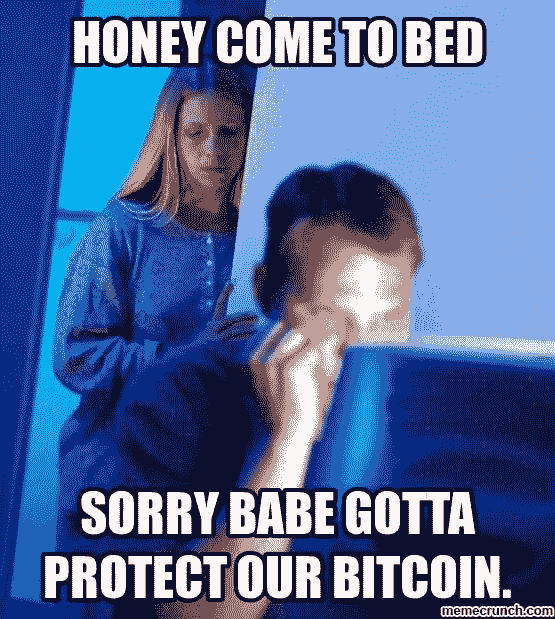
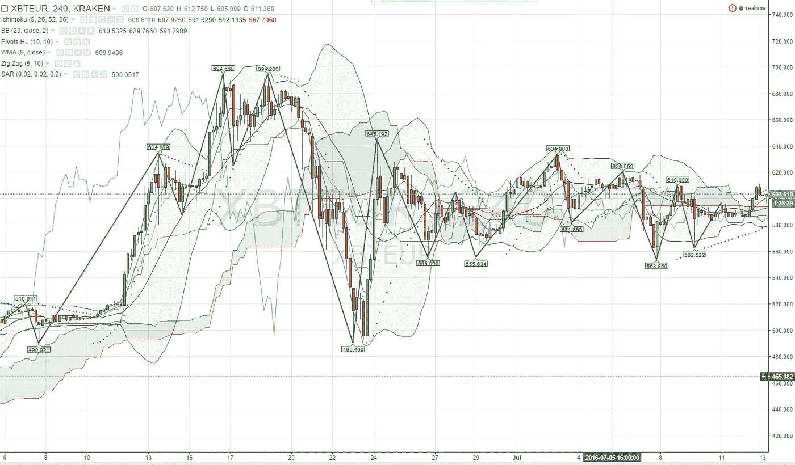
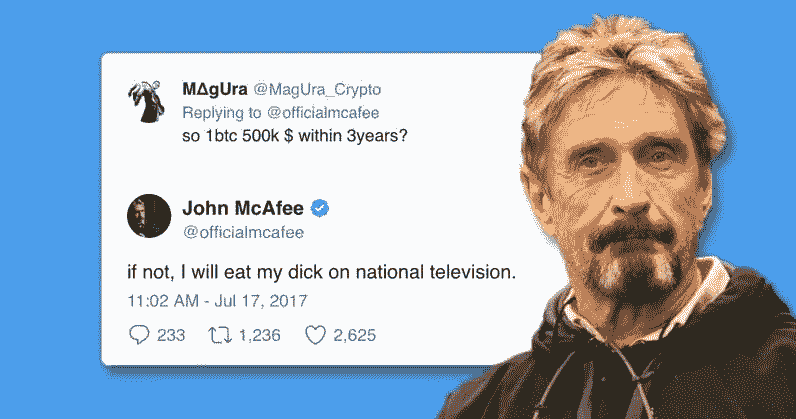
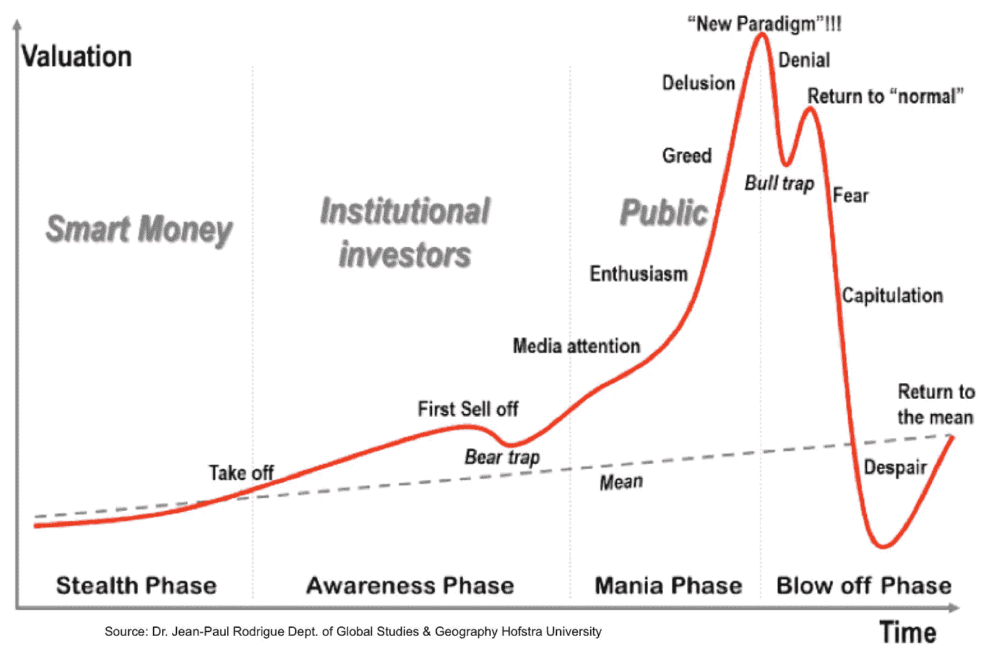
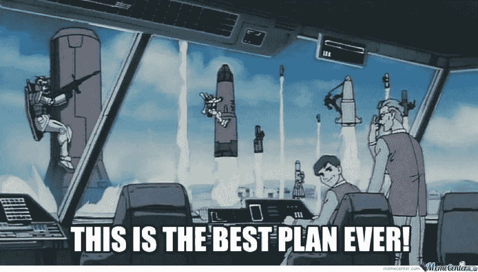
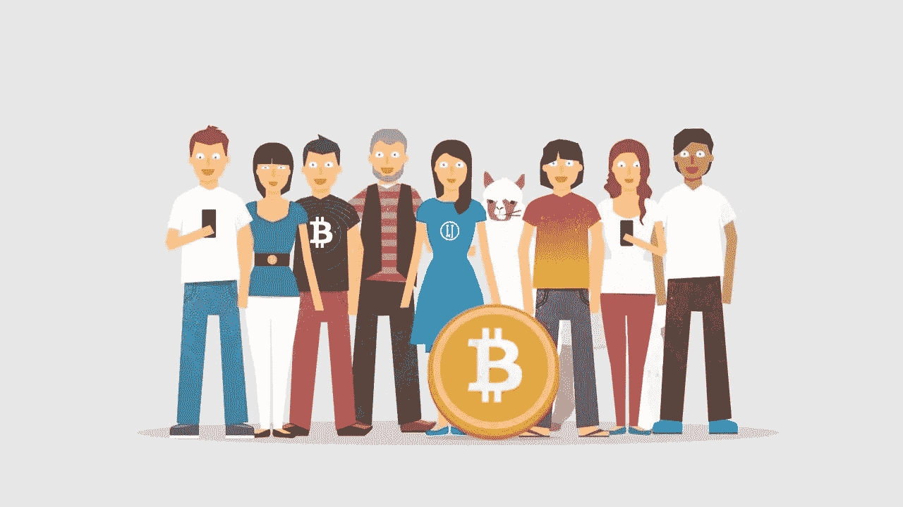
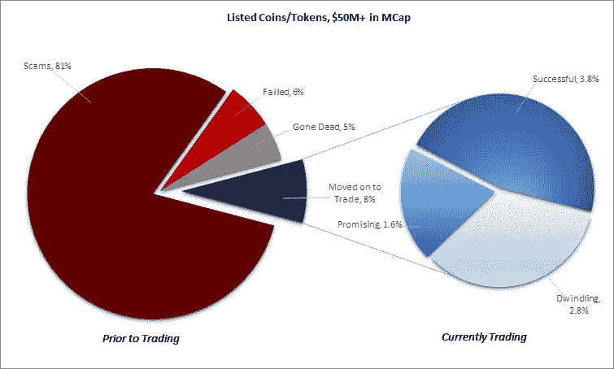
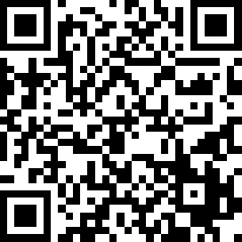

# 交易加密货币一年后我学到了什么

> 原文：<https://medium.com/hackernoon/my-one-year-journey-trading-cryptocurrencies-de57be1657f3>

## 像许多其他人一样，我被 crypto 吸引，希望能赚钱和早点退休。相反，我的压力增加了，我在人类行为方面获得了一些有价值的教训。

一年前，我跳进了秘密的兔子洞，并投入了大量时间阅读厚厚的白皮书，学习技术分析，掌握市场心理学的基础知识。在这个过程中，我犯了所有经典的错误——我盲目跟随某些交易者，上当受骗，亏损，当我盈利时不卖，贪婪地希望价格无限上涨到月球。

最终，这些不幸将我推向痛苦的自我反省，并让我加入了一个社区，在那里我可以获得反馈，并向比我更有经验的人学习。经过几次挫折，一年后我仍然在游戏中，并取得稳步进展。

加密货币让我着迷的是，它们向几乎整个世界开放了投资和投机。只要你有像样的互联网，你就可以连接成千上万的项目，参与充满活力的社区，并赚钱。

你也可能被骗，失去你所有的钱，并养成一种不健康的检查价格行为的习惯。鉴于[游戏成瘾](https://joyofandroid.com/mobile-gaming-addiction/)最近被官方列为精神(成瘾)障碍，我想知道我们所有玩加密令牌的人是否有一天会被诊断出类似的问题。我希望不会。

我认识的很多人都是从 2013 年开始交易的，所以相比之下，我这一年的交易时间可能显得很短。然而，我在这个过程中多次面临失败，我希望至少我学到的一些经验对其他交易者有价值。

# 一、如何管理你的杰基尔博士和海德先生

> 每天，从我的智慧、道德和智力两方面来看，我都这样稳步地接近真理，由于我对真理的片面发现，我注定要遭受如此可怕的灾难:那个人不是真正的一个，而是真正的两个。
> ― [**罗伯特·路易斯·斯蒂文森**](https://www.goodreads.com/author/show/854076.Robert_Louis_Stevenson) **、** [**杰基尔博士和**](https://www.goodreads.com/work/quotes/3164921)

[Source](https://www.goldstar.com/events/dallas-tx/the-strange-case-of-dr-jekyll-and-mr-hyde-tickets)

在高风险的环境中，会有许多自然的不安全感、冲动和倾向。当我们让嫉妒、贪婪和愤怒驱动我们的决策时，就会发生这种情况。我们可以称之为我们的动物本能——这就是我们野性而非理性的海德先生。

我们也有另一个更具分析性和理性的一面，允许我们理性地思考。这种思维模式给了我们规划未来、控制冲动甚至用数字思考的能力。这是好人——我们梦寐以求的杰基尔博士。

坏消息是，正如我们在著名的 19 世纪小说中发现的那样，哲基尔博士和海德先生是同一个人。我们都有一些双重性格，除非我们有意识地努力与我们的化身讲道理，否则我们很容易默认为海德先生。

好消息是，虽然我们都是这种思维/存在二元性的奴隶，但我们*可以*训练自己变得更加理性——尽管一开始*可能觉得*不自然。

第一步是简单地认识一些我们认同的最常见和最强烈的倾向。事实上，由于海德先生可以说是一种更默认或更自然的存在状态，在这种情况下，当交易加密货币时，我们必须警惕地观察我们的自然行为。

我犯的所有错误——也许是生活中的错误——都归结于让我的情绪控制了我。以下是我个人陷入的一些陷阱:

*   “如果我不能完全控制局面，那就什么都不会好。”控制行为将导致对每日价格波动的持续过度检查。
*   “即使是很小的损失也意味着巨大的失败。”对亏损的强烈厌恶会导致更小的交易。
*   “要么做大，要么回家。”=冒险行为的强烈倾向导致重大损失/全军覆没。
*   “我可以略读细节，事情就会迎刃而解。”即兴表演导致你没有计划好交易的进场和出场。
*   咬手指甲的次数越来越多。

***我们如何克服这些人类天生的一些倾向、坏习惯，养成我们的杰基尔博士？***

## 第一步:花时间开发心智模型

除非我们训练我们的大脑以某种方式思考，否则我们会自动默认任何方便或可用的习惯模式。心理学家称之为“[可用性启发法](https://en.wikipedia.org/wiki/Availability_heuristic)”

花时间去了解存在的各种****心智模型。每个模特就像一副不同的眼镜——如果你只有一副蓝色的墨镜，你的整个世界都会是蓝色的。当你试图和一个戴红色眼镜的人交谈时，会有一种基本的不理解。****

********

****[Photo credit](http://funny.pho.to/through-rose-colored-glasses/)****

****你收藏的眼镜越多，你就能解读世界的颜色越多样，你就能从更多的角度解决问题。****

****本书由[马克·道格拉斯](https://www.goodreads.com/author/show/148119.Mark_Douglas)、[在专区交易](https://www.goodreads.com/work/quotes/245670)(感谢[基本分析是对项目可行性、社区参与度(Slack/telegram/discord/etc)、开发进度(可能在 Github 上)、白皮书及其团队的研究。就像天使投资一样，你正试图衡量某种从统计数据来看破产几率很高的东西的内在价值。这里有一个很好的指南。](https://medium.com/u/c24cfaf04a23#1 基本面分析</h2>

 ****无论你是频繁交易加密货币还是长期投资区块链项目，一旦你掌握了买入/卖出的基本面，事情就真的没那么复杂了。****

****记得看过一篇 [**90 页的 PDF**](https://www.amazon.com/Identify-Turning-Points-Using-Fibonacci-ebook/dp/B001XURBC6) 关于使用斐波那契数的历史、理论和实际应用。获得一些背景知识是令人着迷的，这是工具房中的一个重要工具。****

****但是我能够在 20 分钟内通过 YouTube 视频和观察其他交易者学会该工具的实际应用。****

****日内交易者花大量的时间看图表，检查手机，试图到处赚点小钱。这会导致事情变得过于复杂，更不用说不健康的生活方式了。至少有一个关于比特币投资者自杀的故事。****

****当然，对技术分析有一个基本的了解仍然很重要(H&S，旗帜，楔形等等)。你可以分析图表中的垃圾，在上面画一百万条线，让它说出你想让它说的任何话。你可以用十几种方式运行斐波那契扩展，盯着对数刻度，说服自己某个硬币会在不远的将来飞向月球。****

********

****就像在商业世界中使用 KPI 一样，技术分析主要由*指标组成，而*不是终极真理。预测是一门科学，正如 [**它是一门艺术一样。**](http://www.supplychainbrain.com/nc/single-article/article/forecasting-science-or-art-1/) 尤其是回想起来，当一枚硬币表现良好时，你可以用它来证明你高超的技术。****

****我接触过的最好的交易者可能每个月只执行几笔交易，并且在建立交易时非常挑剔。他们不是试图抓住每一个微小的涟漪(没有双关语)，而是专注于抓住大波浪。****

****所有这些最难的部分不是分析图表，不是*超过*-分析它们，因为这会导致过度交易和后悔。有太多的例子表明 [**的人可以什么都不做**](https://hackernoon.com/million-dollar-trading-mistakes-for-your-entertainment-and-edification-e9bbf9675a8b) 的人却获得了明显更大的收益。****

****换句话说，在你学会了基础知识之后，用图表保持事情的简单。****

## ****#3 市场情绪——“趋势是你的朋友”****

> *****“别人担惊受怕的时候你却想贪婪。当别人贪婪的时候，你想要恐惧。就这么简单。”—沃伦·巴菲特，伯克希尔·哈撒韦公司创始人*****

****人们很容易被那些对某项事业如此死心塌地、愿意竭尽全力证明自己忠诚的人所吸引。在 Twitter 上关注他们兜售的硬币也很有诱惑力。****

********

****支持自由主义梦想的比特币最大主义者们说“HODL 你的硬币，因为价格*会*上涨，”好像他们有一个水晶球。从长远来看，他们可能是对的。事实上，我本人非常看好很多项目，尤其是 5-10 年的时间框架。****

****然而，许多人作为交易者进入市场，希望从中短期获利。许多人试图支付账单，在这种情况下，“无限收益”和“希望”都不是好策略。****

> ****“永远不要询问任何人的意见、预测或建议。问问他们的投资组合中有什么，或者没有什么。”
> ― [**纳西姆·尼古拉斯·塔勒布**](https://www.goodreads.com/author/show/21559.Nassim_Nicholas_Taleb) ， [**抗脆弱:从混乱中获得的东西**](https://www.goodreads.com/work/quotes/19092611)****

****所有市场**都遵循周期**。无论是比特币、股票、房地产还是大宗商品——只要是你能想到的。****

********

****忽视市场周期的结果是抓住任何硬币，然后看着价格暴跌——迫使你“袋持有”——用宝贵的生命持有这些珍贵的硬币，希望它们会升值。我也犯了这个错误。****

****这种歇斯底里在 12 月/1 月达到了最糟糕的程度(到目前为止，但无疑还会重复)。媒体进入画面，我们有群众欣快(比特币到 100k！)，在比特币崩溃之前，每个人都在以 20k 的价格购买比特币。****

****我认识的最好的交易者观察更大的市场周期，衡量市场情绪，做与美国消费者新闻与商业频道所说的相反的事情。****

****不要把一个*“周期性趋势”*误认为是一个*“无限方向”*****

## ******#4 自我分析——我是自己的老板******

****这有两个步骤。1)制定计划。2)每周和自己签到。****

1.  ****制定一个计划，坚持下去****

********

****有一次，我盲目地跟随了几个我尊敬的交易者。他们建议买的一枚硬币彻底失败了，这让我很生气，因为我选择了听从他们的建议。当然，我没有权利生气。这完全是我的决定和责任——只能怪我。****

****制定自己的计划需要更多的训练、时间和努力。这也更可怕，因为这意味着你最终要对你的收益和损失负责。****

****我建议写一本交易日记，你可以在里面详细说明你进入交易的原因，定义利润目标，回答一些难题，比如“如果这个价格下跌 90%，我会采取什么行动？”****

****请记住，“成功”对不同的人可能意味着不同的事情，但我们必须定义它并管理我们自己的风险。你对成功的定义是什么？****

> ****crypto 里的说法是，“我一月还是百万富翁，二月就破产了！”****

****我犯的另一个大错误是试图让我自己的目标适应市场的行为。问题是，市场并不关心你的财务目标。我发现最好不要用你想要的具体金额来设定金钱目标，而是用百分比来设定(“从我的头寸中拿走 50%的利润”)。****

****我们必须根据概率来思考，而不是根据完全不可能预测的确切的、确定的结果来思考——这被称为“预测未来”一种方法是测量 [**风险收益比，例如**](https://www.tradeciety.com/how-to-use-reward-risk-ratio-guide/) 。****

****更重要的一点是，更有意义的是专注于培养技能，这将使你更有可能到达你要去的地方，而不是过于专注于特定的时间表和数字。技能、一致性和努力工作最终会带来利润。****

******#2 每周绩效评估******

> ****所谓成功，即历经数次失败，却仍保持热情。 ——温斯顿·丘吉尔****

****当你没有老板监督或给你季度绩效评估时，很难衡量你的进步。你对自己的评估负责。这是一种祝福也是一种诅咒，因为它让你获得了终极自由，但除了你自己，没有人会指责你。****

****每周自我检查是一个值得采纳的好习惯。问自己以下问题:****

*   *****我坚持我在交易日志中的计划了吗？*在 excel 文档中跟踪你的交易——包括进场/出场目标、买入原因和利润目标。回顾它们，对自己诚实，但如果没有，不要自责。总会有下一笔交易。****
*   *****我感觉如何？我有没有给时间来发展精神/情感力量？*正如第一部分所讨论的，确保你花时间保持健康。****
*   *****我学到了什么？你学到了什么(比如做了一个让你后悔的交易)，你将来会如何改正？(例如，我总是会查看一枚硬币的价格，但我只是采用了价格提醒、止损和限价单，这给了我更多的喘息空间)。*****

> ****养成使用这 4 种工具的习惯——即使你做得很快，也能为你节省很多时间/金钱。最终，会有黑天鹅事件，比如新的政府法规或创始人携款潜逃，这将否定你的任何分析，所以请记住，不管你的投资如何，管理下行风险总是至关重要的——也就是说，不要把所有的筹码都放在桌子上，以防你全军覆没。****

# ****三。一个伟大的社区是值得花钱的****

********

****内容 的 [**半衰期越来越短——也就是事实的准确性衰减越来越快。跟上最相关的内容以及找到高质量的内容变得越来越难。不仅如此，它只是很难集中注意力。**](https://www.fs.blog/2018/03/half-life/)****

****有一天这个问题会得到解决，也许是通过改变在线广告模式的激励机制。这就是 Javascript 的创始人布伦丹·艾希(Brendan Eich)在他的区块链初创公司 [**Brave (BAT)尝试做的事情。**](https://basicattentiontoken.org/)****

****目前，培育高质量内容的解决方案是建立一个付费墙，让用户加入。****

****你更相信谁的建议？****

1.  ****Reddit 上一群随机的巨魔****
2.  ****由认真的投资者/交易者组成的封闭社区创建的内容，每月支付 100 美元成为该团体的一部分****

****同样，你应该最终做出自己的投资决定，而不只是跟随他人。然而，作为一群志同道合的人 中的一员，他们会付很多钱，这通常证明了他们的认真。这让你可以接触到更全面的研究内容，众包技术分析，以及与成功交易者交流的机会。跟随导师也非常有用，直到你有足够的信心自己交易。****

****成为合格投资者将允许你进入 [**Coinlist**](https://coinlist.co/) 的独家加密项目，但考虑到最低净值要求，这对我和大多数人来说都是遥不可及的。成为付费社区的一员，在线或离线，或者找到一个伟大的导师是你的下一个最佳选择。****

****和比你聪明的人在一起。这是值得投资的，最终会有更大的回报，无论是知识上还是经济上。****

# ****四。最后，不要让坏苹果打倒你****

****最近的一项研究发现，超过 80%的 ICO 要么没有交付产品，要么是彻头彻尾的骗局。****

********

****沉浸在制作《big gainz》的兴奋中，我已经两次成为骗局的受害者——好像我第一次没有吸取教训。****

****记得有一次 [Quantstamp ICO](https://quantstamp.com/) 的预售，号称 24 小时内结束。我尽职调查做得很差，匆忙购买，送了一瓶乙醚(我总是先送一小部分，但仍有 400 美元左右)，确信时间不多了。****

****骗子很聪明。他们几乎完全复制了真实的网站，但只是简单地将 URL 改为 quant *slamp* ，带一个 l。考虑到我的不耐烦和对细节的缺乏关注，我上当了。****

****我和许多被骗了更多钱的密码交易员交谈过。一些已经被消灭了。许多人放弃了，但其他人把他们的损失放在心上，从他们的错误中吸取教训，重新开始，经常成功地重建他们的投资组合。****

****我所学到的:总会有坏人试图从你身上夺走一些东西——你的时间、金钱和幸福。明智地管理你的风险，但不要在几次负面经历后放弃。也许更重要的是，不要在尝试之前就放弃。****

# ****总结一下…****

*   ****警惕你的情绪和冲动——你的海德先生会出现，所以你要做好准备。****
*   ****了解心智模型，交易心理学，多花时间在心理/情绪健康上。****
*   ****记交易日志，要有耐心。在这个市场上，只需要一两笔大交易就能获得可观的收益。****
*   ****用这四个步骤来评估一项交易或投资——基本面、技术面、市场和自我分析。****
*   ****管理你的风险，不要被消灭。把利润从桌上拿走，永远不要后悔交易。****

# ****在线工具和资源****

*   ********—**用于图表和 TA******
*   ****[**coin wink**](https://coinwink.com/)**—**为交易提醒****
*   ******—新闻事件、技术发布、ico、会议******
*   ******[**coin rank**](https://coinrank.info/)**——**通过数据科学分析密码项目******
*   ****[**proton mail**](https://protonmail.com/)**—**加密邮件****
*   ****[**詹姆森·洛普**](http://lopp.net/bitcoin.html)**——关于比特币你需要知道的一切******

*******识别被低估的加密项目的最佳估价框架和工具是什么？你如何做出更明智的投资，并停止亏损？关于成为更好的交易者，李小龙教了我们什么？*******

******我采访了几十位投资者、交易者和企业家，问了他们这些问题以及更多更多的问题。从奖金到赚取代币的头像,《看好比特币》概述了数十种交易、投资、创造和探索新的去中心化经济的策略。******

## ******[***今天在亚马逊上拿到书***](http://mybook.to/bullishonbitcoin)******

************

## ******觉得这篇文章有用？考虑留下一个小的加密提示以示支持。(20 枚 ERC 代币)******

************

******0xb651287c66fE21eD88cf60fA84f63acae55520fe******