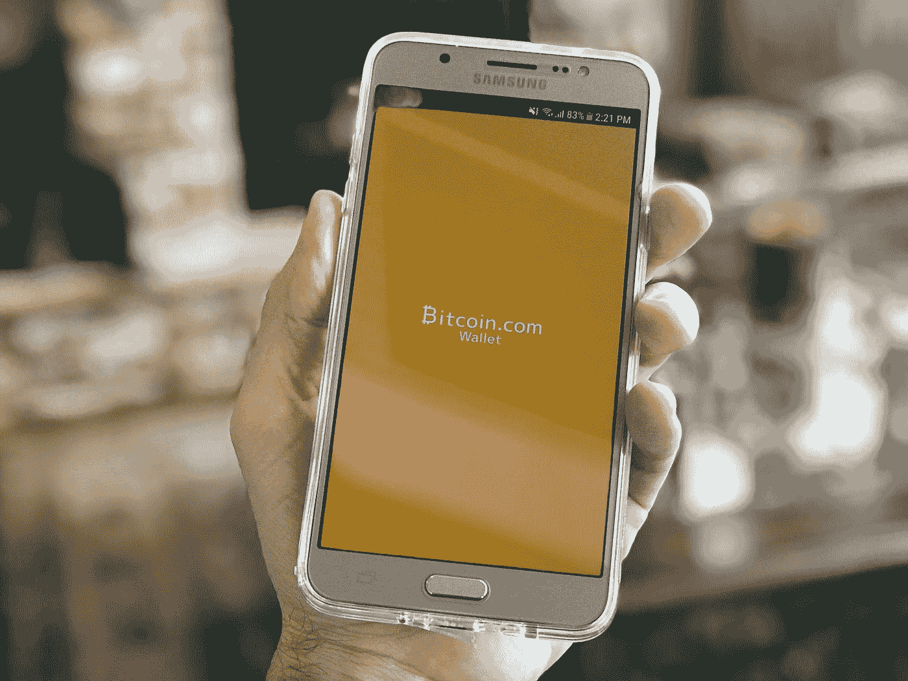

# 你应该买密码吗？

> 原文：<https://medium.com/hackernoon/my-opinions-on-should-i-buy-crypto-72a7f9485c6f>

免责声明:我并不是想说服你做任何投资。在投资之前，你应该做自己的研究。这个帖子只是为了帮助分享信息和我自己的看法。完全公开并努力做到言行一致:我大约 10%的可变现净值是硬币(BTC、瑞士联邦理工学院、BCH 和 XRP)。几乎所有这些都不是来自本金，这是我持有这么多感到如此舒服的唯一原因。

我认为 BTC 基本上是一个泡沫，我认为 ETH 有长期价值。BTC 是一种货币，而且仅仅是一种货币。它运行起来很昂贵(据估计，BTC 上的 1 笔交易消耗的电力足以为一个美国家庭供电近 11 天(【https://digiconomist.net/bitcoin-energy-consumption】))而且无法扩展(请注意所有导致比特币和比特币现金在 segwit2x 和更大的区块之间分叉的斗争)，因此它作为产品的唯一当前用例是作为价值存储或洗钱。看看 BTC 用津巴布韦元比美元贵多少:[http://www . CNN . com/2017/10/31/Africa/津巴布韦-比特币-surge/index.html](http://www.cnn.com/2017/10/31/africa/zimbabwe-bitcoin-surge/index.html) 。在货币不稳定的国家，BTC 更有价值。内战意味着政府不稳定，这意味着货币不稳定，这意味着公民更喜欢另一种货币。BTC 在那里是一个容易的竞争者，因为它是分散的，并且更容易带出你的国家。把美元或其他政府的货币带出去可能更难。

我更喜欢以太坊，因为它是一个智能合约平台，可以做很多事情，不仅仅是一种货币。以太是一种货币，你用它来支付人们为你执行智能合约的费用。你甚至可以通过智能合约在以太坊上创建新的加密货币(这就是 ERC20 规范，一个创建新硬币的智能合约)。

也就是说，我确实相信，在 BTC 和瑞士联邦理工学院拥有一小部分净资产是有价值的。很少有我们能进行的投资有如此不均衡的几率。你可以投入你净资产的 0.1%(或更多)，然后全部输掉，但是有一天，这两种产品的价值都将大大超过 2 倍(甚至 10 倍或 100 倍)。虽然你可以对成千上万无用的加密货币或低价股说同样的话，但我认为 BTC/联邦理工学院的预期价值要高得多，值得冒这个风险，因为它有新的底层技术(区块链)。BTC 是普通加密市场的一个强大的领先指标，以太坊是一个智能合约平台，许多新的硬币和产品都建立在这个平台上，这就是为什么我认为与其他硬币相比，它们是进入[区块链](https://hackernoon.com/tagged/blockchain)市场的低风险、低回报投资。当然，还有其他智能合约平台(Neo、Tezos、Cardano 都很受欢迎)，但 ETH 仍然是最受欢迎的。这也不是说其他硬币是不好的投资，只是我认为 BTC 和瑞士联邦理工学院是进入区块链市场更好的风险/回报交易。

请记住，BTC /联邦理工学院/加密货币的核心都是关于区块链的炒作。区块链很酷，因为它是迄今为止解决拜占庭将军问题的唯一可行方案:[https://en . Wikipedia . org/wiki/拜占庭 _ fault _ tolerance #拜占庭 _Generals.27_Problem](https://en.wikipedia.org/wiki/Byzantine_fault_tolerance#Byzantine_Generals.27_Problem) 。那有价值吗？看起来我们还没有很多产品用例来提供真正的价值，但我相信有比我更有创造力的人有一天会找到一个伟大的用例，为此我持有一点 BTC 和 ETH。

我想特别指出权力下放/区块链的三个使用案例。

1.我认为为没有银行账户的人提供银行服务是区块链最有前途、最积极的产品。鉴于本国货币不稳定，津巴布韦等国家已经在使用比特币进行交易，但比特币非常不稳定，这使得持有比特币而不是本国货币仍然是危险和风险的。如果有一种分散的货币与稳定的法定货币如美元挂钩，那就太棒了(类似于今天的 USDT，但比它更安全)。这样，不太稳定国家的平民就不需要信任他们不稳定或腐败的银行/政府来保管他们的钱——他们的钱只是安全地存放在区块链(类似于今天没有区块链的[M-Pesa(https://en.wikipedia.org/wiki/M-Pesa)](https://en.wikipedia.org/wiki/M-Pesa)所做的)。

2.隐猫(【https://www.cryptokitties.co/】T2)。CryptoKitties 是一个有趣的例子，因为在发布后不久，它在以太坊上的交易量就超过了 10%(我认为现在不是了，但在某个时候是)。这只是通过智能合约在区块链玩游戏的一种方式，包括购买小猫，饲养小猫，和交易小猫。有趣的是，在以太坊上玩游戏给了这些数字纪念品永久性。如果经营 Neopets 的主机公司倒闭，你将失去你在游戏中的一切。如果运行 CryptoKitties 的主机公司死亡，您可以在仍在运行的以太坊平台上继续与其他人玩游戏。如果以太坊平台寿终正寝，你仍然可以下载以太坊的代码，自己运行节点，并保留游戏中的数据，因为它们都存在于去中心化的区块链上。如果在以太坊开发者都离开，CryptoKitties 公司死亡的情况下，其他玩家也想继续玩 CryptoKitties，他们只需加入你新建立的以太坊网络，和你一起玩 CryptoKitties(并运行其他以太坊智能合约)。

3.ethroll([https://etheroll.com/](https://etheroll.com/))是一个网站，你可以通过它来赌一把智能合同。你可以改变你的赔率和赌注大小。赌场告诉你他们会从你的赌注中抽取 1%的利润。因为你在以太坊上用房子赌智能合约，你实际上可以去看你和他们执行的智能合约，看到他们比你多 1%的优势。这是赌场的独特之处，因为无论何时你去赌场用房子赌博，你基本上都相信他们不会改变系统的任何部分来增加他们对你的优势。在吃角子老虎机的情况下，你实际上不知道你的赌注的赔率。关于 Ethroll 的另一件很酷的事情是他们的令牌:【https://etheroll.com/#tab5[。因为 Ethroll 需要足够的初始资本来安全地扮演房子的角色，他们用新的令牌(以太坊顶部的 ERC 20)开始了一个 ICO 来筹集资金成为房子。代币作为 Ethroll 身份的一部分，作为代币的所有者，你将获得你作为房子的利润的公平份额。同样，根据他们用来创建令牌的智能契约，可以验证这是真的。](https://etheroll.com/#tab5)

> 写于 2017 年 11 月 29 日