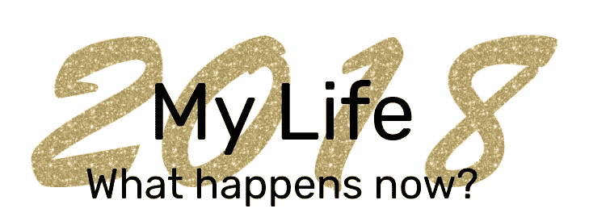
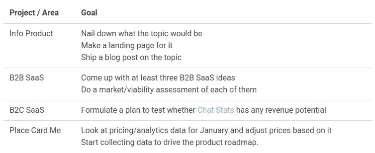

# 我 2018 年的计划和目标

> 原文：<https://medium.com/hackernoon/my-plans-and-goals-for-2018-d26641963d0c>

## 现在发生了什么？

Made with [Place Card Me](https://www.placecard.me/). Template design by my wife, Rowena.

在我的 2017 年回顾展中，我花了很多时间和文字来谈论过去的一年。然而，我没有说接下来会发生什么。

所以事不宜迟，我们来看 2018 年！

# 我的 2018 年大目标

我已经确定了 2018 年的四个大目标。这些是:

1.  **多样性**:至少有一个以上的项目产生一些被动收入
2.  **增长**:在 12 月之前，每月被动收入达到 2 万美元*或*2 千美元
3.  **可持续性**:总收入达到 8 万美元(包括工资/自由职业)
4.  **动力**:继续定期反思和迭代我的生活

前三个是实现真正自给自足的被动收入的大计划的一部分——如果幸运的话，可能到 2020 年。最后一条是为了确保无论我在 2017 年学到了什么，我都会在来年的课程中保持不变，我不会陷入做那些感觉“正常”的事情而不问为什么。

我不完全确定为什么自我维持的被动收入是优先考虑的。

我知道我的个性是这样的，即使我实现了完全的经济独立，我也会继续工作。那么，为什么要这么麻烦呢？

**我怀疑最大的原因是我想向自己证明我能做到。**值得注意的是，对被动收入采取更传统的方法——例如，通过建立储蓄和投资，或通过房地产获得收入——对我来说毫无吸引力。不管出于什么原因，我特别想通过在网上卖东西来做这件事。

换句话说，我认为目标是旅程，而不是目的地。

也就是说，来到一个我没有任何工作义务的地方，对我来说也完全没问题。

¯\_(ツ)_/¯

# 我的 Q1 计划

我在 2018 年第一季度的最大目标是找出在今年剩下的时间里什么新项目会引起我的注意。我正在考虑三个高级候选领域:

1.  像书或课程这样的信息产品
2.  B2B(企业对企业)SaaS 产品
3.  一种新的 B2C(企业对消费者)SaaS 产品

所有这些都有利弊。就能够产生一些收入而言，信息产品可能是最安全的选择，而 B2B SaaS 可能有最高的长期上限。B2C 应用是最有趣的工作，但最不可能成功。

因此，与其今天就承诺其中的一个，我将探索所有三个，目标是在 4 月 1 日左右打个电话。我还将致力于保持 Place Card Me 的发展。

# 我的一月目标

有了这些背景信息，下面是我一月份的目标。

看着这个列表和我可用的时间，看起来可能有很多要完成，但让我们看看它是如何进行的。

暂时就这样吧！该坐下来开始工作了。向前看，我会把这些目标放在我的每周/每月回顾中。

*最初发表于*[*【www.coryzue.com】*](http://www.coryzue.com/writing/my-2018-plans/)*。*