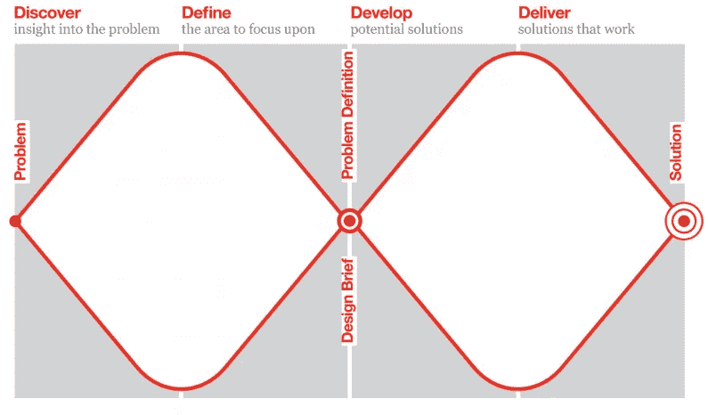
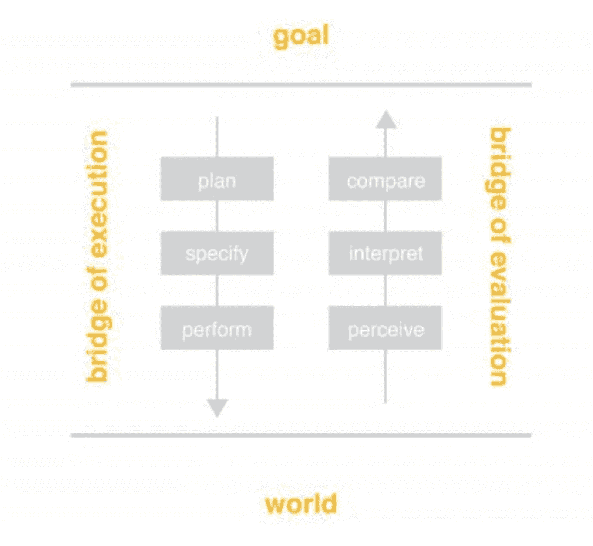

# 我的产品面试流程

> 原文：<https://medium.com/hackernoon/my-product-interview-process-d59480252d85>

作为一名应届毕业生，我最近参加了旧金山湾区科技公司助理产品经理职位的招聘过程。我希望我的经历可以帮助那些希望进入这些角色的人，无论是直接从大学毕业还是以其他方式。在这篇文章中，我将讨论如何解决大多数产品问题。接下来，我将把这个框架应用到一个实际的产品面试问题中。

虽然有许多可行的方法，但我将把英国[设计](https://hackernoon.com/tagged/design)委员会的双钻石作为行业标准，然后讨论我如何改进它以满足我自己的需求。

courtesy of the British Design Council ([https://www.designcouncil.org.uk](https://www.designcouncil.org.uk/news-opinion/design-process-what-double-diamond))

双菱形是一种结构化的设计方法，分四个阶段应对挑战:

1.  **发现/研究** —洞察问题(发散)
2.  **定义/合成**——聚焦(汇聚)区域
3.  **开发/构思** —潜在的解决方案(分歧)
4.  **交付/实施** —有效的解决方案(融合)

在不同的阶段，开放的心态和宽广的思想是必要的。在融合阶段，需要无情的优先顺序和可衡量的特殊性。这种扩展和收缩可以重复进行，以确保在每一步都找到正确的问题和最佳解决方案。

以此为指导，我更具体地概述了在产品访谈中解决功能[开发](https://hackernoon.com/tagged/development)或改进问题时所采取的步骤。

*   **SWOT 分析**从更广泛的角度审视产品和大公司的优势和劣势，以及该领域存在的机会和威胁。这为我们以后对行动进行分类和归类提供了正确的途径。
*   **目标人物角色**确定你试图优化体验的用户。虽然向普通观众播放可能看起来很直观，但 Gartner 的采用曲线表明，针对小众观众的优化用例将导致早期采用，这是以后实现主流增长所必需的。
*   **当前体验**概述您所选角色的当前体验。它们的用例是什么？对于您确定的用例，从开始到结束的当前流程是什么？
*   **难点**针对当前体验中的每个步骤，找出瓶颈和需要改进的地方。唐·诺曼的七个行动阶段是一个很好的起点。

courtesy of Don Norman, Design of Everyday Things

围绕如何执行预期的操作，或者为什么结果与预期结果不同，这两个桥梁之间的任何一步都可能出现棘手问题。用户测试或数据也可以暴露流程或过程中的瓶颈或落点。还要建立一个目标:对于特定的问题，一个解决方案应该完成什么？

*   **竞争对手**这是很多设计师讨论的一个点。一些人在他们竞争对手的工作中找到了鼓舞人心的起点。其他人提倡一种向内寻找核心能力驱动的开发并建立在特定公司的差异化因素上的设计方法。我觉得，虽然你应该始终根据自己的优势进行设计，但重要的是要睁大眼睛，看看在你的竞争领域中，类似的问题是如何解决的。
*   **构思**使用约束、优势、问题陈述和用户目标来指导构思过程。针对每个棘手问题，集体讨论设计、业务和技术解决方案。
*   **机会评估**比较解决方案并分析每个方案的利弊。基于适当的轴进行评估——几个重要的轴包括技术努力、成本、现有产品的分食、市场规模、影响和吸引力。该解决方案在多大程度上实现了您概述的目标？选择最佳选项。
*   设计过程中一个经常被忽视的部分是评估你的设计在实践中的表现。在发布或测试之前建立衡量标准*，以了解成功是什么样的。*
*   **原型+发布**仔细考虑验证你的设计或假设所需的最低功能。如何组织产品发布(在哪里、何时、如何、MVP ),以最快速地验证您的假设？快速启动并立即开始查看数据。
*   **迭代**你可能选择了错误的问题或错误的解决方案。你可能对你的目标受众做了错误的假设。浏览数据并进行用户访谈来发现这些错误。迭代并重新启动。

接下来，我将使用这个框架来解决以下问题:*优步如何改善其骑行体验？*