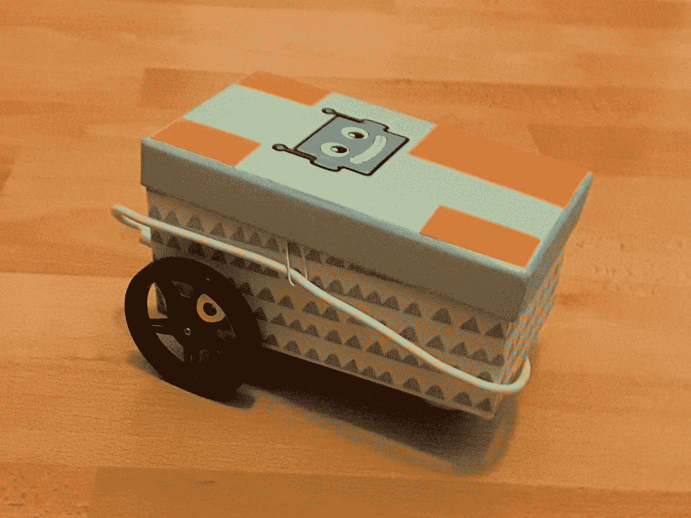
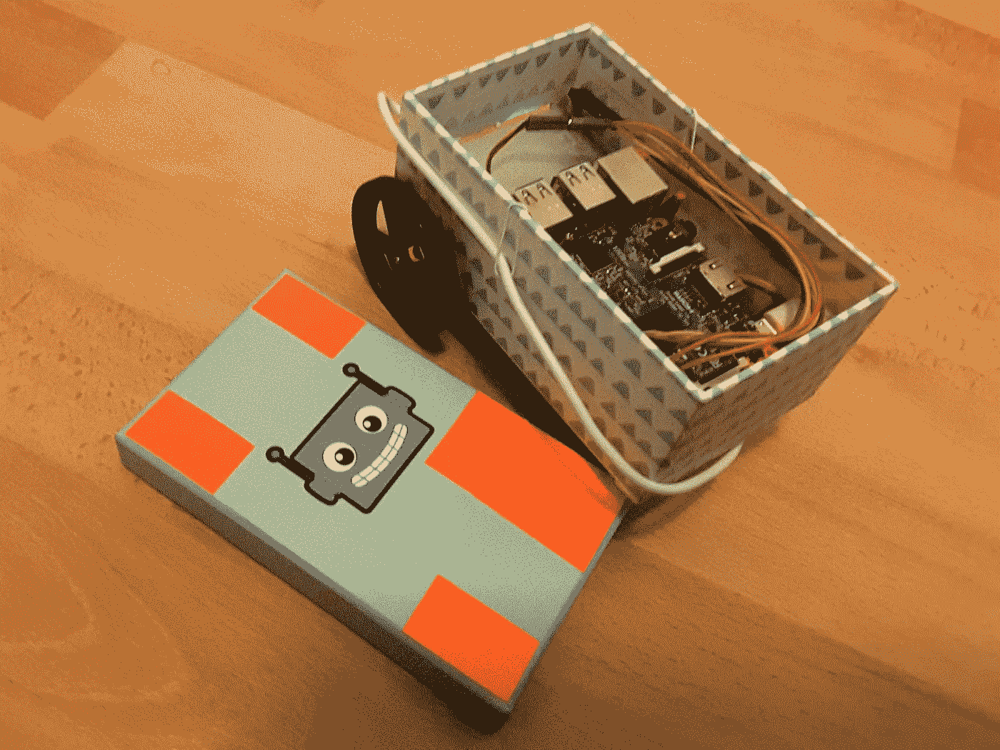
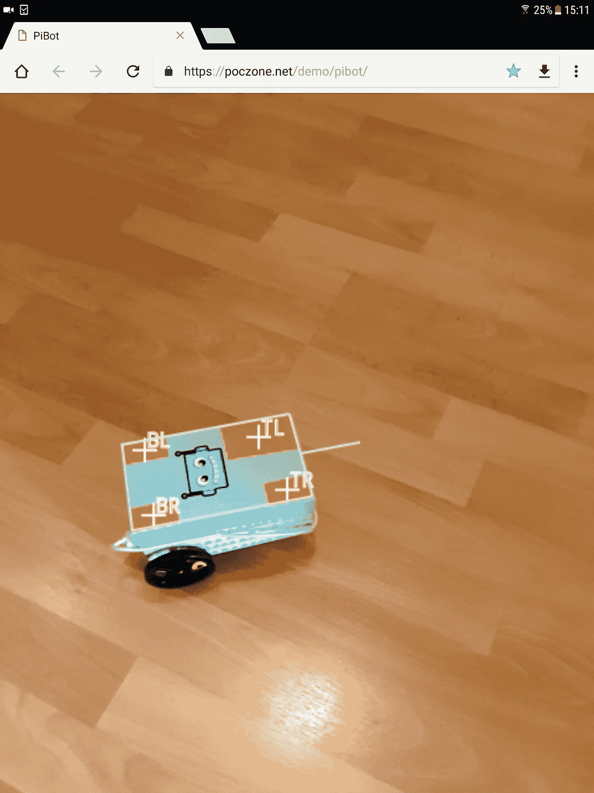

# 我的双轮树莓派

> 原文：<https://medium.com/hackernoon/my-raspberry-pi-on-2-wheels-c7c173918115>

## 用一个漂亮的相机遥控器

[[Click here for the German text version.]](/side-project-lovers-unite/mein-raspberry-pi-auf-2-rädern-61338ae93791)

我的新项目完成了。通常我建立网站…这一次，我想创造一些真实的东西！:-)

所以我开着我的树莓派穿过我的公寓…用两个连续的伺服电机、轮子、无线电源和智能手机摄像头控制。

# 我需要什么？

Insights without cover.

*   [1 个树莓派](https://www.adafruit.com/product/3055)
*   [2x 连续旋转微伺服](https://www.adafruit.com/product/2442)
*   [2x 匹配车轮](https://www.adafruit.com/product/2744)
*   6x 跳线 m/f —这些是我从父亲那里得到的。；-)
*   抽屉里的 1 个 USB 电源板— [我有这个](https://www.amazon.de/JETech-Externe-2-Ausgang-Samsung-Weitere-Silber/dp/B00T416MXU)。
*   1 个漂亮的盒子，盖子大小刚好合适——感谢我的妻子。；-)
*   五颜六色的标记贴纸，以便在相机画面中找到机器人
*   一个被打碎的乒乓球也是第三条腿
*   [装饰](https://www.adafruit.com/product/3841)，剪刀，胶带，…

# 它是如何工作的？

这是我做的…

## 1.控制伺服电机。

First success: Pi with USB power bank spins wheels.

伺服电机有三个输入:5 伏电源(红色)，接地(棕色)，信号(黄色)。使用跳线将这些引脚连接到 Raspberry Pi 的 GPIO 引脚。[点击此处查看引脚排列](https://pinout.xyz)。右上角有两个 5V 引脚。地在不同的引脚上分散几次。对于信号引脚，我选择了 GPIO 17 和 GPIO 27。他们挨着躺着。

信号通过[脉宽调制](https://en.wikipedia.org/wiki/Pulse-width_modulation) (PWM)进行传输。这意味着信号在 0 和 1 之间快速交替。1 的持续时间(“宽度”)成为速度的设定值。

*   1500 秒 —站着别动
*   *1500 秒+ 800 秒= 2300 秒* —逆时针全速
*   *1500 秒— 800 秒= 700 秒* —顺时针全速

现在，我可以通过 SSH 连接到 Raspberry Pi，并使用命令行测试伺服电机。pigs 程序是一个用于此目的的简洁的命令行工具( [pigs 手册页](http://abyz.me.uk/rpi/pigpio/pigs.html))。

*   *sudo pigpiod* —启动 Pi GPIO 守护程序。
*   *pigs m 17 w* —将引脚 17 设置为 **W** rite 模式。
*   猪伺服 17 2300 —全速前进！
*   *清管器伺服 17 700* —全速后退！
*   *清管器伺服 17 0* —停止！
*   *pigs m 17 W m 27 W servo 17 2300 servo 27 700 mils 1000 servo 17 0 servo 27 0*—对于有用的命令序列:首先将 GPIO 端口 17 和 27 设置为 **W** rite 模式。然后在两个电机上设置不同方向的全速。然后等待 1000 毫秒。然后停止两个电机。

## 2.将 HTTP 命令传递给伺服系统。

[【点击此处获取源代码。]](https://github.com/poczone/raspberry-pi-on-wheels/tree/master/src/net/poczone/pi)

接下来，我通过 HTTP 发布了这些命令。作为一名 Java Web 开发人员，这对我来说是家常便饭。

我在 Raspberry Pi 上运行 Tomcat 8 Java Web 服务器。它有我定制的 Java Web 档案(WAR)。HttpServlet 处理 HTTP 请求。它从 URL 参数中读取速度设定值，并通过 ProcessBuilder 将其传递给 pigs 程序。

第二个版本稍微复杂一点，可以理解命令序列:

*   *左<-800…0…800>*-控制左轮。
*   *右<-800…0…800>*-控制右轮。
*   *等待<毫秒>* —等待/移动指定的时间。
*   *停止*——左 0 右 0*的简称。*
*   *清除* —清除所有之前的命令。

请求示例:

http://…/wheels？x =清除+向左+800+向右+800+等待+1000+停止

## 3.构建一个简单的遥控器。

[【点击此处获取源代码。】](https://github.com/poczone/raspberry-pi-on-wheels/blob/master/WebContent/remote/index.htm)

Direct control of the robot with smartphone browser remote control. The remote control is a little bit rotated. Top left = Ahead. Top right = Right turn. Bottom left = Left turn. Bottom right = Backwards.

简单的遥控器根据我点击/触摸的位置直接设置左右轮的速度。当释放点击时，机器人停止。通过这种方式，可以导航 Pi…耶！

## 4.捕捉相机，找到彩色标记，从四个已知点计算机器人坐标系。

[【点击此处获取源代码。]](https://github.com/poczone/raspberry-pi-on-wheels/blob/master/WebContent/index.htm)

Detected robot cover coordinate system inside the web browser

但是我想要一个很酷的控制器！

该控制器应在智能手机/平板电脑网络浏览器中打开。它捕捉摄像机视频。用户将摄像机对准机器人。在图像中可以找到机器人盖上的信号橙色标记贴纸。通过这种方式，可以检测机器人的位置。有了贴纸的位置，即使图像在透视中失真，也可以计算出机器人的坐标系。当我点击图像上的某个地方时，我知道:这是前面 210 毫米，左边 32 毫米。

更详细地说，该过程可归结为以下步骤:

1.  用 navigator.getUserMedia 捕获相机，并将其放入一个标签中。
2.  将快照图像渲染到

    <canvas>并收集当前像素数据。</canvas>

3.  检测信号橙色像素…在 HSV 颜色空间中具有高容差值时效果最佳(以便处理光线和阴影)。
4.  通过整体填充算法找到最小尺寸的连通信号色岛。用平均计算找到中点。
5.  根据岛屿的大小对其后代进行排序。
6.  标记的设计使得最大的标记位于左前方。四个最大的岛屿可以按顺时针方向排列。瞧啊。左前，右前，右后，左后。
7.  现在我们在图像中有四个已知点，并且我们知道它们在机器人坐标系中的坐标。通过这个巧妙的方法，我们可以将它转化为一个线性方程组并求解。我们得到矩阵来将点从图像转换到机器人坐标，反之亦然。
8.  然后，我在机器人周围画了一个框，并在前面画了一个尖峰，作为我检测到正确坐标系的标志——见上图。
9.  当用户点击图像时，我知道目标的前/后和左/右毫米…
10.  这是通过 HTTP 传递给机器人控制…

## 5.指令:转向 32 度，向前行驶 240 毫米。

剩下的部分就是执行这样的命令:顺时针旋转 32 度，向前行驶 240 毫米。

向前行驶很简单:只需在两个车轮上设置相同的速度(由于设置的原因，一个车轮必须倒置)。我试着从数据表中读取车轮速度。然而，该表只有最大值，计算出的值证明是不准确的。所以我把圆周率放在一本书上，通过实验找到了我想要的速度下，轮子旋转 1 圈和 10 圈的毫秒数。我知道车轮周长。所以我可以很容易地计算出给定距离的提前行驶时间。前方:检查。

Tweaking wheel revolution duration

绕中心转动的工作原理是这样的:向前驱动一个轮子。以同样的速度向后驱动另一个车轮。同样，这种计算方法并不是很有效——主要是由于摩擦。所以我测量了 360 度转弯所需的时间。根据所需的角度，我旋转相应比例的时间。摩擦力每次都有点不同，所以旋转可能会有点偏离。但误差很小，对我来说是可以接受的。旋转:检查。

# 瞧啊。

这就是我的带摄像头控制的轮子上的树莓派。

Demo for the camera control: The Pi is detected inside the image. Clicks on the ground image are transformed to target robot coordinates and wheel commands.

这是一个非常好的项目！我很高兴将我在机器人研究中获得的关于差动驱动机器人的知识应用到我自己的 Raspberry Pi 上。这真的很有趣！

控制伺服电机比预期的要容易。

由于 Pi 的 wifi 接入和运行网络服务器的可能性，我在已知的地形非常快。由于 HTML5 相机/视频/画布，现在可以在智能手机/平板电脑上提供基于图像检测的远程控制，这种工作方式非常流畅。

此外，我在 [Adafruit 网上商店和学习系统](https://www.adafruit.com/)中迷失了方向，玩得很开心！在那里，你可以获得任何种类的硬件项目的灵感。这个包裹在三天内从纽约运到了德国——太棒了！

让我们看看我接下来会做什么… :-)