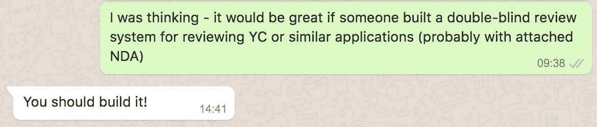
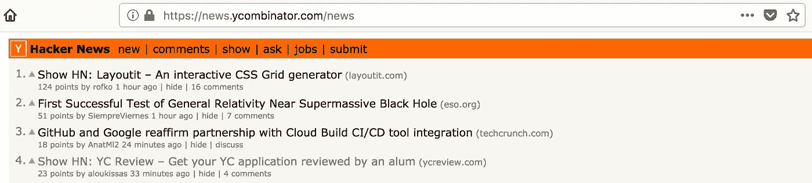
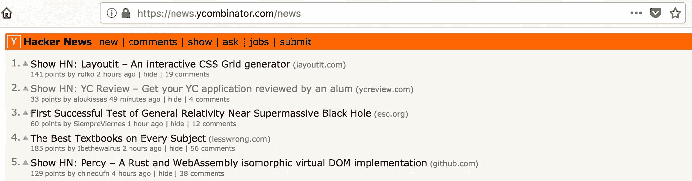
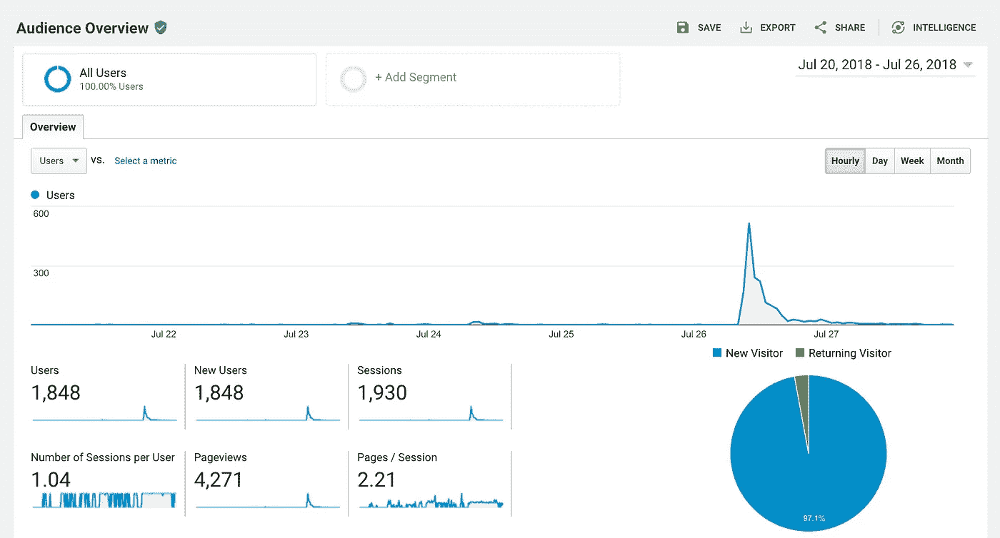

# 我的副业在 30 分钟内上了黑客新闻的头版……

> 原文：<https://medium.com/hackernoon/my-side-project-reached-the-front-page-of-hacker-news-in-under-30-minutes-88754f81348c>

Photo by [Paul Hanaoka](https://unsplash.com/photos/OvLBv6F6DGE?utm_source=unsplash&utm_medium=referral&utm_content=creditCopyText) on [Unsplash](https://unsplash.com/?utm_source=unsplash&utm_medium=referral&utm_content=creditCopyText)

发生了什么事？我在黑客新闻上提交的第一篇“展示 HN”文章不到 30 分钟就上了头版(不到 60 分钟就上了第二名)。这也让我在一天之内从零到超过 4K 页面浏览量。所有这些都是零计划的，而且是在我提交帖子的一周前还不存在的项目。这是相当疯狂的，这就是为什么我决定写这个。

# 什么是黑客新闻？

如果你在技术和/或创业领域，你可以跳过这一部分。还在吗？酷毙了。这里有一个快速概述:[黑客新闻](https://news.ycombinator.com/)是一个类似 reddit 的网站，由 [Y Combinator](http://www.ycombinator.com/) 运营。YC(Y Combinator 通常被称为 Y Combinator)是硅谷最著名的创业孵化器之一。用户可以提交帖子，这些帖子通常包括有趣的新闻文章、新产品发布，以及一般的“[任何满足个人求知欲的东西](http://ycombinator.com/newsguidelines.html)”。

一种特殊的帖子是“展示 HN”帖子(“展示黑客新闻”的简称)。这是为了让人们分享他们在黑客新闻上做的东西。这通常是一个新产品/创业或一个很酷的副业项目(通常与技术相关)。就像 reddit 一样，人们可以对帖子投赞成票和反对票，最有趣/最有新闻价值的帖子会出现在首页。

他们还采用一些方法来防止操纵系统，比如检测人们何时在社交媒体上请求支持。大多数时候，这一切似乎都工作得很好——黑客新闻首页(这个社区中人们的一个常见的日常目的地)经常会包含许多有趣的(甚至可能是浪费时间的？🙈)的帖子。

# 一点背景知识

我提交的黑客新闻是关于我最近建立的一个名为 [**YC 评论**](https://ycreview.com/) 的副业项目。在这个网站上，想申请 Y Combinator 的人可以在申请前让 YC 大学的校友审查他们的申请。这一切实际上是在我提交之前六天开始的。在无意中向一个朋友提到这个想法后，他用肘轻推了我一下，让我“造出来”。事情就是这样。

Friends don’t let friends leave cool projects unfinished

过了一会儿，我很惊讶地发现我想到的第一个域名([ycreview.com](https://ycreview.com))居然有了，于是我赶紧买了下来，把这个东西组装起来。仅仅几个小时后，网站就上线了。然后，我联系了我的扩展网络中的一些 YC 校友，以测试他们是否愿意成为这个实验的一部分(因为没有供应的[双边市场](https://en.wikipedia.org/wiki/Two-sided_market)是相当无用的)。

在头几天获得了相当数量的注册后，我决定是时候与社区分享它了。当然，这意味着提交一个“展示 HN”的帖子。请注意，在那之前，我大部分时间都是作为读者阅读黑客新闻，从未真正提交过任何东西。

# 去参加比赛

我肯定可能有最佳的方法来做到这一点(例如，研究一周中的某些天或一天中的某些时间是否可以产生更好的结果)，但老实说，我没有时间去研究这一点。除了在[建立我自己的创业公司](https://tevehq.com/)，我还必须在同一天准备和打包去欧洲的长途旅行。所以，当我喝着早晨的咖啡时，我决定咬紧牙关去做，抱着最好的希望。接下来发生的事情出乎意料。).

我有一段时间没有查看黑客新闻，因为我转而阅读关于我的家乡雅典发生的可怕火灾的新闻更新。然而，大约 30 分钟后，当我回头查看时，我简直不敢相信——我的帖子不仅登上了首页，而且还排在了第四位！

What the what?! I’m on the front page of HN!

显然，我刷新以确保这不是一个错误，并检查我是否在正确的页面上。不，这是真的。是的，在接下来的几分钟里，我变成了一个“刷新页面”的怪物。直到又过了 25 分钟，我的投稿才登上了首页的#2。那时，我的未婚妻已经结束了她每天早上和她的团队的虚拟站立，所以当我看到她时，我喊道:

> 我的黑客新闻贴已经上头版了！它在#2！

No fake news — we made it to #2 🙀

这简直是疯了！

哦，我有没有提到在这期间我被黑客新闻拒之门外？没错。该网站有这个漂亮的“反拖延”功能，当你在网站上花了一定时间后，你可以主动告诉它把你锁在外面。对我来说幸运的是，当我在 hn@ycombinator.com 发邮件给 YC 负责黑客新闻的人后，他们回复得非常快，仅仅几分钟后，我又一次参与到讨论中。这些人真的很棒。

帖子的评论相当不错(包括一些冷嘲热讽——我告诉你，这是一群难对付的人！)最后它在头版停留了好几个小时。当一天快结束的时候，我的帖子终于登上了头版，是时候看看这疯狂的举动产生了什么。

# 结果呢

我想说这是一个经过深思熟虑的实验，有明确的目标和指标。但是正如你现在可能已经猜到的那样，事实远非如此。好吧，我*让*设置了一些基本的谷歌分析活动，但仅此而已。下面的截图讲述了这个故事:仅仅在几个小时内，该网站从几乎零用户增长到几乎 2K 用户，浏览量超过 4K。我认为这种起伏对于在黑客新闻或其他类似渠道上发布的项目来说是典型的，比如[产品搜索](https://www.producthunt.com/)。

最后，有相当多的人注册了，至少足以让我在接下来的几天里比我计划的要忙得多。

# **那么，这是怎么发生的呢？**

我会试着弄清楚这是怎么发生的。也许这里有一些可重复的学习，但老实说，YMMV。可能差很多。

纯粹的运气。如果我说的还不够清楚的话，我提交了一个项目不到一周的帖子，几乎是零准备。也许我的时机是对的？也许文章的标题足够吸引人？谁知道呢。但我确信运气在这里扮演了一个体面的角色。

**对观众说话的内容**。相当数量的黑客新闻受众参与了创业活动，其中许多人本身就是创始人。发布一些对他们有意义的东西，特别是关于一个共同痛点的话题(在这种情况下，尽可能完善你的 YC 申请)肯定会对你有利。毕竟，这实际上是一个产品市场适应性测试。

**有一个清晰、简洁的标题**。伟大的标题可以产生巨大的差异。我在 YC 创业学校的导师曾经在这个问题上给了我很好的建议，我经常引用。简而言之，一个好的标题应该:

> 1.诉诸私利
> 
> 2.激起好奇心
> 
> 3.有新闻价值，而且
> 
> 4.给人的印象是快速而简单

你不可能总是拥有这四个属性，但是你勾选的复选框越多越好。我认为这一点可能有所帮助。

**诚实善良**。在帖子的早期有一些评论，人们质疑这个项目背后的动机，以及创作者的名字没有在任何地方被提及的事实。老实说，所有这些问题都是因为我把这个东西放在一起太快了，有些东西漏掉了。然而，我决定 100%诚实，在评论中承认这些问题。我还决定尽快更新网站的 FAQ 部分，以避免进一步的混乱。有人会对你提出负面的评论和严厉的批评。但在我看来，最好的做法是简单地将所有的反馈和批评视为改进的暗示(即使是实时的，就像我的情况一样)，而不是对抗性的。记住，对你最严厉的批评者很快成为你最铁杆的粉丝并不罕见。

# 结论

我真的希望这能帮助和激励你尽快把你正在做的事情做出来。如果你想知道这些大惊小怪是为了什么(尤其是如果你正在考虑为即将到来的一批申请 Y Combinator)， [**看看 YC 评论**](https://ycreview.com)——它是完全免费和匿名的。你也可以在推特[上关注《YC 评论》](https://twitter.com/YCreview),我会在那里发布有用的相关内容。

现在，去做一些很棒的东西🚀！