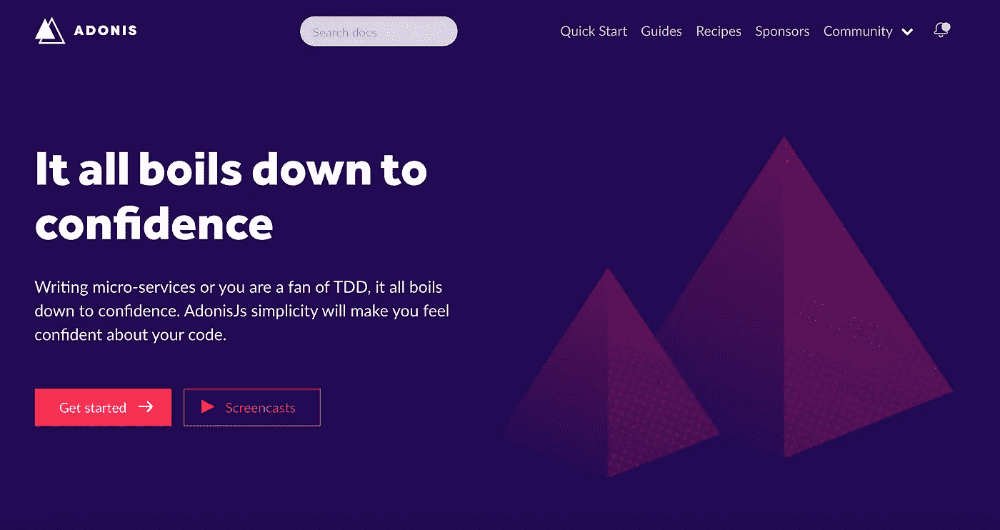
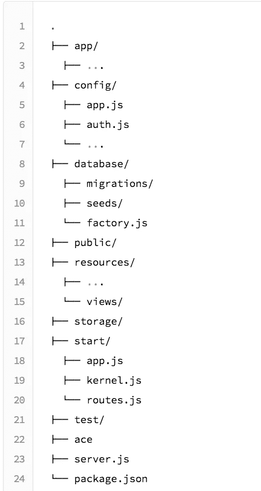
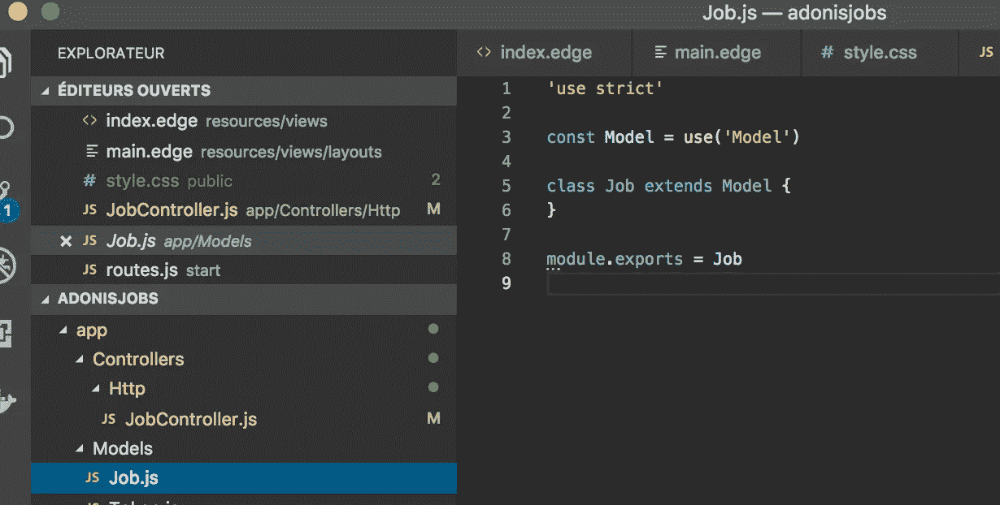

# 我从用 AdonisJs 4 构建工作板中学到的

> 原文：<https://medium.com/hackernoon/my-takeaways-from-building-a-job-board-with-adonisjs-4-f4071d98a929>

也就是尝试 NodeJs 自己的类似 Laravel 的框架

> 如果你是第一次接触 [@nodejs](https://twitter.com/nodejs) 的世界，并且你对构建你的第一个简单应用需要安装和配置的所有包感到不知所措(路由、解析、邮件、orm 和一个大的等等)，不要担心， [@adonisframework](https://twitter.com/adonisframework) 在这里等着你。
> T5【加夫列尔】勒科安蒂

自从我发现 AdonisJ 之后，我就痴迷于用它来建造东西的想法。现在我有了一些空闲时间，是时候建立一个[工作板](https://adonisjobs.club/)了！

在我看来，该框架的价值主张正是 NodeJs 生态系统目前所缺乏的:一个非常固执己见且以生产力为导向的整体框架。Adonis 很像是构建在 NodeJs 之上的 Laravel/Rails 克隆



I love that UI

如果您不熟悉 Laravel/Rails:基本上，AdonisJs 会通过内置模块为您处理身份验证、路由、邮件、数据库/ORM 配置，因此您可以只关注您的应用程序逻辑

我已经厌倦了推出我自己的认证系统，数据库配置，模型引擎等等..每次我用 Express/Koa 构建新项目时。AdonisJs 的[内置 auth 模块](https://adonisjs.com/docs/4.1/authentication)已经足够说服我了。

# AdonisJs:好的部分

那么 AdonisJs 有什么了不起的呢？

首先，典型的 Adonis 应用程序有一个严格的 MVC 结构，所以你不用浪费时间去弄清楚你应该如何构建你的应用程序，就像一个极简框架(例如。快递/Koa)



AdonisJs app structure

AdonisJs 命令行工具(CLI)非常有用，您可以生成所有的脚手架，而不必一次又一次地编写相同的代码

CLI 如此强大，以至于您甚至不必一开始就编写那么多代码，命令行工具本身就可以生成很多代码(很像 Rails 的“生成脚手架”CLI 命令) :

为了构建工作板，可以归结为一系列 CLI 命令:

```
#Install Adonis CLI
npm i --global @adonisjs/cli# Create the project
adonis new job-board
# Install the database
adonis install sqlite3# Create the "Jobs" SQL table
adonis make:migration jobs // pick "Choose an action" -> "Create table"
adonis migration:run#Create the related JS Model and Controller
adonis make:model Job
adonis make:controller JobController // pick "HTTP controller"
```

*瞧，*你已经生成了应用程序结构:

-"作业"数据库表
-模型文件(/models/Job.js)
-相关的 HTTP 控制器(**有对基于套接字的控制器的支持**)



**用户表、模型和认证方法呢？**

好了，已经解决了，当你使用`**adonis new job-board**` 命令时，所有与用户相关的脚手架都已经生成了！
两天内不要再揪你的头发，或与 [Passport.js](http://www.passportjs.org/docs/) 文档斗争

脸书/推特/Instagram/linkedIn 认证怎么样？

当然，这也有一个插件 [AdonisJs 模块](https://adonisjs.com/docs/4.1/social-auth)！

**如果你有一个 CRUD 生成器，并且已经为你生成了认证，那么还剩下什么来构建**[**AdonisJobs**](https://adonisjobs.club/)**？**

我只创建了表单、验证器和一个基本的 UI，然后直接部署我的小应用程序

**我用 AdonisJs 构建工作板并进行部署花了多长时间？**

四个小时。如果用我通常的快递/猫鼬/护照设置，我会花更长的时间

**安全呢？**

有一个模块，[屏蔽](https://adonisjs.com/docs/4.1/shield)，和一个[导轨](https://adonisjs.com/docs/4.1/security-introduction)

你能用 AdonisJs 构建一个 API，而不是一个完整的 MVC 吗？

当然，就用`adonis new -api-only job-board`

最后，作为最后一个好的部分，AdonisJs 拥有对 **Async/Await** 的原生支持，以及更多现代的 Javascript 特性，不像 Express current 版本

# AdonisJs:不好的部分

对该框架的主要批评依赖于 AdonisJs 引入了**很多**的**和**自己的模块:

举个例子，AdonisJs 使用自己的 [Edge 模板引擎](https://edge.adonisjs.com/)，它的语法与 handlebar 相差不远，而不是像 EJS 或 handlebar 那样使用一个非常标准的模板引擎。我在 Reddit /r/webdev 或/r/node 上看到一些人对框架没有使用主流节点模块感到不安

对于 ORM 来说也是一样，叫做 Lucid，路由和框架中的几乎所有东西

我不同意这些批评，我认为，为了构建一个整体框架，你需要对它的每一个部分进行完美的控制，这意味着为框架的每一个方面创建你自己的构建模块

**TL；博士:**

**我已经用 AdonisJs 构建了**[**AdonisJobs**](https://adonisjobs.club/)**来试用这个框架，结论:**

*   **在我看来，节点生态系统非常需要一个初学者友好的、非常固执己见的框架，像 AdonisJs 一样有一个*温和的*学习曲线**
*   **如果您是一名节点开发人员，并且一直在寻找一个面向生产力的、类似 Rails/Laravel 的框架，或者如果您厌倦了一起设置相同的 Express/mongose/Passport 样板文件，这可能是您的最佳选择！**

注意事项:

*   在[madewithadonisjs.com](https://madewithadonisjs.com/)展示和发现用 AdonisJs 构建的项目
*   我正计划和 NestJs 做同样的回顾，如果你对结果感兴趣，可以跟我来
*   为了建立我的求职板，我参加了加里·西蒙的《阿多尼斯 4 速成班》T21