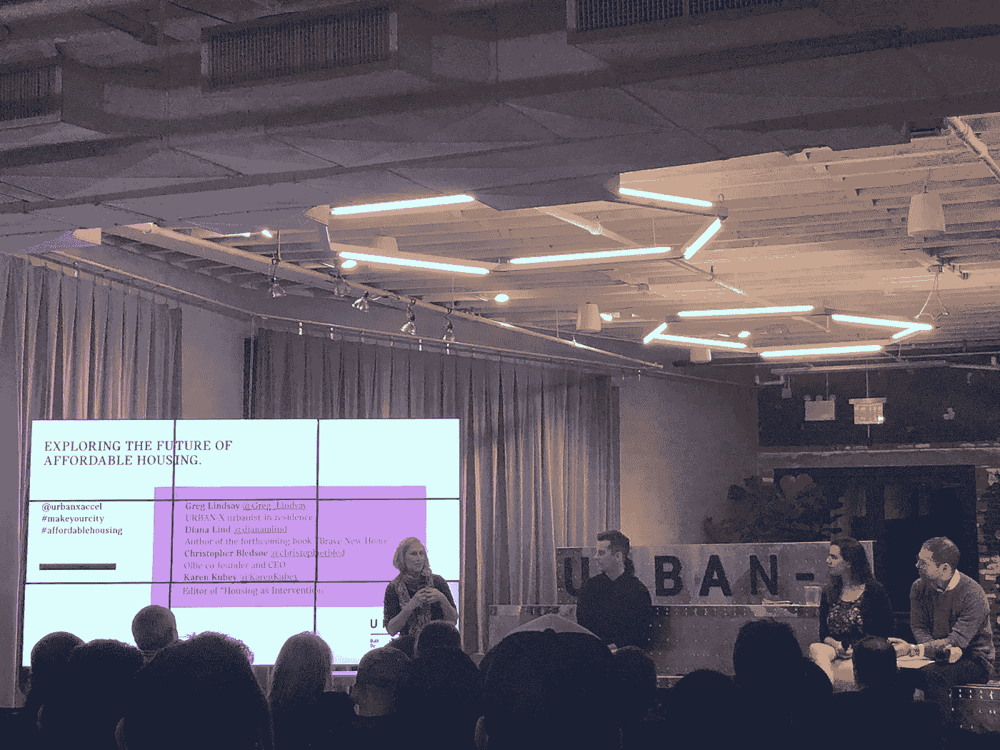

# 我从 Urban-X 小组“经济适用房的未来”中学到的三点经验

> 原文：<https://medium.com/hackernoon/my-three-lessons-from-the-urban-x-panel-future-of-affordable-housing-edf661345fd2>

Awesome event by Urban-X

小组成员——[戴安娜·林德](https://www.linkedin.com/in/dianalind)、[克里斯·布莱索](https://www.linkedin.com/in/christopher-bledsoe-41489b20)、[卡伦·库贝](https://www.linkedin.com/in/karenkubey)和[格雷格·林赛](https://www.linkedin.com/in/greg-lindsay-8b16952)——棒极了。我从 Urban-X 事件中吸取了三个教训。

1.  **挑战主导叙事**

戴安娜·林德认为我们一直在为核心家庭设计我们的房子。事实上，正如格雷格·林赛指出的那样，拥有自己的房子的想法已经成为我们成年叙事的一部分，对一些人来说，也是男子气概本身的一部分。我们需要适合不同生活需求的住房。想想跨代家庭、数字游牧民和希望生活在一起的朋友。

模型正在出现。小组成员提到了居住、微型单元、住宅和大房子。共住和微型单元——克里斯·布莱索(Chris Bledsoe)的奥利就是其中之一——优化了居住空间，帮助更多的人以更低的价格住在一个更小的单元里(奥利房间可以从 1300 美元/月起)。Baugruppes 是奥地利住宅的一个典范，在这里，居民汇集他们的资源，成为建筑的开发商。日本的 Megahouse 不依赖于个人住房所有权，而是一种订阅房模式(注:我无法在网上找到更多有关这方面的信息，所以如果有人有资源，请告诉我)。

我分几部分探索了更多的房屋模型。

*   在[中，多家庭高管](https://www.linkedin.com/feed/update/urn:li:activity:6447134224142073856)(与 [Urban.us](http://urban.us) 的合伙人 Stonly Baptiste 合作)——指出开发商如何与初创公司合作以降低成本。创新跨越了新的密度模式，如微单元和共住，新的建筑技术，以及新的融资模式，如众筹。
*   在[shelter force](https://shelterforce.org/2018/06/26/cdcs-and-nonprofits-are-indeed-leading-affordable-housing-innovation/)——看看非营利组织是如何创新的，使用像小房子和预制房屋这样的工具为无家可归者提供住所。
*   在 [Hackernoon](/@danwu_danwu/startups-and-the-future-of-affordable-housing-9f2ff4c066cb) (与李钰一起)——调查住房创业公司的情况。这篇文章从长计议，特别是新的所有权模式，比如有限股权合作社和社区土地信托。

**2。克服财务和法律障碍**

尽管这些新实验挑战了我们的主导叙事，但金融和法律障碍阻止了这些模型的扩展。例如，[的抵押贷款机构对新的房屋类型收取更高的费用。纽约市和 NYS 的法规，有时被称为妓院法，规定纽约市一个单元中非亲属成年居住者的上限为三人。法律限制人们的住房选择，特别是对那些想住在更小的空间和支付更少住房费用的人。](/the-roam-diaries/why-does-co-living-often-turn-out-overcrowded-silly-expensive-or-both-5282fe6a3b21)

尽管存在这些障碍，一些倡议正在更大范围内验证这些模型。像 Ollie 或 Common 这样的风投支持的共同生活创业公司在展示共同生活的前景方面做得很好。一个传统的演员——城市——也开始涉足这个领域。通过其新项目 share . NYC，该市支持收入受限的居住项目获得公共土地拨款。这种大规模模型可以进一步降低模型的风险，创造更多新生活模式有效的数据，并为贷款人和决策者创造成为先行者的后续机会。

更广泛地说，我支持 Share.nyc 这样的项目，以支持社会驱动的住房创新。我已经在[哥伦比亚公共政策评论](http://www.columbiapublicpolicyreview.org/2018/11/lets-use-housing-policy-to-bolster-social-impact-and-community-led-development/?fbclid=IwAR2nyEtX8sg0T_OJszhomc5RNUXK9IG726LMWGILuwPunI-HBMoA2kbxtk8)(与克里斯托弗·周)上写了一篇即将发表的文章，提出了类似的观点。州、地方和联邦政策制定者应该培养和激励目前属于少数的开发者——社会影响和社区主导的开发者。激励措施可以包括在公共土地上优先开发、技术援助和放宽分区要求，如放宽最大占用限制、停车要求和最小地块面积要求。

为了应对不断增长的财务和法律要求，我们还可以考虑其他策略来降低成本。我在我的文章《多家庭高管》和《探索帮助租房者节省能源浪费的创业公司》中调查了许多这样的问题。

[全堆叠模块](https://www.fullstackmodular.com/)可以减少建造新房屋的时间和财务成本。[封面](https://cover.build)摒弃符合规范的外壳设计，降低监管成本。[小改变](https://www.smallchange.com/)为较小的、有社会影响力的开发商创造新的融资渠道。

**3。在更高密度的环境中创造更高质量的生活**

虽然密度可以省钱，但它会导致贫民窟般的住房条件。我们如何活得更密集但也活得好？

这是一个价值百万的问题。正如 Chris 在他的故事中分享的那样，租房者渴望更便宜的住房解决方案，为好社区的小空间支付惊人的价格。然而，正如卡伦·库比所提到的，简单地消除来之不易的生活水平以服务于高密度也不是答案。

奥利改善高密度环境中生活质量的双重策略包括(1)类似酒店的便利设施和(2)社区。克里斯尤其认为后者是促进宜居、高密度生活的最有力工具。事实上，出现了一些简单的合住解决方案，如 Padsplit 和 Hubhaus，它们主要关注社区和室友中介，但忽略了便利设施。

座谈会后，我问克里斯，他认为发展优秀社区的关键是什么。此外，鉴于人类喜欢吸引同类的倾向，我问奥利采用什么策略来挑战我们与相同种族、阶级或性别交往的倾向。

他的回答是:共同的兴趣。围绕共同兴趣组织社区可以鼓励人们结识不同于自己的人，因为他们只是在一起做他们已经喜欢的事情。令人兴奋的是，他的一些单元是资本“A”[负担得起的](https://hackernoon.com/tagged/affordable)有租金上限，这意味着奥利确实有社会经济多样性。不管人们的阶级、性别或种族背景如何，通过将有共同兴趣的人聚集在一起，奥利可以建立更加多样化的社区。

我对他的方法感到兴奋。我有另外两个想法。

第一，很多活动不是中立的。例如，高尔夫是一项按种族、阶级和/或性别划分的活动。这也是一项前期成本很高的活动——培训、乡村俱乐部会员资格和设备费用可能高达数百美元，甚至数千美元。如果社区的多样性是一个优先事项，奥利应该考虑如何设计这些共同的利益，以对抗预先存在的文化倾向。Wii 高尔夫有人吗？

第二，和共同的兴趣一样重要的是共同的生活习惯。这些包括你对过夜客人的偏好和清洁频率，这些分歧是许多室友冲突的根源。根据我在 [Welcome Home](/@danwu_danwu/building-a-roommate-website-from-scratch-3-product-lessons-2bd253381a1f) 的经历和作为本科生的常驻顾问的经历，我对更多样化的社区有一个双重假设:当你把室友和(1)共同的生活习惯和(2)共同的兴趣联系起来时，你会减少群体冲突，增加群体纽带。

此外，即使在生活习惯相匹配之后，我们也会强迫室友们进行一系列艰难的对话，最终达成“室友协议”。例如，如果室友需要提前离开，你会怎么做？如何找到替代者？设定期望值，尽量减少以后的失望和惊喜。

最后，活动非常精彩，并引发了一些很酷的对话，例如 [Oscar Abello](https://www.linkedin.com/in/oscarperryabello/) 推荐阅读*的《其他太阳的温暖》*和 [Nick Hamilton](https://www.linkedin.com/in/nicholasmarkhamilton/) 建议加入 [NYC 城市可持续发展会议](https://www.meetup.com/Urban-Sustainability-NYC/)。

后勤也很棒:空间大小恰到好处，音响效果很好，人们很热情也很感兴趣。

*☞同意还是不同意？在 LinkedIn 上加我加个备注* [*这里*](https://www.linkedin.com/in/wu12345/) *。*