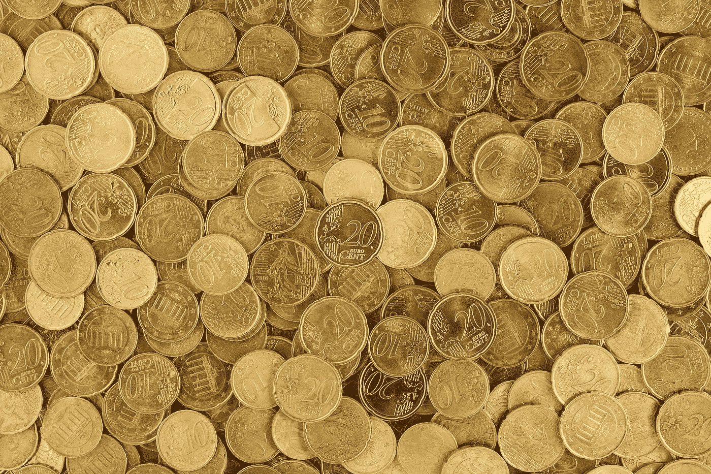

# 我最喜欢的 5 个现实世界资产令牌化应用

> 原文：<https://medium.com/hackernoon/my-top-5-favorite-applications-of-tokenizing-real-world-assets-ce256f5a98d6>

*加州三藩市
2018 年 8 月 1 日*

我将保持这篇文章的简短，但是我已经跟踪了实物资产证券化的趋势有一段时间了，我已经提出了我最喜欢的五个用例，以及详细阐述每个用例的文章。

## 1.黄金(皇家铸币厂金条):

> 基于区块链的[硬币被称为皇家铸币厂黄金(RMG)，是皇家铸币厂金库中储存的黄金的数字表示。](https://cointelegraph.com/tags/blockchain)
> 
> 皇家铸币公司销售实物黄金，是第一家允许客户在区块链上持有黄金支持资产的公司，RMG 商业主管汤姆·考希尔在接受 Express.co.uk 采访时表示。Coghill 还提到一枚 RMG 硬币等于一克黄金，并补充说“当你拿着我们的 RMG 时，你拿的是真金。”— [Cointelegraph](https://cointelegraph.com/news/uks-royal-mint-launches-gold-backed-cryptocurrency)

## 2.房地产(物业):

> 进入国际 P2P 房地产市场 Propy，该市场旨在解决跨国购买房产的问题。它可以说是世界上第一个以区块链为基地的网络，旨在促进国际房地产的无缝在线购买。
> 
> “房地产注册”由智能合同驱动，这些合同旨在根据地区法规跟踪和执行房地产交易。利用以太坊的突破性进展，Propy 允许经纪人、买方、卖方、产权代理人和公证人在现有法律框架内利用区块链的私钥进行交易。— [纳斯达克](https://www.nasdaq.com/article/the-future-of-blockchainbased-real-estate-transactions-cm981351)

## 3.药品供应链(编年史，MediLedger):

> [MediLedger 项目](https://www.mediledger.com/)旨在证明符合药品供应链安全法(DSCSA)。它利用区块链技术跟踪和追踪处方药。该项目还试图展示防止假药进入供应链的能力。— [企业时报](https://www.enterprisetimes.co.uk/2018/05/08/mediledger-chronicled-and-blockchain/)

## 4.货物装运(大宗货运)

> 大宗货运的三个关键要素是:
> 
> 智能合同永久、安全地定义提单、支付条款和完成货物运输的其他元素，建立在[以太坊](https://www.ccn.com/tag/ethereum/)区块链之上。
> 
> 一种作为交易对手资产的可交易代币，由[比特币](https://www.ccn.com/tag/bitcoin/)区块链担保。可交易令牌支付交易费用并消除分散系统上的垃圾邮件。
> 
> 使用行星间文件系统协议存储提单和其他太大而无法放入比特币块的文件。— [CCN](https://www.ccn.com/blockfreight-taps-blockchain-technology-disrupt-global-shipping/)

## 5.艺术与收藏品(法典)

> 在今天的艺术界，你需要咨询专家来跟踪和证明一件艺术品的真实性。这很慢，很贵，而且容易出错。法典正在改变这一点。
> 
> Lurie 将该协议描述为“独特资产的分散注册，从艺术品和收藏品开始…我们存储出处信息，以便每个人都可以轻松地与这些资产进行交易。一旦你有了头衔，你就可以证明你是从哪里得到它的。这意味着你拥有可核实的信息，并获得读取这些数据的服务——保险、有留置权的资产担保贷款、艺术家版税、买卖、托管。”— [Coincentral](https://coincentral.com/codex-ceo-mark-lurie-interview/)

你最喜欢的区块链现实世界资产的例子是什么？请在下面的评论中告诉我。

___

免责声明:这些观点仅代表我个人的观点，并不代表 Sharespost 或我可能建议或投资的任何公司的观点。

如果您想联系，请在 [Twitter](https://twitter.com/John1wu) 、 [Medium](/@John1wu) 和 [LinkedIn](https://www.linkedin.com/in/johnwu87/) 上关注我。