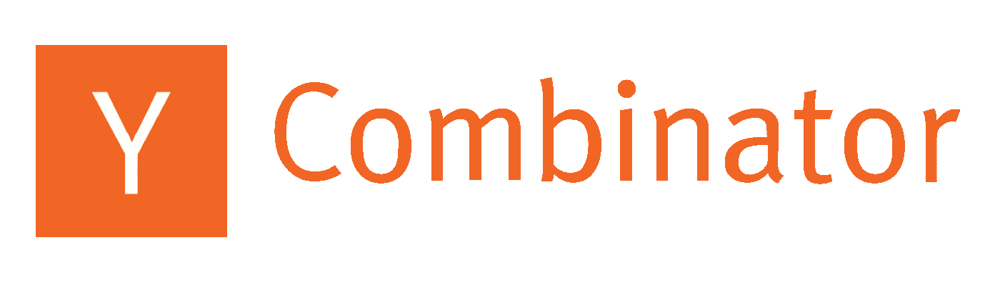
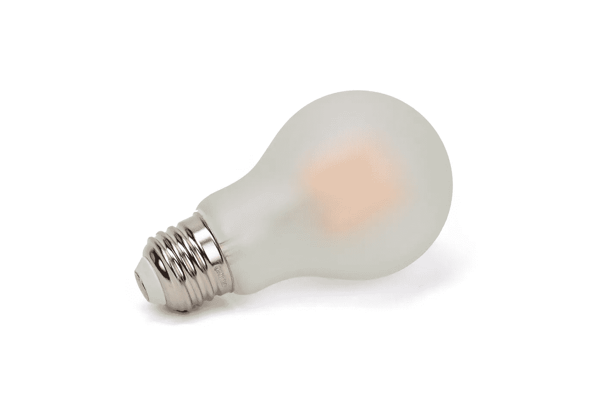

# 我从 Y Combinator 的创业学校学到的最重要的东西

> 原文：<https://medium.com/hackernoon/my-top-takeaways-from-y-combinators-startup-school-e7f8616a3edd>

[创业学校](https://www.startupschool.org/)，由 [Y 组合](https://www.ycombinator.com/)组织的 10 周免费在线课程，刚刚结束第二期年度班。在我看来，这是早期创业公司的完美计划。教训和责任让时间投资物有所值。

在这篇文章中，我将深入探究为什么我会发现这个项目如此有价值，包括我的主要收获。

# 什么是创业学校？

把创业学校想象成“YC 之光”在许多方面，这就像是完整的 YC 计划，只是少了搬迁到硅谷和 15 万美元的股权投资。今年包括哪些内容:

*   每周小组辅导会议
*   每周几次[视频讲座](https://www.youtube.com/playlist?list=PLQ-uHSnFig5NVnJ_cLWM7dLuMQRDeekoX)
*   一个相互支持和问责的论坛
*   目标跟踪
*   来自服务提供商的交易(例如，Microsoft Azure 和 Stripe Atlas)
*   100 家公司有机会获得 1 万美元的无股权资助

视频讲座——来自硅谷一些最聪明的人——可供任何人观看。

YC 意外地向超过其分配空间的公司发送了接受电子邮件。他们[决定接受所有申请的创业公司(超过 15000 家！)进入程序。](https://blog.ycombinator.com/startup-school-every-company-that-applied-is-now-accepted/)

很高兴看到 YC 以其人之道还治其人之身，将他们的洞察力扩展到他们所投资的创业公司之外。

# 开学前

在我进入创业学校的顶级见解之前，我认为把我的创业之旅放在背景中是有意义的。

我的公司 SimpleBulb 正在解决不健康光线的问题。我们的第一个产品，[睡前灯泡](https://bedtimebulb.com/)，是一个健康睡眠的低蓝光灯泡。睡前灯泡在晚上使用，以减少人造光对睡眠的干扰。

Our MVP, [Bedtime Bulb](https://bedtimebulb.com/)

睡前灯泡的想法并不是来自于左翼领域。在此之前，他一生痴迷于光，并多次试图解决夜间蓝光的问题。你可以在这篇文章中了解更多关于[的背景故事。](/simplebulb/bedtime-bulb-the-origin-story-b48932df1723)

8 月底创业学校开学的时候，我手里有一个产品和几十个预订单。早期用户喜欢这个产品，对此我很感激，因为在硬件上迭代可能很困难，也很昂贵。我决定跟踪的指标是每周售出的数量。

当时我正计划推出 Kickstarter，但我被这个挑战吓住了。历史数据显示，大多数顶级活动在头两天内就获得了充足的资金，然后“乘着媒体推广和其他后续效应的浪潮”。因为 Kickstarter 不是有机发现的最佳平台，所以我必须为活动带来大量的流量——这可能是非常昂贵和具有挑战性的。

# 去卖吧！

在第一次小组办公时间会议上，我介绍了我的创业公司和我在项目期间的计划。我们小组的导师，马丁·波森里德(Martin Poschenrieder)是 YC 大学的毕业生(testmunk 的创始人，YC S12)，非常和蔼，但提出了一些具有挑战性的问题。仅仅是听到自己大声解释预购计划和 Kickstarter 计划就让它听起来非常复杂，我意识到我必须做一些更简单的事情。

> YC 核心原则#1:尽早推出

YC 的[核心信条之一](https://www.vccafe.com/2017/09/27/ycombinators-top-advice-for-founders/)是，你应该在你认为自己准备好之前就发布产品，即使你对产品的状态感到尴尬。我有一个早期用户喜爱的工作良好的产品——远远超过了尴尬的阶段——那么我推迟正式发布还在等什么呢？

这个团队说服我去销售，不到两周，产品就在亚马逊的[上架了。事实证明这是一个伟大的举动，因为我们已经卖出了数百台，每周平均增长率为 28%。](https://www.amazon.com/gp/product/B07H49N46N)

销售的教训是如此简单明了，然而我却试图把它复杂化。通过选择销售，我能够获得更多的客户反馈，证明需求，并更快地迭代。

# 创业习惯

第一次办公时间的会议是如此的有价值，我本可以就此打住并处于一个很好的位置。这并不是说该计划的其余部分没有帮助——到目前为止是有帮助的。但是，在办公时间以开放的心态出现，跟踪指标，连续 10 周观看讲座，以一种可能不太明显的方式帮助了我。

一些文献称，养成一种新习惯平均需要 66 天。创业学校持续了 10 周，大约 70 天。也许这不是巧合。

从创业学校出来后，我觉得更有动力继续推动每周的增长。我知道过山车之旅还远未结束，但我觉得我有了一个更开放的心态去接受我们面前的一切。我已经养成了创业的习惯。

# 创业学校后

创业学校结束了，但我带着新的友谊、新的想法和更多的动力去创业。

睡前灯泡现在已经在美国和 T2 推出。在十周内，我们已经发展到了在下一批工厂货物到达之前就可以销售一空的地步。我们正在积极开发未来的产品并完善我们的信息。我们即将启动我们的种子资金筹集，这样我们就可以扩大产品线，建立一个多元化的团队，并最终通过健康之光改变世界。

不同的创业公司一定会得到与我们从创业学校获得的不同的东西。但如果你每周都以开放的心态出现，你一定会有积极的体验，并形成自己的创业习惯。

对我们的[睡前灯泡](https://bedtimebulb.com/)感兴趣吗？查看[我们的博客](https://medium.com/simplebulb)或[直接联系](https://bedtimebulb.com/contact)。