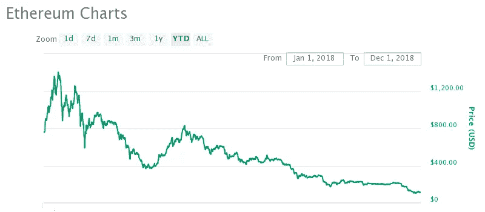

# 稳定币之我见——戴与制造者(上)

> 原文：<https://medium.com/hackernoon/my-view-on-stablecoin-dai-maker-part-1-87473bb8a3cb>

作为我在 stablecoins 上的[介绍性帖子的后续，我想我应该看看一些更受欢迎的帖子。因此，我选择写的第一个是**戴。**](https://hackernoon.com/the-rise-of-stablecoins-what-are-the-different-types-out-there-9b8b7f31dadc)

当我在写的时候，我意识到这有多长，所以我把它分成两部分。第一部分是对我所理解的 stablecoin 的介绍，第二部分是我自己的观点。

## **什么是戴稳定币及其制造者(又名马可道)？**

DAI 是加密抵押的稳定硬币，旨在保持 1 美元= 1 DAI，并旨在通过利用其协议设计和治理来实现这一目标。这个协议设计和治理框架被称为 Maker Platform(以前称为 MakerDAO)，是一个去中心化的组织。

# 它是如何工作的？

傣族稳定的货币生态系统的运作方式可能有点复杂。在核心部分，DAI 以乙醚(ETH)作为抵押，以确保其价值，并使用创客平台的内置协议来维持其价格稳定。为了说明这一点，让我们从头开始:创造戴。

## **创造戴**

如果你想创造债务抵押债券，你需要做的是将你的联邦储蓄银行的资产转移到债务抵押债券(CDP)中，然后你会收到一部分债务抵押债券。你的 ETH 现在被锁在 CDP 里面，只有你偿还了你借的 DAI，你才能拿回它。如下例所示:

1.  存款 1 ETH(价值 200 美元)
2.  发行 100 戴(价值 100 美元，所以你的抵押比率是 2:1)
3.  你现在可以随意给我们 100 戴。
4.  一年后你想要回你的 ETH。然后你必须用 101 DAI 回购你的 ETH(假设利率是 1%)
5.  你拿回 1 ETH，收取的 1%的利率归 MKR 令牌持有者，因为这是他们维护系统的“费用”。

这是该过程的简化版本，但仍然说明了它是如何工作的。

用外行人的话来说，你所做的有点类似于获得抵押贷款。你用你的 ETH 作抵押借了戴，就像用你的房子作抵押借钱一样，只有当你偿还了你的债务(连同利息)，你才能拿回你的抵押品(ETH 或房子)。

## 价格稳定机制

到目前为止，这解释了戴的创建，但这如何有助于保持价格稳定，特别是因为 ETH 可以有相当大的价格波动。同样，在不涉及太多技术的情况下，确保价格稳定的一些主要因素是(注意，其中一些因素略有简化):

**全球结算** 全球结算是协议中的一项设计，当价格偏离太大时可以触发，DAI 将被清算并以预先确定的价格结算，例如 1 美元= 1 DAI。当这种情况发生时，DAI 的持有人将获得价值 1 美元的抵押品，例如，如果您在全球结算触发时持有 100 DAI，您将获得价值 100 美元的 ETH。因此，这一预期确保戴不会偏离其盯住美元的汇率制度太远。

**套利机会** 这是一种信念，即 1 DAI = 1 美元，因此任何价格偏差都是交易机会。这被交易者利用了。

**CDP 创建者——DAI 借款人/贷款人** 记住，CDP 创建者是借用 DAI 的人。因此，如果 DAI 的交易价格低于 1 美元，CDP 创建者回购 DAI 是一个好主意，因为他们需要用它来偿还贷款。或者，如果 DAI 的交易价格高于 1 美元，CDP 的创建者可以发行更多的 DAI 出售，并在它回到 1 美元时回购。

# 抵押风险

ETH prices can be pretty volatile and so the collateral value can vary immensely

与所有稳定的货币一样，最大的风险是它能否维持其挂钩汇率，这主要取决于它保持抵押的能力。这里的问题是，ETH 的价格可能相当不稳定，这意味着戴的抵押品的价值可能会大幅波动。因此制造商的系统有协议来最小化它的影响。比如说…

## **ETH 升值**

在这种情况下，戴只是成为更好的抵押，并没有真正的问题，戴的 1 美元挂钩。

## **ETH 值下降**

这是问题发生的时候。这是因为如果 ETH 的价值下降，并且我们达到了 CDP 中 ETH 的价值低于发行的 DAI 总额的情况，那么该系统已被抵押，并且如果发生“全球结算”事件，1 DAI≠USD＄1。

为了防止这种情况，所发生的情况如下(有些是为了更容易理解而简化的):

1.  首先让我们假设如下:
2.  ETH 当前价格= 200 美元。
3.  您承诺了 1 ETH 来创建 CDP，并创建了 100 DAI(抵押比率目前为 2:1)。
4.  最低抵押比率阈值为 1.5:1。
5.  ETH 价格已跌至 175 美元
6.  您创建的 CDP 的抵押比率为 1.75:1，因此不会发生任何情况。
7.  ETH 价格已经跌破 150 美元
8.  您创建的 CDP 的抵押比率为 1.5:1，这意味着 CDP 抵押不足。
9.  CDP 现在必须触发一个清算事件，在该事件中，它拍卖已承诺的 ETH 抵押品，以弥补原始债务(在本例中为 100 DAI)和清算成本/罚款。
10.  因此，作为 CDP 的所有者，你将获得你所借的最初 100 戴(因为你没有偿还)以及抵押品出售的任何剩余。
11.  这实际上意味着，你的抵押不足的 CDP 被从生态系统中移除，由于这在不同程度上对所有 CDP 重复，它允许整个生态系统保持在抵押率阈值或以上。

## **负反馈循环& MKR 最后的买家**

如果你能够跟随前面的场景，你会很快意识到 CDP 本身的清算会带来一个负反馈循环。因为:

1.  CDP 清算事件被触发，ETH 被出售。
2.  由于 ETH 被出售，价格进一步下跌，引发其他 CDP 清算事件。
3.  这一过程一直持续到所有 CDP 被清算。

这是制造商协议的关键风险之一，但他们已经考虑让 MKR 代币充当“最后的买家”。我不会详细说明这是如何运作的，但简单来说，当 CDP 清算时，如果购买量不足以支付债务+清算罚款，MKR 代币将被发行和出售，以弥补这一缺口。

# 马克尔岛的关键人物

唷，我们终于搞清楚戴是怎么工作的了。因此，让我们把这些放在一起，看看 MakerDAO 生态系统中的参与者:

## 用户

这些人购买和使用戴。他们并不积极参与 DAI 的创建/销毁，但对生态系统很重要(因为没有用户=没有需求)。

## **交易员**

交易员是那些积极交易 DAI 以通过一些策略获利的人，例如围绕 1 美元= 1 DAI 的价格进行交易(低于 1 美元时买入，高于 1 美元时卖出)，在 CDP 清算期间寻求买入 ETH 进行套利交易等。它们很重要，因为它们有助于维持价格体系的稳定，并允许做市商系统按预期运行。

## **CDP 创造者**

如前所述，这些人将 DAI 作为一种借贷形式，为此他们需要创建 CDP。

## **MKR 代币持有者**

MKR 令牌持有者实际上是做市商系统的治理令牌。如上所述，他们充当最后的买家，但也对与创客生态系统相关的各种决策拥有投票权。他们从这个角色中得到的好处是，做市商系统内的所有费用都需要在 MKR 支付。这意味着随着戴的采用增加，对的需求也会增加(价格也会增加)。这使他们的兴趣与为 DAI 提供良好的治理保持一致，以便吸引更多的采用。

# **总结(目前)**

如果你仍然不确定它是如何工作的，不要担心，因为它需要时间来消化。到目前为止的要点是:

*   戴用密码作抵押；目前只有 ETH。
*   套利、全球结算等多种因素有助于维持戴 1 美元= 1 戴的盯住汇率。
*   由于加密价格可能会波动，DAI 有一个清算协议，并尽最大努力确保 DAI 资本充足，能够维持其对冲。
*   MKR 代币持有者管理着创客生态系统，也充当着最后贷款人的角色。

未完待续……第二部分将讨论我对戴的看法

*以上帖子仅供参考和娱乐。通过此类帖子获得的任何和所有信息，无论是通过音频、视频、口头还是书面方式，都应被视为作者的个人观点、策略和示例，并反映他或她在发布之日的判断，可能会更改，并不构成投资或交易建议。作者对任何信息内容的准确性、适用性、适用性或完整性不做任何陈述或保证。这些帖子的作者不对任何一方因使用内容而直接或间接产生的任何直接、间接、暗示、惩罚性、特殊、附带或其他后果性损害负责，这些内容按原样提供，没有任何形式的明示或暗示的担保。任何指向第三方提供商的链接或参考仅供参考，不保证内容、准确性或任何其他明示或暗示的目的。*

*投资和交易策略受市场风险和潜在损失的影响，所有交易策略同样有可能盈利或亏损。过去的表现不能保证未来的结果。不能保证任何交易策略将匹配或优于任何特定的基准。任何内容都不应被解释为购买或出售的要约，或任何购买或出售任何提及的证券的要约的恳求。在任何情况下，读者都不应该从表面价值上接受从本博客获得的任何信息，而应该对任何材料进行尽职调查，以形成自己的观点和最佳判断。在采取任何行动之前，应咨询专业顾问以获得个性化的投资建议。如果读者希望应用任何帖子中包含的概念或想法，这样的读者对他或她的行为承担全部责任。*

*2018 湛豪。保留所有权利。此处提到或提及的产品名称、徽标、品牌和其他商标是其各自商标持有者的财产。*