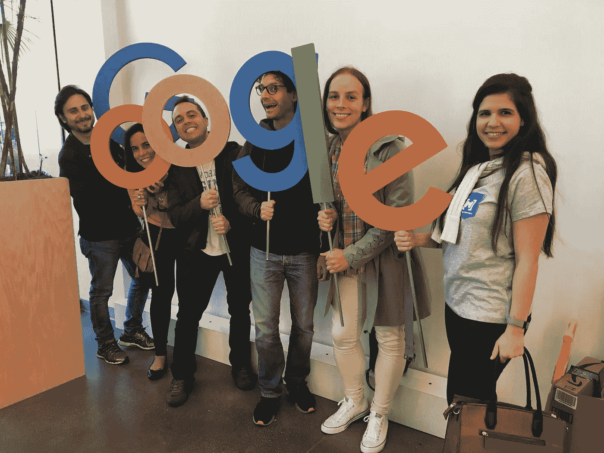
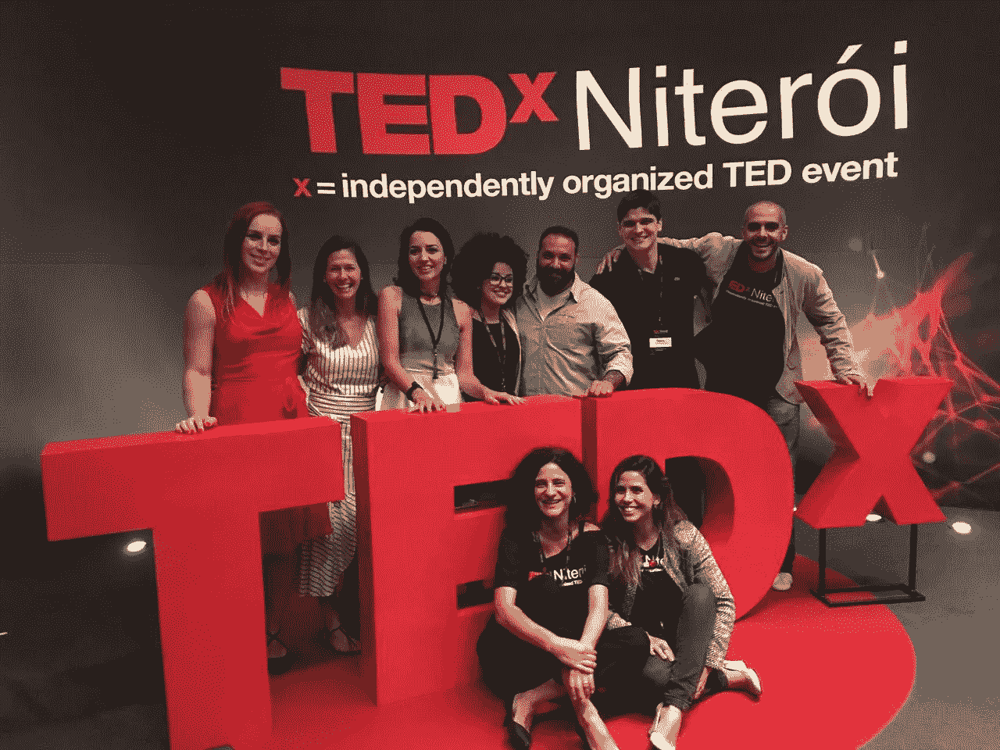
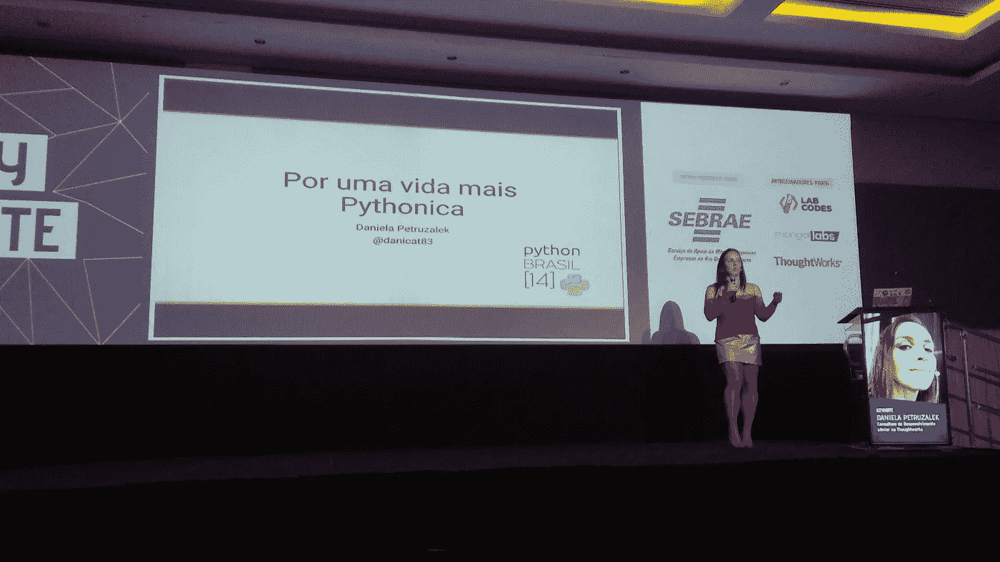
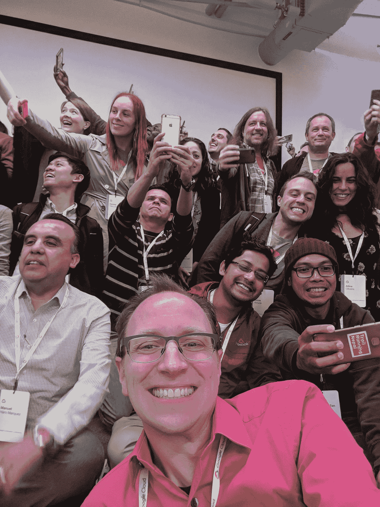
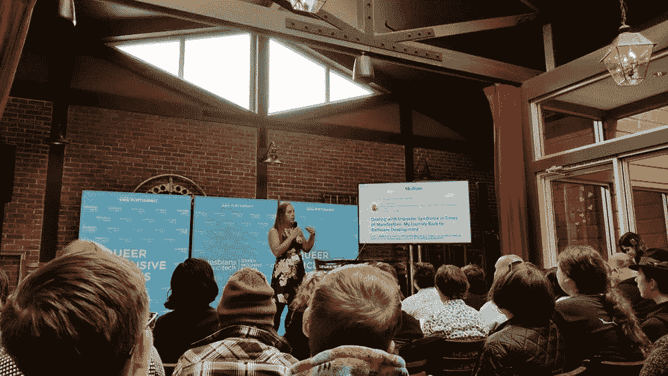

# 我的一年回顾— 2018 年版

> 原文：<https://medium.com/hackernoon/my-year-in-review-2018-edition-53bc2b1cce44>

又一年结束了。随着传统的延续，是时候反思过去的一年并为来年做准备了。

Brazilian GDEs at the Google Cloud Community Summit in Sunnyvale, CA

2018 年是一个充满惊喜的盒子。今天回头看看这一年发生了多少事情，看起来我在仅仅一年的时间跨度里过了 5 年。难怪我感觉这么累！😅

正如你在[我之前的回顾](https://hackernoon.com/my-year-in-review-fea2ffc662ab)中看到的，去年已经非常令人印象深刻了，老实说，我不认为 2018 年会更好……我错了，大错特错！

今年年初，我设定了一些目标，你可能会说是新年决心，其中包括在国际会议上用英语演讲、技术改进和创建 YouTube 频道等内容。

这些应该有助于我在 2017 年开辟的道路上前进，尽管我确实成功完成了其中的一些事情，但正是我没有提前计划的事情给我带来了最大的成就感。

# 年度亮点

今年将很难选择最佳时刻，因为发生的许多事情很容易符合第一名的位置。我想说至少前三名是平局。

Speakers and curators of TEDx Niterói

1.  **在 TEDx 分会上讲话:TEDx Niterói**

TED 演讲是一些最有经验的演讲者的梦想。这是这些年来我脑海中出现过几次的东西，但我不认为我有 TED 级别的材料可以分享，至少在我人生的这个阶段没有。

但在去年 12 月的某一天，一切都变了。TEDx Niterói 的一位策展人联系了我，邀请我在平台上分享我的历史。我不知所措。

准备是一个漫长的过程。首先，你需要写好草稿并提交审阅。然后在稍后的阶段，你开始做视频，每次迭代你都从策展人那里得到反馈来调整你的材料。在活动的前一天，你做最后的排练来调整最后的部分。

我不习惯有如此严格的过程来构建我的任何演讲，因为我喜欢更“自由式”。我真的很难跟上要求的速度，这使我赢得了那一届“最难治愈的演讲者”的奖杯，但最终，我发表了演讲，每个人都对结果感到满意。

尽管如此，我从这个过程中学到了很多，我已经在想我是否还有机会再做一次。我保证下次会更“好治”的！😉

**2。我的第一个主题演讲:Python 巴西 14**

“For a more pythonic life” — My keynote at PyBr14

首先，我需要说:我爱 Python 社区！这是最令人惊叹、有趣和包容的社区之一。我参加的每一次会议都是一种享受:我遇到了非常有趣的人，与朋友重新联系，并学到了很多很酷的东西。当然，我不能忘记提到“pybar”。

今年，我非常荣幸地主持了巴西最大的 Python 活动:Python Brasil 14。这不仅是我在如此重要的活动中的第一次主题演讲，也是我最大的观众群(约 700 人)，也是我感觉联系最紧密的一次，所以我真的想发表我一生中最棒的演讲。

我决定将 Python 的禅与现实世界做一个比较，简单触及巴西当前政治场景的一些方面，并重温我的 TED 演讲中的一些概念。我认为这有点冒险，但却是一种好的挑衅。

演讲结束后，我得到了压倒性的支持，以至于很难离开会议室，因为有那么多人来和我交谈并要求拍照…任务完成了！

我仍在等待视频发布，但你可以在这里找到幻灯片:

**3。被提名为谷歌开发者专家**

我已经和[谷歌](https://hackernoon.com/tagged/google)调情好几年了。去年，我有一次在谷歌伦敦的现场面试机会，是为了一个开发者代言人的角色。我没有通过这个过程，老实说，我对整个经历感到有点失望。

然而，这仅仅是我与谷歌关系的开始，在巴西的一些开发者大会和发布会上进行了几次非官方的“专家”会谈后，我终于被邀请作为谷歌云平台的谷歌开发专家加入 GDE 计划。

Googlers, GDEs and cloud community representatives at the Google Cloud Community Summit.

加入该计划为我打开了许多大门，最大的好处是仅在今年就有机会去三藩市旅行三次，因为我被邀请参加 3 月份的 Google Cloud 社区峰会、7 月份的 Google Cloud Next 和 11 月份的 GDE 峰会。

此外，通过成为这个项目的一部分，不知何故，我想成为一名谷歌人的冲动减少了很多。我很满意我现在与他们的关系，我相信在我人生的这个时刻离开谷歌更有意义，因为我在这里有很多事情要做，帮助社区，专注于我职业生涯的其他方面，否则我无法做到。

**4。我的第一次英语演讲:LWT 旧金山峰会**

Talking at Lesbians Who Tech San Francisco Summit 2018

为国际观众演讲是我今年实现的另一个梦想，也是我已经完成的去年决心中的一项。由于英语是我的第二语言，在我的日常生活中并不经常使用，所以对说英语的观众讲话是一个很大的挑战。

尤其是我喜欢在谈话中使用的自由式方法变得不切实际，因为我没有流利地用英语像用葡萄牙语那样快速地重组我的思想。

尽管如此，我还是有一次很棒的经历。房间满了，许多人不得不呆在外面，因为已经满员了。唯一让我感到遗憾的是，我的讲话没有被录音，因为我真的为这个结果感到骄傲。人们很喜欢我关于应对冒名顶替综合症的建议，最后，他们甚至站起来鼓掌。

**5。我的第一次电台采访:拐点**

那一个绝对值得最意想不到的成就的奖杯。今年年初，我发表了一篇题为【T4 的性别偏见？变性视角！，给大家讲一点我对于在这个世界上做一个男人或者女人意味着什么的独特看法。

我一点也不知道这篇文章会引起如此巨大的反响，足以引起[拐点](https://www.inflectionpointradio.org/)广播节目的[劳伦·席勒](https://medium.com/u/76a590e246a9?source=post_page-----53bc2b1cce44--------------------------------)的注意。我被邀请录制一集，谈一谈我的生活和我的观点。

这是我第一次接受采访，第一次在电台，第一次在美国学校。录音发生在女同性恋者使用科技的前一周，所以最后那是我演讲的正式预演。那时候有很多第一次！

劳伦是一个伟大的主持人，我真的很喜欢录音。也许明年我会有其他公开露面的机会，谁知道呢？我真的很享受这次经历，我期待着无论发生什么。

你可以在下面听完整集:

 [## 跨性别女性能教给独联体女性什么(反之亦然)——丹妮拉·彼得鲁泽拉克，多样性活动家

### 三年前，软件开发员丹妮拉·彼得鲁扎莱克(Daniela Petruzalek)决定转变成真正的女性。其中一个…

www.inflectionpointradio.org](https://www.inflectionpointradio.org/episodes/2018/6/18/what-trans-women-can-teach-cis-women-and-vice-versa-daniela-petruzelak-diversity-activist) 

## 值得注意的提及

今年有太多伟大的成就，很难一一列举，但如果我留下了我在英国 Gophercon 和巴西 Gophercon 的演讲，我不会原谅自己。

在 Gophercon UK 的演讲是我第二次用英语演讲，但老实说，这并不是我感到非常自豪的一次。我严重倒时差，感觉自己表现不佳。一个月后，我在巴西做了同样的演讲，然后我在英国做了我真正想做的演讲。我真的希望这不会影响我接下来的国际演讲。吸取教训。下次我会准备得更好。

然而，我非常感谢 Gophercon UK 的每一个人。

# 新年的决心

是时候设定一些明年要追求的目标了。我想向前推进一点，不仅在事业上，在个人生活上也是如此。所以，这是我希望在明年这个时候实现的五大目标:

1.  **处于最佳身体状态:** 2018 年是专注于职业生涯的一年，现在我需要能够从整体上照顾自己。我已经有计划了，但是我需要执行它。我厌倦了超重。
2.  **移居国外:**在过去几年的大部分时间里，这一直是我的目标，我真的快要实现了。尤其是现在，巴西的政治形势已经变得更糟，极右翼总统当选下届总统，我觉得是时候永远离开巴西了。
3.  **(再次)在大型国际围棋大会上演讲:**我喜欢在英国 Gophercon 大会上演讲，我还想再做一次。这一次我想表现出我非常自豪的样子。
4.  **为开源做出重大贡献:**去年的清单中没有提到这一点。老实说，今年我在面试上花了太多时间，以至于我没有时间关注其他项目。我不期望明年做采访，所以这一次我会把精力放在社区上。
5.  **访问亚洲(如果是日本会加分):**2018 年我真的很接近访问中国，但最终因为工作原因没能成行。明年我想让这个梦想成真。那在几年前会是一个很遥远的梦想，但现在感觉一切皆有可能。

# 最后的话

多么神奇的一年！这么多成就解锁！🏆

发生了太多难以想象的事情，我觉得这只是开始。这听起来可能是陈词滥调，但似乎生活真正开始是在 30 岁之后…哦，好吧…对我来说是 35 岁。

我非常感谢在这个旅程中跟随我的每一个人，我祝愿你们一切顺利，实现你们所有的梦想。我知道生活大部分时间都很艰难，但我相信只要努力和态度正确结合，一切皆有可能。

带着这种心态，我成功地完成了伟大的事情。这并不容易，但是完全可行…而且完全值得！

你呢…你这一年过得怎么样？下一步你有什么计划？欢迎在下面评论。