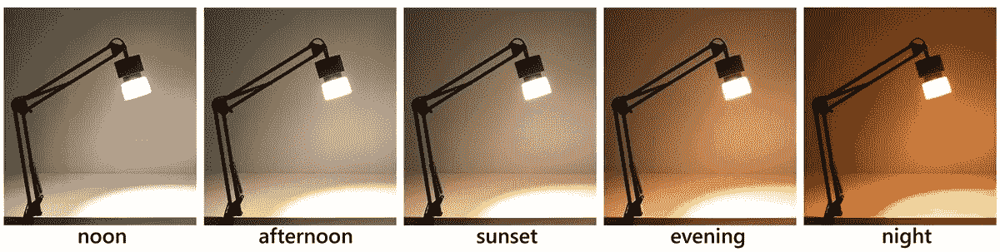
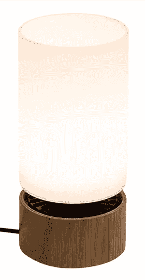

# mySun:照明的特斯拉跑车

> 原文：<https://medium.com/hackernoon/mysun-the-tesla-roadster-of-lighting-25281b89cefa>

一家小型湾区初创公司正在改变我们对照明的看法。

内的[阳光已经认识到](http://www.sunlightinside.com/)[蓝光](https://hackernoon.com/whats-so-bad-about-blue-light-b04e13a801df)在白天是必不可少的，但在晚上却是有害的。他们刚刚发布了 [mySun](https://www.kickstarter.com/projects/1693522222/sunlight-lamp-mysun-desk-lamp-for-vision-and-healt) ，这是首批可以全天自动改变颜色和亮度的照明产品之一，以支持生产力和睡眠。

> 只要插上电源并打开它，mySun 就会根据太阳的日常模式自动开始变化。

让 [mySun](https://www.kickstarter.com/projects/1693522222/sunlight-lamp-mysun-desk-lamp-for-vision-and-healt) 大放异彩的是它不需要任何复杂的设置。也不需要 app。只要插上电源并打开它，mySun 就会根据太阳的日常模式自动开始变化。

Watch [on YouTube](https://www.youtube.com/watch?v=-jO-KdMJEAY). Subscribe to [my channel](https://www.youtube.com/c/gregyeutter?sub_confirmation=1).

# 智能照明的身份危机

[飞利浦 Hue](http://amzn.to/2F3LxQZ) *和 [LIFX](http://amzn.to/2F4yeQj) *向世界展示了照明不仅仅是简单的照明源。突然间，你可以通过地球另一边的一个应用程序让你的灯光变成一百万多种颜色中的任何一种。

> 对于 99%的人来说，改变颜色或远程控制照明的能力不值得付出努力和成本。

Hue 和 LIFX 都是在大约六年前推出的。从那以后，我们没有看到成本或复杂性的重大降低。如果你想在家里安装一套色调系统，你需要支付的费用大约是普通 LED 照明的十倍。设置仍然需要技术知识，而不仅仅是简单地更换灯泡。

智能照明有有效的使用案例，但对大多数人来说，价值主张并不存在。对于 99%的人来说，改变颜色或无线控制照明的能力不值得付出努力和成本。

# 幼年时期的昼夜节律照明

你可能熟悉埃隆·马斯克为特斯拉制定的[绝密总体规划](https://www.tesla.com/blog/secret-tesla-motors-master-plan-just-between-you-and-me):

> 制造跑车
> 
> 用那笔钱造一辆买得起的车
> 
> 用那笔钱去造一辆更实惠的车
> 
> 在做上述工作的同时，还提供零排放发电选择

mySun 之于照明，就像特斯拉跑车之于汽车。又贵又有异国情调。但它代表了一个突破性的想法，将改变照明的未来。

# 简单、华丽、健康的灯光

《我的太阳》为什么要卖[250 美元](http://www.sunlightinside.com/products/)？你可能会认为，即使是飞利浦色相也是比较划算的。由于我的家配备了色调灯，我有资格比较这两个系统。

与色调一样，mySun 混合了几种不同的 LED 颜色，以生成不同色调的白色。但是 mySun 生产的[色彩更丰富、更鲜艳](http://www.sunlightinside.com/light-and-health/comparing-philips-hue-natural-light/)——这意味着人和物体在它的光线下看起来更好。根据制造商的说法，这是目前你能得到的最接近自然光的。

mySun 也比任何色调的灯泡都亮。这意味着你可以在白天获得充足的蓝光——即使你在户外的时间不多。

到了晚上，所有的蓝光都会自动消失，即使 mySun 还开着。我很惊讶地得知，我的太阳可能真的很亮，但仍然不会发出蓝光。

相比之下，要使色调完全不发出蓝色，它必须非常暗，基本上是红色。比普通灯泡更像夜灯。在 Hue 的非蓝色背景下读书几乎是不可能的。

除了基本的控制，Hue 还需要安装一个应用程序和一个连接到互联网路由器的集线器。即使在所有这些设置之后，Hue 并没有真正的自动昼夜照明模式。你必须购买遥控器或使用应用程序来手动改变照明模式。

相比之下，mySun 会自动变色，你只要插上电源，打开它就行了。室内阳光将光线预编程到你的时区。太亮还是太暗？只需相应地调节连接的调光器。就这么简单。

# 我的建议

如果你买得起，你就不会对 [mySun](http://www.sunlightinside.com/products/) 不满。mySun 的简单性、功能性和光线质量远远优于目前市场上的任何其他产品。

如果你在一个光线很差的办公室工作，尤其是远离窗户的地方，你应该说服你的雇主为你购买这个。250 美元的购买比由于光线不足而损失的生产力要少得多。

mySun 也非常适合家庭使用。你可以在你的办公桌和其他任务区域使用它来支持健康的能量、情绪、新陈代谢、视力和睡眠。

bottled sunshine Table Lamp

Sunlight Inside 还制作了一款台灯，即[瓶装阳光](http://amzn.to/2H2T2UN) *，它将相同的功能放在了不同的外形中。瓶装阳光提供了与 mySun 相同的好处，但它可能更适合放在你的床头柜和其他非任务区域。

mySun 和瓶装 sunshine 在加州由实木和玻璃手工制作而成。两者都被设计为可以使用 10-20 年，不需要更换灯泡。我相信你会享受其中的每一分钟。

mySun 是照明未来的一瞥。通过支持内心的阳光，你让未来成为可能。

**感谢阅读。**如果你喜欢这篇文章，请点击上面的拍手按钮，并与你的朋友分享。我也鼓励你订阅我的 [YouTube 频道](https://www.youtube.com/c/gregyeutter?sub_confirmation=1)，获取更多数字健康内容。

我没有得到阳光内部或任何其他方面对这次审查的补偿。这里提出的观点完全是我自己的。我可能会从点击标有*的代销商链接后的购买中获得一小笔佣金。