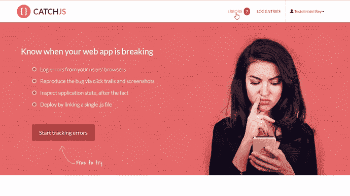

# 异步错误处理:搬起石头砸自己的脚

> 原文：<https://medium.com/hackernoon/n%C2%B2-ways-to-shoot-yourself-in-the-foot-error-handling-with-async-await-and-promises-87f30cda1681>

浏览器现在支持通过`async` / `await`进行异步调用。这很好。它本质上是对承诺的语法支持。

不幸的是，所有这一切的错误处理并不那么好。


*Real footage of the async error delegation mechanism*

总而言之，我们要处理的是:

*   2 非等价方式抛出错误。
*   捕捉局部错误的两种基本相同的方法。
*   从 0 到 1 全局捕捉承诺错误的方法。
*   一种抛出这些机制都无法捕获的错误的方法。

呃。

我们怎么会有这样的结局？当向系统添加新特性时，如果每个特性数 n 都必须与所有现有的 n-1 个特性进行交互，那么特性间的交互将增长 O(n)。因此，对于功能的线性增长，你会得到复杂性的二次增长。这实际上解释了为什么大多数大型软件项目会失败，以及为什么理清特性如此重要。异步错误处理也是如此。我们从简单的回调函数开始。后来事实证明，试镜是一个烂摊子，所以我们用承诺解决了所有这些问题。后来发现 Promises 一塌糊涂，所以我们用 async/await 解决了所有这些问题。

因此，让我们深入了解当前的混乱局面。

# 在本地处理承诺中的错误


> *承诺，有时会违背
> ，有时会违背
> ——在 WHATWG 邮件列表的帖子中的笔画*

# 抛出的错误

当异步函数中抛出错误时，可以用`try {} catch {}`捕捉它。这正如你所料:

```
**async** **function** **fails**() {
    throws Error();
}

**async** **function** **myFunc**() {
    **try** {
        **await** fails();
    } **catch** (e) {
        console.log("that failed", e); 
    }
}
```

这是一种语法糖，适用于你之前可能对承诺做过的事情:

```
fails().catch(e => {
    console.log("That also failed", e); 
});
```

事实上，无论你在哪里使用关键字`await`，你都可以去掉`await`，进行传统的`.then()`和`.catch()`调用。这是因为`async`关键字隐式地为它的函数创建了一个`Promise`。

这两者之间唯一的区别是`catch()`的回调有它自己的执行上下文，也就是说，变量作用域像你期望的那样工作。

# 被拒绝的承诺

对于承诺，除了使用 throw 之外，还有另一种抛出错误的方法。可以调用`reject()`:

```
**function** **fails2**() {
    **return** **new** Promise((resolve, reject) => {
        reject(**new** Error());
    });
}

**async** **function** **myFunc2**() {
    **try** {
        **await** fails2();
    } **catch** (e) {
        console.log("that failed", e); 
    }
}
```

传递给`reject()`的错误可以用`try {} catch {}`和`.catch()`方法捕捉。所以你有两种方法抛出错误，两种方法捕捉错误。这比我们希望的要复杂，但至少两种捕捉错误的方法都会捕捉到任何一种抛出错误的方法，所以这里的复杂性并没有想象中的那么糟糕。

# 在不同的调用堆栈中引发错误

尽管会有更多的麻烦。如果你自己在创建`Promise`，你可能会使用一个`setTimeout()`或者一个`setInterval()`，或者在某个操作完成时以某种方式调用一个回调函数。这些回调将从不同的调用堆栈中调用，这意味着抛出的错误将传播到不是您的代码的地方。

考虑这个例子:

```
**function** **fails3**() {
    **return** **new** Promise((resolve, reject) => {
        setTimeout(**function**() {
            **throw** **new** Error();
        }, 100);
    });
}

**async** **function** **myFunc3**() {
    **try** {
        **await** fails3();
    } **catch** (e) {
        console.log("that failed", e); //<-- never gets called
    }
}
```

这里产生的错误永远不会被`try {} catch {}`捕获，因为它是在不同的调用栈上抛出的。使用`.catch(() => {})`方法也会有同样的问题。

让错误在这样的回调中传播的方法是使用 reject()函数，如下所示:

```
**function** **fails4**() {
    **return** **new** Promise((resolve, reject) => {
        setTimeout(**function**() {
            reject(**new** Error());
        }, 100);
    });
}

**async** **function** **myFunc4**() {
    **try** {
        **await** fails4();
    } **catch** (e) {
        console.log("that failed", e); //<-- this gets called
    }
}
```

这大概是最初引入拒绝/解决范式的主要原因。

# 旁注:为什么拒绝/解决有点糟糕。

在 promise 中调用`reject(new Error())`很像做`throw Error()`，除了一个主要的区别:它只是一个函数调用，所以它不会像`throw`那样中断执行流。这意味着您可以编写矛盾的代码，既有`reject`又有`resolve`的，就像这样:

```
**function** **schrödinger**() {
    **return** **new** Promise((resolve, reject) => {
        reject(**new** Error());
        resolve("great success");
    });
}
```

这里`reject()`和`resolve()`都将被调用。那么哪个会赢呢？答案是先调用*再调用*的函数。

现在看看这个怪人:

```
**function** **schrödinger2**() {
    **return** **new** Promise((resolve, reject) => {
        **throw** resolve("huh"); //<-- this throw is executed
    });
}
**async** **function** **callAsync**() {
    **try** {
        **await** schrödinger2();
    } **catch** (e) {
        console.log("caught error", e);//<-- yet, this isn't reached
    }
}
```

这里的 promise 只有一行代码，一个 throw 语句。然而，`try {} catch {}`从未被触发。这是因为调用了 resolve，规则仍然是先调用*再调用*的获胜。所以 throw 被执行了，但是它被运行时默默地吞掉了。这势必会造成无尽的困惑。

出现这些问题是因为`resolve()`和`reject()`几乎是`return`和`throw`的重复。我认为我们拒绝/解决的唯一原因是能够跨越调用栈边界移动错误。但这是一个平庸的解决方案，原因有几个。它只移动您期望的错误，因此，例如，一个意外的 NullReferenceException 不会跨边界移动，除非您自己用它显式调用`reject()`。此外，它复制核心语言特性的事实会导致问题，如上所述。

这个有更简洁的设计。在人们开始在 [JavaScript](https://hackernoon.com/tagged/javascript) 中谈论 C#之前，它就已经有了`async` / `await`。在那里，异步回调中抛出的异常被捕获，然后重新抛出，以便它们传播到正在等待异步操作的站点。JavaScript 可以通过为 setTimeout 和 setInterval 提供新的错误语义来实现这一点，我们可以抛弃这种`resolve` / `reject`的东西，转而使用`return` / `throw`。这也将削减 90%的承诺规格。

# 全面处理承诺中的错误

所以我们知道如何用`try {} catch {}`和类似的机制捕捉错误。当您想要为所有未处理的错误设置一个全局的捕获所有处理程序时，例如将这些错误记录到服务器中，该怎么办呢？

那么，你怎么知道一个承诺中的错误是否没有被处理呢？在处理承诺时，你无法知道一个错误是否会在未来的某个时间得到处理。该承诺可能会调用`reject()`，10 分钟后可能会出现一些代码，并对该承诺调用`.catch(() => {})`，在这种情况下，错误将被处理。正因如此，像 Q 和蓝鸟这样的 Promise 库中的全局错误处理程序被命名为`onPossiblyUnhandledRejection`，这是一个恰如其分的名字。在 native Promises 中，这个函数被称为`onunhandledrejection`，但是他们仍然只能判断到目前为止是否有拒绝未被处理*。*

*您可以像这样设置全局处理程序:*

```
*window.onunhandledrejection = **function**(evt) { /*Your code*/ }*
```

*或者:*

```
*window.addEventListener("unhandledrejection", **function**(evt) { })*
```

*这里的`evt`是一个类型为 [PromiseRejectionEvent](https://developer.mozilla.org/en-US/docs/Web/API/PromiseRejectionEvent) 的对象。`evt.promise`是被拒绝的承诺，`evt.reason`保存传递给`reject()`函数的任何对象。*

*这一切都很好，除了:除了 Chrome，没有人实现它(嗯，Chrome 和基于 Chrome 的浏览器)。它即将登陆 Firefox，估计也将登陆 Safari 和 Edge。但还没有。更糟糕的是，对于这些浏览器来说，除了不使用原生 Promises，而是依赖于像 Q 或 Bluebird 这样的库之外，没有什么好的办法。希望对这些浏览器的本地支持将很快到来。*

# *跟踪承诺中的错误*

*你如何跟踪发生在你的网站上的 JavaScript 错误？为此，您可以使用 [CatchJS](https://catchjs.com) ，这是一个 JavaScript 错误跟踪服务。它用一个全局错误处理程序装备浏览器，然后记录发生的任何未捕获的错误。部署只需放入一个脚本文件即可。*

```
*<script src="//cdn.catchjs.com/catch.js"></script>*
```

*这样，未捕获的错误会被记录下来，还有各种遥测数据，包括截图和点击轨迹。*

**

*由于将来是否会处理承诺拒绝的模糊性，CatchJS 不会将其自身附加到 onunhandledrejection 处理程序。如果需要，您可以手动设置这种转发。*

```
*window.onunhandledrejection = **function**(evt) {
    console.error(evt.reason);
}*
```

*CatchJS 将检测 console.error，因此这些错误将被记录到您的远程永久日志以及开发人员控制台中。*

***圣雄甘地说，违背诺言是对真理的卑鄙投降。话说回来，他对异步错误处理一无所知。***

*【catchjs.com】最初发表于[](https://catchjs.com/Docs/AsyncAwait)**。***