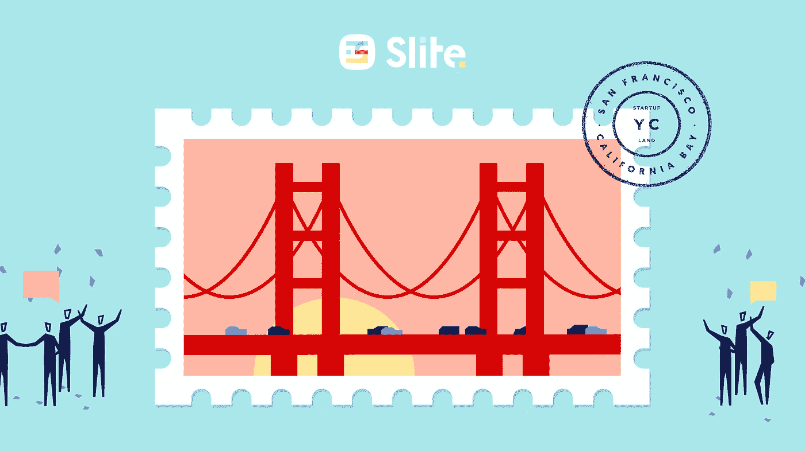
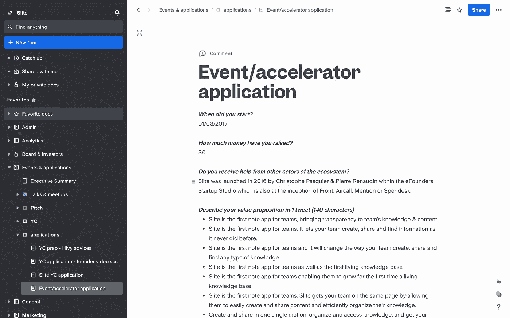

# 搞定你的 YC 申请

> 原文：<https://medium.com/hackernoon/nail-your-yc-application-29ed0fedf2cd>

*嗨我是克里斯，* [*Slite*](https://slite.com) *创始人！*

**是团队写作的新方式。它取代了*[*Googl*](https://hackernoon.com/tagged/google)*e 文档，让协作和共享变得轻而易举。**

*大约五个月前，Slite 一岁了，我们还在私下测试，正准备发布。大约在那个时候，我们申请了 Y Combinator 的 W18 批次，被录取了，现在离演示日还有一个月。下一批*的申请已经开放——如果你正在考虑申请，这里有一些小技巧，希望能帮到你。**

*另外，[这是让我们进入](https://slite.slite.com/public/share/note/Ld8h852M1aopcjgDpSTiW7)的应用程序，如果你好奇的话，就来看看吧！*

**

# *书面申请*

*YC 的申请表格是一个漫长的过程，但无论结果如何，都是 100%值得的——我的第一家公司拒绝了我们两次，但每次申请过程都很有帮助。*

*首先，因为它让你能够阐明自己的价值主张，让你问自己一些敏感的问题:你的关键见解是什么，是什么驱动着你的团队等等。*

*第二，因为你发出的大多数其他申请将基于类似的模型——这是你将以某种方式、形状或形式回收的材料。创建一个 Slite 频道，编写一个应用程序模板，并在每次启动新应用程序时复制它😉 💪。*

**

# *写申请的一些建议:*

*   *至少拿出半天时间和你的合伙人一起工作。*
*   *超级直截了当，尤其是视频。*
*   *废话少说。硅谷最优秀的人倾向于回避废话，YC 合伙人就是其中的一部分。*
*   *让导师和校友来回顾一下，他们会帮助你避免一些明显的陷阱。*
*   *提前一点发送:每个人都在悬崖日期发送，这导致了无用的压力。此外，我很确定合伙人会在截止日期前开始通读，这样你就有机会成为他们的第一批读者。*

# *面试*

*申请结束后，你会收到一封电子邮件，要么说 YC 想见你，要么说你没有参加面试。*

*(需要说明的是:在听到消息的一周前，我居然收到了要求视频通话的消息。那是为了说几个不清楚的位，所以我真的不觉得这些“边缘案例”值得任何解读。其实我们在[站](https://getstation.com/)的朋友，面试前没有接到任何电话，也进去了。)*

# *关于准备面试的一些建议*

*你只有十分钟的时间和 YC 合伙人在一起:这是一个很小的表达自己的空间。唯一的解决办法就是做好充分的准备。*

*   *反复排练敏感的问题( [iPG](https://jamescun.github.io/iPG) 可以帮忙)*
*   *让导师和校友挑战你的练习*
*   *冲洗&重复，直到你对每个答案都感到敏锐和舒适*

# *面试的日子:*

*   *你收到申请回复的日期是提前知道的，所以要准备好挑选适合你的位置(我建议尽早，以避免无谓的压力)。*
*   *采访是在山景城 YC 办公室的小房间里进行的。你被邀请在标志性的橙色大房间里等候，在节目期间，晚餐在这里举行。如果可以，避免在那里等太久:有太多其他紧张的团队，这可能会传染。*
*   *你将会被 3 到 5 个合伙人面试。我最好的建议是:**不要解释他们的行为。**这毫无意义，因为十分钟的时间太少了，每个伙伴都有不同的风格，你无法知道结果。实际上，我从一位被采访了三次的校友那里得到了这个建议，他从来没有猜对结果。*
*   *难以置信的合成。你只有 10 分钟的时间，需要展示你对每个相关主题都有清晰的愿景。*
*   *控制对话:你不想花 5 分钟谈论不相关的话题。*

> **对于 Slite 来说，一个常见的挑战是将 Evernote 作为竞争对手，因为我们经常将自己标榜为“*团队的笔记应用*”。thing Slite 不是 Evernote 的替代品，因为他们主要关注个人使用，而* ***Slite 的核心关注点是团队*** *。这个问题在采访中确实被提出来了，这是让谈话重新回到中心的关键，解释了 Slite 对内容的影响就像 Slack 对沟通的影响一样，因此取代了 Google docs 和 Confluence 等工具。**

*   *这并不意味着你应该避免你的弱点:那些实际上是你必须有最清楚答案的。*

*一旦面试结束，最棒的是你会在当天晚上得到答案。如果答案是否定的，你会收到一封电子邮件；如果答案是肯定的，你会收到一个合作伙伴的电话。*

*如果答案是否定的:不要想太多，只有 1%左右的公司能进入。对我来说，这是第二次拒绝，这只会促使我做得更好，并在第三次得到肯定。*

*如果答案是肯定的:庆祝并开始定义你的演示日目标，预订你的第一个办公时间，YC 刚刚开始！*

*祝你好运，无论结果如何，保持下去！*

*小奖励:为了让你第一次感受 YC，我们实际上为我们的 batchmates 制作了一个如何体验 YC 的 Slite 模板😉→[https://slite.com/templates/how-slite-does-yc-w18](https://slite.com/templates/how-slite-does-yc-w18)*