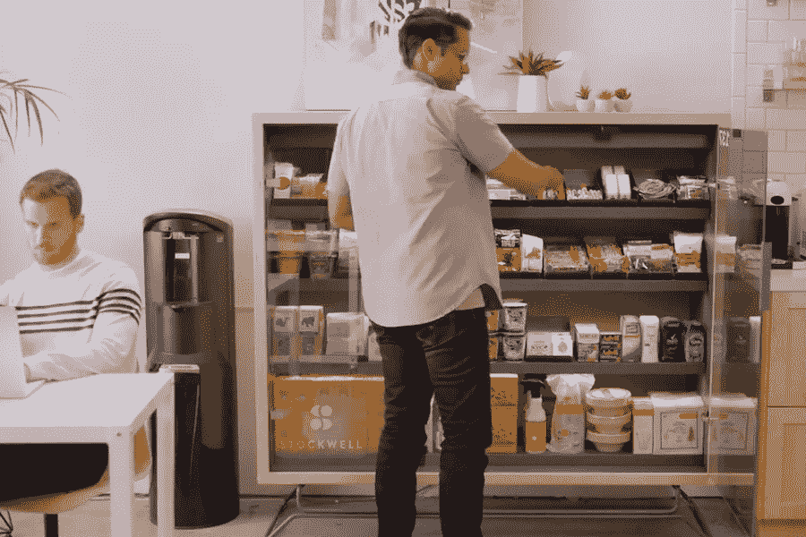
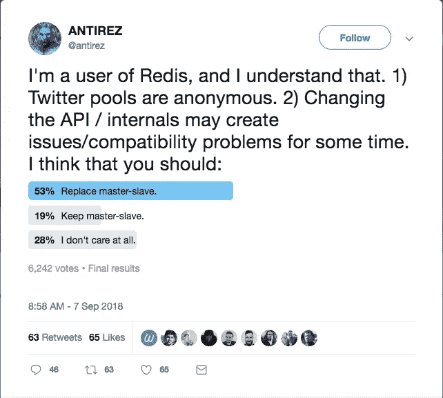

# 一个名字怎么会破坏你的产品呢？

> 原文：<https://medium.com/hackernoon/naming-cost-ea19abbc2648>

对你一直在做的事情的名字产生依恋是可以理解的。但是这种依恋会影响你的判断。

我们正在建立一家初创公司，提供专注于小变化的减肥辅导。由于我们的客户与教练合作，我们最初称我们的产品为 Tandem。这个名字起作用了，我们获得了一个合理的域名(jointandem.com)，我们对此很满意。但是在我们发布之前，我们意识到可能会有商标问题(例如 Tandem Diabetes 是一家在 2B 上市的公司)，所以我们决定重新命名该产品。

糟透了。我们知道我们想从一个名字中得到什么——容易说，容易拼写，一个好的域名——但是我们想出的每一个想法似乎都很无力。我们询问了我们的朋友和顾问对我们提出的一些替代名称的看法，得到的回应令人失望:

> 老实说，所有这些都很糟糕
> 
> 对名单上的任何一个名字都不感冒。
> 
> 我认为这个名字应该是积极的、有抱负的和/或鼓舞人心的

尽管我们很喜欢 Tandem，但我们必须找到一个合适的新名字。

# 调查偏好是必要的，但还不够

评估一个名字的一种方法是询问其他人，但是对这个名字的依恋会损害你正确征求和评估反馈的能力。去年 9 月，一家名为 Bodega 的初创公司启动了一项愿景，即在方便的地点部署智能自动售货机。[公众对这个名字、品牌和业务的反应](https://www.washingtonpost.com/news/food/wp/2017/09/13/bodega-an-unmanned-pantry-box-has-already-become-americas-most-hated-start-up/?utm_term=.cb280350db02&noredirect=on)很快，该公司很快[收回了](https://blog.bodega.ai/so-about-our-name-aa5bff63a92d)的说法，并最终更名为斯托克威尔。

A Stockwell (formerly Bodega)

有趣的是，该公司实际上已经考虑到 Bodega 不会受到欢迎的可能性，并进行了品牌研究和调查，以确定情况是否如此。在[的一篇文章](https://www.fastcompany.com/40466047/two-ex-googlers-want-to-make-bodegas-and-mom-and-pop-corner-stores-obsolete)中，他们的首席执行官声称 97%的受访者不关心这个术语。为什么调查和公众的强烈反对之间会有这样的脱节？几个可能的原因:

1.  这项调查设计不当。似乎很有可能的是，你如何询问“Bodega”会极大地扭曲结果。例如，我希望询问人们对“Bodega”这个公司名称的看法，会比询问他们对一家公司的看法产生更积极的反应，这家公司的愿景可能导致被称为“Bodega”的 bodegas 的衰落。
2.  调查对象不对。他们声称他们调查了社区的不同样本，但这可能不具有代表性。或许他们也应该了解一下其他受众的想法，比如媒体和批评他们的有影响力的人。
3.  一些与这个名字无关的因素导致了激烈的反对。就在发布前几周，备受指责的初创公司 Juicero 已经关闭了。公众对硅谷的情绪已经准备好用浮夸的说法抨击初创公司，自动化对就业的影响是(并将继续是)一个令人担忧的问题。

在不知道实际发生了什么的情况下，真相可能介于两者之间。如果你在寻找一个名字，你可能会偏向调查问题，以一种有利的方式呈现这个名字。也许你会回避调查“敌对”的观众，或者回避深入探讨一些被表达出来的关注点。你几乎肯定会低估公众情绪风险——毕竟，你的公司和你的产品将改变世界，为什么要担心那些反对者呢？

如果你担心你可能会有一个盲点，并试图通过调查来降低这种风险，请小心。你的调查可能会有相同的盲点——偏差会一直下降。

# 切换到性能阈值

防止“我有偏见，因此所有的验证都可能有偏见”这种失败模式的一种方法是测量一些不太可能被动摇的东西，比如产品采用。几个月前，Redis 的创建者和维护者(@antirez)写了一篇关于他对 Redis 复制中使用“主/从”命名的[不满的文章。这不是一个新的讨论，无论是对于](http://antirez.com/news/122) [Redis](https://news.ycombinator.com/item?id=14770122) ，还是对于其他项目，比如 [Drupal](https://www.drupal.org/node/2275877) 、 [CouchDB](https://issues.apache.org/jira/browse/COUCHDB-2248) 、 [Django](https://code.djangoproject.com/ticket/22667) ，它们已经脱离了这个命名法。

尽管他最初为“主/从”辩护，但 antirez 继续就这个话题与人们进行公开和私下的接触，后来决定[将](https://github.com/antirez/redis/issues/5335)改为“主/副本”。他没有改变他个人对这个名字的立场(即这个名字没有问题)；相反，他被感觉到的影响所说服。他观察到很多善意的人对命名表示担忧，认为这会对 Redis 的使用产生负面影响。

One of antirez’s polls

如此公开地改变你对某件事的看法并不常见，但令我震惊的是他是如何证明这一点的。他从社区收集定性和定量的反馈，尽管他观察到双方都表达了强烈的偏好，但最终影响他的是对采用的影响。他的决策计算很简单:重命名需要一些努力，并且只有当它以最小的量提高采用率时才是合理的。在这种情况下，他估计 10%的 Redis 用户对当前的命名感到不舒服，剩下的 90%不会受到重命名的影响。产品采用是一个独立的、可衡量的维度，antirez 不愿意在这个维度上妥协，所以即使他自己对“主/从”名称的依恋持续存在，这也是不相关的。

# 重命名串联，目的是

在我们众多平淡无奇的名字中，我们的朋友最喜欢“Amble”这个名字:在 19 个回答中，超过 53%的人选择 Amble 作为他们喜欢的名字。我们认为这个名字不错，但是担心“慢”的含义是有害的，所以我们转向了我们的目标受众。

我们使用 Mechanical Turk 招募了 101 名调查对象:年龄在 18-50 岁的超重并表示有兴趣减肥的美国人。当被问及同样的偏好问题时，只有 19%的人倾向于 Amble。意向，我们候选名单中剩下的名字之一，有 73%的几率被选中。我们的朋友、顾问和目标受众之间收集的不同数据给我们留下了深刻的印象。

虽然对 Amble 的反应可能会让我们感到惊讶，但提供的理由并没有。

> 出于某种原因，我想到有人蹒跚而行…这对于超重的人来说并不好
> 
> 安布尔让我想起了跌跌撞撞。如果我正在尝试节食，我不想失败。
> 
> 听起来像是老病人的病。
> 
> 我一直很胖，这个名字会让我觉得很懒。
> 
> 安布尔听起来漫无目的，就像你只是一种徘徊。听起来不像是专注于目标。

从某种意义上说，这既是我们与众不同的观点，也是我们的盲点:我们相信小的、可持续的变化会打败大的、不可持续的变化，一个沮丧的节食者会明白缓慢而稳定会赢得比赛。我们没有立即否决 Amble，因为我们认为它很好地参考了该计划的一个方面(一种较慢的方法)，但未能预见到对减肥有兴趣的人会产生多大程度的不满。

偏好数据是有帮助的，但决定交易的是这个名字如何影响采用。我们对相同的观众进行了第二次不同的抽样调查，针对一个模仿流行的现任者的减肥计划，展示了我们产品的完整描述。

Example survey question

在 n = 89 的情况下，我们观察到回答者在 35%的时间里选择了“漫步”,而在 54%的时间里选择了“意图”。在这些调查之前，我们对“漫步”和“意图”基本上没有区别，但是数据似乎表明，从偏好和性能的角度来看,“意图”都更好，所以这个决定是显而易见的。

回想起来，这对于我们来说是一个相当容易的决定，并不完全类似于 Bodega 和 antirez 所经历的公共学习和决策。也就是说，我们的调查结果确实有助于暴露我们的一个盲点——假设喜欢小变化的人会对结果有足够的耐心(因此不会介意好好“散步”)——并且我们已经根据这些更新的信念做出了产品改变。

尽管最初寻找新名字会很麻烦，但以我的经验来看，每次我给产品重新命名时，这个名字最终都会成功。除非这个名字特别难听，否则你会越来越喜欢它。毕竟，我们赋予名字的价值和意义往往是其他的东西，而“其他的东西”不可避免地会随着时间的推移而积累。

*感谢阅读！你可以在我们的* [*意向博客*](https://www.intentapp.com/blog) *上找到更多这样的文章。*