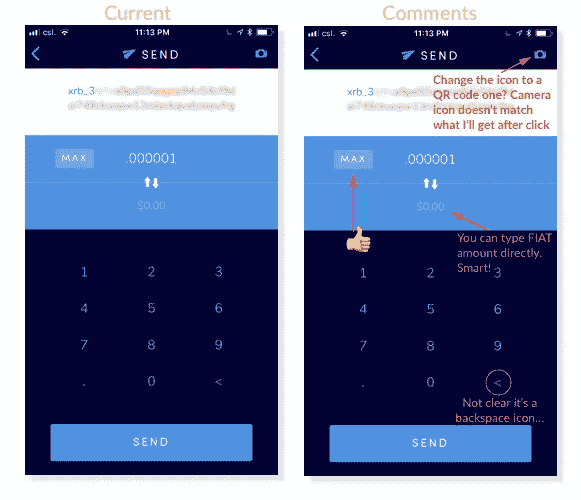

# Nano (beta) iOS 钱包——UX 评论

> 原文：<https://medium.com/hackernoon/nano-beta-ios-wallet-ux-review-2462c22d8cf8>

用户体验是大规模采用的关键。

我刚刚拿到了 Nano iOS 钱包的测试版，作为一名用户体验人员，我忍不住写了这篇评论，并与您分享我的想法。

声明:本文不是关于加密货币本身，也不是其背后的技术和价格。纯粹是从用户体验角度的 app 评测。

毕竟我们希望这个 app 在每个人手里；最终目标是世界上任何人最终都会使用它，对吗？

# 1.欢迎屏幕

Nano Wallet — Welcome Screen

*   首先，欢迎信息:“欢迎来到 Nano”，对我来说听起来有点简单，好的，它完成了任务，它欢迎你。但是，这真的是纳米的全部吗？[Nano 团队的愿景](https://vimeo.com/253563861#at=4)比“欢迎来到 Nano”要远大得多，我很想在打开这个应用程序时感受到这一点。标语和/或解释性句子可以增加上下文。请记住，应用程序上的每一个屏幕都是一个传达产品是什么以及它将如何让用户的生活变得更好的机会。
*   有很多空白——[不一定是坏事](http://blog.teamtreehouse.com/white-space-in-web-design-what-it-is-and-why-you-should-use-it)——它让用户专注于行动号召。在稍后的阶段，这个空白区域可以填充透明的背景图像或与加密货币和即时交易工具相关的插图。这可以帮助用户了解产品的预期。虽然不是必须的。
*   号召行动是明确的，“开始一个新的钱包”或“我已经有一个钱包”。这听起来很简单。我们可以争论这些按钮看起来是否足够可点击:永无休止的争论[skeomorphism](https://www.interaction-design.org/literature/topics/skeuomorphism)vs[flat design](https://www.interaction-design.org/literature/topics/flat-design)；不管怎样，深色或深色会有帮助。用户测试将有助于发现用户是否很难弄清楚点击哪里。你会感到惊讶，用户会迷路…

Nano Wallet — Call to actions

*   按钮 [microcopy](http://goodmicrocopy.com/) 简单有效。在某些情况下，最好有一致的副本结构，如“我没有钱包”和“我已经有一个钱包”或“创建新钱包”和“同步现有钱包”。同样，用户测试将有助于找出哪一个效果最好。对我来说，这些动作是明确区分的，我们知道点击后会发生什么，这是这里最重要的事情。

> "好的缩微拷贝设定期望."— [重复行动号召有时会提高转化率。](https://medium.com/u/e4a3d7e9c438#5)
> 
> *   另一方面，在接纳用户时引入第三方应用程序是非常危险的，你不希望打破流程，让他们下载/注册一些东西，然后因为某种原因不再使用你的应用程序。
> 
> Nano Wallet — Suggested Apps
> 
> *   第二个提示要求用户确认备份。同样，在一些用户看来这可能是多余的，但是如果你不保存种子就继续下去，你可能会失去你的资金。就是这样。如果发生这种事，你只能怪自己。
> 
> 
> 
> Nano Wallet Seed Backup — Confirmation Prompt
> 
> # 3.主页钱包屏幕
> 
> 
> 
> Nano Wallet — Home Screen
> 
> *   在这个屏幕上，行动号召就在眼前，我真想马上点击那些“接收”和“发送”按钮；显然，只要你没有资金，发送按钮就会被禁用。
> *   我注意到“发送”按钮保持禁用，即使有时平衡是积极的...
> 
> 
> 
> *Nano Wallet Home Screen - Call to Actions
> 
> *   中心的空状态(即没有交易)可以用一个[副本和/或一个插图](http://emptystat.es/)来填充，通知用户稍后将在那里显示交易。空状态可用于[在](https://www.smashingmagazine.com/2017/02/user-onboarding-empty-states-mobile-apps/)用户“首次使用”期间对其进行培训和吸引。
> *   即使填满了，交易列表还是有点粗糙，但对于测试版来说已经足够好了。不过，我很想在某个地方看到交易的日期和时间——也许只有我这样想。
> *   我不认为这两个图标做的工作。对我来说，灰色给人的感觉是交易悬而未决。灰色是一种[中性色](https://uxplanet.org/create-emotion-with-color-in-ux-design-446a3766b085)，主要用于淡化元素(惯例，而非规则)。降低发送交易图标的亮蓝色对比度可以解决这个问题。
> 
> 
> 
> Nano Wallet — Transactions List
> 
> *   列表左边有一个空格，右边没有。这打乱了我的对称强迫症。
> 
> 
> 
> Nano Wallet — Home list padding issue
> 
> *   在稍后的阶段，考虑为传入和传出的事务添加[动画](https://www.pinterest.fr/pin/375206212681125691/?lp=true)和[声音](https://www.youtube.com/watch?v=OdkpYv1UNQc)。音频信号和微交互为产品增加了情感价值，还帮助用户了解环境并增加参与度。
> 
> ## 4.接受纳米
> 
> 
> 
> Nano Wallet — Receive Screen
> 
> *   标题直截了当，符合上下文，二维码带有纳米标志，与通常的二维码截然不同。突出 XRB 演讲的开头和结尾是非常聪明的，因为我们的大脑不擅长记忆一长串不相关的数字。通过颜色强调地址的一小部分将有助于我们记住一条信息。如果你像我一样，在发送密码时害怕地检查“接收地址”一百次。这是非常方便的！
> 
> 
> 
> Nano Wallet Adresses
> 
> *   如果改为“复制纳米地址”,“复制”按钮甚至可以更有上下文关系。我们也可以认为这个动作与之前的复制动作不一致(参见#2，创建钱包屏幕上的“点击以复制”)。一致性是用户体验的关键，用户在发现它的同时学习并记住如何与你的应用程序交互，如果有不同的方法来完成类似的操作，用户会感到困惑和不舒服。我打赌你会在那个地址容器上找到窃听器。
> *   点击“复制”后，一个提示给出了有用的动作反馈，我喜欢那个。反馈是用户体验的另一个重要支柱，因为它传达了交互的结果。
> 
> 
> 
> Nano Wallet — Address Copied Prompt
> 
> *   当点击共享图标(右上角)时，有一个有趣的共享功能，它会生成一个“纳米名片”(我刚刚编造了这个名字)。这是个好主意，我迫不及待地想给我的朋友发邮件。我不确定把整个 Nano 地址放在这里是否有意义，因为你不能选择、复制和粘贴它。也许二维码在这里就足够了？图像上也有一些对齐问题——没什么值得大惊小怪的。
> 
> 
> 
> Nano Sharing Card
> 
> ## 5.发送 Nano
> 
> 
> 
> Nano Wallet — Send Screen
> 
> *   在该屏幕上，您可以在顶部手动输入接收地址，或者使用 QR 码。我不认为相机图标是代表二维码扫描动作的最佳图标。[也许二维码扫描图标会更好？](https://www.onlinewebfonts.com/icon/137283)
> *   你也可以手动键入一个要发送的菲亚特金额，这将非常有用，直到 cryptos 接管世界，菲亚特消失(只是几年的问题:p)。
> *   我对键盘上的退格键也有疑问，我不确定"谷歌搜索通常不是个好东西。
> *   我测试了二维码阅读器，一切正常。
> 
> 
> 
> Nano Wallet- QR Code scanning
> 
> *   似乎有一个小错误与纳米发送的数量，在某些情况下，触控 ID 提示显示“发送 0 纳米？”甚至当我输入“. 000001”的时候。不过，看起来它只用了很少的量。
>     在能够发送我的. 000001 Nano 之前，我不得不多次关闭和打开应用程序…
> 
> 
> 
> Nano Wallet — Amount Bug
> 
> ## 5.其他屏幕
> 
> 
> 
> Nano Wallet — Transaction view (left) — Settings screen (right)
> 
> *   这里不多说了，我的评论就在上面的截图上。只有一点，你可以通过点击钱包主页上的交易直接进入浏览器。
> 
> ## 结论
> 
> *先令警报！*
> 
> 我知道这不是一篇技术评论，但我不得不说，我对该应用程序处理交易的速度印象深刻！你自己试试[你就会看到](https://www.youtube.com/watch?v=e7jLFroW_NE&t=2s)。
> 
> 此外，由于 **Nano 交易费用是不存在的**，我做了交易来来回回的测试，并保持我的初始值。多酷啊。对于其他加密货币，我可能会在几笔交易后破产——并且感到无聊……
> 
> 我希望我的评论能帮助核心团队和社区成长。
> 
> *   如果你想联系我，请在推特上给我发短信。
> *   以下是我的 Nano 地址如果你觉得这有帮助:
>     xrb _ 3 qqcix 3 z 6 q 9 p 7 nqjrkr 36 B4 qyyzpxmqk 3 fucrosnog 5t 81 cjhx 4 gt se 6 A8 dw
> 
> 