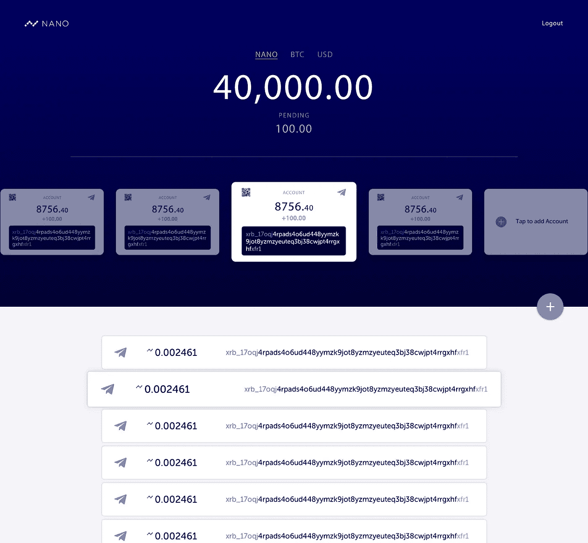

# Nano 更名公告

> 原文：<https://medium.com/hackernoon/nano-rebrand-announcement-9101528a7b76>

对我们宝贵的社区，

对于 RaiBlocks 来说，这是多事之秋，在 12 月份，社区出现了前所未有的增长。核心团队要感谢你们每一个人，是你们让这个社区首屈一指。正是你们的支持和参与，才使 RaiBlocks 成为如此令人激动的项目的一部分。

11 月，该团队聚集在一起讨论 Raiblocks 的未来，并制定进一步发展项目的计划。讨论的一个话题是名字本身(“是雷还是拉伊？、“把积木扔掉！，”“就叫它 Rai 吧！”).来自机构群体的反馈表明，可以进行改进以更好地引起公众和主流受众的共鸣。因此，我们的团队决定重塑品牌。

我们非常荣幸地宣布 Nano。

核心团队想要一个代表项目简单性和速度的名字，而 Nano 做到了这一点。新标志使用几个节点，在网络的块格设计上播放，连接形成一个“n”。所有社交媒体帐户都将更新，以反映名称和标志的变化。新网站是 nano.org 的。

所有资金、钱包和交易仍将照常运行。目前，地址将继续以 xrb_ 开头。未来，我们将引入 nano_ addresses，与当前的其他地址保持一致。我们知道你们中的许多人会对品牌重塑有疑问，我们将尽最大努力回答所有问题。

Screenshots of the iOS mobile wallet

Nano 的发布只是激动人心的 2018 年的开始！测试注册对[桌面钱包](https://zackshapiro2.typeform.com/to/EnfFJm)和 [iOS 移动钱包](https://zackshapiro2.typeform.com/to/uUk3mD)开放。

核心团队谨对您的支持表示诚挚的感谢！

谢谢你，

纳米核心团队