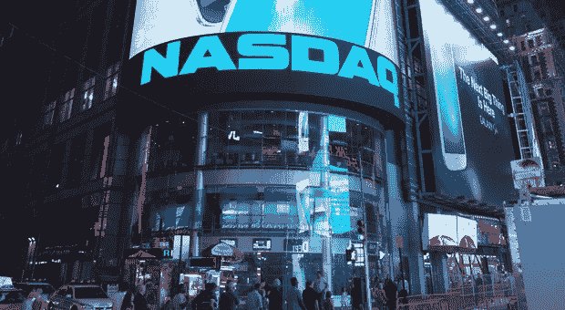

# 纳斯达克提议帮助比特币“合法化”

> 原文：<https://medium.com/hackernoon/nasdaq-offers-to-help-legitimize-bitcoin-8384cf98a2ba>

比特币行业想要/需要这种帮助吗？

纳斯达克公司(Nasdaq Inc .)正在接受帮助比特币在监管机构和机构投资者中获得合法性的挑战。在 SEC 第二次[拒绝](https://www.cnbc.com/2018/07/26/winklevoss-twins-bitcoin-etf-rejected-by-sec.html)文克莱沃斯双胞胎(加密交易所 Gemini)提议的比特币 ETF 后，纳斯达克与包括 Gemini 在内的几家公司的代表举行了一次[闭门会议](https://www.bloomberg.com/news/articles/2018-07-27/crypto-players-gather-as-nasdaq-bids-to-burnish-industry-s-image)，讨论加密货币合法化的计划。

双子座一直非常合作，试图解决加密领域的这些挑战。今年 4 月，交易所[聘请纳斯达克](https://www.ft.com/content/045682d8-4886-11e8-8ee8-cae73aab7ccb)对比特币和以太交易进行市场监控。他们还积极提议为美国虚拟货币行业创建一个自律组织

然而，尽管 SEC 和纳斯达克等机构进行了合作，但它们仍对比特币缺乏足够的监管以防止可能的价格操纵和欺诈活动感到担忧，特别是由于比特币的全球影响力和在不受监管的离岸市场的使用。

# 我们希望比特币成为证交会和纳斯达克需要的样子吗？

加密社区在这个问题上意见不一。一方面，我们认识到比特币交易所交易基金有可能推动加密货币价格飙升，并有可能让我们变得更加富有。然而，我们也认识到，根据美国证券交易委员会和纳斯达克的要求改造比特币，是在剥离分散自主的特质，而正是这些特质让比特币变得与众不同。

没有人想要欺诈或价格操纵，然而我们必须认识到，在任何真正的自由经济中，总会有这些特征的元素。比特币可能永远不会提供与股票相同的保护水平，因为股票由中央政府监管，而比特币是分散的，无法在全球范围内受到监管。

比特币 ETF 将向投资者提供交易基金的股份，防止他们面临拥有实际加密资产的风险。然而，比特币越是制度化和受到监管，投资者从该资产类别中获得的收益就越少。机构投资者希望参与 crypto，因为他们看到其他人在几天或几周内获得 30%-100%的回报。然而，市场监管越严格，在如此短的时间内获得这种回报的可能性就越小。

对于已经进入这一领域的密码纯粹主义者和散户投资者来说，过度的监控和欺诈保护措施可能只会给我们目前在交易所之间高效匿名交易硬币的灵活性制造更多障碍。

此外，比特币制度化的长期后果是，不在同一监管水平下的其他几十种有价值的货币可能在交易所中不那么突出(或者在最糟糕的情况下，可能会被摘牌)。

# 结论

2018 年带来了加密货币进化的一个阶段。曾经被网络朋克和自由主义者热情使用的利基技术现在正通过监管机构和金融机构融入主流社会的结构。这一进展将让更多早期采用者收获他们对加密货币价值的远见回报。然而，与此同时，加密空间将开始失去很多分散性和隐私性，而这正是它最初如此独特的原因。

我们能否或如何在机构认可和维护让加密变得特殊的原则之间找到正确的平衡，还有待观察。清楚的是，不管是好是坏，很快将获得 ETF 批准并最终在纳斯达克交易所上市的比特币将与 Satoshi 几乎 10 年前设想的截然不同。

*免责声明:这些是作者的观点，不应被视为投资建议。读者应该自己做研究。*

*原载于 2018 年 7 月 29 日*[*cryptopotato.com*](https://cryptopotato.com/nasdaq-offers-to-help-legitimize-bitcoin/)*。*