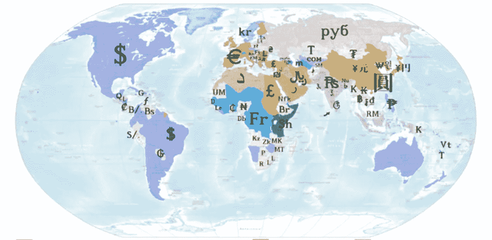

# 国家加密货币:没人真正想要的创新

> 原文：<https://medium.com/hackernoon/national-cryptocurrencies-an-innovation-nobody-wants-4666ce099da5>

Source: Wikimedia Commons

自从比特币和替代币出现以来，每年都会有大量关于国家加密货币发展的谣言和泄露，这种货币是专为单一国家使用而设计的公共区块链，与有问题的法定货币一起使用，甚至可能取代法定货币。理论上有两种方式可以实现这一点:独立开发商创造一种货币，这种货币变得如此受欢迎，以至于政府采用它，或者政府正在研究和开发自己的货币。后一种情况已经在一个案例中发生，尽管迄今为止还没有多少结果。值得一提的是，尽管这些货币可以是稳定的货币——与它们所联系的法定货币 1:1 挂钩的代币——但这不是一项要求。同样，许多 stablecoins 存在非国家密码。

公平地说，到目前为止，在区块链存在的九年中，没有这样的国家密码已经站稳脚跟或看到任何类似于广泛采用的东西，正如它发生的那样，许多预期的国家区块链尚未实现，也许永远也不会实现。本文将提出一个具体的原因，但首先我们将看看五种值得注意的现有、即将推出或推测的国家加密货币，以了解目前该领域的情况。

**冰岛:极光币**

极光币是世界上第一种国家货币，在 2014 年初比特币的第一个大规模认知阶段之后出现。冰岛政府长期以来一直对加密货币持敌对态度，但其公民对银行机构的信任度在[排名最低](https://icelandmonitor.mbl.is/news/politics_and_society/2016/03/15/one_in_ten_trust_iceland_s_bank_system/)，可能因此他们对区块链技术和加密货币的兴趣相对较高。一个采用“博德·松”(挪威神托尔的兄弟)名字的假名开发者，最初将货币开发为莱特币的克隆，并将一半的硬币分发给所有注册的冰岛公民。被广泛视为新奇事物的冰岛人，只有 10%声称拥有极光，价格迅速下跌。冰岛中央政府并不认可这种说法，事实恰恰相反——部长们公开表示，他们怀疑极光币[甚至可能是一个骗局](https://www.ccn.com/auroracoin-jumps-amid-panama-papers-controversy/) —这种说法有一些证据[确实存在](https://digiconomist.net/dogeconomics/auroracoin-exposed/)。

委内瑞拉:石油

该国总统尼古拉斯·马杜罗(Nicolás Maduro)领导的社会主义政府推出了自己的国家加密货币，并试图迫使供应商接受它，尽管完全缺乏接受 Petro 的国际交易所。这并不奇怪，因为创造这种货币主要是为了避免美国和其他国家对其经济的制裁。最初，这种货币被推销为某种稳定的货币，与国家石油储备的价值挂钩，有人建议，一旦在交易所上市，它将留给市场投机。

在一个奇怪的举动中，马杜罗政府在 2018 年 8 月将其国家法定货币玻利瓦尔贬值了 95%，并将其与石油挂钩。所以现在我们有了一种法定货币，它与一种加密货币挂钩，而加密货币(据说)与石油挂钩。这对于打破社会主义者不懂经济学的刻板印象并没有产生奇迹。Petro 可能是第一种官方的国家加密货币，但它并没有为其他人树立多少榜样。

**阿联酋:Emcash**

作为使迪拜成为一个与区块链高度融合的智能城市的更广泛战略的一部分，emCredit 设计了一种加密货币，将通过一款名为 emPay 的钱包应用程序向市民推出。[早在 2017 年 10 月](https://www.ccn.com/emcash-dubais-first-official-state-cryptocurrency/)就有报道，但具体细节很少，发射日期也没有确定。据推测，emCash 将充当与迪拉姆绑定的稳定硬币，销售点站制造商 Pundi X 正在开发允许商店加密购买的系统。该产品的推出似乎正在进行中，可能会在 2019 年推出。

**中国**

2018 年夏天，金融出版物发表了夸张的声明，称中国央行将推出自己的加密货币[，并且很可能在短期内超过比特币](https://news.bitcoin.com/bigger-than-bitcoin-experts-say-chinese-government-crypto-a-real-threat/)。有一些证据表明，PBOC 可能会朝着这个方向发展:经常有报道称，央行正在[测试一种潜在的加密人民币的模型](https://www.technologyreview.com/s/608088/chinas-central-bank-has-begun-cautiously-testing-a-digital-currency/)，最值得注意的是，他们在 2018 年 10 月发布了一份备忘录，讨论这种国家支持的货币的潜力，称[必须先进行小规模测试](https://news.8btc.com/xiao-lei-chinas-pboc-is-well-prepared-for-launching-a-state-banked-digital-currency)。这是中国政策实施的常见做法:在市一级，然后是省一级，最后是国家一级测试变化，应该会取得成功。反对这种说法的证据是，在如此小规模的测试中，没有任何新的消息出现。相比之下，该国的社会信用体系于 2014 年宣布，2017 年在济南开始测试，预计将于 2020 年广泛实施。鉴于这种货币和一种国家加密货币之间可能相似的规模，这表明我们在五年左右的时间里不会看到这样的推出。结合支付平台支付宝和微信支付在中国许多大城市几乎完全饱和的情况，我们完全有可能永远不会看到一个国家支持的加密元。

**俄罗斯**

“加密卢布”的前景可能更具投机性。自 2016 年以来，俄罗斯财政部和中央银行一直在讨论这个概念[，但自那以来，一直有相互矛盾的报道，从高级官员称这个想法为“技术流氓”，到弗拉基米尔·普京直接下令为此进行研究。今年，当国家杜马金融市场委员会宣布它正在考虑](https://cointelegraph.com/news/cryptoruble-how-stable-could-russian-national-stablecoin-be)[一种与卢布挂钩的稳定货币](https://cointelegraph.com/news/russian-state-duma-committee-considers-launch-of-central-bank-issued-stablecoin)时，关于这个问题的最具体的信息就出现了。同样，这并没有带来任何实质性的结果，而且与美元相比，人民币仍将是贬值的受害者，而美元已经有了许多稳定的货币。

**国家货币是未来吗？**

不，可能不会。我们仍处于区块链技术的早期生命周期，但迄今为止对国家货币的试验并没有激发信心，考虑这些货币的政府也没有明显的犹豫不决。美国美联储一再声明他们对国家货币的想法一点也不感兴趣，这并不令人惊讶。公平地说，大多数政府要么不想要国家密码，要么至少不想花费必要的资源来建立它们，也许暗示他们的研究点反对它。

至于公民利益，冰岛向我们表明，当他们的货币自由时，大多数人不接受，当其价格和数量崩溃时，市场强化了这一点。即使是加密货币的倡导者对这样的发展也没什么兴趣，因为它们与随着比特币出现的区块链技术的核心观点根本对立。事实上，为什么公民想要一种既有加密的复杂性和风险，又没有隐私或选择自由的好处的货币呢？考虑到所有这些，难怪对国家密码的大肆宣传已经急剧下降，原因很简单:很明显，没有人想要它们。