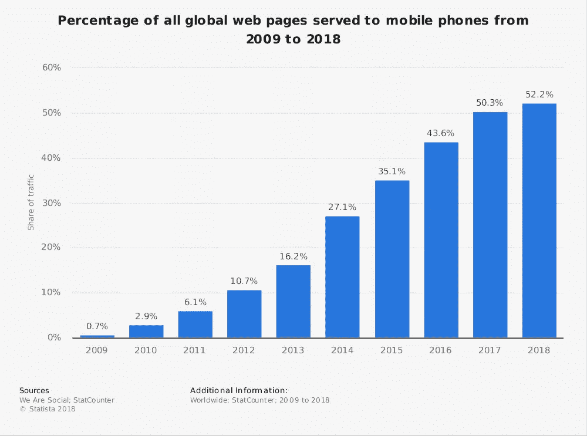

# 原生应用开发与混合应用开发

> 原文：<https://medium.com/hackernoon/native-app-development-vs-hybrid-app-development-dd83122a738c>

近年来智能手机市场的强劲增长导致 2018 年手机网站流量份额达到 52.2%。

高性价比智能手机的出现导致我们对智能手机的依赖性增加，因此开发者很难在本地移动应用开发和混合应用开发之间做出选择。

# UI/UX 在移动应用开发中的重要性

在我们研究本地和混合应用程序开发平台之前，有一个最重要的移动应用程序开发方面需要考虑，即您的客户。

您的客户最不关心支持他们正在使用的应用程序的技术或平台。

大多数用户关心的是他们能用这个应用做什么，而不是制作这个应用需要什么。所以[用户体验和用户界面](https://www.vtnetzwelt.com/services/ui-ux-design-services/)是任何移动应用最重要的方面。

79%的消费者在第一次尝试失败时会尝试一次或两次，而只有 16%的用户会尝试两次以上。

糟糕的用户体验阻碍了用户使用应用程序。

# 本地和混合应用—快速概述

# 原生应用开发

原生移动应用是为在单一特定平台或设备上使用而创建的应用，如[安卓](https://www.vtnetzwelt.com/services/mobile-app-development/android-application-development/)、 [iOS](https://www.vtnetzwelt.com/services/mobile-app-development/ios-development/) 、黑莓或 Windows。

本地应用程序是专门为特定的移动平台以其本地编程语言制作和编码的——

*   iOS (Objective-C 或 Swift)
*   安卓(Java，Kotlin)
*   Windows Phone (C#)

每个平台都有不同的指导方针，开发者需要坚持这些方针，因为它们在排版、图形风格、手势、视觉效果、数据输入等方面都有所不同。

# 混合应用程序开发

混合应用程序是作为单个应用程序创建的，可在 Android、iPhone 和 Windows 等多个平台上使用。

混合应用程序实际上是本机应用程序和 web 应用程序的组合。

这是一款可以在 iOS、Android、Windows 等多种操作系统上运行的单一产品。

它们看起来和感觉上都像一个本地应用程序，但实际上是由公司网站运行的。它由 HTML5、CSS 和 JavaScript 创建，基本上是一个基于网络的程序，放在本地应用程序外壳中，并连接到设备硬件。

# 原生应用开发的优势

# 流畅的表演

在原生移动应用程序开发中，我们必须使用针对每个操作系统的不同编程语言为不同平台编写代码。

因此，我们为每个平台专门制作了一个应用程序的不同版本。由于特定于该操作系统，它可以在其上平稳运行。

# 速度

考虑到该应用程序已经针对 iOS 或 Android 操作系统进行了优化，它将在速度和性能测试中获得更高的分数。

开发原生应用时，一切都要考虑，包括内存和电池的利用。

在原生应用程序开发中，实现对应用程序的手势支持和集成新功能也非常容易。

# 用户体验

对于移动应用程序来说，为了在安装后不被立即删除，留下好印象非常重要。

在原生应用中，感觉和体验要好得多，有更好的滚动，特定的手势识别，深刻的效果和动画，更有吸引力的元素等等。

# 数据保护和安全性

为了保护您的数据，需要充分利用硬件资源，而这只有在本地应用程序开发中才有可能实现。

# 灵活性

本机应用程序提供对内置设备实用程序的快速访问，如相机、GPS、日历、麦克风和智能手机的其他功能。

然而，混合应用程序开发在构建界面时有一定的局限性，因为一个应用程序将在多个平台上使用。

在原生应用中，没有任何限制，技术提供的一切都可以实现。

# 个性化

市场上有这么多不同屏幕尺寸的 Android 设备，只有本地应用程序开发是调整每个设备布局的方式。

# 原生应用开发的缺点

# 程序调试时间

与混合应用相比，原生应用需要更多的时间来开发。

为各种设备尺寸创建和实施设计，如各种 Android、iPhones、平板电脑等，需要更长时间来完成应用程序。

# 开发成本

开发者通常只专注于一个平台，无论是 iOS、Android 还是其他平台。在构建一个原生应用程序时，你需要的开发团队的数量与你想要创建应用程序的平台数量一样多。

多个开发团队意味着多个预算。此外，未来的变化或更新将导致成本乘以团队的数量。

# 混合应用程序开发的优势

# 降低开发成本

如果你以预算为中心，应用程序开发只需在所有平台(Android、iOS、Windows)上进行一次，你不需要雇佣不同的程序员。

# 维护

正如我们已经知道的，混合应用是包含在原生外壳中的 web 应用，因此它的内容可以根据您的需要或需要进行多次更新。所以，混合应用的维护成本很低。

# 更短的上市时间

你希望你的应用多快上线？由于市场竞争激烈，而且不止一个企业家提出了相同的想法，你希望尽快将你的应用介绍给目标受众。如果是这样的话，那么你应该选择混合应用。

# 混合应用程序开发的缺点

# 表演

混合应用在源代码和目标移动平台之间增加了额外的一层，尤其是混合移动框架。这可能会导致性能下降，但具体情况因应用而异。

根据马克·扎克伯格(脸书创始人)的声明——“作为一家公司，我们犯的最大错误是押注 HTML5 而不是 native。”脸书将他们的移动应用从 HTML5 迁移到 native，这清楚地表明了企业应用方面的显著差异。

# 排除故障

混合开发框架的额外一层也使得调试成为一件更大的事情。开发人员必须依靠框架本身来很好地与目标操作系统配合，而不会在应用程序中引入任何新的错误。

# 用户体验

与本地应用程序开发相比，很难在 Android 和 iOS 应用程序之间保持适当的用户体验。如果你更关注 iOS，Android 用户的用户体验将会恶化。

# 为什么选择原生 App 开发？

有许多不同的方向，你可以把你的应用程序。然而，要做出正确的选择，有必要了解它们之间的差异及其利弊，因为每个选项都有自己的优势和劣势，最终的决定必须取决于您的业务需求。

讨论仍然是相关的，因为对于这两种方法，有明显的优点和缺点。

此[链接](https://www.vtnetzwelt.com/mobile-application-development/native-app-development-vs-hybrid-app-development/)上有完整的文章