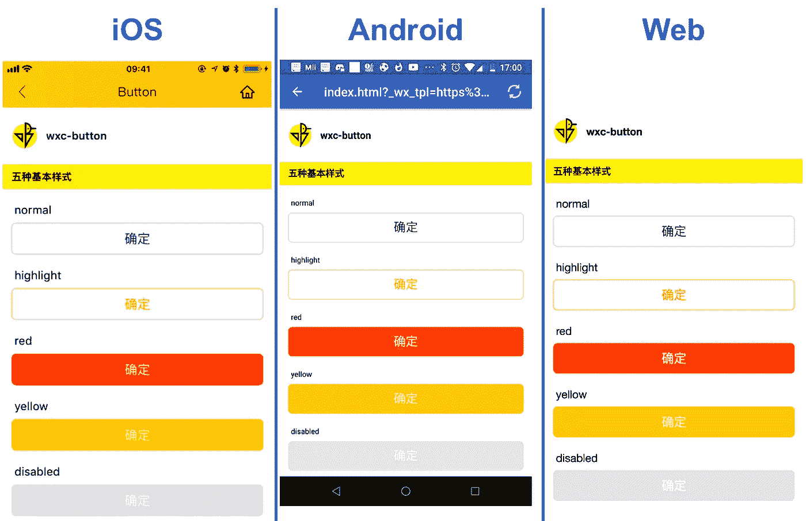

# 带有 Vue.js 的原生应用:Weex 还是 NativeScript？第二章

> 原文：<https://medium.com/hackernoon/native-apps-with-vue-js-weex-or-nativescript-chapter-ii-6d1776da090d>

六个月对于 Javascript 框架来说是一段很长的时间，所以 T2，我之前的文章需要更新了。我建议你在这之前先看看，因为我们会更深入地了解 Weex 和 NativeScript-Vue 背后的理念。

# 那么…有什么新鲜事吗？

两个框架都在被疯狂地开发，特别是通过改进六个月前 T4 指出的局限性。

Weex 有一个[新网站](https://weex.apache.org)，有更好的文档。CLI 工具(weex-toolkit)已经过改进，应该可以提供更流畅的开发体验。Weex 核心团队致力于向世界展示这个框架。此外，现在我们有了 UI lib [weex-ui](https://alibaba.github.io/weex-ui) 和一组名为“ [natjs](http://natjs.com) 的插件来访问本地功能。

**NativeScript-Vue** 到达[1.0 版本](https://nativescript-vue.org/blog/nativescript-vue-1.0-and-a-new-site/)！在 nativescript-vue.org[伊戈尔·兰杰洛维奇](https://twitter.com/igor_randj)在新项目网站上做得很好。v1.0 发布后，社区呈指数级增长，做出了一些贡献，包括由 Pascal Martineau 开发的新 [Vue-CLI 模板](https://github.com/nativescript-vue/vue-cli-template)。NativeScript 团队为 NativeScript-Vue 提供了强大的支持，为社区成员提供了多种激励措施，并根据 NativeScript-Vue 的特定需求调整了他们的工具。例如，你现在可以直接从 [NativeScript Playground](https://play.nativescript.org/?template=play-vue) 使用 Vue.js，并且 [Sidekick](https://www.nativescript.org/nativescript-sidekick) 团队也在开发 Vue.js 模板。

# 不同的方法

Weex 和 NativeScript-Vue 不是同一个东西。合适的框架将根据您的应用和目标平台而有所不同。

## Weex

使用 Weex，我们编写了 html( *-ish* )和 css flexbox，它们将呈现为本机和 web 组件。这实际上很难做到，因为原生 UI APIs 与 flexbox 非常不同，这使得 UI 开发有些脆弱且容易出错。你可能会遇到很多棘手的边缘案例。

Weex buttons on iOS/Android/Web

此外，Weex 在尊重原生 UI 方面做得很少。例如，iOS、Android 和 Web 上的按钮看起来完全一样(见上图)。如果你的应用程序样式繁多，这可能是一件好事，但通常来说，使用原生 UI 组件向用户展示熟悉的外观是一个好主意。当然，Weex 是为 web 构建的，但实际上 web 构建是二等公民。根据您的应用程序的大小和复杂性，您应该至少编写一些特定于平台的代码。

## NativeScript-Vue

另一方面， **NativeScript** 拥抱了原生平台。您使用类似于本地 API 的布局元素来构建 UI，因此结果更容易预测。因此，在 Android 和 iOS 上更容易构建外观和感觉都更自然的应用程序。不利的一面是，它不能为网络构建。然而，以一种允许你在 Web 和本地平台之间[共享尽可能多的代码](https://www.nativescript.org/blog/code-sharing-between-web-and-mobile-with-angular-and-nativescript)的方式建立你的项目是可能的。使用这种技术，你只需要复制应用程序的视图层(模板，css 和一些 UI 代码)。

# 那么…我该选哪个呢？

与开发中的大多数事情一样，这要视情况而定。如果你想要一个外观与众不同的应用程序，并且绝对需要一个网络版本，那么 Weex 可能就是你的选择。只是要小心可能的边缘情况...将来可能会有事情反咬你一口，很难得到社区的支持。如果您想要更好的原生支持和外观，那么 Nativecript 是一个可靠的选择。如果你遇到麻烦，在 [NativeScript Slack](http://nativescriptcommunity.slack.com) 的#vue 频道(邀请[此处](http://developer.telerik.com/wp-login.php?action=slack-invitation))有很多人愿意帮忙。

我呢，还是赌 NativeScript-Vue！感觉更可预测，也更受社区支持。

> **上一篇:**
> < < < <转到[第一章](https://hackernoon.com/native-apps-with-vue-js-weex-or-nativescript-8d8f0bac041d)。