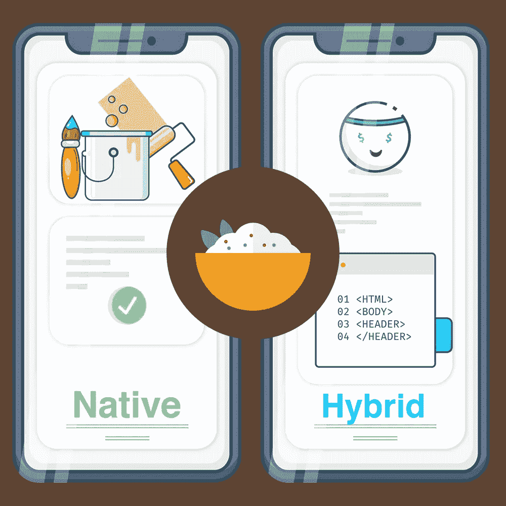

# 原生还是杂交？—我们来做比里亚尼吧。

> 原文：<https://medium.com/hackernoon/native-or-hybrid-lets-cook-biriyani-d336fce5b4d6>

# 原生还是杂交？我们来做比里亚尼吧！

对印度人来说，Biriyani 是一件严肃的事情，做对很重要——但有时你需要尽快满足你的渴望。

当你为你的企业创建一个**应用时，你也会面临这种情况。哪一个最适合你——**本土的还是杂交的？****

你可以在网上订购 biriyani ，或者你可以叫一个厨师专门在你家为你做这道菜。无论哪种方式，你吃的都是印度炒面——但它们的味道绝对不同。类似地，尽管**原生和混合**应用都能满足应用的基本需求和功能，但它们在 UX(用户体验)和 UI(用户界面)上会有很大的不同**。**

**原生**app**就像叫厨师(开发者)给你做饭。由于有不同种类的 biriyani，如 Hyderabad 和 Dindukal，我们还需要针对不同平台的不同应用程序，如 iOS 或 Android。最重要的是保留每个品种的独特“味道”,并准确创造你想要的东西。**

**另一方面，混合应用程序就像从餐馆点餐——它们向每个人提供一种印度炒面*。它更简单，省时省力，但是定制它的选择并不多。如果你认为所有的应用都是一样的，并且你只需要一些东西尽快启动并运行，那么这是你的首选。***

# ***食谱***

*****原生应用**是针对不同平台用**特定语言**编写的，所以让我们看看主要的市场参与者——iOS 和 Android。必须构建两个不同的应用版本，在 iOS 系统中使用 **Swift 或 Objective-C**，在 Android 系统中使用 **Java 或 kot Lin**。创建两个版本会延长开发过程，增加你的成本并可能推迟你的发布日期。***

*****混合应用**实际上是包装在原生应用容器内的网站。因此，它们的构建类似于网络应用，使用 **HTML、CSS 和 JavaScript** ，使用**单一基本代码**无缝运行在所有移动平台上。混合应用也建立在其他平台上，如 *PhoneGap* 、 *Xamarin、React Native、NativeScript 和 Ionic。****

# ***味道***

***香料就像应用程序的功能——它们提供的越多，我们记得越清楚。由于**的本地应用**是特定于平台的，它们可以轻松访问和使用**的内置硬件元件**，如摄像头、麦克风、GPS 和加速度计。他们可以**发送推送通知**并提供一流的**安全性、卓越的性能和离线模式。*****

*****Hybrids** 有一点不同，不过，它们的**便携性**和**插件**允许你访问内置的硬件元素。他们甚至不需要 API，因为一切都是通过网络处理的。***

# *****配菜*****

> ***你的味蕾每十天更换一次。***

***对于任何应用程序来说，更新都是不可避免的，但每种方法处理它们的方式不同。***

*****混合应用可以轻松更新**，因为事情只在服务器上发生变化，然后加载到应用中，不需要更新应用本身。***

***更新一个**原生应用需要用户**参与，每一次更新都要等待各自应用商店的批准，然后才能由用户手动安装。***

# ***还饿吗？***

***对于任何寻求增长的企业来说，本地应用显然是赢家。混合应用的成本更低，开发时间更短，但它们只在企业的初始阶段有用。***

***但是，如果你能像混合应用一样快地构建原生应用，而且成本更低，那会怎么样呢？***

***你能自己做比里亚尼吗？如果你有一个简单的烹饪解决方案，就像我们有一个构建应用程序的解决方案一样，那么也许你可以。有了 Zoho Creator 这样的低代码平台，构建全功能的原生应用变得像拖放元素一样简单。就这么简单！***

*****低代码应用**可能是**您的最终解决方案**，大幅削减成本和时间，同时为您正在创建的应用**提供所有本机特性**。基于 Creator 构建的应用可以在不同平台上无缝访问**，拥有顶级的 UX 和用户界面。*****

*****Zoho Creator 自带超过 **50 个预建应用**，适合各种领域的商业和客户关系。访问 https://www.zoho.com/creator/**的 [**进行为期 14 天的试用**，在那里你可以安装应用程序并立即开始使用，或者从头开始创建你的应用程序。](https://www.zoho.com/creator/)*******

***既然我们已经解决了原生应用和混合应用之间的混淆——并且决定**低代码是前进的道路**——是时候做一些烹饪了。***

****我们来做比里亚尼吧！****