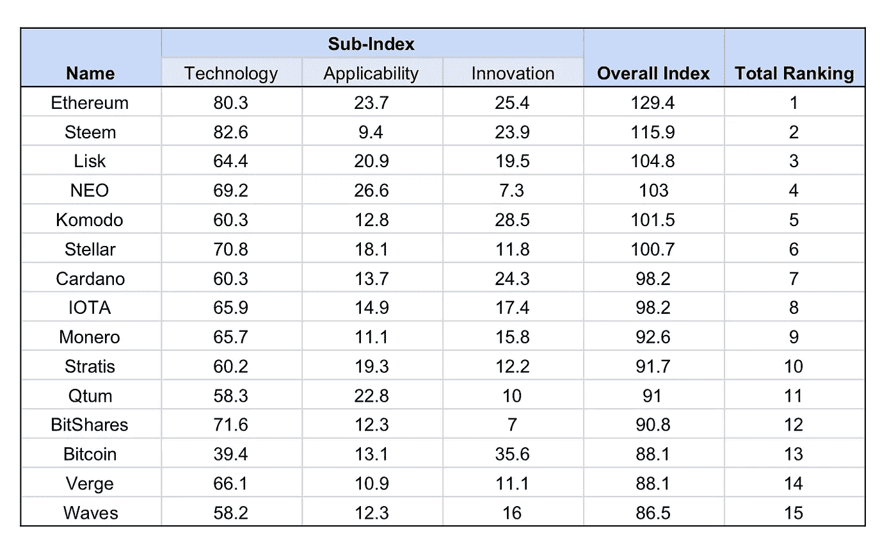
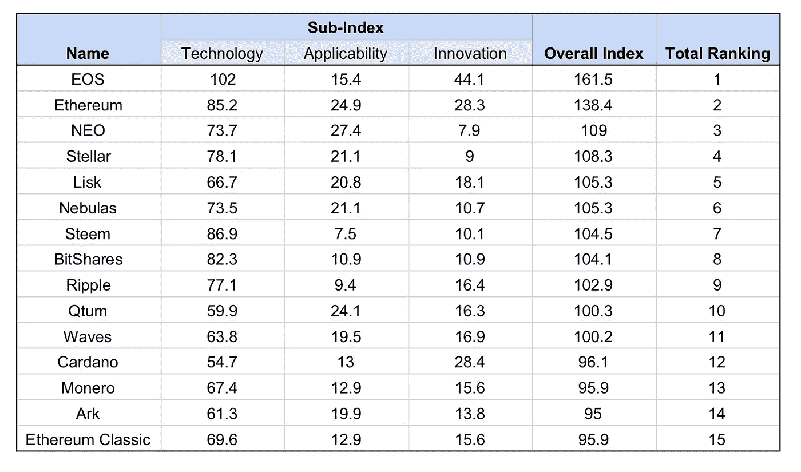

# Navigating Crypto Regulation: China

> 原文：<https://medium.com/hackernoon/navigating-crypto-regulation-china-fbae88697a21>

By [Alex Paley](https://medium.com/u/5b4725c18e?source=post_page-----fbae88697a21--------------------------------)

It’s the fourth installment in our crypto regulation mini-series and today we’re looking at crypto regulation and security offerings in China. Keep reading to find out which blockchain platform scored the highest on China’s **Blockchain Assessment Index**!

At the nation’s peak, China accounted for three quarters of the world’s bitcoin mining operations and over 95% of the bitcoin trading volume. On June 4, 2018, a broadcaster at China Central Television (CCTV) hosted an hour-long special about blockchain, featuring technology leaders and members of the Chinese government. During the special, the economic value of blockchain technology was touted as being “10 times more than that of the internet.” President Xi Jinping also mentioned blockchain as part of a technology revolution, along with artificial intelligence, quantum information, mobile communication, and IoT.

Although Blockchain tech is openly praised in China, the country has arguably the most restrictive regulation in the world. For this reason China is considered to take a **“*blockchain before bitcoin*”** stance. The main reason for their restrictive measures on cryptocurrency is likely geopolitical — Chinese economic initiatives including One Belt One Road are highly dependent upon them retaining and increasing their influence over the international flow of money. The United States already enjoys this power through the U.S. dollar and cryptocurrencies could do the same for China, assuming they have more control over the crypto money supply. In fact, the People’s Bank of China is actively working on a state-backed cryptocurrency and electronics payment system.

So if you are a Chinese individual or business with exposure to blockchain or cryptocurrency, it’s important you stay tuned for answers to some of **the most important regulatory questions**:

1.  How has regulation in China progressed since 2013?
2.  Can I trade cryptocurrency in China?
3.  Can I issue tokens through an ICO in China?
4.  Can I mine cryptocurrency in China?
5.  How do I pay taxes on any crypto gains or income?

# 🇨🇳 A History of Crypto Regulation in China

A brief timeline of the development of Chinese crypto regulation:

*   **December 2013:** The People’s Bank of China issues a warning notice on the risks of Bitcoin, and prohibits all crypto operations for financial institutions
*   **December 2016:** The Chinese government adds blockchain technology to its five-year technology plan
*   **June 2017:** The People’s Bank of China begins testing a prototype state-backed digital currency — the Bank sends several transactions between it and some of the country’s commercial banks.
*   **September 2017:** The Chinese government imposes regulation banning all Initial Coin Offerings (ICOs) and crypto-to-fiat exchanges
*   **January 2018:** The Chinese government imposes regulation banning P2P sales and over-the-counter markets
*   **February 2018:** The Chinese government blocks access to foreign crypto exchanges and ICO websites
*   **May 2018:** President Xi Jinping makes a speech about the importance of pursuing technological research and mentions blockchain amongst revolutionary technologies such as artificial intelligence and the Internet of Things.
*   **May 2018:** China Center for Information Industry Development (CCID) Research Institute of the Ministry of Information and Technology releases the world’s first technology-focused public blockchain assessment index placing Ethereum as the number one contender.
*   **May 2018:** CCID Research Institute of the Ministry of Information and Technology announces that a committee is being setup to establish a national standard for blockchain, with an expected completion date at the end of 2019.
*   **June 2018:** China Central Television hosts a one hour special on blockchain technology with participants from the Chinese government; broadcaster touts blockchain as having economic value “10 times that of the internet.”
*   **June 2018:** China Center for Information Industry Development (CCID) Research Institute of the Ministry of Information and Technology releases an updated public blockchain assessment index placing EOS in front, knocking Ethereum off the top spot.

# 👹 Can I trade cryptocurrency in China?

## Can I trade through crypto exchanges?

On February 5, 2018, the People’s Bank of China issued a public notice of its plans to use the almighty Great Firewall of China to block access to all domestic and foreign cryptocurrency exchange websites. This action was taken after a failed attempt to ban crypto exchanges in late 2017\. The South China Morning Post reported that after banning domestic crypto exchanges, many traders turned to overseas platforms to continue participating in crypto transactions. The People’s Bank stated that the risk of trading is still too high in the sector, and the tougher stance aims to put brakes on the ICO and crypto exchange mania that has been sweeping through China. It was also reported in February 2018 that the crypto market had lost $340 billion in value since the start of January, which many speculate was caused by the regulatory crackdown in China.

尽管在中国交易密码是非法的，但这一禁令显然没有阻止严肃的投资者。来自中国的贸易处于低位，但并非完全不存在。许多中国商人只是利用 VPN 来规避网站禁令。2018 年 3 月 31 日，一项针对未授权 VPN 的监管禁令生效。尽管如此，VPN 提供商和用户仍然声称他们可以访问这些服务。其他投资者也在向香港和日本转移。

虽然官方消息来源称谨慎是早期打击加密的主要原因，但外国观众普遍认为，此举比看起来更具地缘政治性。值得注意的是，禁令的潜在原因可能是担心资本外逃可能使人民币贬值，并破坏依赖于强大外汇储备的经济稳定。

## 我能拿着我的密码吗？

虽然加密交易是非法的，但对中国的个人来说是合法的🙃加密货币。另一方面，金融机构不能。2018 年 1 月，中国人民银行下令金融机构停止向任何与加密货币相关的活动提供银行服务或资金。该文件在银行内部传阅，要求金融机构加强日常交易监控，以确保关闭任何与加密货币有关的可疑支付。💀

## 我什么时候能再次在中国做生意？

虽然中国政府没有表示加密交易将在短期内再次合法，但来自中国的各种研究项目和投资表明，一旦投机活动趋于平稳，交易将在中国合法并受到鼓励。特别是，信息产业部中国信息产业发展中心(CCID)研究院现已正式发布了**全球首个以技术为核心的公链评估指数**。该指数的目的是帮助“掌握全球公链技术发展现状，及时跟踪公链技术创新方向，帮助推动区块链技术的创新和应用。”因此，虽然交易目前是非法的，但这一指数的创建表明，中国政府确实希望在人们等待波动性消退的同时，让他们了解区块链技术。

据《CCID》报道，以下是 2018 年 5 月**15 大大众区块链**:

**全球公链技术评估指数(第一期)**

May 2018 Global Public Chain Technology Assessment Index

自评估指数第一期发布以来，CCID 还提供了 2018 年 6 月更新的**15 大公共区块链**:

June 2018 Global Public Chain Technology Assessment Index

EOS 的利害关系证明共识算法的成功整合可能有助于区块链在本月将以太坊推下榜首。以太坊尚未成功实现利益相关者共识[，尽管事实上他们已经讨论了很长时间](/@VitalikButerin/a-proof-of-stake-design-philosophy-506585978d51)。

# ☠️我可以在中国通过 ICO 发行代币吗？

2017 年 9 月，中国人民银行宣布，所有首次硬币发行都构成非法集资，必须立即停止。因此，任何已经通过 ICO 发行代币的公司都必须依法回购代币，并停止所有筹资活动。中国人民银行采取了这一严厉行动，因为中国政府担心太多的 ICO 是欺诈性的，他们还表示担心，在全球启动的 80，000 个区块链项目中，只有 8%仍在积极维护。

在 1 月份的东南亚区块链峰会上，中国金融科技中心主任否认了对交易和 ico 的全面禁令将无限期继续下去。这位董事补充说，中国不利的监管环境表面上是为了清除欺诈性的 ICO 项目，让真正的发行繁荣起来。

# ⛏️我能在中国开采加密货币吗？

2018 年 1 月，由于“过度用电”，采矿作业面临严重打击。中国的比特币挖矿估计使用高达 4 千兆瓦的电力，相当于三个核反应堆的电力。虽然打压的原因被称为过度用电，但有趣的是，这份声明来自中国人民银行，而不是能源委员会。出于这个原因，许多人猜测，这一决定只是中国政府用来遏制加密货币在中国的使用和炒作的众多决定之一。

## 那么，尽管有打击，为什么中国是加密开采的世界领导者？

1.  **廉价电力**—[中国的电力远比其他大多数国家便宜](https://bitcoinist.com/mapped-cheapest-expensive-countries-mine-bitcoin-electricity-cost/)。在工业区，电力要么由水电设施供应，要么由国家补贴。廉价的电力让矿商能够以最高效率运营，比外国竞争对手更长寿。此外，中国的环境政策比其他国家更加宽松。煤炭是最便宜的能源，中国的能源生产商可以自由燃烧它，并利用它来采矿。在煤炭产地附近建立比特币采矿业务，将碳直接转化为密码，会更具成本效益，这是中国一些大型矿商正在使用的一种策略。
2.  **领先的比特币矿池**——中国以外的许多矿工经常加入中国矿池，因为他们被其规模所吸引。资金池越大，会员的收入就越可预测和稳定。
3.  **顶级 ASIC 硬件制造商**——顶级硬件制造商如[比特大陆](https://www.bitmain.com/)(最近[估值 120 亿美元](https://cointelegraph.com/news/bitmain-receives-12-bln-investment-in-a-recent-funding-round))都位于中国，这使得获得采矿硬件更加容易和可靠。

## 矿工们在做什么来回应镇压？

尽管中国的矿业公司仍在运营，但它们正艰难地控制自己的用电量，使其低于中国央行设定的上限。许多矿业公司正在向海外转移，以利用限制较少的气候。最近，比特大陆科技公司除了在阿姆斯特丹、香港、特拉维夫、青岛、成都、上海和深圳的分公司之外，还在瑞士成立了一家子公司。虽然移居海外可能会导致能源成本上升和利润下降，但利润下降总比没有利润好。

# 💰我如何支付任何收益或收入的税款？

## 我必须支付加密所得税吗？

在大多数国家，如美国，加密货币交易的利润一般作为收入征税。这是因为加密货币被认为是一种财产或商品。许多国家在对密码征税方面采取了类似的立场，但未能提供任何具体的指导。中国尚未就税收目的的加密地位采取任何立场，政府在这个问题上基本保持沉默。

假设密码在中国被视为财产或商品，它将被征收个人所得税。在中国，个人所得税分为 11 类，每一类都有自己的税率和允许扣除额:

1.  就业收入(即工资和薪金)
2.  个人独资企业经营所得
3.  在合同或租赁基础上经营企业的收入
4.  劳务报酬
5.  作者报酬
6.  版税
7.  利息、股息和利润分配
8.  租金收入
9.  财产转让所得
10.  附带收入
11.  国务院财政部确定的其他应税所得

自 2013 年以来，中国政府在加密监管的许多方面都直言不讳，比任何其他国家都多；然而，尽管该国的交易量和利润巨大，但财政部尚未发布任何加密货币税收指导。然而，有一点是明确的:加密货币的收益不会严格归入 11 个类别中的任何一个，或许除了“附带收入”。

当然，只有当一枚硬币或代币被出售获利时，加密货币的收入和收益才会出现，而在中国，交易加密货币是非法的。因此，中国的许多加密持有者将不会参与加密交易，因此不会面临纳税义务。当然，任何在中国非法交易密码的持有者显然都不想通过申报纳税收益来暴露他们的非法活动。因此，缺乏中国政府的税收指导并不完全令人惊讶。

一旦交易被允许，加密持有者应该预料到他们可能需要在个人所得税申报表的“偶然收入”类别下提交加密收益，除非中国政府另有规定。

## 比特币之前的区块链

遵循他们的“比特币之前的区块链”模式，尽管缺乏税收指导，中国政府正在利用区块链技术帮助防止逃税。深圳市国家税务局与腾讯合作，通过“智能税务”项目遏制欺诈和误导性税收行为。在一份声明中，深圳官员表示，该项目将利用腾讯的技术优势，包括其内部的区块链技术和专业知识。区块链将用于跟踪和追踪收据和发票等税务文件，防止人们伪造不准确的信息。因此，虽然加密货币在中国受到了一定程度的压制，但该国在投资区块链研究和真实世界的用例方面做得非常好。

本文是法律信息，不应被视为法律建议。在你依赖这些信息之前，你应该咨询律师。