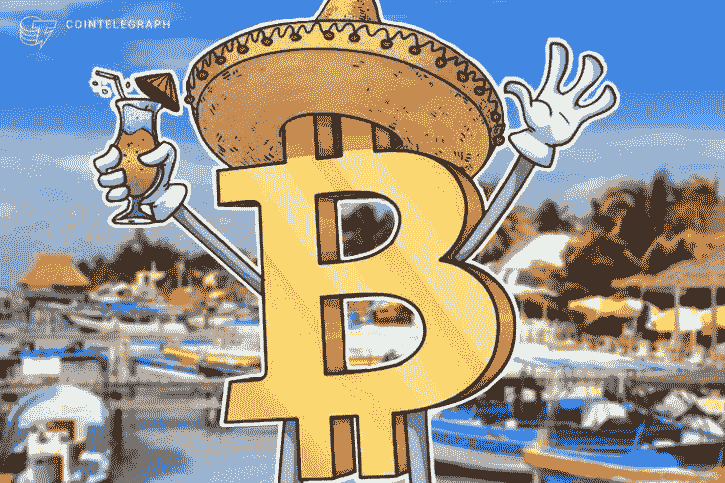

# 导航加密法规:墨西哥

> 原文：<https://medium.com/hackernoon/navigating-crypto-regulation-mexico-7ef17071fb1>

丹尼斯·兹多诺夫

这是我们的加密监管迷你系列的第三部分，今天我们来看看在**墨西哥**的加密监管和安全产品。请继续阅读，了解墨西哥对金融科技 ***【监管沙箱】*** 的看法，以及如何利用这一新发展。

墨西哥是拉丁美洲第二大经济体，国内生产总值超过 2 万亿美元，金融业也在不断发展。然而，由于对金融机构的不信任，墨西哥超过一半的家庭没有银行账户。正因如此，[加密货币](https://hackernoon.com/tagged/cryptocurrency)比以往任何时候都更加重要。每年有超过 250 亿美元从美国工人那里电汇到墨西哥，其中很大一部分是通过加密发送的，因为每笔交易的速度、匿名性和低成本。仅在 2018 年 3 月的第一周，BTC/MXN 组合的交易量就达到了 10，629，708 美元的历史最高水平。

由于加密技术的快速发展和下届墨西哥选举的潜在金融影响，我们在外国系列中首先处理墨西哥。请继续关注墨西哥密码企业和个人面临的一些**最重要的监管问题**的答案:

1.  在墨西哥哪里有密码交易，合法吗？
2.  我如何购买或出售菲亚特加密？
3.  我如何在墨西哥发行或购买证券？
4.  在墨西哥有任何独特的加密机会吗？
5.  我的纳税义务是什么？

# 🇲🇽哪里有密码交易，合法吗？

那么在墨西哥哪里可以买卖 crypto 呢？

墨西哥最受欢迎的提供加密法定交易的中央加密交易所是 [Bitso](https://bitso.com/) 和 [Volabit](https://www.volabit.com/en) 。尽管只提供[比特币](https://hackernoon.com/tagged/bitcoin) (Volabit)、以太坊和 Ripple(Bitso 提供全部三种)的交易，但这两家墨西哥交易所都受到了称赞，因为它们的可访问性远远超过了在美国运营的任何交易所。2017 年，Bitso 和 Volabit 与几家墨西哥电话和支付服务合作，如 [Compropago](https://compropago.com/) ，它在 OXXO、7-Eleven 和沃尔玛等连锁店的 135，000 多个地点提供终端。

与 Compropago 的合作允许 Bitso 或 Volabit 用户直接从该国的任何 Compropago 终端将菲亚特存入他们的账户。终端允许用户将现金直接存入其中一个交易所，然后这些交易所将现金存入一个固定账户。出于流动性和安全考虑，为了确保交易所不会持有太多的法定货币，存入的现金必须在 24 小时内转移到加密账户或转移到关联的银行账户。两家交易所目前都不提供从 Compropago 终端提取密码的功能，但没有银行账户的用户仍然可以从位于墨西哥的少数几台比特币 ATM 机中的一台提取现金(墨西哥城有三台)。对于使用银行账户的墨西哥居民来说，Bitso 和 Volabit 还可以“在一秒钟内以零成本”向银行账户进行即时存款和取款。

## 加密交易在墨西哥合法吗？

墨西哥加密交易所的合法性仍然是一个灰色地带，但在一项新的金融科技法案签署成为法律并于 2018 年 3 月 9 日公布后，交易所已经开始在该国申请许可证:

1.  **Bitso**—Bitso 网站声明“Bitso S.A.P.I. de C.V .将向国家银行和外汇委员会(CNBV)申请相应的授权，如果适用，还将根据为此目的发布的一般条款向墨西哥银行(Banxico)申请授权。”
2.  **vola bit**——vola bit 网站声明“根据监管金融技术机构的法律第八临时条款，在该电子支付基金平台内开展业务的授权正在进行中，因此该平台目前的运营不属于墨西哥当局监管的活动。”

为了符合 CNBV 即将出台的要求，加密交易所究竟需要改变什么以及是否需要改变还不确定，但金融科技法案是进步的，应该会鼓励该行业随着监管而发展(下文将进一步讨论)。

# 💵我如何购买或出售菲亚特加密？

墨西哥居民可以在墨西哥交易所交易菲亚特吗？

根据新的金融科技法案，希望参与墨西哥金融科技行业的公司和个人必须使用墨西哥授权金融机构的银行账户。这样做的原因是，政府可以实施适当的反洗钱和了解您的客户(AML/ KYC)协议，允许 Banxico 等机构跟踪所有加密货币的来源。在涉及加密的地方，反洗钱/ KYC 要求尚未得到充分解释，但《金融科技法案》已授权 CNBV 制定具体规则。

目前，Bitso 和 Volabit 都要求用户如果想每天提取超过一定数量的比索，就必须关联一个银行账户。如果墨西哥居民拥有与这两个交易所关联的墨西哥银行账户，他们就可以利用这两个交易所为菲亚特大量买卖密码。

## 美国和领地的居民可以在墨西哥交易所交易菲亚特吗？

从法律角度，这个答案还不清楚。从实践的角度来看，答案最有可能是**否**，原因有二；

1.  **反洗钱/ KYC** —根据金融科技法案的新要求，墨西哥加密交易所的用户可能仅限于那些在墨西哥银行拥有账户的人。但是，即使是那些在墨西哥有银行账户的美国人也可能仍在挣扎…
2.  **向美国居民提供服务的限制** —要建立 Bitso 账户，潜在用户必须输入个人信息，包括姓名、出生日期和居住国家。如果您在下拉列表中选择“美国”，您将会收到消息*“不正确的国家/地区—很遗憾，我们目前不接受美国居民”*。虽然他们没有解释为什么不能接受美国居民，但反洗钱/ KYC 问题可能不是原因，因为同样的信息不会出现在联合国制裁的国家(如朝鲜/伊朗)。更有可能的是，交易所对美国证券交易委员会向美国居民出售证券的影响持谨慎态度。Volabit 是否有同样的限制还不清楚，但他们需要一个墨西哥电话号码来验证身份。

# 👮🏻我如何在墨西哥发行或购买安全令牌？

2005 年，墨西哥众议院和参议院批准了《证券市场法》(LMV)。LMV 重新定义了证券法，这是今天任何代币发行者或购买者必须遵循的框架。

## 墨西哥是如何定义“安全”的？

在向国家证券登记处(RNV)提交的登记声明生效之前，LMV 不允许发行证券。LMV 对证券的定义几乎与 1933 年美国联邦证券法相同，没有功能上的区别；

*“股票、信用债券、债券、认股权证、证书、本票、汇票和其他连续或集体发行的信贷工具，无论是否在 RNV 登记，代表一个法律实体的股本、资产的比例部分或集体债务的参与或任何个人信贷权利，可通过新 LMV 监管的市场交易所进行交易”。*

墨西哥任何潜在的代币购买者或发行者都应遵循[前两篇文章](https://tokenarcade.com/2018/06/16/navigating-crypto-regulation-united-states/)中提供的相同分析。虽然墨西哥不遵循“豪威测试”，但该测试的基本原则是广泛的，并且一个令牌是否具有“独立效用”最终将是我们通过这个小系列解决的大多数管辖区的普遍问题。LMV 要求任何满足该定义的安全令牌都需要向 CNBV 注册。

## 我如何在没有向墨西哥当局注册的情况下发布安全令牌？

与美国证券交易委员会的 D 规则豁免类似，通过 ICO/STO (STO 意为*证券代币发行*)提供证券代币的最简单方法是**将发行限制在合格投资者**。根据 LMV 证券框架，在以下任何情况下，令牌发行者都不需要注册其安全令牌；

1.  证券只向合格投资者或机构投资者发售；
2.  股票证券(提供公司的股票或权益，而不是提供公用事业或投资的传统代币)最多出售给 100 个人；
3.  根据员工福利计划出售证券(如作为补偿或支付的初创企业股权)。或者
4.  证券作为股东或实体成员的“购买选择权”出售，其主要目的是向这些股东或成员提供服务(例如，乡村俱乐部可以允许成员购买俱乐部的股份，以代替定期付款或作为定期付款的补充)。

## 在墨西哥，合格投资者的定义是什么？

国家银行和证券委员会负责维护定义，目前定义如下:

**基本合格投资者**:

*   上一年平均持有 150 万美元证券投资的任何人；或者，
*   在过去两年中，年净收入等于或超过 500，000 UDI 的任何人。

**老练的合格投资者**:

*   上一年平均持有 300 万乌地阿拉伯第纳尔证券投资的任何人；或者
*   在过去两年中，年净收入等于或超过 100 万 UDI 的任何人。

**机构投资者**:

*   任何被认为是金融实体的实体(墨西哥和外国银行、经纪自营商、保险公司、投资基金、私人养老基金等)。

STO 必须确保他们收集适当的文件以核实资格状况，否则他们将面临提供非法证券的风险，并可能不得不回购他们的代币或面临个人责任。

获得投资者身份的限制与证券交易委员会的豁免规定相似；然而，SEC 对“合格投资者”的定义确实允许投资者使用净资产(个人财产除外)进行判断，这在墨西哥是不可行的。因此，在墨西哥获得合格投资者资格可能会更加困难。

很难确定是否有任何 ico 在墨西哥使用这种筹资机制，因为没有多少 ICO 来自墨西哥。为数不多的墨西哥硬币之一， [AgroCoin](https://agrocoin.com.mx/) 于 2018 年 3 月推出了他们的 ico。AgroCoin 是“Amar Hidroponía 的投资产品，允许投资者分享智利 Habanero 一个生产单位产生的利润……[一] AgroCoin 代表 1/10，000 的利润份额，即代表一平方米的生产单位。”仅从首页的简短描述就可以很明显地看出，这枚硬币没有任何用途，仅仅是一个投资单位。然而，从服务条款来看，AgroCoin 似乎没有将他们的 ICO 限制在“inversionistas calificados”——合格投资者。这可能是因为墨西哥公司对 CNBV 的恐惧小于美国证券发行商对 SEC 的恐惧。在美国，你会希望该公司至少做出一些努力来伪装成一个公用事业令牌！😱

## 如何在墨西哥注册安全令牌？

许多代币发行者发现，限制向合格投资者发行代币对他们的业务来说根本不可行，尤其是当他们提供的服务更有可能被公众所重视的时候。在这种情况下，为了向公众开放他们的 ICO，发行者可以选择更传统的途径，注册安全令牌。

要在墨西哥注册安全令牌，该公司必须经历与美国首次公开募股(IPO)类似的流程。首先，必须获得 CNBV 的批准，CNBV 要求发行人编制招股说明书，其中包括:

1.  根据墨西哥会计原则编制的法律和财务信息；
2.  认可的信用评级机构的信用评级；
3.  交易的描述；
4.  风险因素的讨论；
5.  管理层讨论和分析；和
6.  适用法规，包括税务处理和公司治理信息。

CNBV 将批准或拒绝申请，如果获得批准，CNBV 将在每个季度对发行人向投资者提供的信息的透明度进行评级:

1.  如果发行者披露了 80%到 100%的信息，那么 T2 绿色等级为 T3。
2.  如果发行人披露了 51%到 79%的信息，则为黄色等级。
3.  如果发行者向投资者提供的透明度不足，则为 T2 红色等级

美国没有实施这种分级制度，要求这种制度的后果是双重的；1)由于害怕显得疏忽，公司将被迫完全遵守；或者 2)真正努力遵守法规，但启动预算低的公司，最终将难以达到绿色等级，因为聘请律师和会计师需要费用。

**墨西哥的上市公司有哪些持续的义务？**

“上市”后，代币发行人将遵守与美国上市公司相同的严格的持续披露要求，包括:

1.  报告:公司必须提供年度和季度报告，包括经审计的财务报表。
2.  **披露**:公司必须向公众披露任何可能影响证券价值的相关事件，如果该事件的价值相当于公司资产的 5%，或上一年总销售额的 3%。
3.  **限制** : 墨西哥上市公司的投票限制包含在每个特定公司的章程中，必须根据具体情况进行分析。

代币发行者通常选择持有 ICO 而非 IPO 的众多原因之一是，这些持续的披露要求极其耗时且成本高昂。对未能持续披露和报告的处罚从暂停或取消上市证券到指定提供信息的个人承担个人责任不等。如果任何相关信息未被披露或以虚假或误导的方式披露，个人可能面临刑事责任。

**持续义务是否适用于在墨西哥发行证券的外国公司？**

如果外国代币发行人没有在非墨西哥证券交易所上市的任何证券，则在墨西哥交易所上市的外国代币发行人必须提交与当地公司相同的信息。如果他们有在非墨西哥交易所上市的证券，外国公司必须定期向 CNBV 和证券交易所提供信息(西班牙语),包括经审计的财务报表。这些要求仅适用于在传统证券交易所发行和上市的证券(首次公开募股之后)，通过 ICO 发行代币的公司如果希望其代币在墨西哥加密交易所上市，则无需遵守这些规则。

# 🔥在墨西哥有任何独特的加密机会吗？

**我可以利用新的金融科技监管沙箱吗？**

2017 年 12 月，墨西哥参议院通过了新的金融科技法案，该法案于 2018 年 3 月签署成为法律。该法律适用于任何融资机构，特别侧重于:虚拟资产管理机构(加密货币)、电子支付机构(交易所)和众筹机构(ICO / STOs)。金融科技法案的通过是为了将新的金融科技机构引入墨西哥，它没有明确阐明现有法律对虚拟货币或交易所的适用性。

影响加密的法案中最大的一点是建立了 **FinTech *“监管沙箱”*** ，类似于英国提供的那些，**将允许加密机构获得为期 2 年的临时授权，以运营并向有限数量的客户提供服务**。报告和披露要求不那么繁琐，并将为加密业务提供一个在沙盒中游戏的机会，看看它们是否能成为一项可行的技术。

要申请临时授权，金融科技公司必须向 CNBV 和金融科技委员会(由 SHCP、CNBV 和 Banxico 各两名代表组成)提出申请，并且必须证明:

1.  金融科技机构打算进行的交易在其公司章程中有明确说明；
2.  该公司有适当的公司结构进行交易；和
3.  公司拥有必要的控制和基础设施，如运营、会计、安全系统、人员和手册。

在 2 年临时授权到期后，利用监管沙盒的公司将发现获得全职许可证的过程远没有那么繁琐，并且他们应该在试用期内积累了一些收入，这应该会减轻昂贵的行政费用的负担。

目前没有任何公司利用沙盒，但希望随着更多关于申请程序的细节公布，这种情况会有所改变。

# 💰我如何支付任何收益或收入的税款？

**在墨西哥，出于税收目的，crypto 被视为哪种资产类别？**

墨西哥政府除了像包括美国和英国在内的大多数司法管辖区一样，确认出于税收目的，crypto 不是墨西哥的法定货币或货币之外，没有就虚拟货币的税务处理提供任何指导。在知道它不是法定货币的情况下，我们必须假设虚拟货币将被视为资产或商品。

**在墨西哥，crypto 是否要缴纳增值税？**

由于虚拟货币很可能属于*资产*类别，我们可以推测，在墨西哥境内进行加密交易将使交易者承担增值税(VAT)责任。然而，对于加密货币来说，有趣的是，只有当转移发生在墨西哥境内时，墨西哥才会对商品转移征收增值税——这在处理虚拟货币时是不确定的。

墨西哥增值税立法规定，如果被转让的资产在装运时在墨西哥，或者如果不要求装运，如果资产的实际交付在墨西哥进行，则销售被视为在墨西哥境内发生。然而，在无形资产的情况下，当买方和卖方(无论是个人还是公司)都是墨西哥居民时，销售被视为发生在墨西哥境内。

加密货币很可能会被视为无形资产，因为它们缺乏实物形态。如果我们这样看待它们，如果买方和卖方都是墨西哥居民，加密交易将只在墨西哥缴纳增值税。这一立场仍有待税务部门确认，但即使确认，由于 crypto 的匿名性，居住地的确定将特别困难。

例如，如果一名居住在墨西哥城的墨西哥居民从墨西哥交易所 Bitso 购买比特币，这笔交易就应该缴纳增值税。但是，Bitso 不对任何转账收取增值税。这是因为他们在支付增值税，还是因为他们完全忽略了增值税的责任，还不确定。如果他们完全忽视这一点也不奇怪，因为在所有司法管辖区，不缴纳加密税是一个大趋势。

另一方面，如果墨西哥居民使用在马尔他运营的交易所，如币安交易所，则不需要缴纳增值税。

*本文是法律信息，不应被视为法律建议。在你依赖这些信息之前，你应该咨询律师。*

*原载于 2018 年 6 月 21 日*[*tokenarcade.com*](/tokenarcade/navigating-crypto-regulation-mexico-1e0646b400b7)*。*