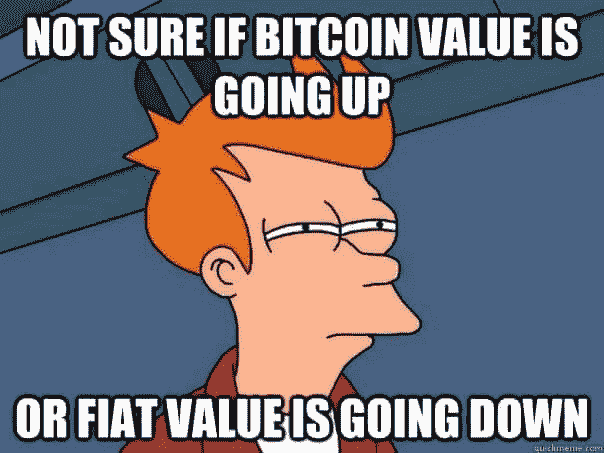
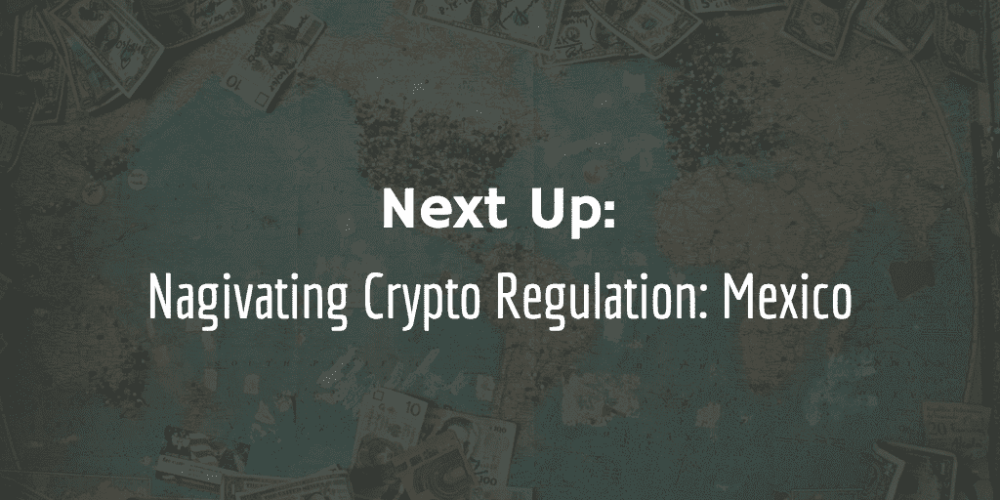

# 导航加密法规:美国

> 原文：<https://medium.com/hackernoon/navigating-crypto-regulation-united-states-f7dc3ba24f3a>

亚历克斯·佩利

这是我们的加密法规迷你系列的第二部分，我们将从美国**的加密法规导航指南开始。**

如果你是美国的个人或公司，并且 1)购买 crypto(法定转加密)；2)发布密码；3)交易加密(加密到加密或加密到菲亚特)；还有，4)考虑到与加密相关的收益或损失，你无疑会有很多疑问——而且你应该有。虽然我们无法在一篇文章中涵盖所有内容，但我们将带您了解我们认为美国加密企业和个人面临的**最重要的监管问题**:

1.  我在发行/购买证券吗？那是什么意思？
2.  你可以在哪里交易密码，它是合法的吗？
3.  我怎样才能把我的密码卖给菲亚特？
4.  我可以匿名交易吗？
5.  我的纳税义务是什么？

事不宜迟，让我们开始吧。

# 😥我在发行/购买证券吗？那是什么意思？

## 我们为什么要关心证券法？

《1933 年美国联邦证券法》*规定，如果没有注册声明，任何人直接或间接参与州际商业中的证券发行或销售都是非法的。这适用于总部位于美国的公司或个人，以及向美国居民提供未注册证券的任何国际公司或个人。在其他司法管辖区，法规不同，可能会产生不同的后果。*

*向美国居民出售未注册证券的后果可能是深远而严重的，包括:*

1.  *要求重新购买所有发布的密码；*
2.  *对企业的高额罚款；*
3.  *对公司负责人的个人罚款；最后但同样重要的是，*
4.  *坐牢时间💀*

*作为购买证券的个人，美国居民也不能完全幸免。虽然购买未注册证券的大多数公众成员对自己的行为可能是幼稚的，但做广告或推销证券的合格投资者可能会被罚款和受到刑事处罚。因此，无论你是企业还是个人投资者，了解你使用的是什么类型的加密技术是很重要的。*

## *根据美国联邦法律，什么是证券？*

*《证券法》第 2(a)(1)节和《交易法》第 3(a)(1)节将证券定义为“投资合同”,在这种情况下，将资金投资于一个普通企业，并合理期望从他人的创业或管理努力中获得利润。这种测试是在“证券交易委员会诉 W.J .豪伊公司”[1946 年《美国最高法院判例汇编》第 328 卷，第 293 页，第 301 页]一案中创立的，通常称为*豪伊测试*。加密资产是否是一种安全资产取决于它是否满足豪威测试的所有四个要素，我们将在下面进行分解:*

# *豪威试验*

1.  ***资金投入** : 不需要拿出实际现金来满足这个测试要素——任何加密货币或代币作为“支付媒介”就足够了。*
2.  *共同事业:一群人聚集在一起就足以建立“共同事业”；例如，一个由开发人员组成的企业启动的 ICO。*
3.  ***合理的利润预期**:利润的定义包括股息、其他定期支付或投资的增值。大多数(如果不是全部的话)ICO 发行的代币都是带着升值的预期购买的。只有当代币以设定的价值发行，具有完整的效用，用于非盈利目的，并且不在任何交易所进行交易，那么*可能*不满足这一要素，并且能够避免被定义为证券。*
4.  ***来自他人的努力**:如果代币除了来自 ICO 发行人的开发努力或推广代币的交易所的价值之外没有其他价值，则利润完全来自他人的努力。但是，如果令牌拥有完全独立的实用程序，令牌持有者可以用来创造价值，如 Filecoin(持有者可以使用令牌来存储文件)或假人(持有者可以捐赠计算机能力或使用其他持有者的计算机能力来换取令牌)，则有可能不符合这最后一个要素。*

*为了理解豪威测试的应用，我们来看两个著名的例子:*

## *比特币和以太(2018)符合豪威测试的要素吗？*

## *比特币是一种证券吗？*

1.  ***金钱投资**——在 SEC 诉 Shavers 案中(引用:SEC 诉 Shavers 案，第 4:13-CV-416 号(E.D. Tex。2014 年 9 月 18 日)一名联邦法官认为，比特币是一种价值衡量手段，被用作一种支付形式和交换方法，这一事实足以被视为这种目的的“货币”，即使它没有法定货币地位。
    **结论**:符合豪威测试*
2.  ***普通企业** —比特币不限于特定的风险企业或普通企业；没有控制实体。
    **结论**:难道**不**符合豪威检验*
3.  ***合理的利润预期** —考虑到比特币并不赋予额外的权利，如智能合约提供的公用事业，购买比特币的主要原因是预期利润。
    **结论**:符合豪威测试*
4.  ***源自他人的努力** —没有特定的控制实体或管理人员在平台上工作并驱动利润。
    **结论**:是否**不**满足豪威检验*

*尽管大多数人是带着利润预期购买比特币的，但没有特定发行者受益或推动价值的事实意味着豪威测试中的“普通企业”和“其他人的努力”观点无法得到满足。**出于这个原因，比特币不被认为是一种证券。***

## *以太是安全的吗？*

1.  ***金钱投资** —根据 Shavers 分析
    **结论**:符合 Howey 检验，乙醚将被视为金钱投资*
2.  ***普通企业**—2014 年以太发行时，以太坊基金会是控股实体。然而，今天以太坊的基础是如此遥远，以至于任何购买以太的人都不会投资于一个普通的企业
    **结论**:难道**不能**通过豪威测试吗*
3.  ***合理的利润预期** —有一种观点认为，以太网的初始投资者购买智能合约功能，而不是带着利润预期购买以太网。今天，大多数投资者会因为预期利润而购买乙醚。
    **结论**:符合豪威测试*
4.  ***源自他人的努力** —与 2014 年的情况不同，它不再受单一特定实体的控制。
    **结论**:难道**不**符合豪威测试*

*无论以太在发行之日是否是一种证券，加密货币与以太坊基金会的关系现在已经非常遥远，任何购买以太的人都不会投资于由“他人的努力”驱动的“共同企业”。**所以 2018 年的乙醚不算安全。***

***2018 年 6 月，** [**SEC 正式裁定比特币和以太不属于证券**](https://www.cnbc.com/2018/06/14/bitcoin-and-ethereum-are-not-securities-but-some-cryptocurrencies-may-be-sec-official-says.html) **(让我们所有人都松了一口气)。***

**

*因此，看起来加密货币可以从一种证券转变为一种实用/货币，甚至可能再转变几次。这让我们思考几个没有答案的问题:*

1.  *如果代币曾经是一种证券，即使发行者不再参与或积极推动利润，美国证券交易委员会是否可以追溯处罚发行者？*
2.  *当没有亮线测试时，加密交易所如何知道它们是否正在列出安全令牌？*
3.  *如果加密交换列出了一个实用工具令牌，然后该令牌变成了安全令牌，他们是否需要将该令牌从列表中删除，以及如何对其进行主动管理？*

*如果代币是流动的，可以是一个月的证券，然后不是一个月，发行人将不可能充分遵守适用的法规，这将是 SEC 确定发行人是否积极遵守的巨大管理负担。*

## *如何颁发安全令牌？*

*因此，您刚刚确定了您的令牌是一种证券。你是怎么发行的？一定要经历 IPO 吗？幸运的是，证券登记要求有豁免，大多数 ICO 发行人目前都在利用 SEC 法规 D 下的选项。法规 D 允许公司通过证券的发行和销售筹集无限量的资金，并且不要求任何登记或披露。但是，它要求:*

1.  *证券只提供给“合格的投资者”；和*
2.  *该公司需要采取合理的步骤来验证投资者是经过认证的*

*那么什么是“合格投资者”呢？一个自然人可以证明:*

1.  *他/她在过去两年中每年的收入超过 200，000 美元(或与配偶一起超过 300，000 美元),并且合理地预计今年的收入也将超过 200，000 美元，或；*
2.  *他/她单独或与配偶一起的净资产超过 100 万美元(不包括此人主要住所的价值)。*

*根据该条款出售的任何证券都需要“锁定”至少 6 或 12 个月，以确保合格投资者不会将证券转售给不合格投资者。这意味着交易将受到限制，发行者将无法申请在交易所上市。是否对广告和产品有进一步的限制取决于 Reg D 下使用的豁免，而使用哪种豁免将取决于 ICO 发行实体结构的具体情况。*

# *🇱🇷哪里可以交易密码，合法吗？*

**

*所以，你找到了一种方法来发行你的令牌，你想让它可用于交易。你能在交易所列出代币吗？哪里可以买到安全令牌？*

*加密交换能否列出您的令牌取决于它是实用令牌还是安全令牌。任何加密交易所都可以列出一个公用令牌，但如果该网站没有注册为**国家交易所**或**替代交易系统(ATS)** ，任何加密交易所交易安全令牌都是违反《证券交易法》的。有多少运营中的交易所注册为国家交易所或 ATS？无(尽管有三个已接近投入使用---- Templum、SharesPost 和 tZero)。*

*这是否意味着所有运营中的交易所都违反了《交易法》？也许不是。*

## *根据美国联邦法律，什么是交易所？*

**交易法案*将“交易所”定义为一个组织，无论是公司制还是非公司制，它提供一个市场，将证券的买方和卖方聚集在一起，或者执行通常由证券交易所执行的功能。检验交易所是否符合这一定义的方法如下:*

1.  *组织是否汇集多个买方和卖方的证券订单；而且，*
2.  *组织是否使用既定的非全权方法(无论是通过提供交易工具还是通过设置规则)来使此类订单相互作用，以及输入此类订单的买方和卖方是否同意交易条款？*

*大多数集中式交易所无疑符合这个定义。这意味着交易证券代币的集中交易所可能是非法经营的。许多受欢迎的美国交易所，如比特币基地，正在与美国证券交易委员会沟通，通过寻求作为 ATS 的监管来解决这一问题。*

## *美国交易所如何成为 ATS？*

*许多美国交易所尚未注册为 ATS 的原因之一是，这可能是一个漫长而昂贵的过程。需要几个步骤；*

1.  *第一步 —交易所必须在美国证券交易委员会注册为经纪交易商*
2.  ***第 2 步**——交易所必须在 FINRA 注册为经纪自营商*
3.  ***步骤 3** —交易所必须提交 ATS 表格，以通知 SEC 交易活动*
4.  ***第 4 步**—ATS 必须遵守常规的冗长披露要求*

*每一步都需要很高的申请费，还需要交易所的负责人。1)披露他们的居住/工作历史；2)提供指纹；3)公开刑事定罪和民事司法判决；4)准备详细的商业计划；5)披露他们的资金来源，6)与 FINRA 的代理人进行口试。*

*尽管许多交易所渴望向前发展，并在监管下运营，但对于资本最少的初创交易所而言，申请成为 ATS 的过程漫长、成本高昂，而且难以实现。*

## *在哪里可以列出或购买 crypto？*

*如果你的代币是一种证券，而你想让它在交易所上市，你可能要等到上面提到的三个 ATS 中的任何一个开始运行后才能上市。大多数集中交易，如 Bittrex，现在**要求对上市申请人的证券的效用状态出具法律意见**。如果你的代币不是一种工具，律师就不会写意见说它是一种工具，所以如果你想在一个集中的交易所上市，你可能就没那么幸运了。但不要绝望，在某些情况下，分散的交易所可能会在市场上提供公用事业和安全令牌。*

*2018 年 5 月，比特币基地收购了分散式交易所 Paradex。在接受美国消费者新闻与商业频道采访时，比特币基地·首席运营官·阿西夫·希尔吉表示，“我们收购了世界领先的接力赛……这将允许你从自己的钱包中交易数百枚代币，我们实际上是要使这符合美国的规则。”在解释比特币基地计划如何做到这一点时，Hirji 先生解释说他们不打算把 Paradex 作为一个交易所，而是作为一个 ***公告牌*** 。Paradex 将完全去中心化，将允许用户从自己的钱包中进行交易，而不是使用匹配引擎，它将使用公告板机制——然而，这种机制的底层逻辑尚未指定。*

*因此，这种分散的“公告板”方法很可能不符合《交易法》对交易所的定义，这意味着它们将能够提供实用工具和安全令牌，而无需在 SEC 注册。一旦比特币基地的公告牌开始运作，发行者可以申请在该网站上上市其证券代币，公众投资者可以从该网站购买证券代币，而无需认证要求。*

# *💵我如何为菲亚特出售或购买加密？*

**

## *美国的货币服务企业*

*任何充当金融中介的交易所，被视为“货币服务企业”，提供加密到法定或法定到加密的转账，必须持有**货币服务传输者(MST)** 许可证。美国大多数大型交易所，包括 Bittrex、BitFlyer、BitStamp、比特币基地、Gemini、itBit 和 Poloniex，都拥有 MST 许可证。北海巨妖是唯一一个不需要 MST 许可就能提供菲亚特转会的交易所。*

*个人可以安全地从货币服务企业购买，并知道企业对任何资金损失负责。寻求在美国境内和向美国个人提供 crypto-fiat 转让的交易所或 ICO 发行人必须在所有要求的州和地区申请 MST 许可证，这是 53。显然，这是一个漫长的过程，可能需要数年时间来积累所有 53 个许可证。在此期间，为了确保服务不违反《银行保密法》，货币服务企业必须使用 IP 识别软件来阻止来自尚未获得许可的州的任何潜在买家。*

## *美国居民可以从国外交易所购买密码吗？*

*虽然没有法律禁止美国居民从外国交易所购买密码，但许多未在美国注册的外国交易所，如 Bitfinex，已经选择不接受美国居民的交易。美国监管水的温度正在升温，许多交易所选择通过完全终止与美国客户的关系来避免 SEC 的调查。许多基于外国的交易所对美国公民开放，但如果他们向美国客户提供服务，他们应该注册为国家交易所或 ATS。*

## *我可以提取多少密码？*

*交易所的流动性限制了秘密交易到公开交易的销售。如果一名交易员试图出售价值 1000 万美元的密码，该交易所只有在拥有 1000 万美元法定可用资金的情况下，才能处理交易并进行支付。加密交易所不受任何特定流动性要求的限制，这意味着它们不需要保持一致的最低要求。*

*在 20 世纪初，当信托公司作为银行、证券交易所和对冲基金的结合体被创建时，它们也完全不受监管，并且没有准备金要求。流动性要求的缺乏最终导致了大规模的储户挤兑，摧毁了许多信托公司，并导致了“1907 年的恐慌”。这可能与今天的密码问题类似；密码交易所吸收法定存款并发放密码，但是如果大公司大量提款会发生什么？加密货币的波动性如此之大，以至于海洋中的一条鲸鱼进行一笔大额交易就能极大地改变甚至摧毁市场。*

*具体能从每个交易所提取多少，以及它们的流动性状况都非常不清楚，尤其是考虑到许多交易所[大大高估了它们的交易量](/@sylvainartplayribes/chasing-fake-volume-a-crypto-plague-ea1a3c1e0b5e)。*

# *👀我可以匿名交易吗？*

**

*许多加密货币的支持者忠于这种支付方式，主要是因为它的匿名性。许多交易所和 ico 允许您购买代币，除了电子邮件地址和密码之外，没有任何身份要求。虽然这一特点既方便又保密，但它确实给洗钱行业打开了方便之门。*

*注册为货币服务企业的交易所，如上所述，都受到严格的 ***反洗钱和了解客户(反洗钱和 KYC)*** 法规的约束，这些法规旨在防止洗钱，并要求企业标记可疑交易。《银行保密法》要求所有货币服务企业记录并报告单个客户一天内累计超过 1 万美元的交易。2014 年，FinCEN 对 Ripple Labs Inc .进行了刑事调查，原因是他们未能报告可疑交易，以及与有处理爆炸装置重罪前科的客户打交道。2015 年，[同意](https://www.justice.gov/opa/pr/ripple-labs-inc-resolves-criminal-investigation)接受 70 万美元的民事罚款。*

*许多被许可为资金转移者的交易所在允许任何秘密交易之前需要获得照片识别，以确保它们遵守反恐融资和反洗钱法规。由于现在大多数只向合格投资者发行的 ico 也要求身份证明，匿名为菲亚特购买和出售密码变得越来越困难。*

*随着加密货币越来越受欢迎，完全匿名交易的能力将会下降，因为美国联邦政府将实施更严格的反洗钱/KYC 法规。然而，寻求匿名的个人仍然可以在大多数分散的交易所进行交易，这些交易所通常不需要实施反洗钱/KYC，因为到目前为止，它们是不受监管的。*

# *💰我如何为任何收益或收入缴税？*

**

## *为菲亚特出售密码时，我如何纳税？*

*2014 年，美国国税局发布了一份税务通知，澄清了出于联邦税收目的，虚拟货币被视为财产，而不是能够产生外币收益或损失的货币。该通知解释了可能产生的几种类型的纳税义务；*

1.  ***普通收入** —收到虚拟货币作为商品和服务付款的纳税人必须在计算总收入时包括收到的金额。*
2.  ***采矿收入** —通过采矿获得的虚拟货币将被征收所得税。*
3.  ***资本收益** —虚拟货币将被视为资本资产，除非它被持有以出售给客户。应纳税的资本收益是资产最终售价超过原始成本的部分。*

*该通知规定，虚拟货币交易的所有收益或收入必须在所有纳税申报单上以美元申报。虚拟货币的“公平市场价值”必须在购买、接收或支付之日计算，这意味着主要(未指明)交易所列出的汇率。IRS 包含了这一时间敏感要求，以补偿虚拟货币价值的巨大波动。然而，后果是，为了计算资本损益，虚拟货币的每一笔买卖都必须记录在案。这种损益确认没有任何例外，这意味着纳税人必须持续跟踪他们的加密基础来报告损益，无论是 100 比特币还是 0.000000001 比特币。对于日内交易者、摇摆交易者或那些使用虚拟货币支付小额服务的人来说，记录每一笔交易的可行性是可笑的。*

*然而，尽管加密货币交易盛行，纳税人也不断要求澄清，但自 2014 年通知以来，国税局尚未发布任何进一步的解释性指导。*

## *出售加密软件如何纳税？*

*2014 年美国国税局的通知没有就加密对加密交易是否被视为免除资本利得税的“同类”销售提供任何指导。1031 交换是同类企业或投资资产与其他资产的互换。在美国国税局 2014 年的指导意见中，他们表示，加密货币是财产，而不是货币。因此，许多年来，大多数投资者和企业都认为，用比特币换取以太网不会成为应税事件，因为它是作为“同类”交易免税的。*

*不幸的是，2017 年 12 月 22 日，减税和就业法案签署成为法律，并修改了 1031 条款文件。主要的变化是个人财产交易的完全废除，这意味着 **1031 文件现在只限于房地产资产**。该法规定，“如果纳税人在交换中处置的财产是在 2017 年 12 月 31 日或之前处置的，或者纳税人在交换中收到的财产是在该日期或之前收到的，则任何交换都有例外。”这实际上意味着，2017 年 12 月 31 日之前的任何同类加密交易都可以免税，但该日期之后的任何交易都要 100%纳税。实际上，通过加密到加密交易获得的任何收益都是要纳税的，即使这些收益没有在法定货币中实现。这意味着，加密可能需要转换为菲亚特，以支付税款，但纳税义务将实现销售…因此，加密可能需要出售，以支付税款，但纳税义务将实现销售…现在我们有税收异常！*

*我们确信日内交易者和波段交易者在准备明年的纳税申报单时会有很多乐趣！*

**

*本文是法律信息，不应被视为法律建议。在你依赖这些信息之前，你应该咨询律师。*

**原载于 2018 年 6 月 17 日*[*【tokenarcade.com*](/tokenarcade/navigating-crypto-regulation-united-states-fef6260d3230)*。**