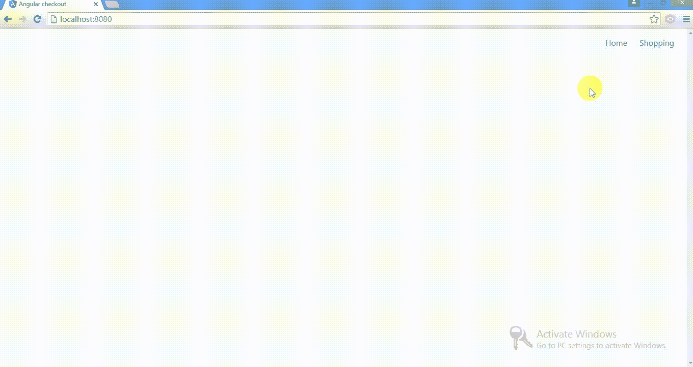
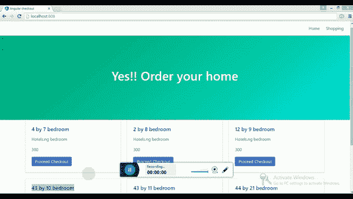

# 在电子商务 Web 应用程序中使用角标强制导航

> 原文：<https://medium.com/hackernoon/navigating-imperatively-with-angular-dart-in-an-e-commerce-web-app-f9d7d0da096f>

Our E-commerce Web App.

[之前，](https://hackernoon.com/router-practical-approach-with-angular-dart-80485978a124)我们研究了使用路由器从一个视图导航到另一个视图，这需要锚链接，我们将 **routerLink** 属性传递给 shell，但是这种方法需要我们不断为每个视图创建组件，但是如果有更好的方法来编写代码并在视图之间导航，而不必为每个视图创建新的组件呢？

今天，我们将通过像 web app 这样的电子商务来研究这一点，同时在产品和结账之间进行交互。

现在，我们的应用程序中列出的产品很少，但这是否意味着我们必须为每个产品结账创建一个新视图？这可能真的很有压力，并且使我们很难管理我们的代码库，这就是为什么强制导航看起来很重要。

使用命令式导航，我们只需为产品结账页面创建一个视图，并将其绑定到产品结账按钮，告诉路由器导航到该页面，并提供产品数据，我们现在将一步一步地完成这项工作。

如果你不知道什么是路由器以及如何使用它，请参考我以前的教程[。](https://hackernoon.com/router-practical-approach-with-angular-dart-80485978a124)

在我们开始之前，请确保您知道如何执行以下操作:

**-创建并定义路线路径**

**-创建一个向我们的应用程序异步提供数据的服务**

就这样了。在本教程结束时，你的应用程序应该像上面的图片一样运行，尽管缺乏高质量的用户界面，特别是在结账页面。

好了，我已经准备好了我们需要的文件，包括 UI、产品数据，我还创建了一个服务，所以只需从我的[库](https://github.com/corpsgeek/naviagting-imperatively-with-angular-dart)中克隆它，运行 pub get 和 webdev serve。

我想我们都已经准备好进行强制性导航了。

在进入命令式导航之前，让我们运行应用程序来了解一下变化和结构。现在，当用户点击继续结帐时，所点击产品的详细信息显示在产品列表部分，如下所示:

现在，我们想要做的是，当用户单击“前进到结帐”按钮时，我们希望它导航到一个全新的视图，并显示所单击的特定产品的数据。

我们要做的第一件事是为新视图创建一个组件，我们称之为 checkout 视图。因此，让我们在 lib 文件夹中创建一个 **checkout.dart** 文件，并向其中添加以下代码:

开始吧，我们已经有了选择器、模板、指令，还导出了路由路径和路由。如果你注意到我们没有导入 RoutePaths 和 Routes 包，因为我们已经在 app 组件中导入了，从而使它可用于所有其他组件。

接下来，我们定义结账的路径，这将是棘手的部分。

所以，我们现在想要的是，当用户点击产品时，我们的 URL 显示产品名称，就像这样:

[http://localhost:8080/# shopping/2% 20 by % 208% 20 bedroom](http://localhost:8080/#shopping/2%20by%208%20bedroom)

该 URL 表明用户点击了“继续”来结帐名为“2 乘 8 卧室”的产品，这只能通过使用路由参数来完成。路由参数的语法如下:

参数只返回一个字符串，但是我们也可以解析它来返回一个整数，基于路由参数的 API 文档，没有任何关于如何使用它的明确定义，所以我也要这么做。

首先，我们希望 URL 指示 shopping/“product name ”,但是我们已经为购物创建了一个路由路径，所以我们将使用 **shopping.path** 来引用购物路径。

我们还想传入产品名，为此我们首先创建一个变量名 **idParam** ，并赋予它一个值*“产品”*。

> 我们在购物页面中使用了价值产品来列出我们列表中的所有商品，为了安全起见，我建议您在程序中保持一个变量名。事情可能会变得更大，您无法跟踪所有这些变量名。

好了，让我们继续创建一个常量变量名 **idParam** ，其值乘积正好在 **RoutePaths** 的类声明之上。

接下来，我们通过将 **idParam** 作为参数来定义 checkout 的路由路径

正如我前面提到的，我们希望 URL 地址指示 **#shopping** ，正确的做法是引用购物路径，后跟一个正斜杠，并使用 **idParam** 作为路由参数。

似乎我们还没有完成， **idParam** 在 route 参数的路径中创建了一个槽，路由器会将所单击产品的产品名称插入到我们的槽中，如果我们告诉路由器导航到 checkout 组件，并显示产品名称为 2x 2 bedroom、价格为 300 美元的产品的 checkout 详细信息以及描述，URL 应该如下所示:

[http://localhost:8080/# shopping/2% 20 by % 208% 20 bedroom](http://localhost:8080/#shopping/2%20by%208%20bedroom)

如果用户也在地址栏中直接输入上述 URL，它会导航到该产品的结帐页面，就像我前面解释的那样。

**RouterParameters** 属性具有字符串类型的 URL 参数的映射，使得如果匹配的 **RouteDefinition** 路径具有路径“shopping/:productName”并且 URL 是“shopping/2by2bedroom”，则路由器参数将等于{productName: '2by2bedroom'}。

接下来是获取被点击的产品的名称，并将其传递到路由参数中。在我们的 **route_path.dart** 文件中，我们创建了一个方法 **getName()** ，该方法返回一个字符串值并接收路由器参数的一个参数。

**getProducts()** 方法返回给定[product]的值，如果[product]不在映射中，则返回 null。有些映射允许键的值为 null，所以我们还将它设置为如果乘积等于 null 则返回 null，如果为 false 则返回产品名称，这是一个字符串参数。

> 如果您尝试返回一个整数，并且我们很清楚 route parameters 接收一个字符串，我们使用**try parse(***source***)**方法将该项解析为一个整数，如下面的代码所示:

接下来，我们以与定义其他视图的路由路径相同的传统方式来定义结帐路由路径:

现在，我们已经准备好实现所有必须导航的结账路径。

让我们将 dart 文件切换到保存所有产品列表的组件，即 **shopping.dart** 文件。我们不会添加任何 **routerLink** 来继续检查锚链接标签，而是使用路由器强制导航。但是首先我们在我们的**购物组件**类中初始化路由器

在初始化路由器之后，我们创建一个私有方法，因为它将被初始化，它保存结帐视图 URL，并且还将所需的参数传递给结帐路径:

**_checkoutUrl** 接受产品的字符串参数，因为我们的产品名称是一个字符串，就像我前面提到的那样— *在强制导航时维护一个变量名。*

**chechoutUrl** 使用 arrow 语法传递结账路径的 Url 和必要的参数。

因此，我们想告诉路由器在发生什么事情时自动导航，在这种情况下，当用户点击继续结帐按钮。

当调用**router . navigate**时，Future 用于延迟计算，而 **NavigationResult** 保存调用 **router.navigate** 的结果，router.navigate 试图导航到定义的路径，在这种情况下是检验路径。

我们在 **_checkoutUrl()** 方法中定义了产品的字符串参数，即产品名称。

前面，我们初始化了 **onSelect()** 方法，该方法响应一个点击事件，并返回被点击产品的数据，将其存储在类型类 **Products** 的变量 **selectedProduct** 中。

但是我们不想再在产品列表下显示所选产品，我们只想在另一个视图中显示所选产品，因此我们将 products 参数传递给 **_checkoutProduct()** ，这使我们能够引用特定的产品名称。

就是这样；我们已经完成了与购物组件的交互，剩下的部分在结帐视图组件中，但是让我们转到购物组件 HTML 文件，并剪切掉所选的产品部分。

我们将把这个 **selectedProduct** 部分粘贴到我们的 checkout 组件的模板属性中。

很快，让我们将 **ShoppingComponent** 添加到我们的指令中，并导入 **ShoppingComponent** dart 文件。

在我们的 **CheckoutComponent** 类中，我们初始化了**产品服务**和**位置**，它们与浏览器 URL 交互，还将用于导航回购物页面；我们还声明了类型类 **Products** 的变量名 **selectedProduct** ，它与模板中的 ***ngIf** 属性中的变量相同。

我们在 **CheckoutComponent** 类上实现 **onActivate** 生命周期挂钩。

> **onActivate** 是一个生命周期接口，它在组件被路由激活时发出通知。如果组件类将作为路由定义的一部分被导航到，并且希望在由于路由而被激活时得到通知，那么它们应该实现这一点。

在实现了 **onActivate** 之后，我们创建了一个覆盖注释来覆盖 **onActivate** 方法

我们用下划线( **_** )替换 **RouterState** previous，该下划线在路由器出口插入组件后被调用，并将在初始变化检测后出现。

接下来，我们将这段代码添加到 **onActivate** 方法中:

**get product(current . parameters)**从 route path 返回产品的当前值，如果产品不等于 null，我们将产品赋给变量名 **selectedProduct** 。

我们还没有初始化 **get()** 方法，该方法只能在产品服务类中完成。

**await** 表示异步操作，因此我们将 **async** 添加到 **onActivate()** 方法中，该方法异步获取产品数据。

最后，我们转向产品服务类并添加一个 **get** 方法，该方法从产品列表中异步获取数据，同时迭代列表以获取列表中第一次出现的所选产品名称。

是的，这就解决了问题，我们的应用程序运行良好，那么为什么不在您的…..

还有一件事，让我们看看**位置**是如何有用的。

在我们的结帐页面中，我将添加一个“**返回购物**”按钮，使用 location.back 将用户导航回上一页

将这段 HTML 代码添加到结帐页面的模板中，并将这段代码添加到实现 **goBack()** click 事件的 **CheckoutComponent** 类中

位置类可以在平台(浏览器)历史中向后和向前导航。

是的，回到我刚才说的。

这就解决了问题，我们的应用程序运行良好，那么为什么不在你的下一个电子商务应用程序或任何你选择的应用程序(如博客)中使用强制导航呢？