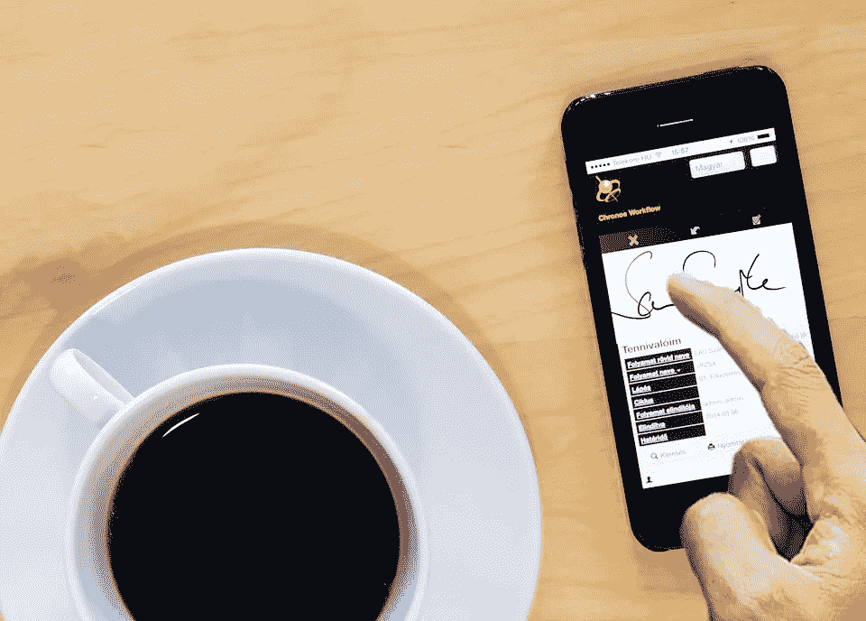

# 利用电子签名和健康数据解决安全问题

> 原文：<https://medium.com/hackernoon/navigating-security-concerns-with-e-signatures-health-data-8e21ea15a14f>

[管理层](https://hackernoon.com/tagged/management)和人力资源团队有时可能对员工入职和业务合同等流程的电子签名安全性感到陌生。此外，应用程序开发人员通常会担心与医疗保健提供商处理患者数据相关的符合 HIPAA 的数据安全问题。

让我们来看看新的数字安全技术和协议可能会如何影响您的[组织](https://hackernoon.com/tagged/organization)。

**电子签名与数字签名**

对于更常见的商业应用，有效的数字签名不仅通过加密来保护敏感数据，而且还可以检测篡改行为并增强签名者的信任。电子签名也是一个法律概念，它提供了一种持久的、长久的表示和对某人意图的捕捉。

虽然它们听起来可能一样，但是电子签名和数字签名不是一回事。[美国《全球和国家商务电子签名法》将电子签名](https://www.esignlive.com/blog/the-difference-between-e-signatures-and-digital-signatures/)定义为“附加在合同或其他记录上或与之相关联的电子声音、符号或过程，并由某人采用，意图签署记录”，而数字签名则是指电子签名所基于的加密技术。

不幸的是，通过暗网可以获得[数字代码签名证书——当然，是要付费的。](https://thehackernews.com/2017/11/malware-digital-certificate.html)[电子邮件仍然是](https://www.pcworld.com/article/3196902/security/digital-signature-service-docusign-hacked-and-email-addresses-stolen.html)一个易受攻击的点，黑客仍然利用它来获取上传到云的私人用户数据。

然而，在银行和税务相关交易中使用的电子签名包含了一个强大的、[复杂的安全规定网络](http://www.nbcnews.com/id/41256683/ns/technology_and_science-security/t/e-signatures-safer-real-thing-experts-say/#.WnCVLainHIV),使得电子签名与真实签名一样安全——或者更安全。由于在备份电子签名时使用了大量生物测定和二级认证措施，黑客侵入带有电子签名的文档的情况极不可能发生。

**医疗保健数据安全**

虽然[许多披露个人健康信息的医疗保健交易一般不需要签名](https://www.hipaajournal.com/can-e-signatures-be-used-under-hipaa-rules-2345/),但出于营销或研究目的签署的授权应符合法律规定，并在用户完全知情和同意的情况下验证用户的身份。例如，医疗软件应用程序必须符合 HIPAA，像 HIPAA Journal 发布的这种[指南可以帮助开发者通过安全协议。](https://www.hipaajournal.com/hipaa-compliance-for-medical-software-applications/)

由于[大量的医疗保健数据](https://www.gohealthuc.com/library/benefits-latest-emerging-medical-technologies)已经数字化并可通过多种平台获得，这种可用性正在改变提供者治疗患者的方式——以及患者治愈的方式。例如，远程医疗的发展使患者可以更灵活地在自己家里看医生，而不是被迫长途跋涉或请假。

物联网(IoT)普及了可以远程配置医疗设备、个性化医疗和患者监护的移动应用。此外，可穿戴健康传感器、3d 打印机、液体活检和声音生物标记正在引入一种新的、未来的实现方式，以及 10 年前还不存在的数据可访问性。

**数字公民身份**

[Ritesh gujarati 最近写了一篇文章](https://hackernoon.com/citizenship-in-the-age-of-digital-transformation-fa95f17ba989)，列出了数字公民的九个重要元素:数字接入、数字商务、数字通信、数字素养、数字礼仪、数字法律、数字权利和责任、数字健康和福利以及数字安全。这不仅是一个文化问题，也是一个礼仪、安全和权利问题，以确保客户和客户的个人信息保持私密，并通过强数字签名来保护他们的电子签名以及其他个人信息的完整性和机密性。

一个万无一失的、基于商业的数字签名将使客户和投资伙伴更有可能提供他们的电子签名并与你做生意。然而，如果你的公司未能保护其所有客户数据，他们很可能会步 Equifax 或易贝的后尘:成为[安全漏洞](https://hackernoon.com/a-revolution-in-privacy-security-and-data-is-coming-are-you-ready-255328783bea)的受害者，原因是未能更新你的安全软件，以包括最新的[区块链](https://hackernoon.com/privacy-on-the-blockchain-7549b50160ec)、加密货币、防恶意软件网络安全程序和可用的加密程序。

*** * ***

随着[互联网犯罪的增加](https://www.houstoncriminallaw.com/internet-crimes-on-the-rise/)，采用最安全、最加密的文档交换和网络安全防御措施最符合您公司的利益。贵公司如何通过数字签名技术收集有说服力的电子证据？

在发生安全违规事件时，您的组织是否能够向所有相关业务方提供捕获证据的快照？请在下面的评论区分享你的经历。