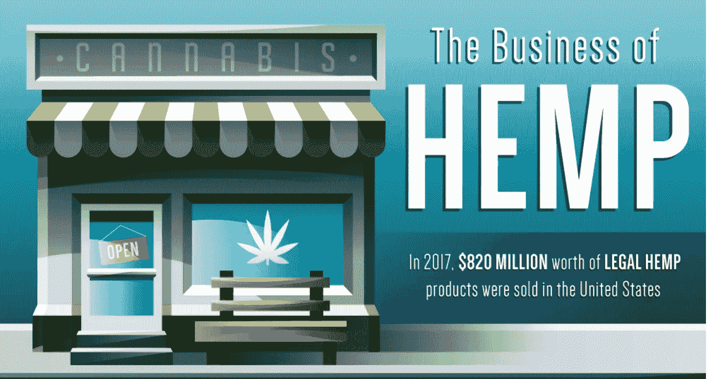
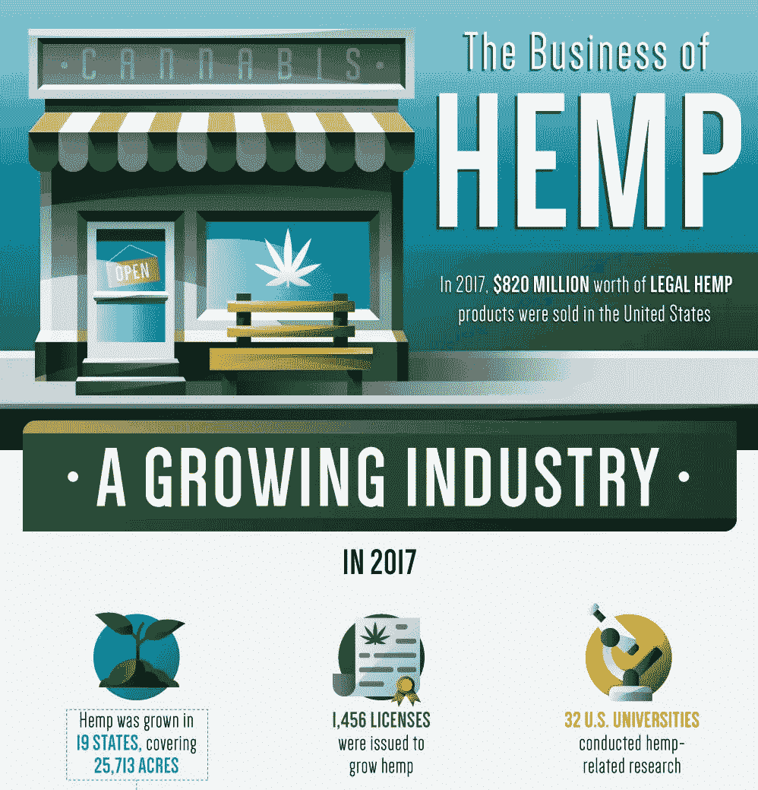

# 大麻行业导航

> 原文：<https://medium.com/hackernoon/navigating-the-business-of-hemp-43a688cd7f08>

2017 年，美国出售了价值 8.2 亿美元的合法大麻产品，从药用到纺织品，以及介于两者之间的一切。这是全美 32 所大学研究的焦点，超过 1400 个许可证被颁发给大麻种植者。这种蓬勃发展的业务只是受到法律的阻碍，其中许多法律已有近一个世纪的历史。

大麻除了是大麻的近亲，与没有药用价值、滥用风险高的管制药物享有同样的法律地位之外，还受到了不好的指责。幸运的是，公众对这种作物越来越好奇，也越来越开放，鼓励了行业发展，甚至影响了法律的修改。在美国历史上，这不是第一次必然性影响了这一特殊领域的变革。早在二战时期，一个名为“胜利的大麻”的项目鼓励农民利用他们的土地种植大麻，并用它来提供必要的纺织品，如绳子和降落伞，以帮助美国的战争努力。尽管今天这个项目经常被遗忘，但它证明了改变是可能的。如今，药物特性和环境因素开始流行起来。大量研究表明，CBD 补充剂可以缓解慢性疼痛、焦虑和抑郁、改善消化系统健康等。大麻为农田问题提供了一种解决方案，因为与棉花相比，它需要减少的面积、水需求和劳动力需求，并且是最环保的作物之一。难怪大麻一度是农业的主要产品，甚至在美国历史的早期被认为是法定货币。

现代麻可以说是一个成长中的产业。大麻可用于纺织、医药、造纸等行业，甚至工业应用，用途已超过 25，000 种。看看这张关于大麻生产现状的信息图，这是法律上的挑战，聪明的商业领袖是如何对抗过时的法律的，以及大麻在美国的未来是什么样的。

