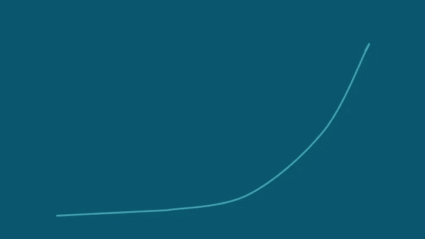
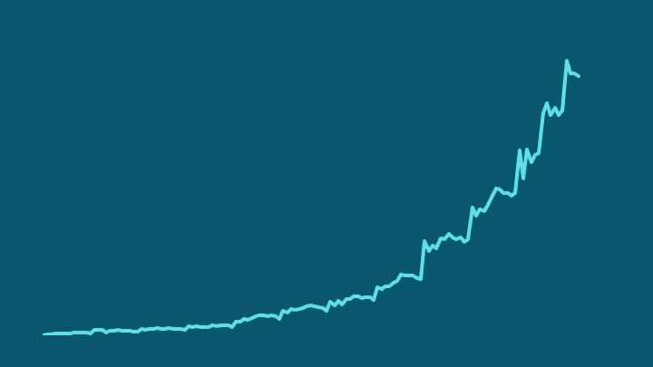
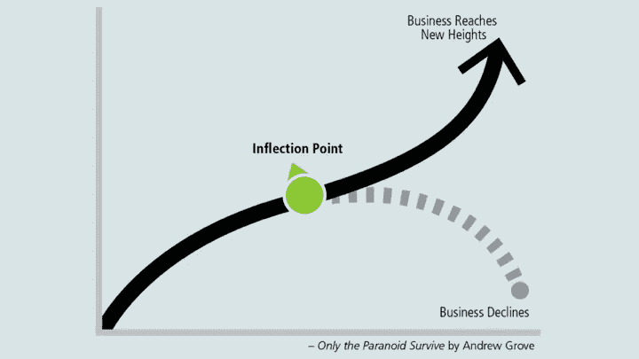
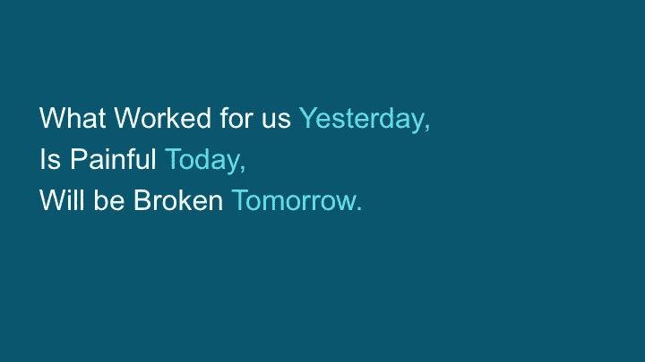

# 穿越高速增长阶段

> 原文：<https://medium.com/hackernoon/navigating-the-stages-of-hyper-growth-6201d65eaaa8>

我于 2009 年加入 Skyscanner。当时，该团队不到 30 人，致力于开发航班元搜索产品，该产品刚刚够得上市场需求。继用户和收入连续同比两位数增长之后；每月接触 6000 万旅客，使用 30 种语言，预订 200 万次航班；并在全球 10 个办事处建立了 900 多人的团队— [Skyscanner 于 2016 年 11 月被携程以 14 亿英镑(17.4 亿美元)的价格收购](https://techcrunch.com/2016/11/23/ctrip-skyscanner/)。

2017 年末，我应邀在苏格兰一个为雄心勃勃的初创企业举办的知识共享论坛[上发表演讲，让他们了解在 Skyscanner 上经历那种程度的高速增长是什么感觉。讨论的主题是组织成长过程中的各个阶段。这是那次谈话的摘要。](https://crux.shoaltogether.com/)[这些幻灯片也可以在 Slideshare](https://www.slideshare.net/richardlennox/navigating-stages-of-hypergrowth) 上找到。

## 穿越高速增长阶段

Hockey Stick Curve of Growth

那些领先的技术主导型企业实现的完美增长是每个雄心勃勃的初创企业的愿望。然而，这条平滑的曲线不能准确地代表现实。它是缩小的、平滑的宏观视图，允许我们理智地应用业务成熟度模型，并定义业务整个生命周期的各个阶段。

现实是，在任何时间点，它都不是完美的指数曲线。经历这一切是不同的。对于一个正在经历显著增长的企业来说，事实实际上更像是一系列更精细、更小的曲棍球棒式增长周期。Skyscanner 从 2003 年到 2016 年每月活跃用户的增长更准确。

Skyscanner’s growth monthly active users from 2003 to 2016

每一年都代表着新的发展或旅程中的新阶段。在旅程的某些点上，需要有意识的努力来确保我们积极地沿着这条轨迹继续下去。这些阶段和周期比单一的生命周期模型所显示的要短得多，也多得多。

英特尔联合创始人安德鲁·格罗夫(Andrew Grove)在 1981 年出版的《只有偏执狂才能生存》(Only the Paranoid Survive)一书中引入了拐点的概念:

> 战略拐点是企业生命中基本面即将改变的时刻。这种变化可能意味着一个上升到新高度的机会。但这也可能标志着末日的开始。

在一个高速发展的组织中，这些转折点经常发生——有些局限于一个产品领域，但有些会影响整个组织。每一个都创造了新的条件、新的规范，并需要不同的方法。他们之间可能只有几个月的时间，尤其是在组织加速发展的早期。很少有几年时间。无论是因为你发现了新的见解，需要对你的产品目标进行重大调整，还是因为团队规模翻倍带来的成长的烦恼，根本性的转变是不可避免的(T2)。

每个转折点对你和你的企业来说都是独一无二的。在您的新环境中，没有确定的制胜之道—要继续发展壮大，您需要全力投入应对这些挑战。经验可以帮助你识别它们，并帮助你识别在类似情况下可能有效但必须谨慎使用的方法。

## 持续改进

[赫拉克利特](https://en.wikipedia.org/wiki/Heraclitus)，一位生活在公元前 6 世纪的前苏格拉底时代的哲学家，被认为是这个片段的作者。

> 一切都在变化，没有什么是静止的……而且……你不可能两次踏入同一条河流

作为一名软件工程师，我一直知道[摩尔定律](https://en.wikipedia.org/wiki/Moore%27s_law)对我们的学科有着重大的影响。随着处理器变得更快，存储变得更便宜，新方法和新系统正以前所未有的速度被构建。不可能跟得上每一次进步。

我逐渐认识到，这不仅仅是一场技术进化。技术只是我们实现目标的工具。我们解决问题的方法和推动这些解决方案的流程必须随着我们与技术的结合而发展。我们必须提高整个系统的效率。作为组织、团队和个人，我们必须不断改进——在我们的新环境中，接受以前对我们有用的东西将开始限制我们的成功。

What worked Yesterday, is Painful Today, Will be Broken Tomorrow

当我们敞开心扉挑战我们现有的方法时，我们将开始从不同的、更具原创性的角度来看待问题，并通过实验来发现今天可行的新方法。我们开始认识到失败其实只是一个机会。

反思和持续改进的精髓贯穿于 Skyscanner 的始终。对于小型敏捷团队来说，我们很自然地会问自己——“什么做得好，什么做得不好”。更困难的是当我们开始关注跨多个团队的大规模交付问题时。其中之一就是我们的翻译流程——当使用 30 多种语言时，这会大大降低我们的速度。我们必须发现技术，评估团队面临的整体问题，而不是局部问题。我们停止工作流程，专注于解决问题。我们应用精益和约束理论技术来审查，剔除一些瓶颈，并创建一个全新的方法，将我们从超过 2 周的翻译周转期转移到<2 days and subsequently <24 hours.

## Time it right. Look to Leading Indicators.

One of the most used (and perhaps overused) clichés is Wayne Gretzky’s famous quote:

> I skate to where the puck is going to be, not where it has been.

It has been re-used by the likes of Steve Jobs and Warren Buffet on occasion and is somewhat of a rallying cry for [产品管理](/@johnv/the-bipolar-nature-of-product-management-6c534479d2e9)。然而，格雷茨基预见冰球去向的能力在国家曲棍球联盟的历史上很少有人能与之匹敌——[他仍然保持着 60 项 NHL 官方记录](https://en.wikipedia.org/wiki/List_of_career_achievements_by_Wayne_Gretzky)，他于 1999 年退役！只能断言，看到冰球会在哪里实际上真的很难。然而，这句话的意图是正确的，这就是为什么我认为这句话被广泛使用的原因。

导航拐点的关键之一是认识到，你正在走向一个拐点，尤其是当你正在赢的时候。如果你已经过了点，能看到下降，那很可能就来不及了。时机至关重要。

不幸的是，我们传统上衡量企业成功的方式，如收入，是滞后的指标。

滞后指标显然是有价值的，但它们是“事后”措施，告诉你结果，而不是在可操作的时间尺度上的状态。收入增长的下降可能表明企业基础的转变，但这可能发生在根本原因发展的几个月后。到那时，遏制这种下降就变得相当困难了。

领先指标可以更好地预测未来事件，并且可以接近实时地退出。他们很可能是行为驱动的，而不是结果驱动的。如果你能理解客户行为和最终结果之间的联系，那么利用你的领先指标来影响结果是至关重要的。

领先指标同样适用于您的日常运营。问问你自己:“什么在改变，什么对团队来说变得更困难了？团队的痛在哪里？”鉴于他们与问题的密切关系，你的一线团队很可能会在你意识到之前感受到拐点开始带来的痛苦。这些症状中的一些将是不可测量的、不可触摸的或基于感觉的——在你的测量中可能没有任何具体的东西。但是知道你的团队感受到了痛苦，这是一个尽快找出原因的信号。它们是预警系统的重要组成部分。

在使用 Skyscanner 的一段时间里，我们决定通过减少频率、增加整体大小来处理发布期间增加的痛苦，但似乎更频繁地承受痛苦。我们即将做出一个决定，用一个 6 周的发布周期来代替一个 4 周的发布周期。够了。虽然产品会发布，每月的痛苦会减少，但我们会创造更多的挑战。传统观点认为，每 6 周做一次同样的努力比每 4 周做一次要好。最终，团队领导了改变范式的对话。我们的产品交付机制出现了拐点。这需要大量的容量和几个月的时间来大幅改善，但我们自己设定的道路导致 Skyscanner 的产品开发团队每周运行数百次实验。

## 你的团队至关重要

我们的组织是一个团队，由我们聘请的专家组成。他们带来了自己独特的经验和方法。为了度过拐点，我们需要整个团队都给予支持*和*支持。在经历拐点时，你的团队是最重要的资产。

因此，雇佣合适的人对你的整体战略至关重要。无论你的企业处于哪个阶段，你都希望在每个候选人身上找到一种品质，那就是[成长心态](/@ruth_obe/growth-mindset-a3b13566a78d)。

Growth vs Fixed Mindset

在卡罗尔·德韦克的介绍下，她认为我们的心态决定了我们是否相信自己能够学习、改变和成长。具有成长心态的人相信他们有能力学习去实现任何事情，他们欢迎问题，并将它们视为需要回避和克服的障碍。

正是这种方法，你需要能够不断适应成长所创造的不断变化的环境。通过在你自己和你的团队中寻找它，你将自然地在组织中拥有适应企业经历其基本面转变的愿望和弹性。

对于 Skyscanner 经历的最大拐点之一，它需要停止所有活动的产品开发数周，以修复一些核心问题。这不是一个轻率的决定，它极大地影响了一切。我们慢了下来，不是由任何原因造成的，但是车队感觉到了，整个组织也感觉到了。我们的方法越来越令人沮丧。这是导火索——不是一个可衡量的项目。只有通过倾听一线同事的意见，他们的成长心态告诉我们可以找到更好的方法，并愿意帮助指导我们，我们才发现我们遇到了一些重大障碍，我们必须再次改变我们的方法。

## 结论

在一个经历高速增长的组织中成为一名积极的领导者是一种非常特别和令人振奋的经历。大多数企业不会看到 Skyscanner 的成功。但是对于那些渴望成功的人来说，我有 4 条经验可以帮助你驾驭高速增长:

1.  拐点是*必然*和*频繁*。拥抱不断的变化。
2.  *不断改进每件事，认识到以前有效的事情不太可能再次有效。*
3.  你必须*通过观察你的*领先指标来选择正确的*时间。*
4.  您的*团队*至关重要，是您最宝贵的资产。雇佣那些有成长心态的人，并赋予他们成功的能力。