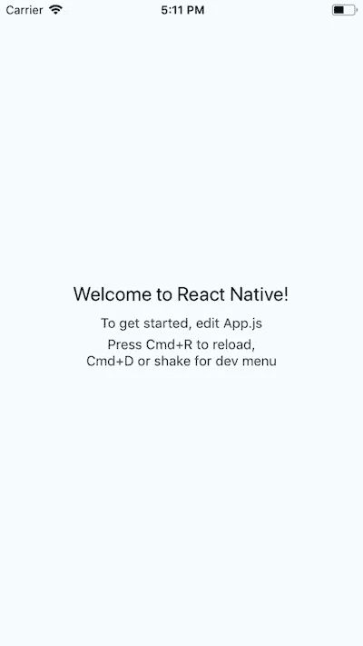
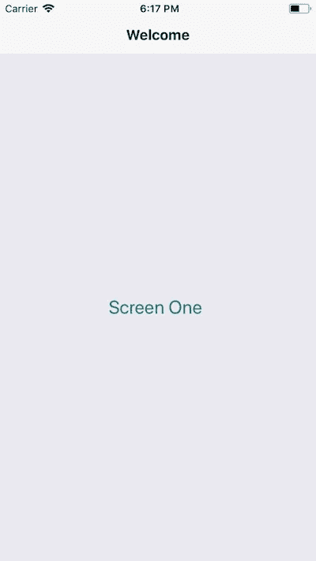
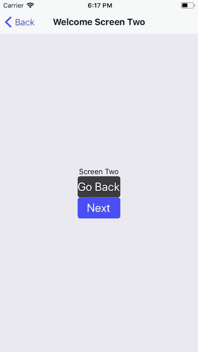
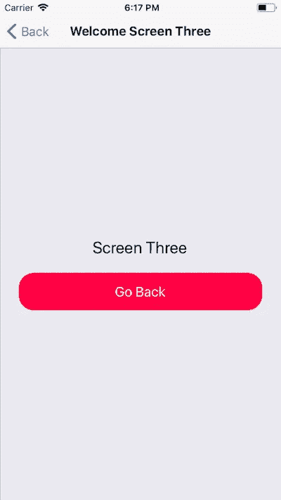
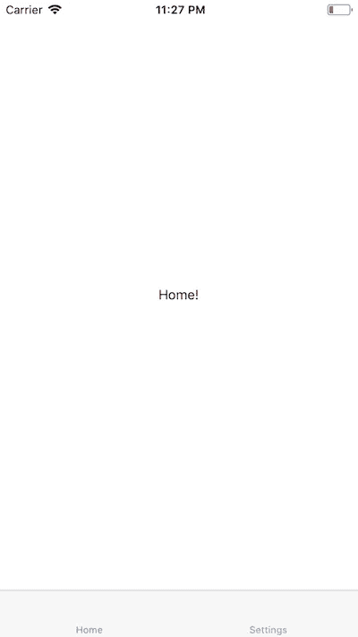
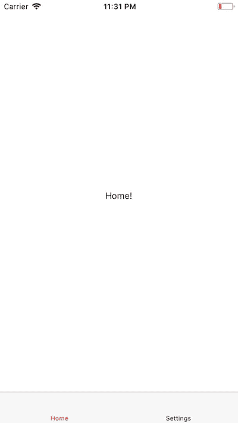

# 如何在 React 本地应用中使用 React 导航

> 原文：<https://medium.com/hackernoon/navigation-in-a-react-native-app-cf61ed85e80b>

导航在移动应用中扮演着重要的角色。如果没有导航，应用程序就没什么用处。在本教程中，我们将从头开始学习如何在 React 本机应用程序中实现导航。如果你熟悉网络，或者对图书馆有所了解，导航的总体概念是一样的。它用于导航到不同的页面或屏幕(在我们的例子中)。然而，这里导航库的实现不同于 web。

# 入门指南

在构建一个移动应用程序之前，建议花一些时间来规划应用程序将如何处理导航和路由。在本模块中，我们将讲述可供我们使用的不同导航技术。首先，让我们设置我们的项目。为此，我们将使用 **react 本地 CLI 工具**。如果您还没有安装它，请键入第一行，否则如果您已经安装了，您可以跳过第一个命令。

接下来，我们将导航到新的项目目录，并通过运行以下命令来运行项目，以查看是否一切正常。

之后，我们将安装在应用程序中实现导航所需的依赖项。

既然我们已经创建了最基本的应用程序并安装了所需的依赖项，我们可以从创建组件开始，看看不同的导航技术。

# 堆栈导航

堆栈导航正是单词*堆栈*所指的。就是一堆可以从顶部去掉的屏幕或者 app 页面。它遵循一个简单的机制，*后进先出*。它堆叠导航器，这意味着，在彼此之上添加屏幕。为了实现这一点，我们将在目录`src/`中创建三个屏幕。如果目录名不可用，请创建一个。这三个画面是`.js`档:`ScreenOne`、`ScreenTwo`和`ScreenThree`。

注意，在所有三个屏幕中，我们都将访问`navigation.state`作为道具，将`navigationOptions`作为静态对象。navigationOptions 接受屏幕标题 *Welcome* 的标题选项。在上面的应用程序屏幕中，您会在工具栏中看到欢迎文本。其他割台选项包括`headerTitle`、`headerStyle`等等。这是通过`react-navigation`依赖关系提供给我们的。

对象也有不同的属性，我们可以在组件中直接访问它们。第一个，`navigate`用于指定屏幕导航。接下来，`goBack()`是帮助我们导航回上一屏幕的方法(如果可用)。最后，`state`对象帮助我们跟踪以前的和新的状态。

使用`onPress()`处理程序，我们也可以像在`ScreenOne.js`中一样直接访问屏幕。只需将组件和屏幕名称作为参数传递。

由于下面的配置，所有这些方法和对象对我们的组件都是可用的。为了利用这三个屏幕，并查看堆栈导航如何工作，我们将把`App.js`修改为:

我们正在从`react-navigation`和我们在源目录中创建的所有其他屏幕导入`StackNavigator`。

*屏幕一*

*画面二*

*画面三*

# 标签导航

选项卡导航的工作方式不同于堆栈导航。不同的屏幕将在某一点上对 UI 可用，并且没有第一个或下一个屏幕。用户可以从选项卡菜单中访问每个选项卡。为了创建选项卡导航菜单，我们需要导入`createBottomTabNavigator`。让我们看看它是如何工作的。这一次，我们将编辑`App.js`代码。

当然，你可以通过将 Home 和 Setting screen 分离到它们自己的不同组件中来将它模块化一点。对于我们的演示应用程序，上面的例子正好满足了这个目的。您可以添加`tabBarOptions`来修改它的外观。

# 结论

掌握它们并将其用于您的应用程序可能需要一段时间，但是一旦您掌握了全部基本概念，您就可以用它创造奇迹了。您甚至可以为复杂的场景集成堆栈和选项卡导航器。`[react-navigation](https://reactnavigation.org/docs/en/getting-started.html)`有良好的文档记录。

*Github Repo 提供了完整的代码👇*

 [## amandeepmittal/rnNavApp

### ⚛️ + 📱react-导航示例。在 GitHub 上创建一个帐户，为 amandeepmittal/rnNavApp 开发做出贡献。

github.com](https://github.com/amandeepmittal/rnNavApp) 

我叫阿曼·米塔尔。我是一名开发人员，负责 Node.js 相关应用和❤️ React Native 的开发和咨询。这是我的 [**网站**](http://www.amanhimself.me) *和*[***@ amanish***](http://www.twitter.com/amanhimself)**的推特。**

*[**在此加入每周简讯。**](https://tinyletter.com/amanhimself)*

* [## 在 React Native 和 Expo 中访问地理位置和应用程序权限

### 在 web 中，地理定位作为 API 提供，在 web 应用程序中有不同的使用方法。同样，反应…

medium.com](/react-native-training/accessing-geo-location-and-app-permissions-in-react-native-and-expo-e7a1bd4714a2)  [## 如何使用 React Native 和 Expo 将 Redux 集成到您的应用程序中

### Redux 是 React Native 生态系统的重要组成部分。如果你的世界围绕着 JavaScript 转，你可能…

medium.freecodecamp.org](https://medium.freecodecamp.org/how-to-integrate-redux-into-your-application-with-react-native-and-expo-ec37c9ca6033) 

最初，这篇文章是在 Zeolearn.com 发表的。*