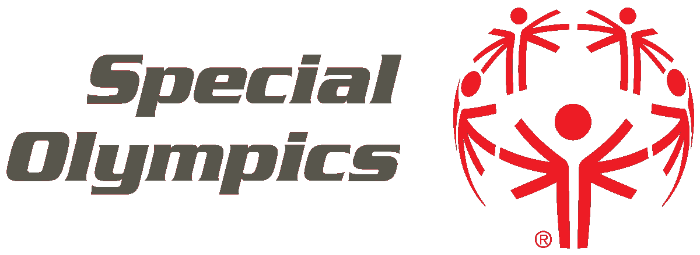

# 通过特奥会展现社会责任感，让智障人士也能参与体育运动

> 原文：<https://medium.com/hackernoon/ncloud-swiss-ag-shows-social-responsibility-and-wants-to-give-people-with-intellectual-51c9399a9829>

## *瑞士云提供商 n'cloud.swiss AG 支持瑞士特奥会作为智障运动员的捐助者，通过瑞士各地的体育项目让他们参与体育运动。*

Image: [www.pieper-salditt.de](http://pieper-salditt.de)

体育让人们走到一起。在这里，年龄、语言和原籍国都不起作用。智力残疾的程度不应该决定谁可以从这项运动的独特特征中受益。更重要的是，像瑞士特奥会这样的行动者要引起人们对体育运动重要性的关注，尤其是对残疾人而言。特奥会表明，除了强身健体之外，体育还能在多大程度上增强自尊、自立和尝试新事物的勇气。不同的赛事和体育项目将使与其他运动员、家庭成员和社会分享经验成为可能。残疾仅仅意味着你不能做别人能做的事情。这并不意味着你不能有任何目标和面对挑战。

“对残疾人的欣赏、接纳和平等是特奥会的动力和体现，这一愿景给我们公司的所有人留下了深刻的印象。我很高兴我们能在这里展示我们的社交脉络，做出我们的贡献，”T2 云瑞士股份公司的创始人兼董事长安德烈·马特说。

这家来自瑞士 Seengen 的云提供商利用了一段激动人心的公司历史，这段历史不是别人，正是由 André Matter 本人撰写的，主要是通过雄心、愿景、目标和不懈努力写成的。虽然最初是为花旗银行、迅达集团或 ABB Turbosystems 等知名大公司提供咨询服务，但欧洲首批云之一 n'cloud 却是在 2009 年从这位企业家的笔下推出的。

“要有远见，并以极大的热情追求和实现你的目标，从而赋予远见以生命。这正是我的动机。因此，作为一家公司，我们敢于在国际上取得重大突破。安德烈·马特强调说:“如果我能以我目前所取得的成绩回报特奥会，我会更加高兴”，并希望有更多的捐助者加入他的行列。有关基金会和积极捐款方式的更多信息，请访问 [www.specialolympics.ch](http://www.specialolympics.ch) 。

Image: [www.specialolympics.ch](http://www.specialolympics.ch)