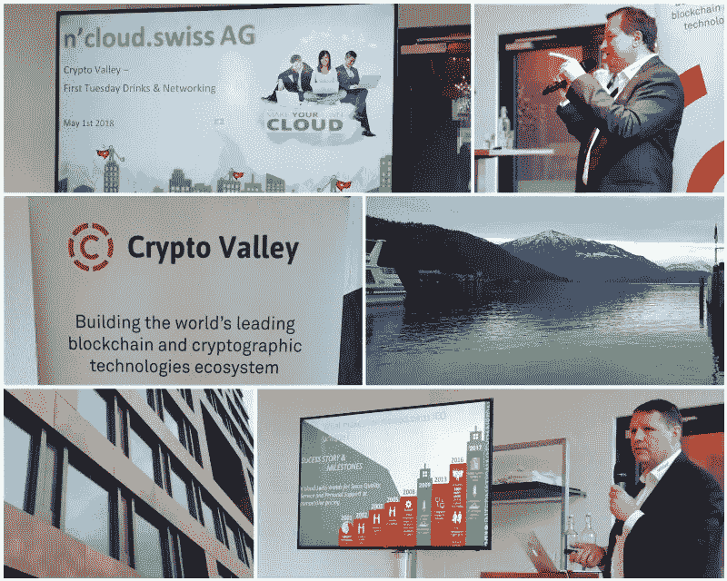

# n ' Cloud . Swiss——亚马逊 AWS、微软 Azure、谷歌 Cloud & Co .的瑞士云替代方案——在楚格的 Crypto Valley 展示云创新

> 原文：<https://medium.com/hackernoon/ncloud-swiss-the-swiss-cloud-alternative-to-amazon-aws-microsoft-azure-google-cloud-co-9bd059f1d1c1>

Image: n’cloud.swiss

楚格不仅仅是一个拥有美丽湖泊的美丽瑞士城市；楚格以“加密谷”闻名于世，是加密货币的硅谷。来自许多国家的领先技术专家、创新公司以及技术人员和书呆子来到楚格，开始新的令人兴奋的项目，介绍这一领域的新公司，结识来自世界各地的有趣的人，或者只是体验一下现场。

[加密谷协会](https://cryptovalley.swiss/)旨在建立世界领先的区块链和加密技术生态系统。在此背景下，5 月 1 日举办了“第一个星期二与来自 Seengen 的 n'cloud.swiss AG 和来自硅谷的 Crypto Explorers 一起喝酒&联网”活动。

在此次活动中，创始人兼董事长 André Matter 和首席营销官 Pascal Dossenbach 介绍了公司 n'cloud.swiss AG。除了创新的云平台 [www.ncloud.swiss](http://www.ncloud.swiss) 之外，其名为 NCU Token 的数字加密货币也向投资者、加密专家和感兴趣的贸易参观者等国际观众展示。

对于未来 7 年在多达 60 个国家的雄心勃勃的增长计划，该公司仍然独立融资，也向投资者和其他形式的外部融资机会开放。正因如此，ICO 项目启动。NCU utility token 也为 n'cloud.swiss 客户提供服务，作为打折购买 n'cloud.swiss 服务和产品的数字货币，但在可预见的未来，也可以在对投资者极具吸引力的所谓交易所(证券交易所)进行买卖。

n'cloud.swiss AG 是由位于瑞士 Seengen 的 Netkom IT Services GmbH 发起成立的。17 年来，Netkom 一直成功活跃在瑞士和海外的 IT 市场，同时也活跃在多个领域，例如作为瑞士[高尔夫球场](https://birdie-open.com/)的 IT 合作伙伴。n'cloud.swiss AG 是瑞士对亚马逊 AWS、微软 Azure、谷歌 Cloud & Co .的云回应。创新的云平台提供了从纯公共云到 PREM 云或混合云的所有云模式，在同一个软件中提供了众多云服务。因此，应用程序的可能性实际上是无限的，因此来自所有行业或服务分支的开发人员、软件公司、中小企业、咨询公司乃至大型国际公司都可以灵活地满足他们的云需求。

有关 ICO、云服务或公司的更多信息，请访问 [www.ncloud.swiss](http://www.ncloud.swiss) 或 [www.netkom.ch](http://www.netkom.ch) 。对于投资者关系，首席执行官 André Matter 期待您的来电，电话号码是+41 (0) 62 511 82 82。