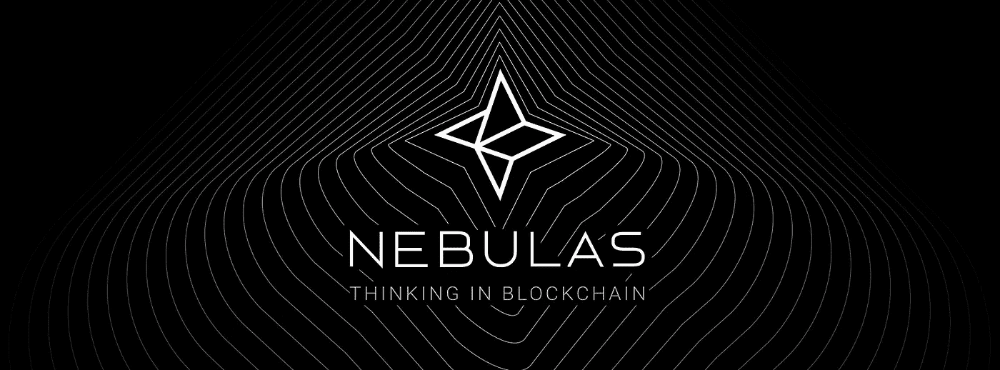

# 星云开创了新的先例，将团队令牌分配延长至 10 年

> 原文：<https://medium.com/hackernoon/nebulas-sets-new-precedent-by-extending-teams-token-distribution-to-10-years-4759301115f9>

加密行业因其快速的繁荣和萧条周期而闻名，公司筹集了数百万美元的资金，这些公司只创建了一个好看的网站和复杂的白皮书。

然而，似乎并不是所有的 ICO 项目都是为了快速获取现金。上周[宣布](/nebulasio/announcement-on-the-adjustment-of-the-way-nebulas-team-distribute-the-nas-reserved-6d35d172e2ef)Nebulas 的创始人将重组他们的代币清算协议，选择等待 10 年才能出售代币并从项目中套现。

Nebulas 是下一代公共区块链，成功筹集了 6000 万美元，是市值最高的 100 种硬币之一。该团队最初计划在 3 年内分配 20%的 NAS 令牌供应。对于创始人来说，这个时间表现在又延长了 7 年，以努力向投资者展示他们对项目的长期承诺。

在被问及为什么做出这一决定时，创业者 Nebulas 的创始人徐说:

*“我们意识到星云的建设和发展还有很长的路要走。我们需要关注星云的发展，包括技术和生态系统，”*

该队的市场总监贝基·卢也表达了同样的观点:

*“我们只是希望我们的团队专注于我们的技术愿景。这对每个人来说都不是一个容易的决定，因为区块链行业是一个非常创新的行业，仍然有很多风险。我认为这表明了我们的决心。”*

此外，该团队已决定发布持有其 NAS 令牌的智能合同地址，并将与第三方审计员合作来验证他们的财务状况。

在一个很难获得信任的行业，Nebulas 似乎为未来的 ICO 项目树立了一个很好的榜样。许多在纳斯达克证券交易所上市的上市公司已经遵循类似的做法，但在加密的狂野西部，这样的开放和承诺是罕见的。

十年之久的代币清算时间表是否会成为 ico 的新标准还有待观察。然而，从普通投资者的角度来看，毫无疑问，此举将使一个有前途的区块链项目更具吸引力。

*原载于 2018 年 8 月 14 日*[*cryptopotato.com*](https://cryptopotato.com/nebulas-sets-new-precedent-by-extending-teams-token-distribution-to-10-years/)*。*