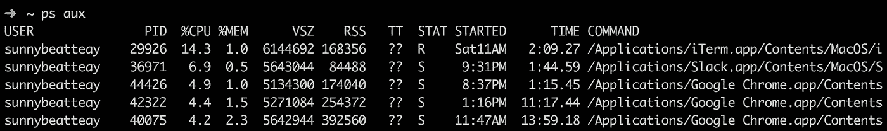
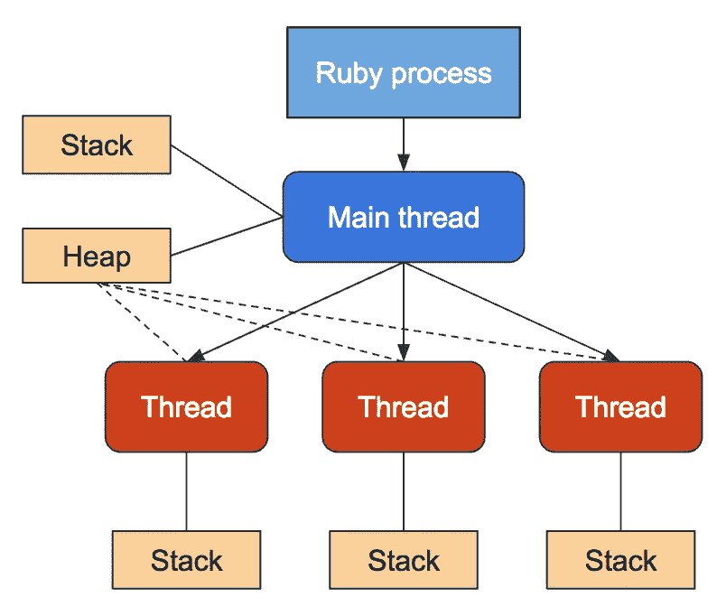
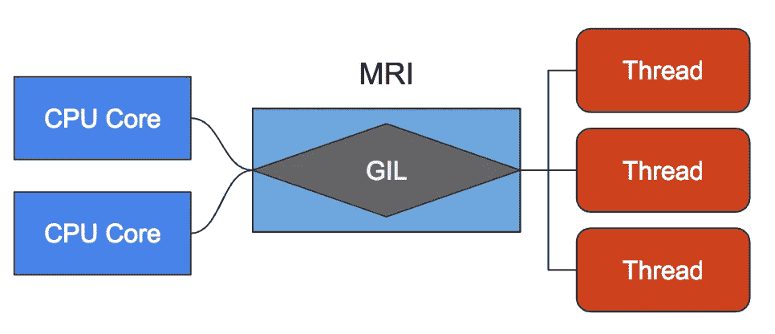
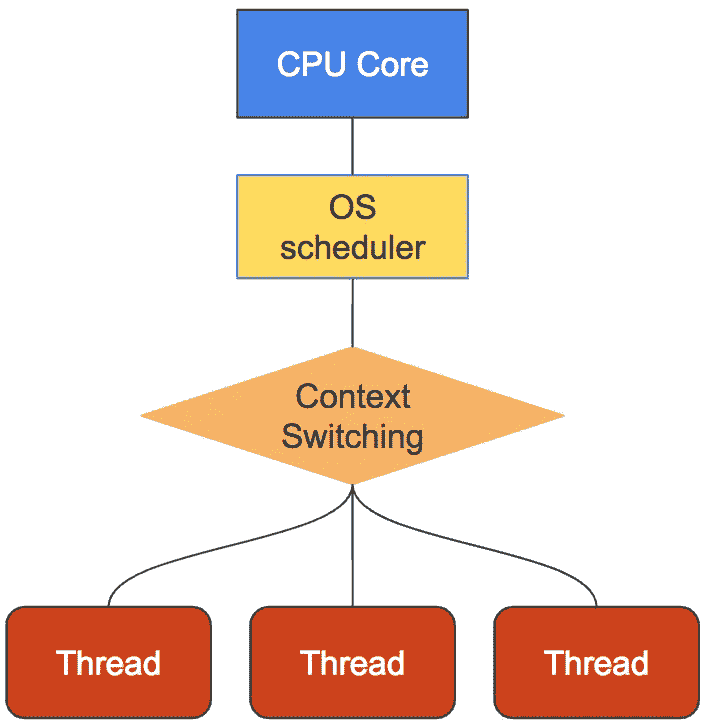

# 需要更快的代码？尝试多线程

> 原文：<https://medium.com/hackernoon/need-faster-code-try-multithreading-5dc30c83837c>


在程序员的职业生涯中，有时他们会意识到他们的代码只需要运行得更快。无论是创建低延迟 API 还是解析数十亿个数据点的程序，速度都是一个重要因素。

当你的代码运行太慢时，你能做什么？

幸运的是，编程工具包中有许多工具可以让代码运行得更快。你首先想到的可能是缓存。但是当缓存不是一个选项时呢？

另一个可行的选择是多线程。为了讨论多线程，讨论什么是进程和线程是很重要的。用最简单的术语来说，你可以把一个进程想象成一个正在执行的程序。

例如，在终端中运行`ps aux`来查看您的计算机上当前运行的所有进程。所有这些过程都对应于一个程序或应用程序。您正在阅读的 web 浏览器正在使用一个或多个进程。



Processes running on my computer

您可以将线程视为进程的工作线程。如果过程是老板，那么线程就是忠实的员工。每个进程启动一个线程，但是如果需要的话可以创建更多的线程。

一个进程中的所有线程共享相同的堆内存，但包含各自的执行堆栈。这意味着线程可以共享数据，但不能共享函数调用。



Credit: [https://workerholic.github.io](https://workerholic.github.io)

多线程之所以有用，是因为正在执行的程序可以将任务委托给许多不同的线程。这相当于一个雇主雇佣 50 名程序员来开发整个 SaaS 产品，而不仅仅是一个。展示这一点的最好方式是用一个例子。

*注意，本文中的所有代码示例都将使用 Ruby 编写，并将使用* `*Thread*` *类来运行新线程。*

比方说，你有一个程序需要遍历一系列任务并完成它们。在这个例子中，我们假设每个任务大约需要 1 秒钟来执行。如果您依靠单线程来执行这个循环，则需要 10 秒钟才能完成。

```
$ ruby 01_serial_loop.rb1
2
3
4
5
6
7
8
9
10**10.02504587173462 seconds to complete.**
```

然而，如果我们将每个任务分配给不同的工作人员，只需要 1 秒钟，因为所有的工作人员将同时工作。在 Ruby 中，这就像创建一个新的`Thread.new`实例并传递给它一个块来执行一样简单。每个`Thread.new`返回一个线程的新实例。

然而，仅仅增加新的线程是不够的。程序必须确保这些线程在退出前完成。如果一个程序没有明确地等待线程完成，这个程序就会过早地退出。

在 Ruby 中，必须在每个线程实例上调用`join`方法，以便每个线程与主线程连接。

```
$ ruby 02_multithread_loop.rb5
4
8
6
10
2
1
9
3
7**1.0051839351654053 seconds to complete.**
```

# 并发性和并行性

您可能已经从并发示例中注意到了一点，即线程以随机顺序返回。线程结束的顺序不同于它们被启动的顺序。它们是异步的。这是并发性和并行性背后的主要概念。每个线程以自己的速度开始和结束，而不考虑其他线程。

虽然并发性和并行性不同，但它们是相似的。每个概念之间的区别超出了本文的范围，但是[可以在这里阅读](https://blog.golang.org/concurrency-is-not-parallelism)。

需要注意的一点是，由于 Ruby 语言的限制——特别是 **Matz Ruby 解释器(MRI)** 和**全局解释器锁(GIL)**——标准版本的 Ruby 无法实现真正的并行。然而，它可以很好地处理并发。

*注意:MRI 在 Ruby 1.8 之前一直使用。从 1.9 版本开始，默认的解释器是* [*YARV*](http://www.atdot.net/yarv/) *(另一个 Ruby VM)*



The MRI and GIL prevent parallelism in standard Ruby versions. Credit: [https://workerholic.github.io](https://workerholic.github.io)

# 竞赛条件

理解并发性很重要，因为如果不小心的话，它会导致难以修复的错误。多线程中可能出现的一个错误叫做**竞争条件**。

最常见的竞争情况是多个线程试图同时访问同一块内存。这种情况的问题是许多操作可能被忽略，或者更糟的是，内存可能被破坏。

让我们来看一个例子，在这个例子中，许多线程试图增加一个全局计数器。我们从 0 开始计数，创建 1000 个线程，所有的任务都是将计数器加 1。

如果一切顺利，计数器最终应该是 1000。但是请记住，每个单独的线程都是在一个变量或一块内存上操作的。由于在单个状态上发生如此多的不同操作，可能会发生数据损坏。让我们看看在这种情况下会发生什么。

```
$ ruby 03_global_counter.rbcount = 1000
```

瞧啊。成功了！但是为什么呢？如此多的操作发生在一个州上，肯定会破坏它，对吗？不总是。

在这种情况下，每个线程必须执行的操作非常快，以至于在创建下一个线程时，第一个线程已经完成了。根本没有足够的时间让多个线程互相覆盖。

但是如果事实并非如此呢？如果每个线程在处理一个状态之前都必须做一些工作，比如 API 调用，那会怎么样？我们可以通过让每个线程在递增计数器之前随机休眠一段时间来模拟额外的工作。这将阻止线程立即结束。

```
$ ruby 04_sleeping_threads.rbcount = 1000
```

“嗯，”你可能会想。“看来它还是起作用了。我认为这家伙不知道自己在说什么。”

别太舒服了。这个例子成功的原因是标准的 Ruby 运行时不具备并行性。默认情况下，线程一次只会对一个全局变量执行一次。有了标准的 Ruby 运行时，你就不必太担心竞态条件。

但是如果你没有使用标准的 Ruby 运行时呢？如果您使用一种不同的语言或运行时，比如 JRuby，能够实现并行，那会怎么样？如果我们将 Ruby 版本切换到 JRuby，我们可以看到竞争条件的结果。

```
**# Change ruby version to JRuby** $ rbenv local jruby-9.1.10.0
$ ruby 04_sleeping_threads.rbcount = 864
```

呀。看起来我们的计数器少了 136 项。这意味着在一个或多个点上，多个线程会相互覆盖。

由于 JRuby 运行在 Java 虚拟机上，并且具有并行性，所以我们的程序容易受到竞争条件的影响。在[螺纹安全](https://en.wikipedia.org/wiki/Thread_safety)方面，非常不安全。

# 多个全局变量

如果我们在线程中访问多个共享数据，这个漏洞会更加明显。在下面的程序中，我有两个递增的计数器，它们之间的差值被计算出来。

如果一切顺利，我们应该看到两个最终计数都应该是 1000，diff 应该等于 0，这意味着计数值在任何时候都不会不同步。

```
$ ruby 05_multiple_counters.rbcount1 : 1000
count2 : 1000
diff : 0
```

执行两个增量和计算差值所花费的时间对于多个线程来说太快了，以至于不能互相重叠。正如你可能想象的那样，如果我们增加额外的计算随机性并启用并行性，情况就不是这样了。

```
**$ rbenv local jruby-9.1.10.0**
$ ruby 06_mulitple_values_sleep.rbcount1 : 890
count2 : 869
diff : 253904
```

然而，有趣的是，在这种情况下，即使是普通的 Ruby 运行时也会出错。

```
**$ rbenv local 2.4.1**
$ ruby 06_mulitple_values_sleep.rbcount1 : 1000
count2 : 1000
diff : 339498
```

虽然一次只有一个线程可以访问计数器，并且两个计数都以预期的 1000 计数值结束，但它们并不总是同步的。当一个线程递增`count2`时，另一个线程递增`count1`导致值不同。这种差异在`diff`中被捕捉到了。虽然标准的 Ruby MRI 防止了许多典型的竞态条件，但它也不能幸免。

# 防止竞态条件

对于那些不熟悉竞态条件的人，你可能想知道如何防止它们。"必须有一种方法使我们的程序具有确定性和线程安全性，对吗？"你可能会问。幸好有。我们可以使用一个叫做**互斥对象**的东西。**互斥**，简称。

互斥体将确保一次只有一个线程可以访问一块内存。在 Ruby 中使用互斥体非常容易。您所需要做的就是创建一个互斥类的新实例，并将易受攻击的代码包装在一个`synchronize`块中。

```
$ ruby 07_thread_safe.rbcount1 : 1000
count2 : 1000
diff : 0
```

# 多线程并不总是最好的解决方案

使用互斥体的代价是，由于线程必须等待，你的程序会比没有互斥体时运行得慢。虽然长时间运行的程序比不精确的程序要好，但是使用互斥体可能会违背多线程的目的。程序串行运行可能更好。

例如，如果我们以最后一个例子为例，将线程数减少到 100，并计算运行时间，您可以看到多线程和非多线程之间的差异很小。事实上，由于创建线程和线程间上下文切换的开销，多线程可能会更慢。

```
**# Non-Multithreading Result**
$ ruby 08_single_thread_multiple_counter.rbcount1 : 100
count2 : 100
diff : 0
**96 seconds to finish****# Multithreading Result**
$ ruby 09_multi_thread_mutex.rbcount1 : 100
count2 : 100
diff : 0
**99 seconds to finish**
```

由于创建 100 个线程并迫使它们都等待`mutex`的开销，多线程程序的性能更差。严重依赖访问全局变量的程序可能不会从多线程中受益。



Too much context switching can lead to poorer performance. Credit: [https://workerholic.github.io](https://workerholic.github.io)

此外，必须按特定顺序执行的任务不适合多线程。正如我们在本文前面看到的，线程不会以确定的顺序结束。

# 理想的用例

虽然多线程可能不适合每种情况，但有许多情况下它是完美的。一个例子是当你的程序需要多次请求获取数据时，无论是从内部服务还是第三方。

假设您正在创建一个 API 端点，它返回关于用户帐户的数据。回复中是贵公司既不拥有也不管理的数据，比如 GitHub Repos。为了获得用户的 GitHub 信息，程序需要向 GitHub 发出许多请求。

这个 API 的要求是数据必须准确，延迟必须小于一秒。越快越好。

在下面的 API 示例中，程序从一个文件中提取所有 repo 名称(模拟对数据库的请求)。然后，该程序遍历每个 repo 名称，并向 GitHub API 发出请求，以检索关于它的更多数据。

正如您所想象的，这会导致用户的响应时间很长。

```
$ curl localhost:4567/slow_response{
 “response”: [
 …
 ],
 **“time”: 7.479549884796143**
}
```

在本例中，检索用户数据需要 7 秒多的时间。这是不能接受的。我们需要将这一时间缩短到一秒钟以下，以便它可以扩展并提供更好的用户体验。

缩短响应时间的一个可能方法是在数据库中缓存所有回购数据。这种解决方案的问题是回购数据经常变化。标题、观看者数量、星星数量和分叉。这些值都会发生变化，这会使结果不准确。不允许错误的结果。

另一个要考虑的工具是多线程。不是一次向 GitHub 发出一个 API 请求，而是为每个请求运行一个单独的线程。

```
$ curl localhost:4567/fast_response{
 “response”: [
 …
 ],
 **“time”:0.5799121856689453**
}
```

通过更改 3 行代码，我们将响应时间从超过 7 秒降低到不到 1 秒。通过启用并行性，可以使这段代码的性能更高。

```
**$ rbenv local jruby-9.1.10.0**
$ ruby sinatra_demo_fast_response.rb[2018–09–29 11:47:21] INFO WEBrick 1.3.1
[2018–09–29 11:47:21] INFO ruby 2.3.3 (2017–05–25) [java]
== Sinatra (v1.4.8) has taken the stage on 4567 for development with backup from WEBrick**# In a new terminal tab** $ curl localhost:4567/fast_response{
 “response”: [
 …
 ],
 **“time”:0.3163459300994873**
}
```

有了并行技术，响应时间可以缩短到三分之一秒。我们的用户会对这样的表现非常满意。

我希望你对多线程有一些新的见解。并发是一种语言无关的工具，非常适合优化您的代码。大多数语言以某种方式支持多线程或多重处理。

如果你觉得这篇文章是有益的或有见地的，请留下一些👏。下一次你发现自己需要创建一个快速的程序时，我希望你考虑多线程作为一个可能的解决方案。

[*订阅我的个人资料*](/subscribe/@SunnyB) *如果你想在我上传新故事时得到通知。*