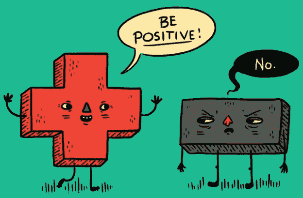

# 像专家一样谈判:如何对产品功能要求说“不”…

> 原文：<https://medium.com/hackernoon/negotiate-like-a-pro-how-to-say-no-to-product-feature-requests-e2ce00ae9981>

## …并且仍然与您的利益相关方保持良好关系

假设你是一名[产品](https://hackernoon.com/tagged/product)经理，一名来自[市场部](https://hackernoon.com/tagged/marketing)的同事向你提出一项功能需求。让我们称她为“虚构的安妮”。她问你，“如果我们在产品中内置这个神奇的区块链加密功能，那不是很棒吗？”嗯…

Facepalm ([image source](https://en.wikipedia.org/wiki/Facepalm#/media/File:Paris_Tuileries_Garden_Facepalm_statue.jpg))

你内心的声音说，“不，不，不…😩我们没时间干这个！”你的路线图已经充满了许多有前途的想法和实验。你已经落后于你雄心勃勃的 okr，而且你已经接近本季度末。

这可能是一个很酷的功能，但现在不是关注它的时候。你必须对虚构的安妮说“不”。做这件事的最好方法是什么？

为了弄清楚这一点，让我们先来看三个例子，看看*如何不*说‘不’:

## 错误 1——拒绝

*   **行动:**你可以*直截了当地拒绝*安妮:“不，安妮，这不是个好主意。这是不可能的。”忘记这段关系。毕竟，你不可能让所有人都开心。尊重我的权威！
*   **影响:**当你拒绝时，你破坏了工作关系。下次你需要安妮的帮助时，她会拒绝你的。当她有一个功能想法时，她不会告诉你，而是背着你把事情做好。

## 错误 2——适应

*   **行动:**你可以*迁就*她，在你真的想说“不”的时候说“是”。你已经对最后一个特色创意说了“不”……哦，我的上帝，她会恨你的！您不敢推后，而是将另一个工作项目添加到团队的积压工作中。
*   **影响:**当你迁就的时候，你的团队和影响都会受到影响。作为项目经理，你的工作不仅仅是找到最有价值的特性来构建。您还需要保护您的团队，并确保发布特性。你不能让你的团队因为不知道如何说“不”而一直被随机的利益相关者的请求拖慢。

## 错误 3——忽略

*   **行动:**你可以*忽略*的请求。你回避问题，什么也不说，希望问题会消失。当然，几天后安妮会忘记她的想法。如果她再问，你会说，“哦，对不起，一定是漏了嘴”。希望她永远不会问🙏。
*   影响:如果你选择忽视另一个人，你也忽视了一个基本的人类真理:人们永远不会忘记他们的想法。他们可能不会跟进你，因为他们认为这是毫无意义的，但这并不意味着他们忘记了。相反，你会失去他们的信任。他们会认为你不可靠，不遵守承诺。

显然，拒绝、迁就或忽视都是无效的。你应该怎么做？你如何对利益相关者的要求说“不”*和*并与他们保持良好关系？

# 引入“肯定否定”

你用一个“*肯定的“No”*代替否定的“No”。哈佛大学的威廉·尤里在他的书《积极否定的力量》中介绍了这一观点:

> “我们的拒绝来自我们反对的东西——他人的需求或行为。一个积极的“不”要求我们做完全相反的事情，并把我们的“不”建立在我们所支持的事情上。与其从没有开始，不如从有开始。对你的核心兴趣和真正重要的事情坚定地说不。[..]说不是一种说服练习，而不仅仅是交流。”

让我们来看看，对于虚构的安妮的特色创意，你的肯定“不”可能是什么样的:

*   **在你说‘不’之前，对对方的时间投入表示真诚的尊重:** *感谢你伸出援手，与我分享你的想法。我很感激你有兴趣让我们的产品变得更好。🚀*
*   表达强烈的“是！”为了您的利益: *在我们的团队中，我们总是努力为客户打造最有价值的功能。我们目前正在构建[功能]，这是我们公司战略的重要组成部分，目的是[实现某些目标]。我们已经看到了对[成功指标]的积极影响，并加倍努力实现本季度的目标。*
*   明确而实事求是地对请求说“不”: *这就是为什么我们现在不能考虑你的想法。我们希望确保我们仍然专注于当前的目标。*
*   提出一个“是吗？”跟进并达成一个双方都满意的协议:当我们计划下一季度的策略时，我会在季末再跟你联络。我很想和你聊一聊，看看你的想法能如何改善我们顾客的生活。你怎么想呢?

© [lexicide](http://lexicide.com/nonplussed/)

# 让你的积极“不”更有效的 4 个技巧

既然你已经知道如何把你的“不”从消极变成积极，这里有 4 个技巧可以让你的“不”变得更加有效。

🚀**把你的视角从*我们对他们*变成*我们*。**你们都朝着同一个目标努力——公司的成功。确保将团队的工作与公司的总体目标联系起来。不要专注于不同的个人立场。把它带回到更高层次的，共同的兴趣。

🧐 **在你真正理解这个想法之前，不要因为说“不”而错过好的功能。朱莉·卓(Julie Zhuo)简洁地说:“*如果有人描述了一个你觉得奇怪的特征，问‘你为什么认为这是个好主意？’可能会让你理解背后的概念或观念，这可能会导致有希望的新的执行。*“要好奇。通常，听起来很疯狂的想法会带来 10 倍的改进，而不是 10%的增量收益。**

🤗**懂得妥协。**如果你的团队说一个特性请求会很快，不会影响你的时间表，并且没有太大的负面影响，你也许应该去做。即使它与你目前的工作完全无关。如果你对每件事都说“不”，你就会成为每个人都回避的“不”人。传播一些利益相关者的爱！

🎁**提供建设性的跟进。我们经常说我们不会做什么，却忘记说我们会做什么。记得提出一个积极的结果。建议在下一季度重新审视这个想法，看看它是否会对新目标产生影响(“以后”)。或者解释需要发生什么才能让你对请求说“是”。它可能是更多的数据，更精确的音调，或者只是更多的时间来研究这个想法(“如果…那么”)。**

就是这样！有了肯定的“不”，你就准备好保护你的团队免受太多的功能需求，*和*仍然和你的利益相关者保持健康的关系。

## 学到了什么？按住👏说“谢谢！”并帮助他人找到这篇文章。