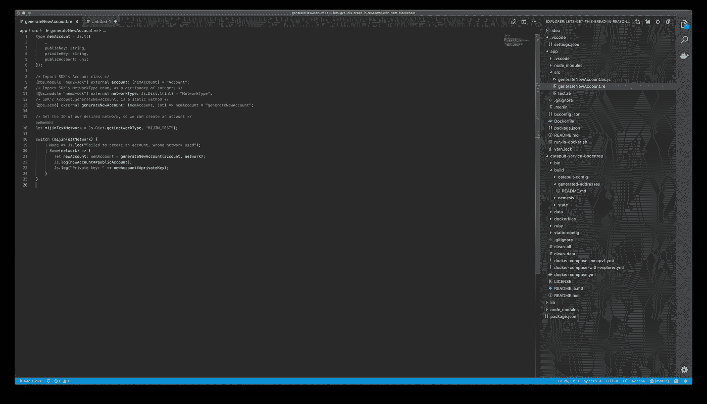
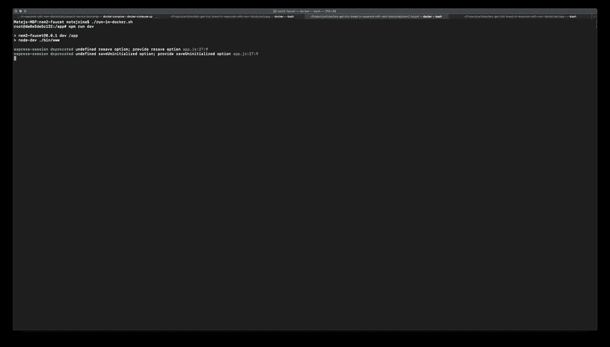

# NEM 区块链龙头和使用 ReasonML 的交易

> 原文：<https://medium.com/hackernoon/nem-blockchain-faucet-and-transactions-using-reasonml-lets-get-this-bread-pt-2-36e5d06aaf99>

## 这篇文章解释了如何让一些虚拟的汁液以被称为 XEM 的货币形式流动。包括使用 NEM SDK 的交易。让我们吃面包吧🥖😎

> 本文是上一篇 [ReasonML 和 NEM 区块链的后续；我们去买面包吧🥖😎](/@matej.sima/reasonml-and-nem-blockchain-crashcourse-8c8b540ed522)。要查看本文中解释的步骤的工作情况，有必要完成第一篇文章中的教程。

# 目标

我们的目标是将 XEM 从一个账户转移到另一个账户——为此，我们需要创建两个账户，并使用一个**龙头**将 XEM 填入其中。

> 如果你只想了解水龙头，你可以完全跳过回溯时间部分

# 倒退时间

如果您已经阅读了上一篇文章，那么您已经得到了如下所示的文件结构——我们将使用它来集成水龙头。

Result file structure, from the previous article from this series.

感谢 [@44uk_i3](https://twitter.com/44uk_i3) ， [NEM2 龙头](https://github.com/44uk/nem2-faucet)的存在。我们现在就进行设置，让我们从克隆存储库开始，克隆完成后，创建一个 docker 文件，我们可以用它来启动存储库。

# 水龙头文件

下一个合乎逻辑的步骤是构建一个图像，我们可以在其中实际运行水龙头。我们将需要 nodejs——所以让我们使用与我们在上一篇文章中使用的 ReasonML 环境相同的版本。(节点:11.4)

然后，我们将不得不填写一些 ENV 变量，以便水龙头正常工作。让我们仔细研究变量，并解释如何以及在哪里获得所需的值。

## **API_HOST:**

这将是我们的 NEM Rest 网关运行的容器的 docker- [网络](https://hackernoon.com/tagged/network) URL，我们知道在我们的设置中，容器的名称是**catapult-service-bootstrap _ Rest-gateway _ 1**

## API _ 端口:

这是默认网关端口， **3000** 。

## 私钥:

这是一个帐户的私钥，在我们的 catapult 堆栈启动时生成。所谓的涅墨西斯地址的一部分，预先填充了 xem。

如何找到所需的私钥？第一步是发射弹射器。

然后导航到**catapult-service-bootstrap/build/generated-addresses/addresses . YAML**，寻找**涅墨西斯 _ 地址**。

拿你找到的第一个私钥来说，它应该有足够的 xem 来填充我们的水龙头。

所以我们的价值值将是:

f1 c 69759140256420 EB 42 cf 39906 a 01 DD 02 a 57 FB 6d 0676 AE 134343 a 13 a1 CBC 21

List of generated nemesis addresses, which are pre-populated with xem

## **RECAPTCHA _ CLIENT _ SECRET&**RECAPTCHA _ SERVER _ SECRET

水龙头功能谷歌的 recaptcha，所以如果你的水龙头是公共的，它将受到保护，免受某些类型的滥用。

我们能从哪里得到那些秘密？导航到[谷歌的 recaptcha 网站](https://www.google.com/recaptcha/intro/v3.html)。并进入管理界面。

Navigating to recaptcha’s admin interface

一旦你进入，填写你的站点信息，在我们的例子中是 localhost / 127.0.0.1，同意条款和条件，并确认。你将被导航到一个页面，在那里我们可以最终为我们的水龙头的 recaptcha 提取秘密。

Registering a site for recaptcha

我们的秘密将会在下面的彩色区域显现出来。

**RECAPTCHA _ CLIENT _ SECRET**=**站点密钥**

**RECAPTCHA _ SERVER _ SECRET**=**秘密密钥**

Retrieving site & secret key from recaptcha admin

有了所有的秘密，对于我们的环境配置，让我们编写 docker 文件本身，这样我们就可以构建一个映像来运行我们的水龙头。

> 我们之前已经创建了 Dockerfile 文件，现在我们只需填写它

我们已经准备好回到终端，建立我们的形象，打开水龙头。我们将使用一个 **run-in-docker.sh** 文件，类似于上一篇文章中创建的文件。

> 首先确保你的弹射器已经启动并运行

Build our faucet docker image

Create a run-in-docker.sh script

Contents of nem2-faucet/run-in-docker.sh

为了完成水龙头安装，让我们安装它的依赖项。使用 **run-in-docker.sh** 运行 **npm 安装**。

# 该喝点果汁了🥤

如果命运对我们有利，我们现在应该可以打开水龙头了。

首先，让我们使用 nem2-cli 创建一个帐户，在那里我们可以发送一些甜蜜的 xem。

> 启动一个安装了 nem2-cli 的 docker 容器，最好是 **app/run-in-docker.sh.** 关于如何创建 nem 区块链账户/钱包的详细说明，可以在第一篇文章中找到[。](/@matej.sima/reasonml-and-nem-blockchain-crashcourse-8c8b540ed522)
> 
> **故障排除**
> 
> 如果你在 catapult 服务上遇到麻烦，你可以从 2018 年 7 月开始使用[这个提交](https://github.com/tech-bureau/catapult-service-bootstrap/commit/44b32b7e1875af45a73c25b6829dc32efc345de9)来运行 docker-compose up。
> 
> 你可以通过运行**来清理所有的构建文件和其他由 catapult 产生的“混乱”。/clear-弹射器目录中的所有**。
> 
> 不要忘了更新水龙头的私有密钥 env 变量，并在每次清除和构建 catapult 服务时重建 docker 映像——因为涅墨西斯地址会改变。

Generate a new account using nem2-cli

我们将使用该帐户来验证我们的水龙头是否按预期工作。让我们现在打开水龙头。使用**ne m2-水龙头/run-in-docker.sh** 并运行以下命令。

Starting the faucet via command line

在您最喜欢的浏览器中导航到 [http://localhost:9000](http://localhost:9000) ，以验证水龙头是否按预期运行。

Faucet loaded as expected

# 将 XEM 从水龙头转移到您的 NEM 帐户

在前面的步骤中，我们已经创建了一个 NEM 帐户，公共地址为**SD 5 boy-KFIWDU-pts jek-64 rvg 2-CQGQYQ-63 uxen-DDKU**。

让我们用水龙头，送一些 XEM 到我们的地址。填写表格，然后点击认领。别忘了说服[谷歌](https://hackernoon.com/tagged/google)你不是机器人🤖。

Sending XEM from the faucet, to our new account

我们如何验证 XEM 确实到达了我们的地址？我们可以使用 nem2-cli 来查看我们的平衡。让我们使用 **app/run-in-docker.sh** 并使用 nem2-cli 检查我们帐户的余额。

XEM successfully arrived from the faucet, to our account.

恭喜你，你已经成功地从水龙头里转了 1000 XEM 到你自己的账户里。现在你已经准备好交易和探索 NEM 区块链了！

# 该行动了💸

既然我们口袋里已经有了足够的'[机架](https://www.urbandictionary.com/define.php?term=Rack)，我们可以尝试使用 NEM2-SDK 通过编程转移 XEM。

让我们从创建第二个帐户开始，在那里我们可以转移我们的虚拟货币。

现在我们有两个账户，保存在两个配置文件下:**我的 _ 账户***(1000 xem)***和**我的 _ 其他 _ 账户** *(0 xem)* 。**

**让我们写一个 ReasonML 脚本，把一些 xem 从一个转移到另一个。**

## **流动**

**首先，我们需要定义收件人的地址，在我们的例子中，它将是我们的新/第二个帐户。**

****收件人地址**:***SB7COE-YWEP7K-LAKHJX-vpm bl 5–4 piyu 7-ktna 7j-lyy 3*****

****然后，我们需要持有 1000xem 的帐户的私钥，因为将使用它来签署交易。****

******私钥**:*5 EBA FD 9 f 3258188 E6 C1 F2 AC 44 cfbf 89 BF 352878 fecc 517847d 4953 ad 7518 eedd*****

****接下来，我们必须指定要发送的金额，我们将发送 100xem，因为现在是圣诞节，我们感觉很慷慨。****

******XEM 发送金额** : *100*****

****除此之外，我们只需要指定我们的 REST 网关 URL，但是我们之前已经做了很多次，您将在代码中看到。****

****在我们的 ReasonML 代码中完成的事情:****

1.  ****将收件人地址转为 NEM 帐户****
2.  ****将私钥转入 NEM 账户，用于签署交易****
3.  ****定义转移事务对象，包括截止日期、接收者、要转移的马赛克(在我们的例子中只有 XEM)、消息和网络****
4.  ****使用我们的私钥创建的 NEM 帐户签署交易。****
5.  ****向区块链网络宣布交易****

> ****下面显示的大部分文件都是类型定义，一旦 NEM-SDK 提供了一个合理的映射/版本，这些都将消失。但是现在，我们可以自己指定类型，所以 JS-interop 可以完美地工作。****

****让我们创建一个新文件， **transferXem.re** ，内容如下。****

****我们可以在 ReasonML 容器中使用 run-in-docker.sh 编译并执行它。****

# ****结果呢****

****让我们检查一下我们的 XEM 是否成功到达**我的其他账户**。我们可以使用 NEM 命令行界面，并像前面一样检查帐户信息。****

********

****我们可以看到，我们的一个帐户有 900 个 XEM，而不是 1000 个 XEM，而第二个帐户现在有 100 个 XEM，而不是 0 /没有区块链的历史记录。👏****

# ****下一步是什么？****

****在下一篇文章中，我们将创建自定义马赛克，并使用多重签名交易在帐户之间进行交易。****