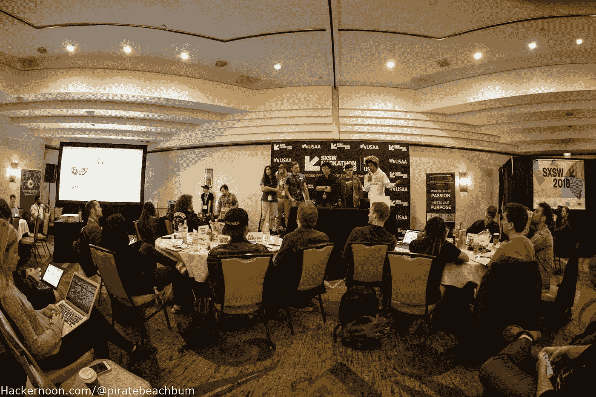

# 书呆子聚集在 2018 SXSW 24 小时黑客马拉松照片功能

> 原文：<https://medium.com/hackernoon/nerds-converge-at-2018-sxsw-24-hour-hackathon-photo-feature-37441c136de7>

On March 13–14, over 120 hacker nerds converged upon Austin, Texas for the 2018 SXSW 24 hour Hackathon held at the Omni Hotel.

# **SXSW 24 小时黑客马拉松体验**

HackerNoon.com 的创始人大卫·斯穆克邀请我去看看今年的黑客马拉松。我一直都很忙，没有时间参加这种活动，但是我决定让它发生。我很高兴我做到了，因为这是一次非常酷的经历。我在演示的最后一天出现了，看着每个团队做他们的事情。竞赛的水平和人们从世界各地赶来参加的事实给我留下了深刻的印象。

我从这次活动中得到的主要收获是鼓励更多的人走出他们的舒适区，参加这样的活动。你不仅会提高你的开发技能，还会遇到一群和你一样对开发充满热情的酷人。最重要的是，它将教你如何向一群潜在投资者推销一个项目。我没有用一大堆的话来烦你，而是拍了一些照片，这样你就可以亲眼看看 Hackathon 上发生了什么。

# SXSW 黑客马拉松是什么？

*Travis Lauren dine**说【当你想到 SXSW 时，取决于你是谁，你要么会想到最好的新音乐、技术或电影】。“作为一名博学的人，我共同创建了 SXSW 黑客马拉松，它是一个融合 SX 所有元素的混合器，也是一个孵化器，为获胜的团队提供 SXSW 本身，作为他们对现实世界用户的初始和非常肥沃的测试场地。”*

*“今年，作为对创新在科技和娱乐交叉领域的重要性的最终认可，我们邀请了国内一些最有价值的公司赞助和派遣工程师，帮助参与者为艺术家和他们的消费者制作产品，”特拉维斯继续说道。“我迫不及待地想看看这些超级明星开发者在这些消费者平台上构建了什么，转化为超过 1 万亿美元的市值。尤其是当他们看到 Capitol Records 带来的新沙盒中的内容以及我们为他们准备的其他音乐、电影和 API 惊喜时！”*

Over 25 teams from around the world developed ideas utilizing the sponsors technology or platforms in 24 hours and presented to the judges. The projects all had to be music or entertainment related which made it really interesting. Capital Music Group opened up their entire catalog of music for the hackers to use at their disposal if they so pleased.

Many teams worked all night without sleep to create a working prototype for their presentation. There were literally hundreds of laptops and mobile devices in one room creating a wireless, magnetic nerd apocalypse. Everyone was getting down to business.

Each team presented their idea to the panel of judges who asked questions and commented on their presentations. There were also mentors on deck to help and guide the teams along the way.

# 2018 SXSW 黑客马拉松评委

图欣·罗伊(环球音乐)

瑞安·沃尔什

[蒂芙尼·钟](https://medium.com/u/e0f54ea3c1a5?source=email-anon_2b2e19ea1d16--publication.newsletter)(Z 世代语者)

[杰伊·扎罗威茨](https://medium.com/u/26404b72aeb4?source=email-anon_2b2e19ea1d16--publication.newsletter)(黑客正午)

杰瑞米·加德纳(T4)

[韦科胡佛](http://me.dm/r-Qc_1px7Gt3?source=email-anon_2b2e19ea1d16--publication.newsletter) (XLIVE)

[杰夫·李本森](http://me.dm/r-TrVWqXXcAh?source=email-anon_2b2e19ea1d16--publication.newsletter)(李本森定律)

大卫·西科尔斯基

[Lucy Guo](http://me.dm/r-iCkfOj_KIF?source=email-anon_2b2e19ea1d16--publication.newsletter) (刻度 API)

[大卫·斯穆克](http://me.dm/r-T21gfqP9MQ?source=email-anon_2b2e19ea1d16--publication.newsletter)(黑客正午&阿米)

# 2018 SXSW 黑客马拉松导师

[陈莉莉](http://me.dm/r-Vt24KJpvJ5?source=email-anon_2b2e19ea1d16--publication.newsletter)(通用)

杰罗姆·范赫夫(Leansquare/加利福尼亚音乐技术公司)

[泰·罗伯茨](http://me.dm/r-7VQBqqlgJ6?source=email-anon_2b2e19ea1d16--publication.newsletter)(泰·罗伯茨创新)

李修贤 (YG 娱乐)

安迪·伽丁尔(创始人大使馆)

[达诺·莱曼](http://me.dm/r-SJtzx1VqE9?source=email-anon_2b2e19ea1d16--publication.newsletter)(reven 8 te/票星系)

路易丝-玛丽·马盖特。

The dialog between the judges and teams was both constructive and to the point. One of the main questions for teams integrating blockchain to their project was [Jay Zalowitz](https://medium.com/u/26404b72aeb4?source=post_page-----37441c136de7--------------------------------)’s “Why does this need to be on the blockchain versus an existing SQL database?” It became somewhat of a joke.

Practice Hero, who ended up winning second place, developed a prototype that integrated a keyboard with the Amazon Alexa api designed to help teach you to be a better musician.

One of the teams integrated a VR head set with the Facebook API that would allow people to watch an event from multiple angles. David Smooke, the man behind Hacker Noon, strapped on the VR headset and took it for a test ride.

There were some funny characters at the Hackathon. This team brought their ‘A game during their presentation and were pumping up the crowd with WWE type chants while throwing out FREE swag! It paid off as they took home one of the prizes.

The sponsors stepped up with food, refreshments and a bunch of awesome cash and prizes for the teams. The table on the right was filled with cool stuff for the winning teams to pick from.

# **赞助商**

****。**以向会员提供银行和保险服务的创新方式而闻名的 USAA，将作为赞助商加入我们的 SXSW 黑客马拉松。**

**[亚马逊 Alexa](http://me.dm/r-o3kFd2Lxro?source=email-anon_2b2e19ea1d16--publication.newsletter) **。** Alexa 是亚马逊基于云的语音服务。Alexa 是亚马逊 Echo 和其他支持 Alexa 的设备背后的大脑。**

**[**亚马逊网络服务。**](http://me.dm/r-FOYifw2UK1?source=email-anon_2b2e19ea1d16--publication.newsletter) 亚马逊网络服务(AWS)是一个安全的云服务平台，提供计算能力、数据库存储、内容交付和其他功能来帮助企业扩展和增长。数百万客户目前正在利用 AWS 云产品和解决方案来构建具有更高灵活性、可扩展性和可靠性的复杂应用程序。**

**[**国会音乐团**](http://me.dm/r-WW3JLiodJW?source=email-anon_2b2e19ea1d16--publication.newsletter) **。国会音乐集团(CMG)由国会唱片公司、维珍唱片公司、摩城唱片公司、蓝调唱片公司、Astralwerks、丰收唱片公司、国会基督教音乐集团和 CMG 的独立发行部门 Caroline 组成。****

**[**同意**](https://medium.com/u/6c7078bf7b01?source=email-anon_2b2e19ea1d16--publication.newsletter) 。ConsenSys 是一个全球性的组织，由技术专家和企业家组成，他们构建基础设施、应用程序和实践来实现一个去中心化的世界。**

**[**云淡风轻**](http://me.dm/r-iCBtLCZllk?source=email-anon_2b2e19ea1d16--publication.newsletter) **。**利用领先的云服务 Cloudinary 管理 web 和移动媒体资产:图像和视频上传、存储、操作、优化、数字资产管理和交付。**

***附加伙伴有*[***Devpost***](http://me.dm/r-MKT-WVUVHs?source=email-anon_2b2e19ea1d16--publication.newsletter)*和* [***黑客正午***](http://hackernoon.com/?source=email-anon_2b2e19ea1d16--publication.newsletter) *。:-)***

****

**When it was all said and done, there was a beat box competition with two world class beat boxers who were also developing a beat box battle platform. Their app would allow beat boxers to battle real-time from anywhere around the world.**

****

**Travis was the dude making announcements and running the show. He had a very colorful outfit and cool hair. Don’t hate the player, hate the game!**

****

**During the closing ceremony, each sponsor awarded prizes to the teams they felt integrated their products best. These are the winning teams who developed projects on the facebook API. For more photos of the winning teams, please check out the [photo gallery](https://photos.app.goo.gl/5qCjL4KPiqU3qC1L2).**

****

**Scalp V by Ryan Constant was the 1st place winner. He took home 6k. USAA double downed on prize money for the winners. Not bad for a few days of hustling.**

****

**The Practice Hero team (Sun Soravis, Matthew Li, Eduardo Luna, and Amer Din) took second place with a 4k payday.**

****

**The Focus team (Andrew Clasen & Remington Griffin) took 3rd Place with a 2k payday.**

# ****更多活动照片****

**[**这里有更多的活动照片，是所有参赛队做陈述和接受奖项的照片。请随意使用任何免版税的照片。我们只要求你信任**](https://photos.app.goo.gl/5qCjL4KPiqU3qC1L2) **[hackernoon/@piratebeachbum。](https://hackernoon.com/@piratebeachbum)****

**[**> > >点击此处查看更多照片< < <**](https://photos.app.goo.gl/5qCjL4KPiqU3qC1L2)**

***特别感谢所有赞助商、评委、导师和参与者。我希望在明年的 SXSW 黑客马拉松上看到大家。特别感谢大卫·斯穆克和*[*Hackernoon.com*](https://hackernoon.com)*帮助我参加这次活动。***

***在 twitter 上找我*[*@ piratebachbum*](https://twitter.com/piratebeachbum)*或*[*hacker noon/@ piratebachbum*](https://hackernoon.com/@piratebeachbum)[*www . coin strategy . io*](https://www.coinstrategy.io/)**

****

**[ftwtour.com](http://www.ftwtour.com)**