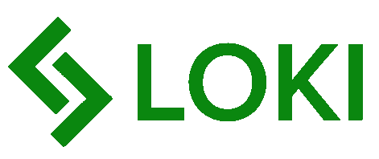
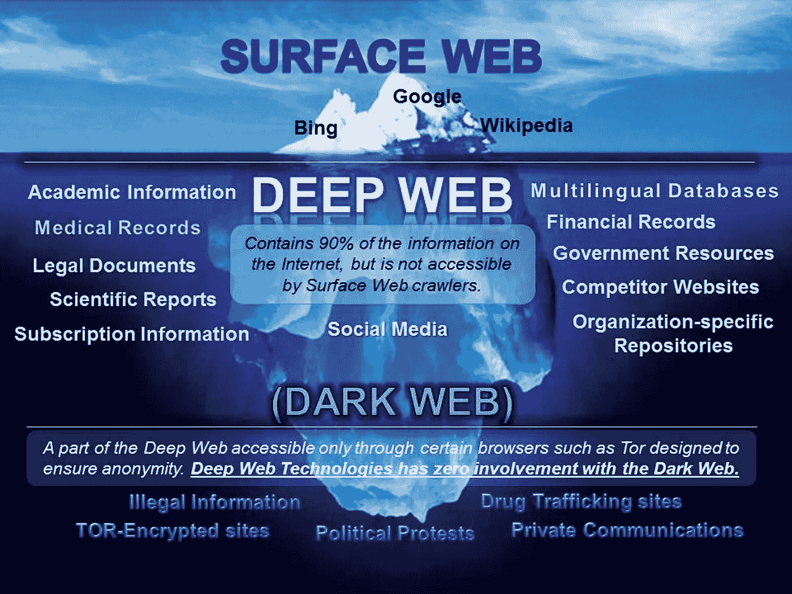
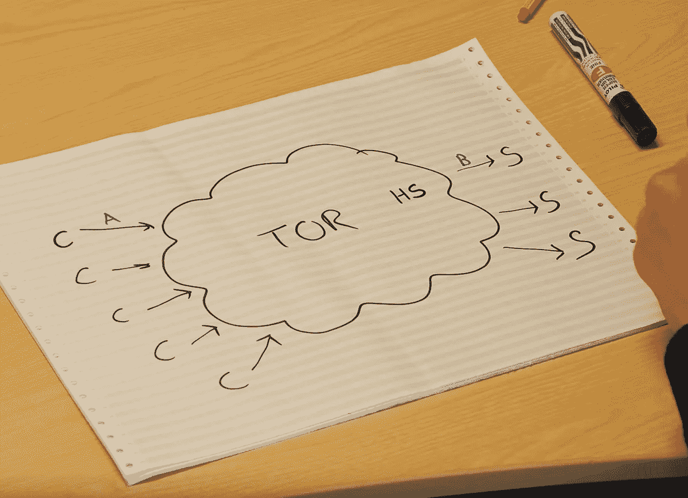
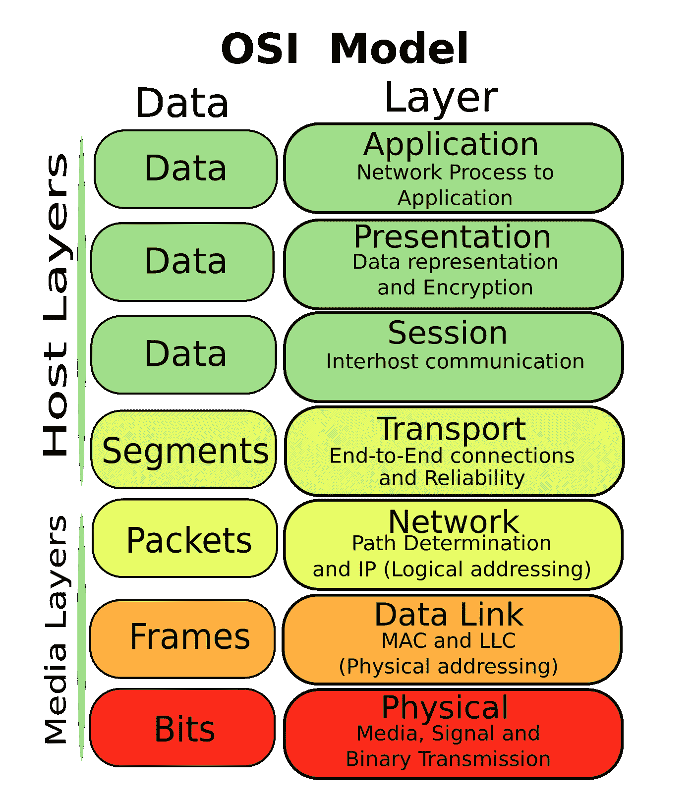
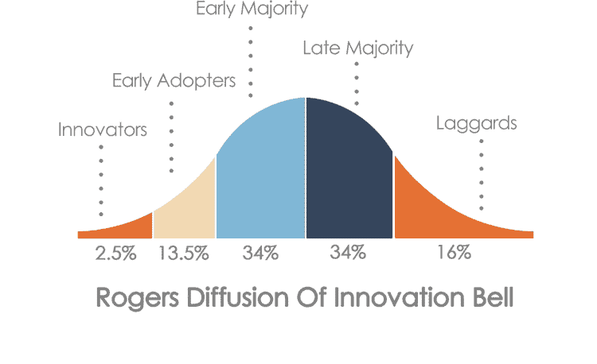
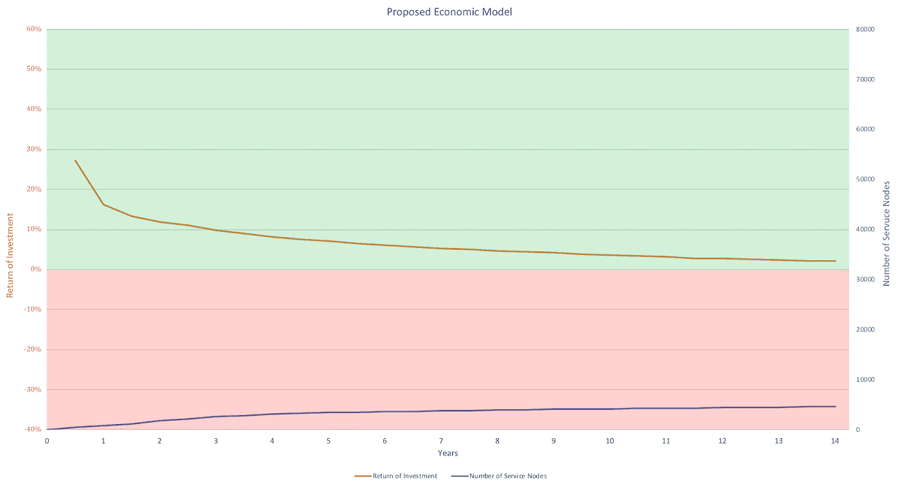
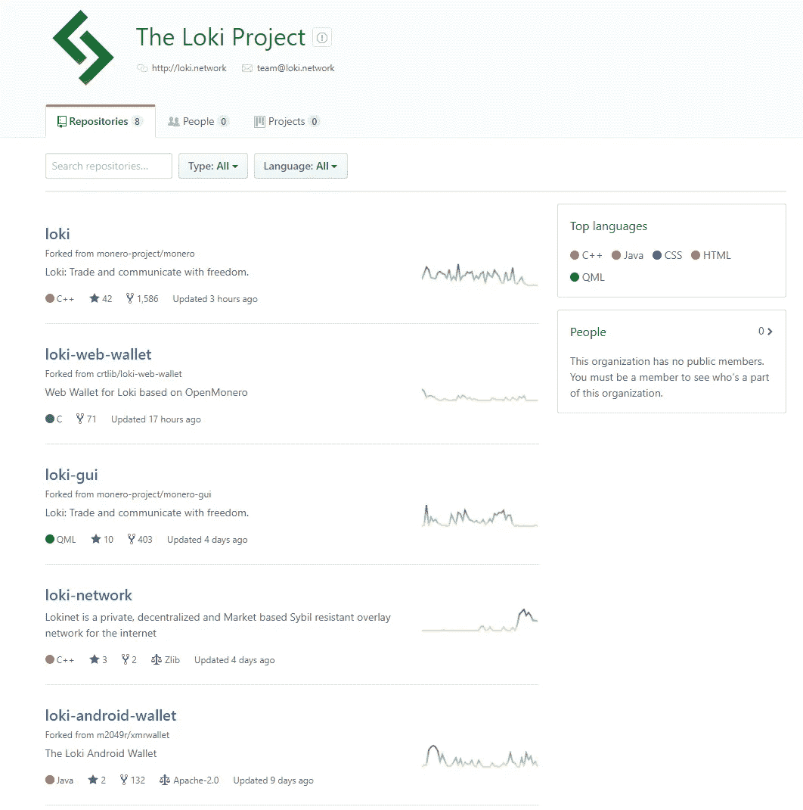

# 经由区块链的网络中立性:分析洛基网络的洋葱路由混合网络

> 原文：<https://medium.com/hackernoon/net-neutrality-via-blockchain-analyzing-loki-network-tor-protocol-2-0-d44c75a802ff>

在这篇文章中，我的目标是从根本上分析 Loki Network(Loki)，这是一个加密项目，旨在结合 Tor 和 i2p 的最佳元素，创建一个更加私有的 mixnet。通过回答 sort 类型分析框架中的关键问题，旨在整体分析初创企业，并彻底了解其目的。

内容

*   关于项目
*   采用
*   竞争
*   象征经济学
*   团队和社区
*   融资和治理
*   状态和评论
*   结论

如果你喜欢这篇文章，请沿途用掌声表达你的欣赏！:)

欢迎对分析框架或 Loki 网络的分析提出任何意见、改进想法、反馈或批评。

主要来源:[网站](https://loki.network) | [白皮书 v3](https://loki.network/wp-content/uploads/2018/07/LokiWhitePaperV3.pdf) | [密码经济学 v1](https://loki.network/wp-content/uploads/2018/07/CryptoeconomicsOfTheLokiNetworkV1.pdf) | [Youtube](https://www.youtube.com/channel/UCN7LL0dEffQ7FSjbY5wwlnw/featured)

Loki’s name is a pun to being ‘low key’ via a ‘lock’ against censorship

# _____________________________________________

# 关于项目

***LOKI 解决了哪个关键问题？*** 互联网中立；信息审查阻力，数字匿名，私人交易和通信。

***LOKI 服务于人性的哪一方面？*** 大多数数字环境都被政府和民族国家所控制、追踪和审查。 *Loki 旨在通过建立一个新的 mixnet，解决 Tor 和 i2p 的一些关键挑战，在信息、通信和交易方面创造自由和隐私*。受[洋葱路由](https://www.youtube.com/watch?v=QRYzre4bf7I)的启发，洛基基本上提供了一种更安全的方式来访问互联网的各个层面——包括深度网络，据估计深度网络包含了超过 90%的万维网。

The internet divided in three levels, Loki’s mixnet offers better privacy than Tor to access the dark web.

> Lokinet 协议允许用户和网络服务在互联网上保持完全匿名和加密，从而确保网络中立和抵制审查。

在 Lokinet 上，开发者可以用任何基于网络的语言创建所谓的服务节点应用(SNApps)。这些应用类似于 Tor 中的' [*隐藏服务*](https://youtu.be/lVcbq_a5N9I?t=53s) '，确保对利用 Loki 的 mixnet 的网站和 webapps 进行加密匿名。Loki Messenger 是一个端到端加密的私人信使，应是 Lokinet 上的第一个 SNApp。

> 更多关于 **Tor vs Lokinet** 的信息请见[对 Loki 首席执行官西蒙·哈曼的采访](https://www.youtube.com/watch?v=cBQ-DYEhQ0A&feature=youtu.be&t=2m16s)。

A hidden-service (HS) is located inside the Tor routing network, making it near impossible to identify the user or the service. As there is no exit node linking to a server outside the anonymous cloud, the HS counters security breach B ([source](https://youtu.be/lVcbq_a5N9I?t=53s)). SNApps are similar to this, but run on the Lokinet with incentivised network nodes.

***洛基的大规模改造目的(MTP)是什么？
“***绝对自由的交易和交流:私下交易，分散交流”。

***LOKI 有哪些关键应用？*** *Lokinet* (例如基于区块链的 Tor/ i2p mixnet)

*   “Loki 网络上的服务节点将运行低延迟洋葱路由协议，形成一个完全分散的覆盖网络，称为 Lokinet”([来源](https://loki.network/wp-content/uploads/2018/07/LokiWhitePaperV3.pdf))。
*   “由于 mixnet 完全在 OSI 模型的第 3 层上运行，它没有规定应用层操作”([来源](https://t.me/LokiCommunity/83346))，所以“你可以通过它推送任何协议，因为[它不局限于 TCP/IP，它围绕 UDP](https://www.youtube.com/watch?v=TKrTnPz7gvk) 构建，就像 I2P”([来源](https://t.me/LokiCommunity/83347))。

*SNApps* (服务节点应用)Lokinet 上匿名隐私的应用

*   Loki Messenger(基于 Lokinet 协议的私人通信)
*   “SNApps 的功能类似于 Tor 中已经盛行的所谓[隐藏服务。[……]SNApps 允许用户在自己的机器或服务器上建立和托管市场、论坛、举报网站、社交媒体和大多数其他互联网应用程序，同时保持全服务器和用户端匿名”(](https://www.youtube.com/watch?v=lVcbq_a5N9I)[来源](https://loki.network/wp-content/uploads/2018/07/LokiWhitePaperV3.pdf))。
*   与大多数 DApps 不同，SNApps 不依赖于链上执行或计算。所有快照都在客户端计算，联网由服务节点网络离线处理”([来源](https://loki.network/faq/#LokiFAQ_AreSnappsLikeDapps))。
*   SNApps 可以用常见的基于网络的语言来构建，所以开发者不需要学习新的编程语言。

The Loki mixnet “operates entitrely on layer 3 [Network] in the OSI model” ([https://t.me/LokiCommunity/83346](https://t.me/LokiCommunity/83346))

# _____________________________________________

# **领养**

***为什么 LOKI 会达到超级统治力？*** 先发优势；它是第一个基于区块链的 mixnet 协议，并且有一个工作主网。

隐私正日益成为一个热门话题，因此许多区块链项目都专注于隐私功能。由于 Tor 是目前最流行的 mixnet 集成解决方案，面向隐私的加密项目——如 NIX 平台的跨链隐私协议——正在将 Tor 实现为默认的 mixnet。

合乎逻辑的是，这些项目更新到 Lokinet，*触发网络效应和用户对现有项目的采用*。

***LOKI 如何追踪并增加其网络效应？***

*   面向隐私的项目现在使用 Tor 网络作为默认的 onion 路由服务，也实现了与 Lokinet 的集成。
*   激励矿工；通过 CryptoNight Heavy 算法(= CPU + GPU 挖掘)的工作证明来保护网络。
*   激励服务节点；通过服务证明。
*   从用户角度来看；来自 Loki Messenger 和其他 SNApps 的网络效果，基本上是通过 Lokinet 协议在互联网上运行的 webapps。

洛基是如何解决区块链三难困境的？
(去中心化/安全性/可扩展性)
对于 LOKI 来说，主要问题可能是可扩展性，因为安全性是首要关注点，去中心化是通过混合 PoW/PoS 结构实现的。尽管该团队正在研究一个没有中央矿池的 PoW 采矿网络，因为这可能会导致集中的散列功率。

根据白皮书 v3，Loki 可以通过以下方式解决潜在的*可扩展性*问题:

*   利用 bulletproofs，“减少节点需要存储和中继的信息，从而提高可伸缩性”。
*   没有固定的块大小。“Loki 数据块大小通过观察最后 100 个数据块的中值数据块大小进行调整，并相应地缓慢调整任何新数据块的最大大小。”
*   优化交易规模，“以确保网络高效扩展，从而降低服务节点运营成本，以便长期维持高节点数”。
*   最后，“为了确保移动用户的可扩展性和可访问性，工作证明难度要求是根据消息或路径的生存时间(TTL)来确定的，而不是基于全局网络活动。”

***开发者可以用哪些编程语言在 Loki mixnet 之上构建 SNApps？*** 建议程序员可以挂钩现有的、[流行的开发语言和框架](http://githut.info/)，如 Python、Java、Node、C#等，以确保开发友好的生态系统扩展。在 SNApps 的情况下，可以使用常见的基于 web 的语言，这使得开发者很容易加入生态系统。

据首席技术人员 Kee Jefferys 说,“因为 SNApps 与 Tor 中的隐藏服务非常相似，所以它们是使用基于 web 的语言构建的。基本上，你可以在互联网上托管的任何东西也可以在 Lokinet 上托管，因为实际上你只是通过一个路径向提出请求的人提供加密的网络内容”( [source](https://t.me/LokiCommunity/83328) )。

***洛基与其他区块链互通吗？*** 找不到任何官方公开信息来回答这个问题。然而，现有的以隐私为导向的硬币和项目现在使用 Tor 作为他们的路由服务，也有可能将 Lokinet 集成到他们的技术栈中。互操作性是一件大事，因为它可以导致更多的采用，利用其他人的网络效应，所以 Loki 团队关于这个主题的官方声明将有助于获得更好的理解。

# _____________________________________________

# 竞争

***LOKI 有集中式和/或分布式比赛吗？***

*   Mixnet: TOR / i2p /兰花协议/ VPN 服务(？)
*   私人信使:信号/ Wickr Me /电报/暴动/中毒/回声
*   基于区块链的私人信使:status . im/armand . im/e-Chat/Mercury Protocol(Dust)/Obsidian

***为什么洛基很有机会击败那些竞争对手？*** Mixnet

*   VPN 服务并非完全无法追踪，而且使用起来可能很昂贵。
*   Tor 和 i2p 不是完全私有的，因为一个参与者可以相对容易地操作洋葱网络中的大多数路由节点，从而实现去匿名化。
*   截至 2018 年 7 月，兰花协议仍需要做他们的 ICO，而洛基的 mainnet 自 2018 年 4 月起已上线，服务节点计划于 2018 年第四季度上线。

私人信息

*   竞争非常激烈，很难创造网络效应，也很难利用梅特卡夫定律来应用。
*   然而，[据首席执行官](https://youtu.be/rZgok6wXMHE?t=12m33s)称，Loki Messaging 并不与 Signal、Telegram 或其他私人消息应用竞争。“这个系统背后的想法并不是它是最好的信息系统。相反，这是在你需要绝对确定信息不会被其他任何人阅读的时候，你需要绝对的隐私保护”，如机密合同或政府情报。

尽管这个隐私级别是一个利基市场，但创建一个强大的品牌和快速的用户采用可能是实现约 16%的关键大规模采用百分比的关键，在这个注重隐私的利基市场达到早期的大多数(见罗杰斯的创新扩散)。

# _____________________________________________

# 象征经济学

***如果这个协议有自己的令牌，为什么还需要它？*** 去中心化服务，保证 mixnet 中的隐私和匿名。

像 Tor 这样的现有系统在集中化方面存在问题。由于网络是以获取流量为基础的，因此网络参与者在路由过程中获得大多数节点是容易且廉价的。因此，交互可以被追踪并追溯到用户，违背了 Tor 匿名的目的。

通过服务节点，一部分令牌被锁定，从而降低了数字资产的流动性。通过引入财务激励来锁定总令牌供应的很大一部分，拥有网络的多数股权变得越来越昂贵，从而使 51%的攻击成本高得令人望而却步。

> 更多关于 **Tor vs Lokinet** 的信息请见对 Loki 首席执行官西蒙·哈曼的[采访。](https://www.youtube.com/watch?v=cBQ-DYEhQ0A&feature=youtu.be&t=2m16s)

2018 年 7 月 20 日，提出了 LOKI 令牌的[排放曲线的新经济模型，确保了服务节点数量与人们在网络中运行这些节点的动机之间的更好平衡。](https://loki.network/tldr-why-loki-should-change-its-emission-curve/)

The new economic model reduces the amount of Service Nodes, to ensure long-term positive return on investment for the Service Nodes operators.

***LOKI 如何产生和捕捉价值？*** 通过为接入新 mixnet 的以隐私为中心的分散式应用(SNApps)构建一个平台——确保隐私、匿名和审查阻力。“一旦 SNApp 启动，它应该是不可阻挡的，不受审查的，并且完全不受外部攻击的影响”([来源](/research-center/loki-lok-ico-analysis-a-decentralised-privacy-based-payment-and-communications-network-a39825eefa40))。

Lok 是 Loki 网络的官方代称，用于激励运行服务节点和采矿作业的参与者的分散网络。不清楚数字资产是否也被用作网络上服务的实用工具令牌。更多关于洛基硬币的圆形代币经济学的信息将不胜感激。

A model for circular token economics ([source](https://www.coindesk.com/the-theory-of-a-blockchain-circular-economy-and-the-future-of-work/)).

_____________________________________________

# 团队和社区

***团队为什么可信？***

*   一些来自 Monero 的开发者在团队中，包括 Monero 的第三大贡献者(Tom Winget)，因此带来了有用的区块链经验。
*   Lokinet 团队负责人( [Jeff](https://github.com/majestrate) )是 i2p 协议的 C++开发人员。
*   在[的采访中，项目负责人(西蒙·哈曼)看起来既专业又聪明。](https://youtu.be/Cycp7FmyY04)
*   首席技术官(Kee Jefferys)在[的演示和采访中似乎知识渊博，魅力非凡。](https://www.youtube.com/watch?v=rZgok6wXMHE)
*   沟通是清晰的，向社区提供每周更新和即时公告。
*   在小组讨论中，团队成员看起来像是朋友，相互之间以尊重和谐的方式互动。

*项目开发*-可以观察到 [Github 库](https://github.com/loki-project)中持续且活跃的更新流。不同的人活跃在不同的 Loki 项目上，所以可以说一个程序员社区正在从事这个开源项目。

***社群参与度如何？*** Loki regularity 发布发展动态或即将发生的事件的更新。然而，似乎没有真正的社区决策或民主治理。服务节点是治理过程的一部分，但普通用户不是。在洛基使用的各种社交媒体平台上，似乎都有一个活跃的社区。

# _____________________________________________

# 融资和治理模式

***洛基是如何、何时获得资助的？*** 2018 年 3 月，一家出售了 15%代币供应总量的私人 ICO 融资 900 万美元。根据 T21 的说法，这些早期私人投资者的 ICO 代币价格是 1 洛基= 0.68 美元。

***技术和治理模型都是去中心化的吗？
(架构、政治和逻辑分权)*** 白皮书中的第 9 章致力于治理:

“洛基治理系统旨在通过提供一个结构化的讨论和代表环境来解决潜在的问题，并在不依赖外部影响或利他主义的情况下为洛基的发展提供资金来源”。

“治理结构应该创造方法*在内部资助改善洛基生态系统的新项目*。内部资助项目可以防止特殊利益集团的形成，这些特殊利益集团的动机不一定与用户、矿工或服务节点一致。”

*技术/架构分散*

*   开源。
*   将挖掘和服务节点结合起来，以实现更大程度的分散化。
*   CryptoNight Heavy 算法保持对 CryptoNight ASIC 矿机的 ASIC 抵抗。
*   该团队正在考虑[消除或重新考虑对中央矿池](https://www.youtube.com/watch?v=Cycp7FmyY04&feature=youtu.be&t=1h4m2s)的需求，以确保网络中分散的散列能力。

*治理/政治权力下放*

*   “[对于]每一个 Loki 块，5%的奖励都是为了网络治理的目的而分配的。这提供了一个稳定的 Loki 流，它将分布在社区项目、软件开发人员和集成团队中。在这 5%的块奖励中，3.75%由洛基基金会控制，1.25%由服务节点通过洛基资助系统控制”。
*   洛基基金会概述了该项目，并“由代表洛基项目的各种个人组成……并受其自己的管理章程和澳大利亚法律的约束”。这可能会成为基金会决策范围的一个限制因素”。
*   “洛基资助系统允许
    的一部分块奖励完全由服务节点的投票决定。服务节点代表来自世界各地的实体，并不受制于 Loki 项目团队或基金会的输入，这使他们能够在决策中达到新的自治水平。服务节点是网络中最重要的参与者，他们在经济上受到激励，做出增加 Loki 价值的决策。”
*   每两个月(43，000 块)，可以提交新决定的提案。服务节点可以根据所提供的信息对这些提议进行投票。对于每个建议，都要消耗大量的 Loki，以确保良好的信噪比。“只有当赞成投票减去反对投票的结果等于服务节点网络上节点数的 15%时，提案才被通过”([来源](https://loki.network/wp-content/uploads/2018/07/LokiWhitePaperV3.pdf))。

*系统/逻辑分散*

*   目前只有一个 Lokinet 系统正在建设中，所以它是集中式的。根据 Vitalik Buterin 的说法，逻辑集中化是区块链项目的一个关键特征。由于它是开源的，并且可以分叉，所以该系统可以扩展为多个版本，并且这些版本之间具有互操作性，从而增加了逻辑上的分散性。

# _____________________________________________

# 状态和评论

***LOKI 目前的状态如何？*** Main-net 正在上线，手机和笔记本钱包都发布了，社区和兴趣正在增长。Lokinet 的积极开发已于 2018 年 5 月开始。

> “Lokinet 还有很长一段时间，我们将一如既往地向每个人更新我们的进展。此外，如果你是一名开发人员或热衷于代码的猴子，请联系我们，或通过提出请求、发布等方式做出贡献。我们已经为开源开发留出了奖金"*(*[*source*](/@LokiNetwork/lokinet-b8f738fefe7a)*)。*

根据 Lead Teach 的说法，目前的代币供应量为 2900 万枚，包括上锁和未上锁的硬币。总最大限值为 150 米，但在更新的排放曲线改变后(不包括尾气排放)，更接近 110 米([来源](https://t.me/LokiCommunity/83367))。

关于 Loki 的短期未来，2018 年第四季度将发布服务节点，2019 年 Q1 将推出 Loki Messenger。

***批评/缺陷/缺点？***

*   Loki Messenger 和其他 SNApps 可能很难获得大规模采用，但由于 Lokinet 的加密匿名层和基于网络的语言的开发容易性，Loki 可以抓住以隐私为导向的利基。
*   这个团队看起来很专业，但看起来他们都是 20 多岁，可能 30 出头。也许一些更有经验的人可以加入核心团队，增加宝贵的技能、网络和关系。
*   没有元确定性操作/语义用于链上分叉而不干扰底层系统，如铋。换句话说，一个硬分叉产生了一个新的区块链。
*   这还不是 ASIC 阻力的永久解决方案，但对于集中化和网络完整性来说，这可能不是一个大挑战。根据首席执行官的说法，[挖掘池是实现网络去中心化的问题](https://youtu.be/Cycp7FmyY04?t=1h4m2s)。
*   没有关于与其他区块链互操作性的官方声明。
*   没有审核来验证 LOKI 钱包的完整性和安全性。
*   这篇加密经济学论文关注的是激励网络节点和矿商之间的平衡。还没有找到关于生态系统的循环令牌经济学的信息，例如洛基数字资产也作为公用令牌吗？
*   洛基基金会和洛基资助系统看起来是一个不错的治理模式。基金会董事会中的个人以及分散的服务节点在项目决策过程中发挥着重要作用。很高兴看到用户或 Loki 网络的常规令牌持有者也拥有某种类型的投票权，使治理更加民主。

# _____________________________________________

# 结论

通过一个分析框架，回答各种类别的问题，从根本上分析了加密启动洛基网络。总的来说，这似乎是一个坚实的项目；它有很强的远见，在区块链 mixnet 领域有先发优势，有一个热情的团队，似乎在传递和交流。由于常见的基于 web 的编程语言可以用来构建 SNApps，因此开发人员很容易参与进来。

一些批评和缺陷确实存在。Loki 令牌被用作一种激励机制，但不清楚它是否也作为生态系统中的公用令牌。更多关于这些循环代币经济学的信息将不胜感激。此外，由于竞争激烈，另一个私人信使的大规模采用也是一个严峻的挑战。最后，没有官方声明 Loki 协议是否将与其他区块链互操作。

分析框架仍然是一个过程中的工作，所以如果你有不同的问题或方面的建议来分析区块链项目，让我知道！

## 你喜欢这篇文章吗？

如果你从我的报道中获得了一些价值，我会很感激你的分享和点击*按钮——*到 50！谢谢:)

—

感谢您阅读本文！我是否忘记了某些信息或发展？或者你在我的故事和推理中发现了缺陷或偏见？*请让我知道，我对讨论、反馈和批评持开放态度。*