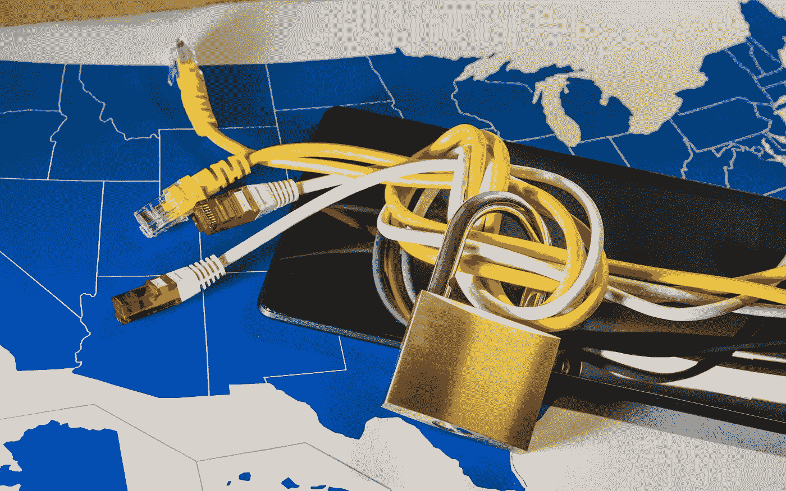

# 网络中立:它是什么，为什么重要，它如何影响美国

> 原文：<https://medium.com/hackernoon/net-neutrality-what-it-is-why-it-matters-and-how-it-affects-the-u-s-97ad7ecf1d98>

在过去的一年里，很多新闻都充斥着关于网络中立的文章。随着联邦通信委员会最近废除网络中立，许多美国人一直在挠头，试图了解网络中立到底是什么，为什么它很重要，以及它如何影响他们。

我们会保护你的。尽管网络中立规则目前在美国尚未生效，但关于其对社会、监管未来等的影响仍有持续的争论。以下指南将帮助你轻松驾驭这些持久的对话。

**什么是网络中立？**

这个术语最早是在 Tim Wu 2003 年的论文中提出的，题为“[网络中立，宽带歧视](https://papers.ssrn.com/sol3/papers.cfm?abstract_id=388863)”他的观点是，互联网应用需要一个公平的竞争环境来保护服务提供商和消费者。虽然社会对这一术语的了解和使用在持续增长，但广泛存在的混乱继续阻碍理解。

根据定义，网络中立是指互联网服务提供商应该允许访问所有内容和应用程序，而不管其来源，并且不偏袒或阻止特定的产品或网站。这意味着您可以随时随地以自己喜欢的方式访问自己想要的网站和服务。

具体来说，网络中立解决了互联网接入服务提供商对客户的授权问题。正如 [Wired 恰当地解释](https://www.wired.com/story/guide-net-neutrality/)的那样，它的想法是提供商“不应该能够将一些数据滑入‘快车道’，同时阻止或以其他方式歧视其他材料。”根据网络中立性，视频流媒体服务，如网飞、YouTube、你的强制性公司视频会议或任何其他此类服务，都不会受到歧视性商业行为的影响，这些行为需要额外付费或罚款。

如果这对你来说似乎是常识，那是因为这是互联网自诞生以来基本运行的标准。直到最近十年，服务提供商才开始操纵其客户对互联网的访问——这导致了 2015 年 4 月开放互联网秩序的初步建立。被称为网络中立法案的开放互联网秩序将互联网确立为美国的公共事业，防止企业影响消费者的访问。

为什么网络中立很重要？

Tech Republic 说得最好:“网络中立至关重要，因为它有可能塑造互联网的未来，以及我们获取知识的方式。”

默认情况下，网络中立性控制着定价，确保消费者不会为访问他们喜爱的网站和服务而斤斤计较。如果没有保护措施，服务提供商就有可能将互联网服务分割成不同的“服务通道”。例如，如果您想要访问视频流服务，您的提供商可能会在您的常规互联网账单之外要求您订阅视频高级服务。

2012 年，美国电话电报公司就是这么做的。这家服务提供商被发现限制任何试图使用 FaceTime 的用户的带宽接入，只为支付额外费用购买美国电话电报公司额外共享数据计划的用户提供全面服务。虽然不太可能，但没有网络中立保护意味着互联网套餐可能看起来像有线电视一样——对体育或电影等优质内容的访问有单独的计划和额外的费用。

另一方面，网络中立性也阻止了服务提供商自己买单。以网飞为例。尽管该公司负责该国的大部分数据流，但网络中立性阻止服务提供商限制流媒体速度，直到网飞被迫支付费用来恢复服务质量。

从本质上讲，网络中立性确保了互联网提供商不能将互联网作为人质，将零碎的服务和内容只提供给在基本互联网基础上支付额外费用的客户和企业。

**网络中立如何影响美国人？**

截至 2018 年 6 月 11 日，美国联邦通信委员会已经废除了此前《开放互联网秩序法案》确立的许多核心网络中立规则。

这意味着在美国，互联网服务提供商不再被禁止按照自己的意愿阻止、限制和优先考虑用户和服务。尽管一些知名提供商如康卡斯特(Comcast)已经发誓效忠于开放的互联网——没有网站屏蔽或网络节流——但面对潜在的利润，许多人仍然怀疑这种誓言能持续多久。虽然互联网的未来仍然不明朗，但有一点是肯定的:人们将继续辩论和推测其对未来的影响。

与此同时，如果你担心网络中立的废除会对你个人产生怎样的影响，最好的方法就是保持消息灵通。阅读来自你自己的服务提供商的电子邮件。查看他们的网站，了解他们的服务计划和套餐的更新，并寻找有关服务阻止、节流和优先化的材料和消息。