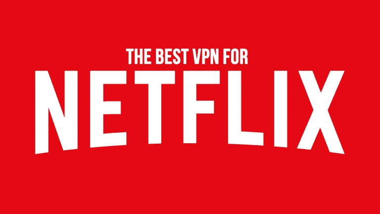

# 网飞和 VPN 服务器—它们之间有什么关系？

> 原文：<https://medium.com/hackernoon/netflix-and-vpn-servers-how-do-they-relate-1e2942629aca>

根据全球统计，亚洲在各大洲中得分最高，拥有最多的上网人数。几乎有 49%的人使用各种网络渠道观看自己喜欢的电视剧、电影、视频等。为了满足巨大的需求，各种各样的新玩家进入了在线空间，同时还有各种各样的虚拟专用网或虚拟专用网或网络接入服务。

**直播频道越来越受欢迎**

有各种各样的网络接入在线服务，包括亚马逊 prime video、Hulu、Sling TV、Pureflix、HBO Now、Show Time、网飞等。在所有这些在线服务中，网飞对全球观众产生了特殊的影响。网飞已经证明了自己是世界上最聪明、最快的在线娱乐服务提供商。几年前，网飞开始在 190 多个国家提供服务。在这短短的时间内，网飞已经征服了全世界成千上万的用户。当[网飞](https://hackernoon.com/never-ending-netflix-6e912968d915)宣布将他们的服务扩展到全球时，这在网上观众中引起了轰动，这意味着他们可以看到他们喜欢的电影和电视节目，而这些在早些时候只能在少数几个国家看到。当网飞在他们的国家正式可用时，人们有了一个概念，他们现在可以访问它的整个内容数据库。

**地理限制——网飞最大的限制**

但网飞出于自身的法律或许可原因，对一些内容进行了地理抵制。尽管网飞有无限的内容来源，但根据该国的规范，它必须面对某些地理限制。这意味着你在美国能看到的内容在英国可能看不到。网飞从未承诺向所有国家的用户开放其全部收藏，这很少给许多网飞爱好者带来痛苦。

但是随着技术进步几乎每天都在发生，在网络领域没有什么是不可能的。这里也有一种方法来观看特定地区的 Geo 抵制程序，答案是通过 VPN 服务器。虚拟专用网络(通常称为 VPN)有助于绕过这一限制，并允许您访问在其他地区开放的内容。

**网络托管服务的类型**

通常有两种类型的网络托管服务，VPN 和 VPS。VPS 或虚拟专用服务器是作为服务由互联网托管服务出售的虚拟机。虚拟专用服务器运行自己的操作系统副本，称为操作系统。为了访问操作系统，用户可以有一个超级用户级别实例。这将有助于下载操作系统中运行的几乎所有软件。当涉及到虚拟专用网时，它有助于安全和匿名地浏览互联网。

**网飞与 VPN 服务器的冲突**

在网飞，由于虚拟专用网络的功能，使用虚拟专用网络比使用虚拟专用服务器更可取。有一些虚拟专用网络已经通过使用它们在世界各地拥有的许多服务器中的一个，将互联网连接虚拟地理定位到一个完全不同的区域。自 2016 年以来，网飞一直在反对 VPN 服务器。人们发现，他们花费了数百万美元来阻止和检测[网飞 VPN](https://www.firesticktricks.com/best-netflix-vpn.html) 。他们已经不偏不倚地成功尝试得到它，因为他们已经限制和检测到数百个这样的服务器。

**值得关注的顶级 VPN 服务器**

但没有什么可强调的，因为仍然有一些顶级的虚拟专用网络服务设法避开了网飞的探照灯，并且很容易获得。其中最受欢迎的是 Express VPN、IP Vanish VPN 和 Nord VPN。这带来了 VPN 中最好的东西，越来越多的网飞用户保证他们在你的地区允许受限制内容的有效性。