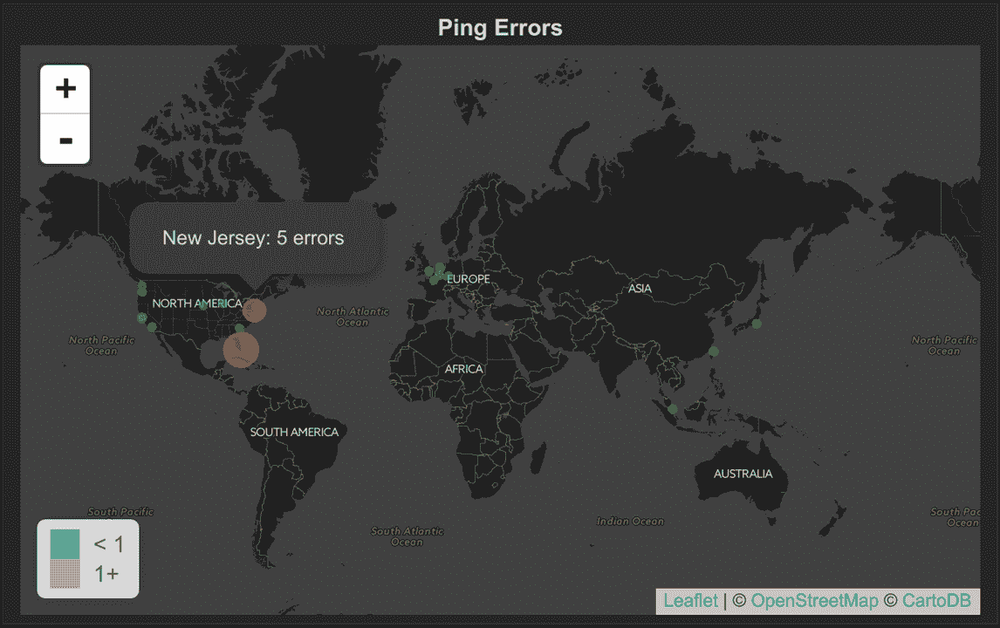
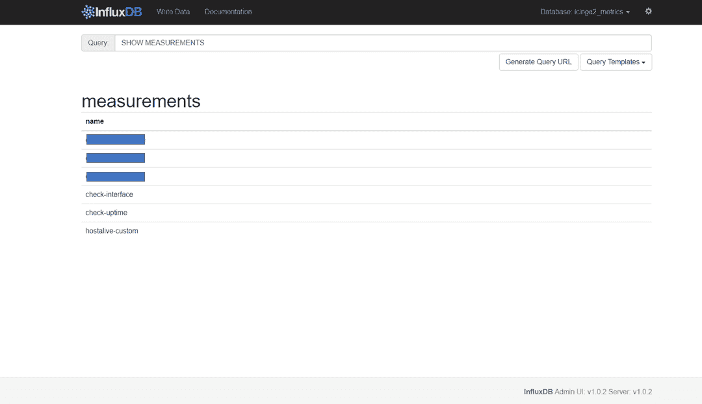
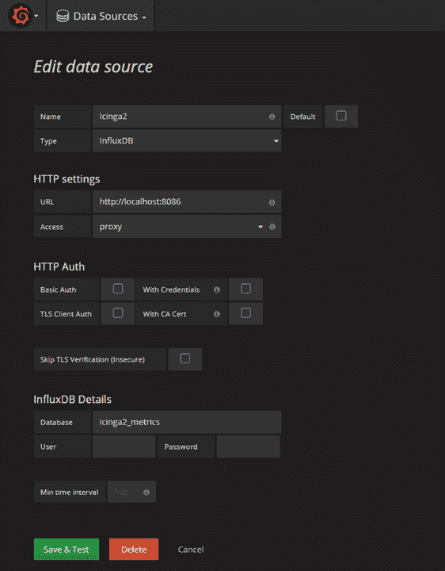
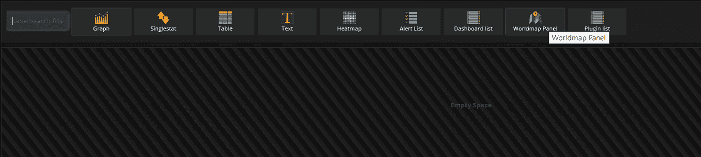
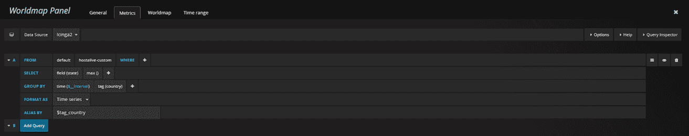
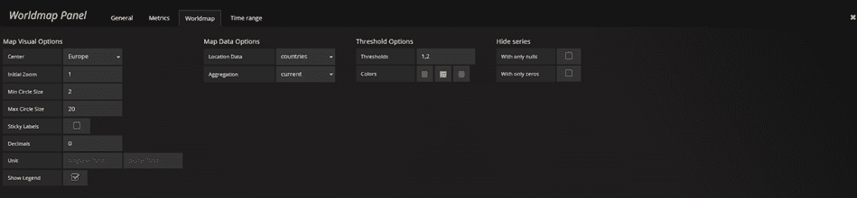
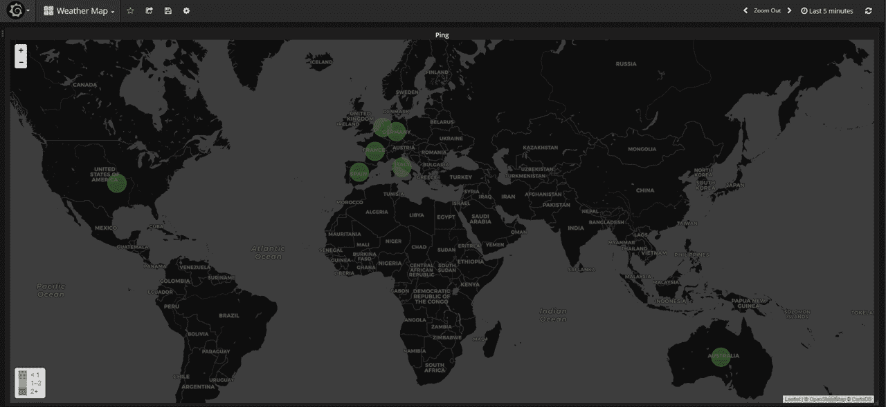

# 网络基础设施天气图

> 原文：<https://medium.com/hackernoon/network-infrastructure-weathermap-5afedbfa686>

Network Weathermap

收集指标的主要目的是存储它们以供长期使用，并创建图表来调试问题或识别趋势。然而，监视您的系统并不足以确定问题和异常的根本原因。有必要对你的网络**主干**有一个高层次的概述。**气象图**是**网络运营中心** ( **NOC** )的完美选择。在这篇文章中，我将向你展示如何只用开源工具来构建一个。

**Icinga 2** 将收集关于您主干的指标，将检查结果指标和性能数据写入 **InfluxDB** (从 [Icinga 2.5](https://www.icinga.com/2016/08/31/icinga-2-meets-influxdb/) 开始支持)。以地图形式在 **Grafana** 中可视化这些指标。

首先，在 *hosts.conf* 文件中添加您想要的主机配置:

注意:*城市* & *国家*属性将用于创建天气图。

要在 Icinga 2 安装上启用 **InfluxDBWriter** ，请键入以下命令:

> icinga2 功能启用 influxdb

在*/etc/icinga 2/features-enabled/InfluxDB . conf(*[*了解关于 influx db 配置的更多信息*](https://www.icinga.com/docs/icinga2/latest/doc/09-object-types/) *)* 中配置您的 **InfluxDB** 主机和数据库

**Icinga 2** 会将您的所有指标转发到一个 *icinga2_metrics* 数据库。包含的*主机*和*服务*模板定义了一个存储，*度量*表示一个表，通过该表，度量与定义了某些主机或服务的某些度量的标签进行分组(注意*城市* & *国家*标签的用法)。

保存更改后，不要忘记重启 **Icinga 2** :

> 服务 icinga2 重新启动

一旦 **Icinga 2** 启动并运行，它将开始收集数据并将其写入 **InfluxDB** :

一旦我们的数据到达，是时候进行可视化了。 **Grafana** 广泛用于生成图形和仪表盘。为了创建一个**天气图**，我们可以使用一个名为[世界地图面板](https://github.com/grafana/worldmap-panel)的 Grafana 插件。确保使用 *grafana-cli* 工具进行安装:

> grafana-cli 插件安装 grafana-世界地图面板

该插件将被安装到您的 grafana 插件目录中( */var/lib/grafana/plugins* ):

重启 **Grafana** ，导航到 Grafana web 界面并创建一个新的*数据源*:

创建新仪表板:

**Group By** 子句应该是**国家**代码，还需要一个**别名**。别名的形式应该是 **$tag_field_name** 。有关查询的示例，请参见下图:

在**世界地图**选项卡下，选择**国家**选项:

最后，您应该会看到一个世界地图，圆圈代表每个主机的状态。

字段*表示*可能的值( **0** —正常， **1** —警告， **2** —关键， **3** —未知/无法到达)

注意:对于懒人，我创建了一个现成的仪表盘，你可以从 GitHub 导入。